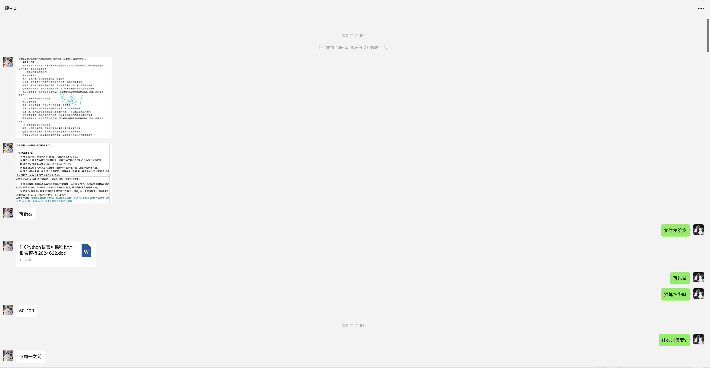
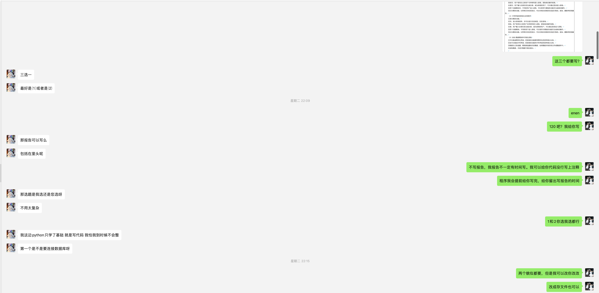
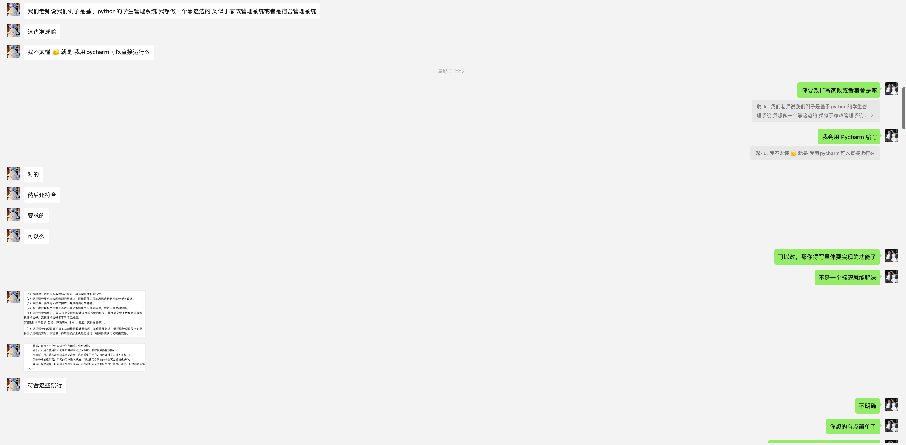
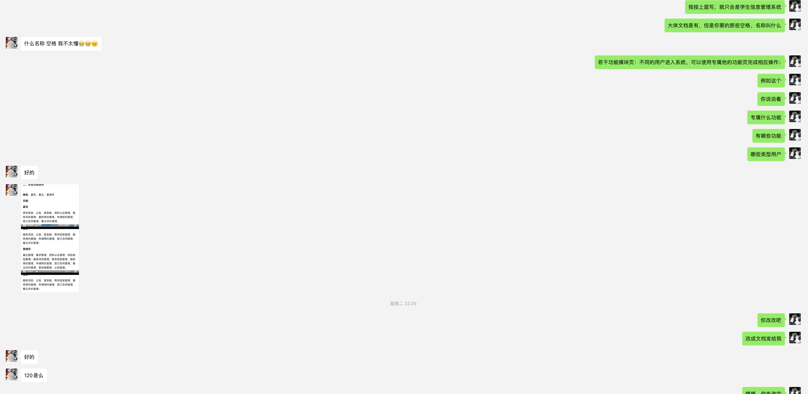
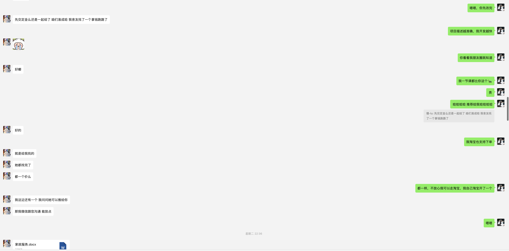
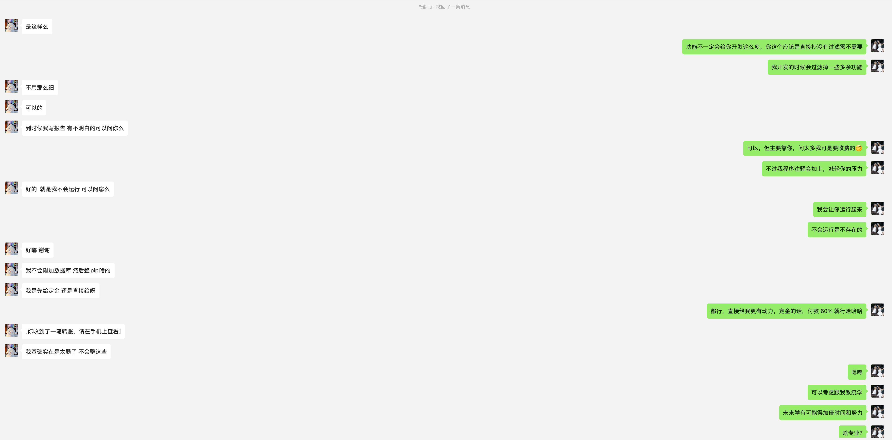
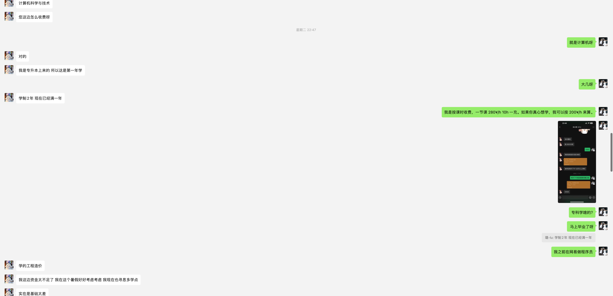
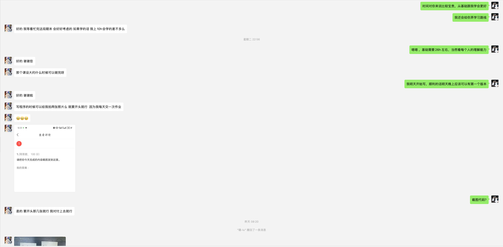
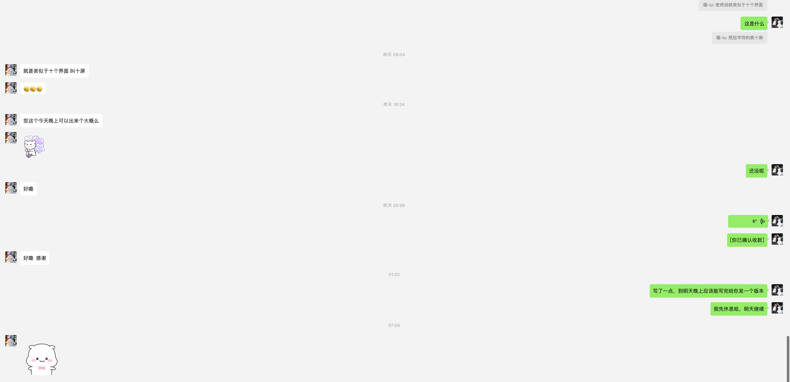

::: tip

经过允许的才会发布在此，也为了宣传。感谢，这些学员的支持。

:::

## 0. 前言

::: tabs

@tab image-1

@tab image-2

@tab image-3

@tab image-4

@tab image-5

@tab image-6

@tab image-7

@tab image-8

@tab image-9

:::

## 1. 需求

要求学生开发一个融合软件工程、Python 语言、文件或数据库等内容的的系统。系统功能描述如下：

**项目名称：** 图形化界面的应用程序

1. 前台模块功能：
    1. 首页：在首页用户可以进行信息浏览、信息查询；
    2. 登录页：用户使用自己的用户名和密码登入系统，获取相应操作权限；
    3. 注册页：用户输入注册信息完成注册，成为系统的用户，可以通过登录进入系统；
2. 若干功能模块页：不同的用户进入系统，可以使用专属他的功能页完成相应操作；

3. 后台模块功能：以管理员身份登录后，可以对相应系统的信息进行修改、添加、删除和查询操作。

---

要求学生开发一个融合软件工程、Python 语言、文件或数据库等内容的的系统。系统功能描述如下：

**项目名称：** 家政服务系统

1. 前台模块功能：
    1. 首页：在首页用户可以进行信息浏览、信息查询；
    2. 登录页：用户使用自己的用户名和密码登入系统，获取相应操作权限；
    3. 注册页：用户输入注册信息完成注册，成为系统的用户，可以通过登录进入系统；
2. 若干功能模块页：不同的用户进入系统，可以使用专属他的功能页完成相应操作；
    1. 角色：雇员、雇主、管理员
        1. 管理员：可以查看雇主和雇员的预约关系；
        2. 雇主：可以查看现有的雇员和对其进行预约；
        3. 雇员：可以查看哪些雇主预约和点击是否已经去过完成任务；

3. 后台模块功能：以管理员身份登录后，可以对相应系统的信息进行修改、添加、删除和查询操作。

::: details 公众号：AI悦创【二维码】

:::

::: info AI悦创·编程一对一

AI悦创·推出辅导班啦，包括「Python 语言辅导班、C++ 辅导班、java 辅导班、算法/数据结构辅导班、少儿编程、pygame 游戏开发、Web、Linux」，全部都是一对一教学：一对一辅导 + 一对一答疑 + 布置作业 + 项目实践等。当然，还有线下线上摄影课程、Photoshop、Premiere 一对一教学、QQ、微信在线，随时响应！微信：Jiabcdefh

C++ 信息奥赛题解，长期更新！长期招收一对一中小学信息奥赛集训，莆田、厦门地区有机会线下上门，其他地区线上。微信：Jiabcdefh

方法一：[QQ](http://wpa.qq.com/msgrd?v=3&uin=1432803776&site=qq&menu=yes)

方法二：微信：Jiabcdefh

:::

