## 1. Purpose

In this project, you will be building a two-player game with a graphical interface. The design and implementation of this game is left open-ended, for you to figure out, explain, and justify. There will be several components to this project, so do not assume that *everything* in your code must neatly be described as either “model”, “view”, or “controller”.

## 2. Pawns Board gameplay

Pawns Board is a two-player game played on a board of cells and custom cards. The game is a variation of a new card game called [Queen’s Blood](https://finalfantasy.fandom.com/wiki/Queen's_Blood). In the game, each player has a color—red or blue—, a deck of cards, and a hand made from their respective decks.

To start the game, each player must be given a deck of cards to play with and the board must be constructed.

There must be enough cards in each deck to possible fill every cell on the board. Additionally, in *our* game, there can only be two copies of any card in a deck. That means there can be duplicates, but not triples of any given card. The deck for each player will be read in from a separate file.

The board in our game is rectangular and its dimensions must be specified before the game starts. For *our* game, the number of rows must be positive (meaning greater than 0) and the number of columns must not only be greater than 1, but they must be odd. This allows for interesting interactions to occur in the center column of the board.

Game play begins with both players being dealt an equal number of cards to their hands from their decks. The board also starts with no cards on it. However, the cells in the first and last column start with a single *pawn* in each cell. The first column’s pawns belong to the red player. The last column’s pawns belong to the blue player

An initial layout of the game with 3 rows and 5 columns might look like this:

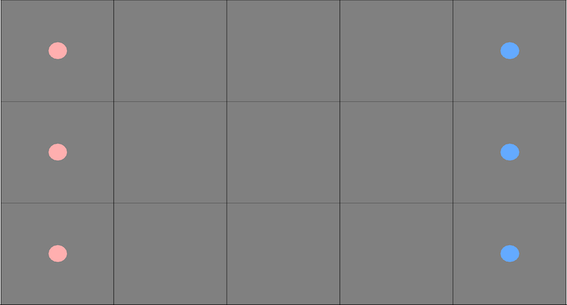

With a valid board created and valid decks for each player, each player is dealt their cards at random from the list. The starting size of each player’s hand is also passed in at the start of the game, but it cannot be greater than a third of the deck size. Player Red always goes first.

On each turn, the current player first draws a card from their deck if there are cards remaining in their deck. If not, then no card is drawn. Then they can take one of two actions: pass or place a card. If the player chooses to pass, then their turn ends and the current player switches to the other player of the game.

For the player chooses to place a card instead, they must place their card in a cell that has enough of their own pawns to cover the cost of the card.

That newly placed card can then affect the board by adding pawns to other cells or converting pawns from the opponent’s ownership to the current player’s ownership. Once a card has been properly placed, the turn changes over to the other player.

The game ends when both players pass their turn, one after the other. The winner is determined by calculating the score of each row.

In the following subsections, we will dive into the cards, the board, scoring, and detailed information on how placing a card works in this game.

## 3. The cards

Each card in the game has a name, a cost, a value score, and a five by five board demonstrating the card’s influence on the board. Costs are either one, two, or three pawns. A *value score* is any positive integer and is used to determine the overall score of the game. Influence determines how the cells on the board relative to the card are affected. Consider the following card below

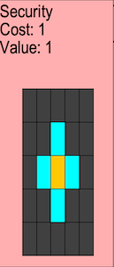

The name, cost, and value score are depicted in text on the card itself. This card, named Security, has a cost of 1 and a value score of 2. The grey grid depicts the card’s influence. The orange square represents the card itself. If a square on the influence board is cyan, like in the above picture, then it affects the cell relative to where the card is placed on the board. If a square on the influence board is grey, then nothing happens on those cells. This will come into play when we discuss placing a card on the actual board.

We will be supplying cards to the game via files that contain the decks for each player. See the relevant section later in the assignment.

Two cards are the same if they have the same name, cost, value score, and influence grid.

## 4. The board

A board is a rectangular container of cells. Cells can either contain pawns, cards, or nothing. Each cell can contain anywhere between 0 and 3 pawns on a cell. If a cell has a pawn or a card, then it is owned by one of the players of the game. Cells with cards cannot change ownership. Cell with pawns, however, can change ownership depending on the cards the current turn player places on the board. Here is another example of a larger valid board for the game in the middle of play.

## 5. Scoring the game

In the game, each row tallies the scores for each player. Those scores, which we will call row-scores, are determined by summing the value scores of each card owned by that player. Consider the row shown in the following image. You will see grey squares with numbers on them. Those are the row-scores as calculated by the game. The leftmost number is the red player’s row-score and the rightmost number is the blue player’s row-score.


We can see which player owns which card by looking at the color of the cell. We can see here that the red player has played cards with value scores of 1 and 1, giving them a row-score of 2. Similarly, we can see that the blue player has played cards with value scores of 3, 1, and 1, giving them a row-score of 5.

We can calculate each players *total score* at any point during the game. To do so, we need to examine each row. For each row, we look at the row-scores for each player on that row. The player with the higher row-score adds their row-score to their total score. The player with the lower row-score gains zero points for their total score. If the row-scores are the same for both players, neither player gains points. After reviewing all the row-scores, we compare the total scores for each player. The player with the higher total score wins. If the total scores are tied, then the game ends in a tie.

As an example, consider the following game.

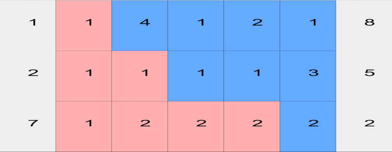

Let us figure out the total score for each player.

- Player Blue wins the first row with 8 row-score over Red’s 1 row-score. Blue gets 8 points while Red gets 0 points.
- Player Blue wins the second row with 5 row-score over Red’s 2 row-score. Blue gets 5 points while Red gets 0 points.
- Player Red wins the third row with 7 row-score over Blue’s 2 row-score. Red gets 7 points while Blue gets 0 points.

By the end of scoring, Player Red has 7 points while Player Blue has 13 points. If the game ends here (which it definitely will), Blue will be the winner.

As another example, consider this different game.


Reminder that pawns do not affect the score in any way. With that in mind, let us start calculating the total score for the players.

- Player Blue wins the first row with 3 row-score over Red’s 2 row-score. Blue gets 3 points while Red gets 0 points.
- Player Red wins the second row with 3 row-score over Blue’s 1 row-score. Red gets 3 points while Blue gets 0 points.
- The third row ends in a tie. Red and Blue get 0 points.

Since the final score for Red is 3 and the final score for Blue is 3, the game is tied so far! If the game ends here, then the game is a tie with no winner.

## 6. Placing a card

The current turn player can either choose to pass or place a card. We will focus on placing a card as that has actual effects on the board.

### 6.1. Legally placing a card

A player can place one of the cards in their hand onto a cell if the following conditions are satisfied

- the cell contains pawns the player owns AND
- the cell contains at least enough pawns to cover the cost of the card

If both conditions are not satisfied, the player must choose another card that does satisfy the conditions. If none satisfy the conditions, the player *must* pass. If both conditions are satisfied, then the pawns on that cell are removed and replaced with the card. Naturally, the player removes the card from their hand to place it on the board.

Using the starting board from the start of the assignment as an example, players can only play cards that cost one pawn on the board because for each player, all the cells they own have one pawn.

Consider the following board.

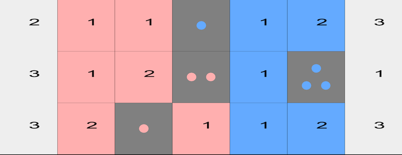

Right in the middle of the board, the red player can place cards that cost one or two pawns, but not any that cost three pawns.

In the middle of the final column, the blue player can place cards that cost one, two, or three pawns because that cell contains three pawns.

Naturally, player red cannot place cards on any cell with blue pawns. Similarly, player blue cannot place cards on any cell with red pawns.

### 6.2. Card Influence on the Board

Once the card is placed, the card’s influence spreads on the board according to that card’s influence grid. The influence grid is always relative to the card’s position. All cells relative in position to the card’s position on the board can be affected. You can think of it like laying the influence grid over the board, centering it on the card that was just placed. For example, say we place a card in the bottom left of the board. The image below represents the possible area that can be affected.

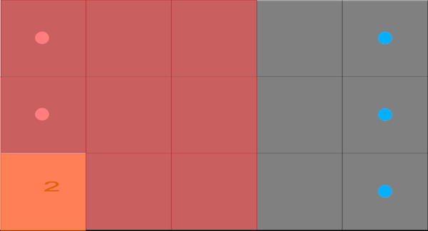

Notice that not every cell might be effected. Some of the influence grid’s squares might fall off the board, so nothing happens. Players must consider whether playing a card in a particular cell will allow them to maximize that card’s influence.

When you perform that overlap, all the cyan squares in the influence grid represent the cells that the card influences. The grey and orange squares do not influence any cells. As an example, consider the following pictures, one of a card called the Mandragora with its influence grid, and another showing what cells placing that card can influence after overlaying the influence grid over the grid, centered on that card.


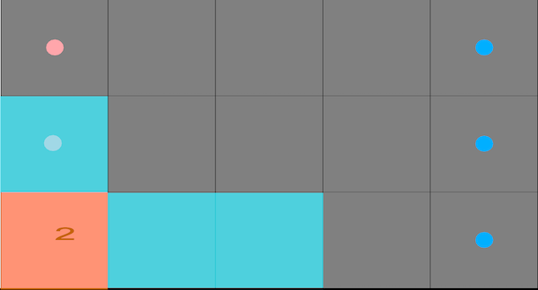

Now that we have determined how to figure out which cells are influenced, we must discuss *how* they are influenced. Recall a cell either has a card, pawns, or nothing. We will walk through each scenario separately by focusing on a single cell affected by a card’s influence.

For these subsections, we will use the following card to focus on only one cell on the board.

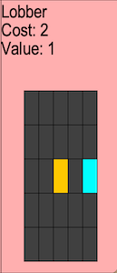

#### 6.2.1. Influence on Cards

If the cell to influence has a card, *nothing happens*.

#### 6.2.2. Influence on Nothing

If the cell to influence has nothing on it, then the cell gains a single pawn owned by the current turn player. In the following example, we can see a before and after of this effect.

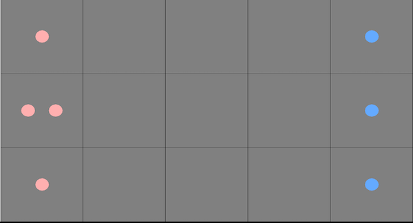


#### 6.2.3. Influence on Pawns

If the cell to influence has pawns on it, the effect changes depending on whether the current turn player owns the pawns or not.

If the current turn player owns the pawns, then the number of pawns on that cell increases by one. However, there can only be a maximum of 3 pawns on a single cell.

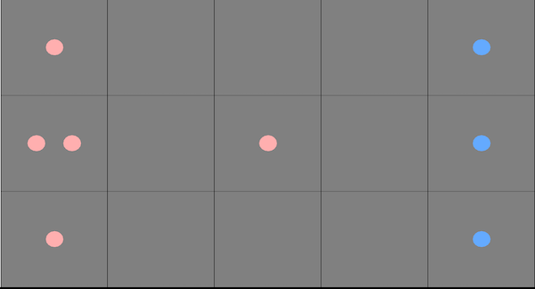


If the current turn player does NOT own the pawns, then the number of pawns on that cell does *not* increase. Instead, the current turn player takes ownership of those pawns. You can see this play out in the following images.

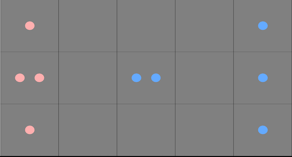


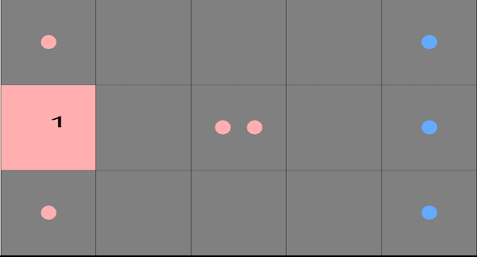

This allows players to gain the upper hand by claiming pawns the opponent was saving for higher cost cards.

#### 6.2.4. Putting it all together

Putting together these rules, we can now visualize the result of playing the Mandragora in the bottom left. The images below show the card on the left and the resulting board for placing the card on the bottom left of a standard starting board.

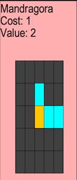

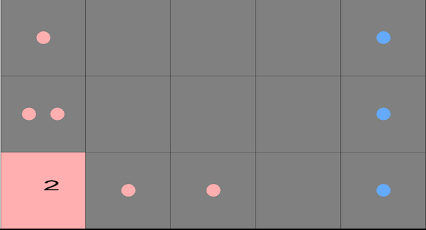

Notice number of pawns above the card increased to two pawns. Furthermore, the two cells to the right of the card gained a red pawn.

For another example not in a corner, consider a play where the red player is somehow able to place a different card in the middle of the board.


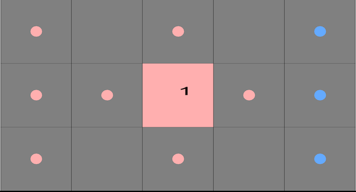

Notice that since every cyan square on the influence grid actually overlayed with a cell on the board, they all took effect.

Finally, consider a play where the red player instead placed the same card in the top left instead.


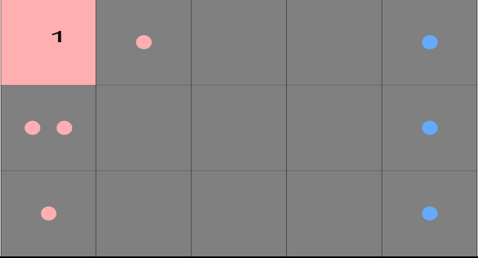

Notice that some of the cyan squares actually don’t overlap with a cell on the board, so they exert no influence.

#### 6.2.5. Influence and the Blue Player

Keep in mind the blue player is on the right side of the board. To allow the red and blue player to use the same cards, when the blue player looks at what their card can influence, the influence grid is *mirrored* across the columns (i.e. the y-axis). You can see this in the example below with the Mandragora card.


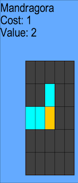


Therefore, influence is also mirrored when the card is placed on the board. You can see this in the images below. When red plays their Mandragora in the middle, the influence spreads to the right and above. When Blue plays their Mandragora in the bottom right, the influence still spreads above, but it spreads to the *left* instead.

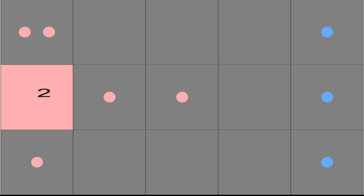


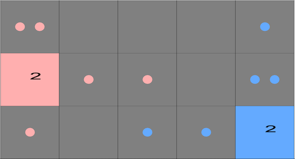

## 7. Architectural choices

A multiplayer game involves several interacting components: you have multiple *players*, that each *interact* with a *visualization* of the *grid*, along with a *rules-keeper* to ensure the game is played legally.

In our setting, the cards, board, and the rules-keeper (objects or methods that make sure the rules of the game are always followed) comprise our model: together, they are what distinguish one instance of the game from another.

There are multiple ways to view the game; we will discuss two below.

Depending on how the game is viewed, we might want to design different controllers for the game.

The game also has some further customization not mentioned in the overview, but could come up in future assignments including the extra credit. For instance, influence only adds pawns or takes control of existing pawns. However, the game Pawns Board is based on has different *types* of influence, like increasing or decreasing the value scores of cards.

And then there are the user-players (an object that the users actually play the game through), which are not part of the model, view, or controller. User-players make decisions about what move they want to make (not be confused with the player entities of Red and Blue in the model), so they “have a different interface” than the other components discussed so far.

### 7.1. Modeling the game

You will need to represent the cards, the players, the board, and all of their contents. You likely will have to figure out how to represent the coordinate system of the grid, so as to describe the locations of all the cells on the board.

You will need to figure out how to let users make moves. Your implementation will need to (among other tasks) enforce the rules of the game, to make sure that players take turns, that moves are legal, that influence is applied on the board, and that the winner of the game can be determined.

**About variant rules:** While variant influence effects are briefly mentioned, they are **not to be implemented** as we have not discussed what they are. We mention them now in case that has an effect on how you design the model.

**Hint:** your primary model interface may not be all that complicated. As with all our design tasks so far, consider all the nouns you notice in this game’s description, and all the verbs describing their interactions, observations, or mutations, and those become your interfaces and methods.

### 7.2. Visualizing the game

You are *not required in this assignment* to create a GUI view of your game. Instead, you will start with a simpler textual view, similar to the previous project, to make it easier to see the interim progress of your game. We recommend a straightforward rendering of the board itself and the row-scores, using `_` for empty cells , an integer of 1, 2, or 3 for the number of pawns on the board, `R` for a card owned by the red player , and `B` for a card owned by the blue player. For example, see the graphical and textual views below for a representation of a game in play where player Blue is the current player.

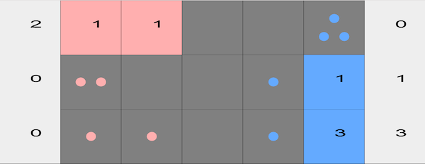


```
Textual view
2 RR__3 0
0 2__1B 1
0 11_1B 3
```

#### 7.3` `Controlling the game

You do not need to implement any sort of controller in this assignment, though you are encouraged to think about how to do so — we will build a controller in future assignments.

### 8` `Players – human or machine?

In a future assignment, we *might* ask you to implement a simple AI user-player for this game. This will enable several possible scenarios, including solitaire play (person vs computer) and fully-automated play (which may be useful for testing). You do not have to implement a computer user-player right now, but you should design your model so that different user-player implementations could exist for human or machines to play your game. You should attempt to design a user-player interface that allows this to happen.

In a design document (in a separate text file), explain how you envision instantiating user-players and your model, so that you could play a few moves of the game. This might be one part of your README (see below), but probably should be a separate file.

We will give additional guidance in future assignments over how we suggest you implement user-players; the goal in this assignment is for you to think through the design possibilities and explain what you think might be an appropriate design.

## 9. Reading Deck Configuration Files

Configuration files are a great way of setting up game states without having to manually create them in a test file. We will be using configuration files to instantiate the grid and cards for our game. This files seemingly play a special role, but do belong in one of our 3 regular components (model, view, controller). You must decide where they go based on the purposes of each component, what the classes that read these files actually do, and which component best represents that purpose.

For this section, it may be helpful to read up on the `FileReader` and `Scanner` documentation from Oracle. The goal is to help you practice some software archaeology and help you figure out how you learn to use new classes.

### 9.1. About files and file paths

Your program needs to work on any computer, which means on any operating system. However, different operating systems describe paths to files in different ways. For instance, Windows uses

```
"\"
```

to separate folders while Macs and Linux use

```
"/"
```

. Furthermore, when graded, your projects won’t be opened on your computer, but on someone else’s. So how do we decide on a location for the files you will be reading so your program works regardless of the computer and how do you write that location in code when you need to read in a file?

For the location, IntelliJ actually has a solution. Any code run in IntelliJ automatically assumes that file paths start from the *project folder*. Consider the following possible project setup

```bash
+- src/
| +- cs3500/
| | +- pawnsboard/
| | | +- ... (more stuff)
+- test/
| +- cs3500/
| | +- pawnsboard/
| | | +- ... (more test stuff)
+- board.config
```

I can read the board.config file in my code by giving the appropriate object the path as a String as follows

```bash
String path = "deck.config";
File config = new File(path);
```

However, we cannot leave random files sitting in the project folder because that clutters the project itself. So instead, we place all files that support the program like config files in a folder called docs like below.

```bash
+- docs/
| +- deck.config
+- src/
| +- cs3500/
| | +- pawnsboard/
| | | +- ... (more stuff)
+- test/
| +- cs3500/
| | +- pawnsboard/
| | | +- ... (more test stuff)
```

That brings us to the other issue: how to write paths in Java that are independent of any operating system. Java’s file class actually has something for us! There is a static constant called `separator` which changes depending on the operating system. Let’s say we wanted to create a `File` object for `deck.config`. We can write the following code

```bash
String path = "docs" + File.separator + "deck.config";
File config = new File(path);
```

Use this knowledge to write tests and code that will read files on any computer.

### 9.2 Deck Configuration File

If you get a file that does not correspond to the format listed below, the behavior is unspecified. This means you can let **anything** happen as a result. If you do choose a specific behavior, make sure to document it in the code.

This file is a list of cards in the following format

```
CARD_NAME COST VALUE
ROW_0
ROW_1
ROW_2
ROW_3
ROW_4
CARD_NAME COST VALUE
ROW_0
ROW_1
ROW_2
ROW_3
ROW_4
CARD_NAME COST VALUE
...
```

Each card consists of one line with its name (with no spaces), an integer between 1 and 3 inclusive for the cost, and a positive (greater than 0) integer for the value score of the card. Then there are 5 lines, each made of 5 characters, representing the influence grid of the card. There are 3 possible characters that can appear in the influence grid

- "X": This indicates the card has no influence on that cell.
- "I": This indicates the card does have influence on that cell.
- "C": This indicates the card’s position. This must only exist in the middle of the grid on ROW_2’s third character. It cannot appear anywhere else

A valid card file only has lines for cards as formatted as specified above.

What follows is an example of a deck configuration file with two cards.

```
Security 1 2
XXXXX
XXIXX
XICIX
XXIXX
XXXXX
Bee 1 1
XXIXX
XXXXX
XXCXX
XXXXX
XXIXX
```

## 10. Showing functionality

Since you are creating the interfaces yourselves, we cannot possibly write JUnit tests to check your functionality. However, the functionality of your model is integral to your success in this project and for your grade.

To show that functionality, you must add a class called `PawnsBoard` that only has a `main` method. Just like with `PokerPolygonsGame`, this is a class that cannot be in the model, view, or controller packages, but instead exists in your project’s package at the same level as the model, view, or controller packages. In this main method, you must do the following:

- Read in a deck configuration file of your own creation. This file must contain enough cards to play on a board made of 3 rows and 5 columns.
- Initialize a model and start the game. The board must be 3 rows by 5 columns. The two players must use the same deck read in from that configuration file you made and have a starting hand size of 5. The decks *must not be shuffled* at any point.
- Play the game until no cards can be placed on the board. You are free to have players pass as needed, but both players must place cards on the board. After each action a player takes (placing a card or passing), the textual view must be printed to the console to show how the game is progressing.

We will use this main method to check the functionality of your model.

## 11. What to do

1. Design a model to represent the game. This may consist of one or more interfaces, abstract classes, concrete classes, enums, etc. Consider carefully what operations it should support, what invariants it assumes, etc. Your model implementation should be general enough for multiple board sizes.
2. Design classes to read in the deck configurations. This many consist of one or more interfaces, abstract class, concrete classes, etc.
3. **You are required to identify and document at least one class invariant for the implementation of your main model class, and ensure that your implementation enforces it.**
4. Document your model well. Be sure to document clearly what each type and method does, what purpose it serves and why it belongs in the model.
5. Write a README file (see below).
6. Implement your model. If some method of your model cannot be implemented because it requires details we have not yet provided, you may leave the method body blank for now — but leave a comment inside the method body explaining why it’s empty and what details you’re waiting for. If your implementation makes additional assumptions about invariants (beyond those asserted by the interface), document them.
7. Create a deck configuration file with enough cards to play a game on a 3 row and 5 column board.
8. Implement the main method in the `PawnsBoard` class as described previously.
9. Test your model thoroughly. You are encouraged to do the following : an Examples class to give readers a quick understanding of your model (like you did in HW1), a ModelInterface-testing class that lives *outside* your model package, to ensure you’re testing the publicly visible signatures of your model, and an Implementation-testing class that lives *inside* your model package, that can test package-visible functionality that isn’t part of your model interface.
10. Implement the textual rendering of your model described above, so we can visualize your data. Leave enough comments in your code that TAs know how to use your code to produce a visualization of a model. Test your textual rendering.
11. Design a user-player interface, such that human or AI players could interact with the model, and explain your design. You do not have to implement this interface for this assignment. You don’t even necessarily need to define this interface as a Java `interface`, but merely as a clearly-written English description in a text file.

We will not be autograding this assignment, but you should emulate the textual view output above as precisely as possible, as we will likely be looking at it on future assignments.

## 12. How to write a good `README` file

A good README file needs to quickly explain to the reader what the codebase’s overall purpose is, what its design is, and where to find relevant functionality within the codebase. (Just because your code organization is obvious to *you* does not mean it’s obvious to a newcomer to your code!)

A README file does not have to be *long* in order to be *effective*, but it does need to be better than merely formulaic.

README files need to be in a predictable place in your codebase, or else readers won’t easily be able to find them. Typically, place them in the topmost directory of your project, or in a toplevel `docs/` directory.

Consider the following outline as a good starting point for your READMEs, and elaborate from here. This is not a verbatim requirement, but rather a launch-point for you to explain your code.

- **Overview:** What problem is this codebase trying to solve? What high-level assumptions are made in the codebase, either about the background knowledge needed, about what forms of extensibility are envisioned or are out of scope, or about prerequisites for using this code?

- **Quick start:** give a short snippet of code (rather like a simple JUnit test) showing how a user might get started using this codebase.

- **Key components:** Explain the highest-level components in your system, and what they do. It is trite and useless to merely say “The model represents the data in my system. The view represents the rendering of my system. ...” This is a waste of your time and the reader’s time. Describe which components “drive” the control-flow of your system, and which ones “are driven”.

    > **Key subcomponents:** Within each component, give an overview of the main nouns in your system, and why they exist and what they are used for.

- **Source organization:** Either explain for each component where to find it in your codebase, or explain for each directory in your codebase what components it provides. Either way, supply the reader with a “map” to your codebase, so they can navigate around.

Notice that almost everything in the README file corresponds strongly with the purpose statements of *classes and interfaces* in your code, but probably does not get into the detailed purpose statements of *methods* in your code, invariants in your data definitions, etc. Those implementation details belong in Javadoc on the relevant code files. You *may* choose to mention some key methods as entry points into your code (perhaps in the Quick start section’s examples), but you should not overburden the README with such lower-level detail.

## 13. What to submit

Submit any files created in this assignment, along with your design document. Make certain you include your README file, which should give the graders an overview of what the purposes are for every class, interface, etc. that you include in your model, so that they can quickly get a high-level overview of your code. It does *not* replace the need for proper Javadoc!

## 14. Grading standards

For this assignment, you will be graded on

- the design of your model interface(s), in terms of clarity, flexibility, and how plausibly it will support needed functionality;
- the appropriateness of your representation choices for the data, and the adequacy of any documented class invariants (please comment on why you chose the representation you did in the code);
- the choice of component for your classes that read files
- the deck configuration file to play and test the game
- the forward thinking in your design, in terms of its flexibility, use of abstraction, etc.
- the correctness and style of your implementation, and
- the comprehensiveness and correctness of your test coverage.

## 15. Submission

Please submit your homework to https://handins.ccs.neu.edu/ by the above deadline. Then be sure to complete your self evaluation by its due date.


::: details 公众号：AI悦创【二维码】


:::

::: info AI悦创·编程一对一

AI悦创·推出辅导班啦，包括「Python 语言辅导班、C++ 辅导班、java 辅导班、算法/数据结构辅导班、少儿编程、pygame 游戏开发、Web、Linux」，全部都是一对一教学：一对一辅导 + 一对一答疑 + 布置作业 + 项目实践等。当然，还有线下线上摄影课程、Photoshop、Premiere 一对一教学、QQ、微信在线，随时响应！微信：Jiabcdefh

C++ 信息奥赛题解，长期更新！长期招收一对一中小学信息奥赛集训，莆田、厦门地区有机会线下上门，其他地区线上。微信：Jiabcdefh

方法一：[QQ](http://wpa.qq.com/msgrd?v=3&uin=1432803776&site=qq&menu=yes)

方法二：微信：Jiabcdefh

:::


