## 1. 首版封面

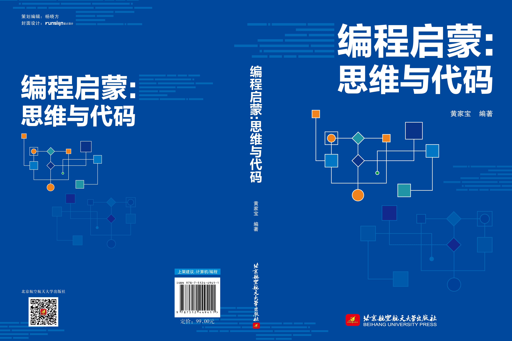

::: tabs

@tab image

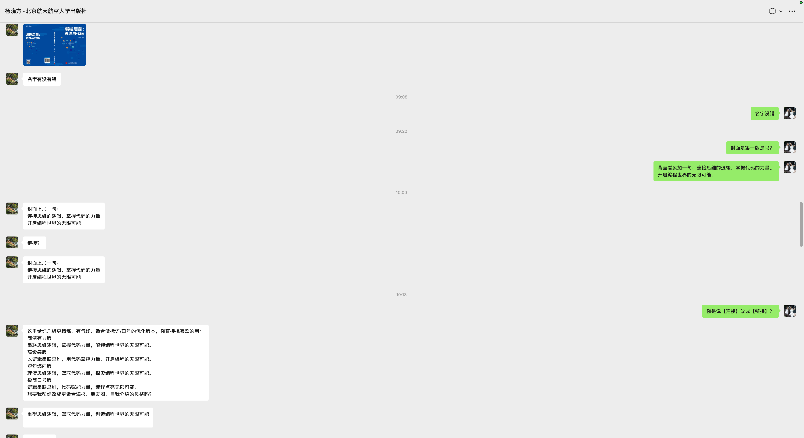

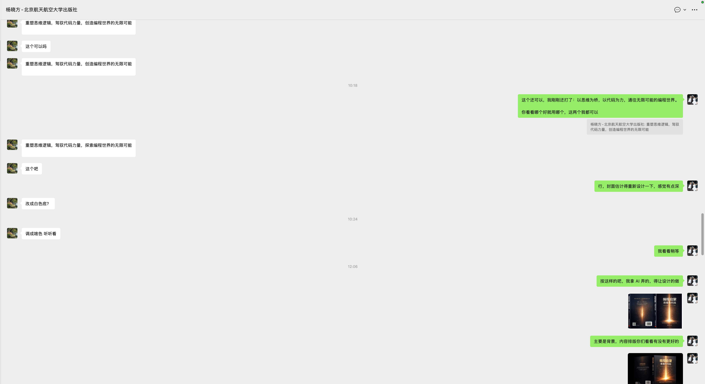

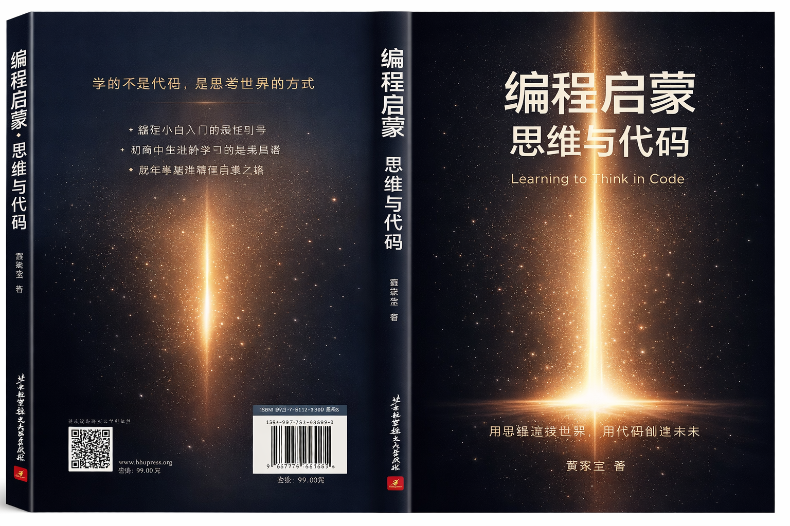

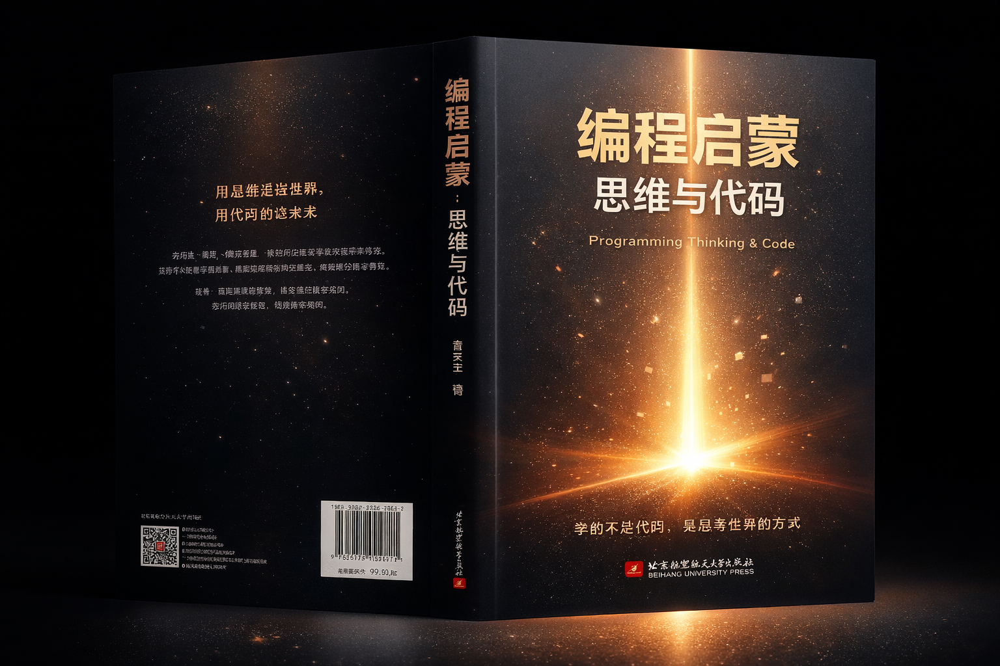

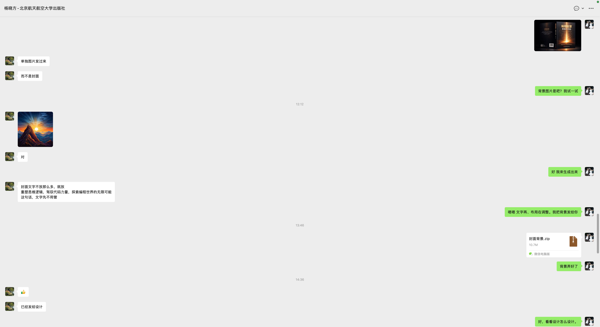

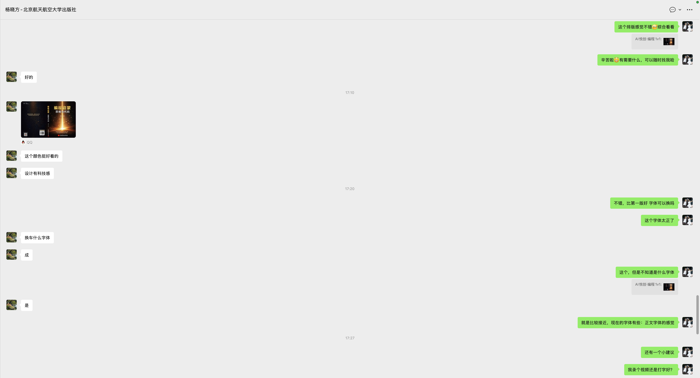

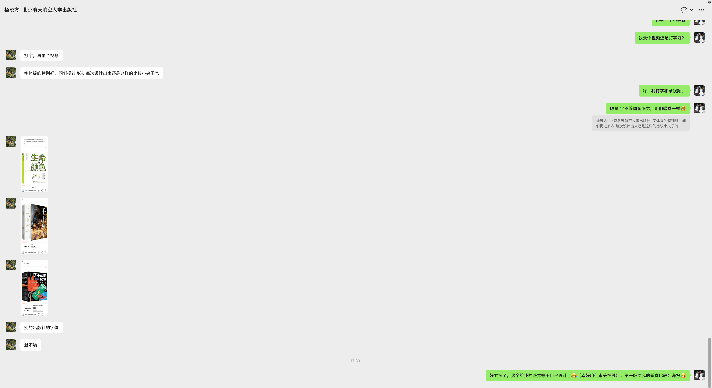

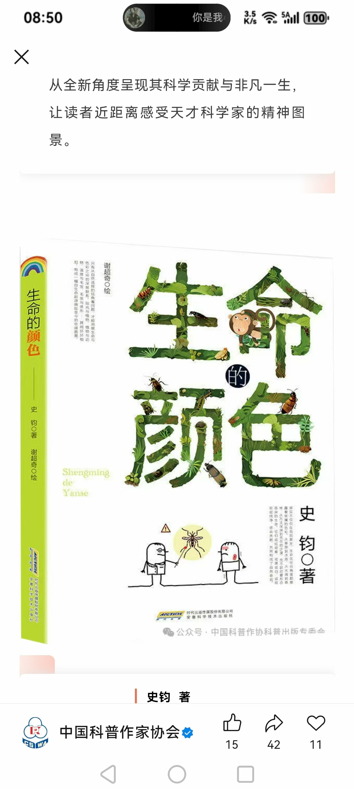

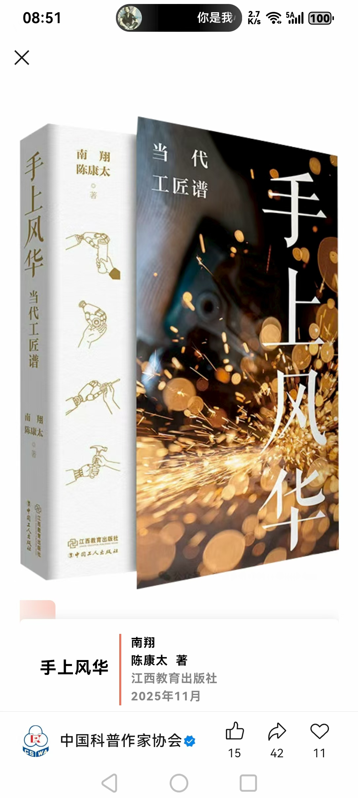

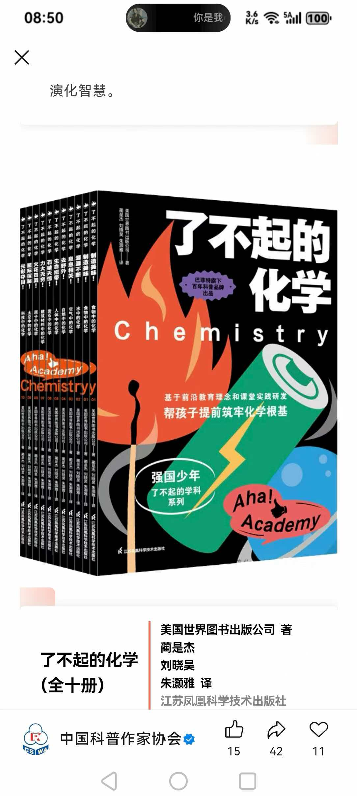

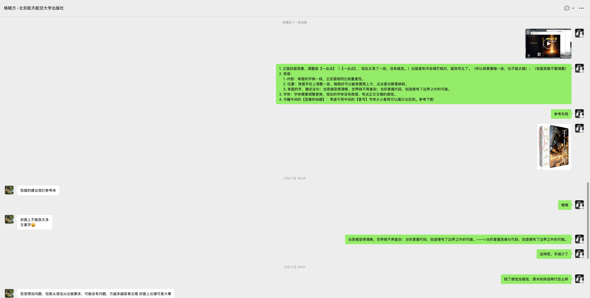

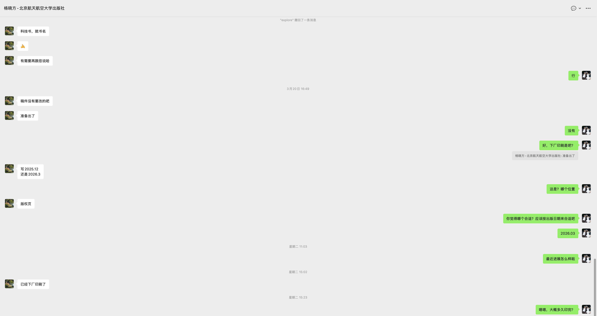

:::

## 1. 改进建议

1. 正面封面背景，调整按**一点点**（**一点点**，现在太亮了一些，没有感觉。）也就是和书名锋芒相对，喧宾夺主了。（所以背景要暗一些，也不能太暗）；（背面亮度不要调整）
2. **背面**：
    1. **内容**：背面的字换一段，正反面相同比较重复性。
    2. **位置**：背面字往上调整一些，刚刚好可以被背景图上方，点点星光散落映射。
    3. **背面的字，确定这句**：当思维变得清晰，世界就不再复杂；当你掌握代码，创造便有了边界之外的可能。
3. **字体**：字体需要调整更换，现在的字体没有质感、有点正文文稿的感觉。

