::: warning 没有特定指出或者回复的，都按编辑您的方式修改即可，辛苦了～

:::

## Suspicious point 1

::: details image，可以点击展开

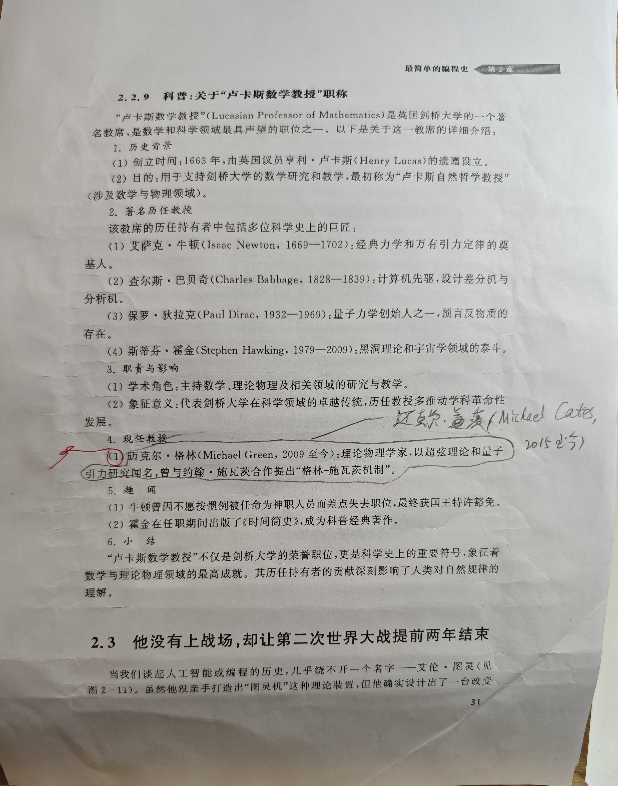

:::

:::: tip P31 页，Answer

需要修改，维基百科和 Gemini 均已更新：[迈克尔·凯茨](https://zh.wikipedia.org/w/index.php?title=迈克尔·凯茨&action=edit&redlink=1) Michael Cates（born 1961）。

::: details 核定资料

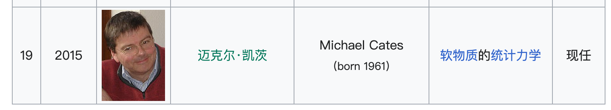

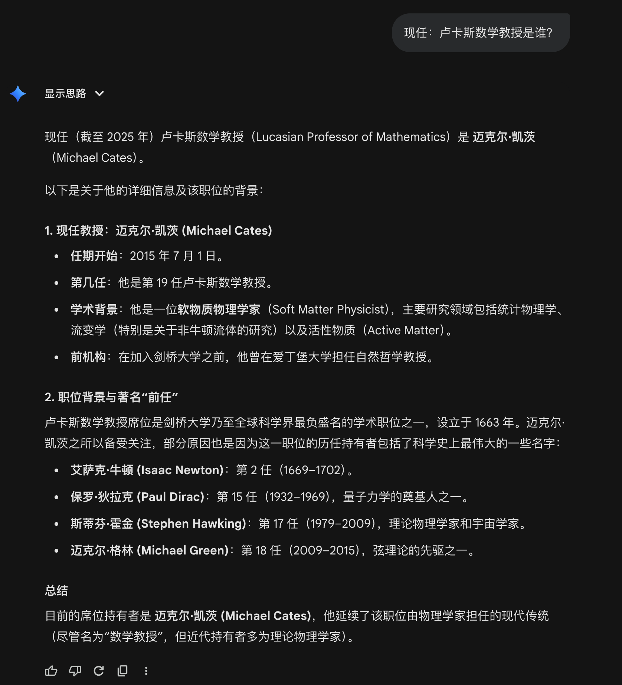

:::

::::


## Suspicious point 2

::: details image，可以点击展开


:::

:::: tip P75 页，Answer

1. 可以改成：直到 AlphaGo 登场，人们才改变了看法。

2. 关于图 3-43 的问题：你手写的问题，没看清楚最后几个字。不过我大概推测是：AI 生成的图片？——这个图片是手机实拍真实的棋盘，不是 AI 生成的。（补上：黄蓉摄）；

3. 对于：“深蓝” 和 Alpha Go——> 改成：“深蓝” 和 AlphaGo；

    > Alpha 与 Go 两个单词之间，没有空格。

4. 对于：**AlphaGO 的对手就是人类的围棋大师。** ——>可以改成**逗号**；

::: details 核定资料

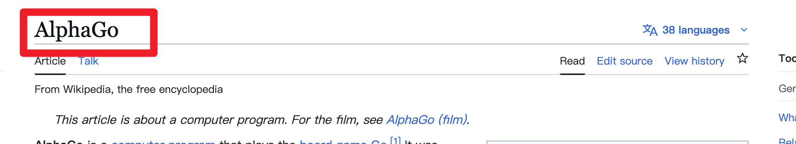

:::

::::

## Suspicious point 3

::: details image，可以点击展开

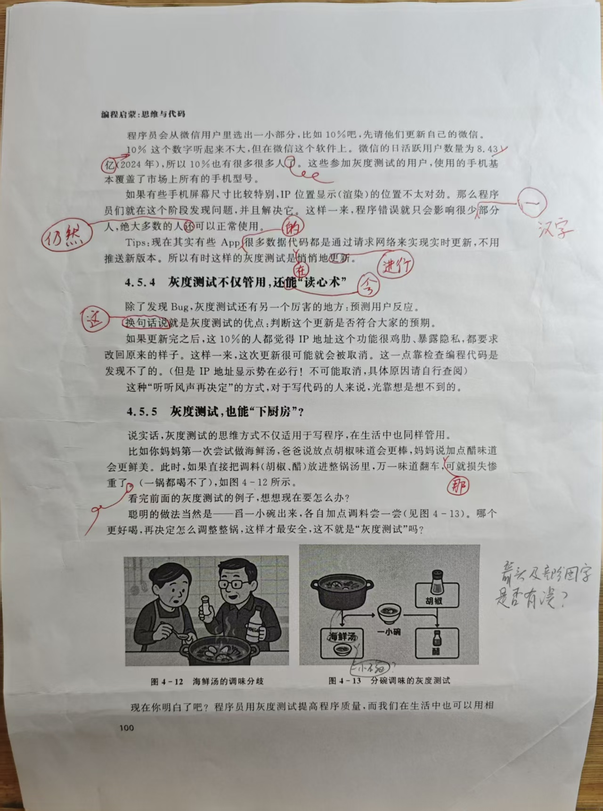

:::

:::: tip P100 页，Answer

可以按你的建议全部修改。

::::


## Suspicious point 4

::: details image，可以点击展开

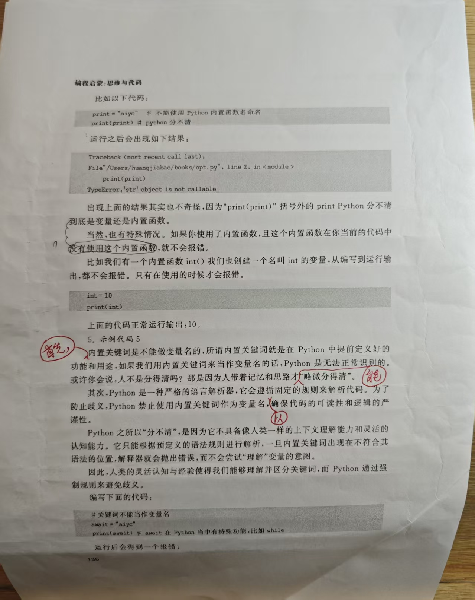

:::

:::: tip P136 页，Answer

可以按你的建议全部修改。

::::

## Suspicious point 5

::: details image，可以点击展开

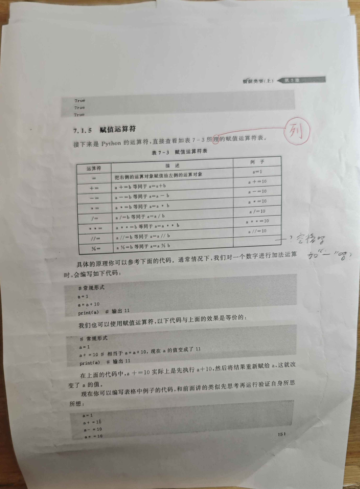

:::

:::: tip P151 页，Answer

- 错别字，可以改成：列；
- 表格最后是留空，留空看是直接空白，还是用 `-` 表示，看编辑你的经验来即可。

::::


## Suspicious point 6

::: details image，可以点击展开

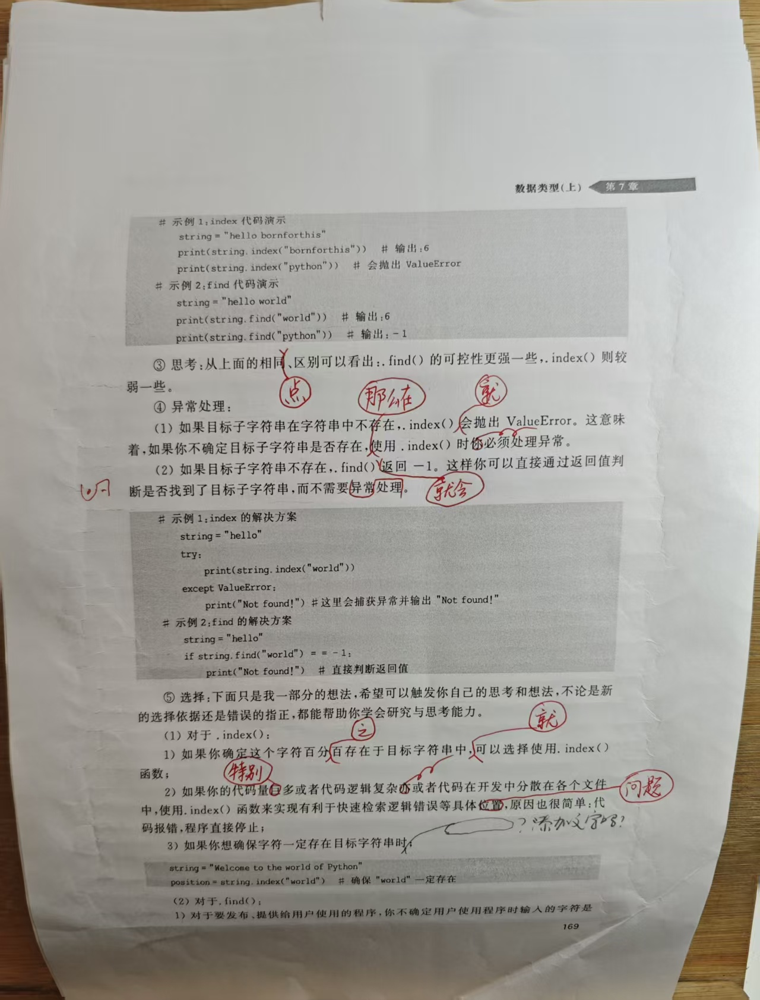

:::

:::: tip P169 页，Answer

全部都可以改，除了下面三个：

- **异常处理**：不用改，异常处理是固定术语。可以考虑在异常处理这个词后面添加一个单词：👉 **异常处理（Exception Handling）**

- **位置**：不用改成“问题“；

- **添加文字**：3）如果你想确保字符一定存在目标字符串时，就可以使用 `.index()` 函数。例如：想要确保字符 `"word"` 一定存在于字符串 `string` 中，就可以使用如下代码：

    ```python
    string = "Welcome to the world of Python"
    position = string.index("world")  # 确保 "world" 一定存在
    ```

::: details 核定资料

**✔ 为什么更推荐说「异常处理」？**

- 「异常处理」是一个**固定术语**，对应英文 *exception handling*。
- 各种语言的文档和教材里也都这样叫，例如：
    - Java Exception Handling
    - Python 异常处理
    - C++ Exception Handling

它强调的是一个**体系、一套机制**，包含捕获（catch）、抛出（throw/raise）、清理（finally）等行为。

**✔ 「处理异常」是什么？**

- 「处理异常」更像是一个具体动作，只是指某次代码执行遇到异常，你去把它处理掉。
- 它**不用于表示技术概念**，更口语。

对比：

| 表达         | 含义                             | 是否专业术语     |
| ------------ | -------------------------------- | ---------------- |
| **异常处理** | 表示一整套机制、流程、设计       | ✔ 是术语         |
| **处理异常** | 表示一次性动作，遇到了异常去解决 | ✖ 非术语，更口语 |

:::

::::


## Suspicious point 7

::: details image，可以点击展开


:::

:::: tip P175 页，Answer

- **满满**——>**慢慢**；

- 代码中的“满满”也需要修正：

    ::: details 点开查看图片，红色框框部分

    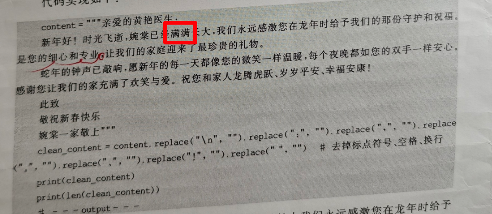

    :::

- 最后一段说是否删除：排版错误❌，这段属于代码输出的内容，应该放在代码块中。参考下面👇图片：

    ::: details 点开查看原本效果，输出结果还包含 153。可以看出现有印刷排版：只停留在 `# ---output---` ，后续的输出内容没有包含在内。

    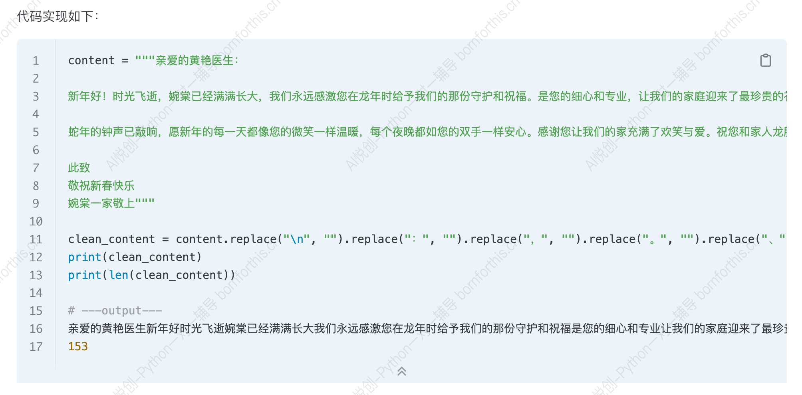

    :::

- 输出结果中的：**满满**——>**慢慢**。

::::


## Suspicious point 8

::: details image，可以点击展开

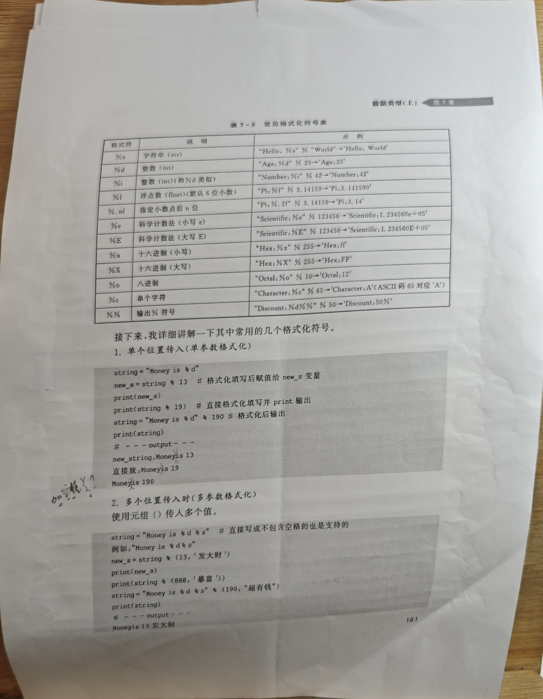

:::

:::: tip P181 页，Answer

- **添加空格**
- **问题**：排版与印刷中 `%d` ，% 与 d 的距离可以再靠近一些吗？不行就不用操作，可以就让它们靠近。

::: details 核定资料

代码中原本有空格，估计是排版时忘记添加了。

:::

::::


## Suspicious point 9

::: details image，可以点击展开


:::

:::: tip P182 页，Answer

- 标点符号按你的建议来修改；

- 添加上 `{}`：

    - **修改点 1**：这会导致内层的 `{}` 被当作结束符。
    - **修改点 2**：一个 `{}` 表示"这里要插入一个值"；

- **疑问**：以往要是有多点的话，不都是以 `;` 来结尾吗？实际是要 `。` 来做每小点的结尾吗？（**按实际语文语法来就行**）

    我想着是这样：

    1. 一个 `{}` 表示"这里要插入一个值"；
    2. 两个 `{{` 会被转义成一个字面的 `{` 字符；
    3. 两个 `}}` 会被转义成一个字面的 `}` 字符。

::::


## Suspicious point 10

::: details image，可以点击展开


:::

:::: tip P194 页，Answer

按你的修改来即可。

::::


## Suspicious point 11

::: details image，可以点击展开

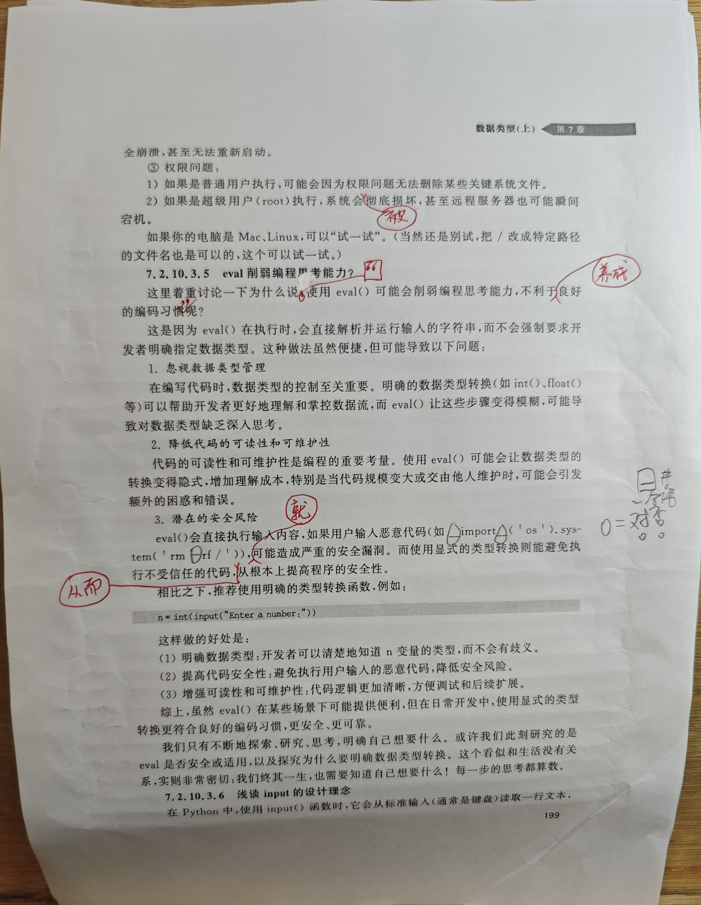

:::

:::: tip P199 页，Answer

添加的文字没有问题，至于铅笔画圈的保持现状，我看 PDF 是正确的，不需要做任何修改。

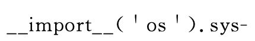

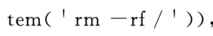

不能统一哈。


::::


## Suspicious point 12

::: details image，可以点击展开

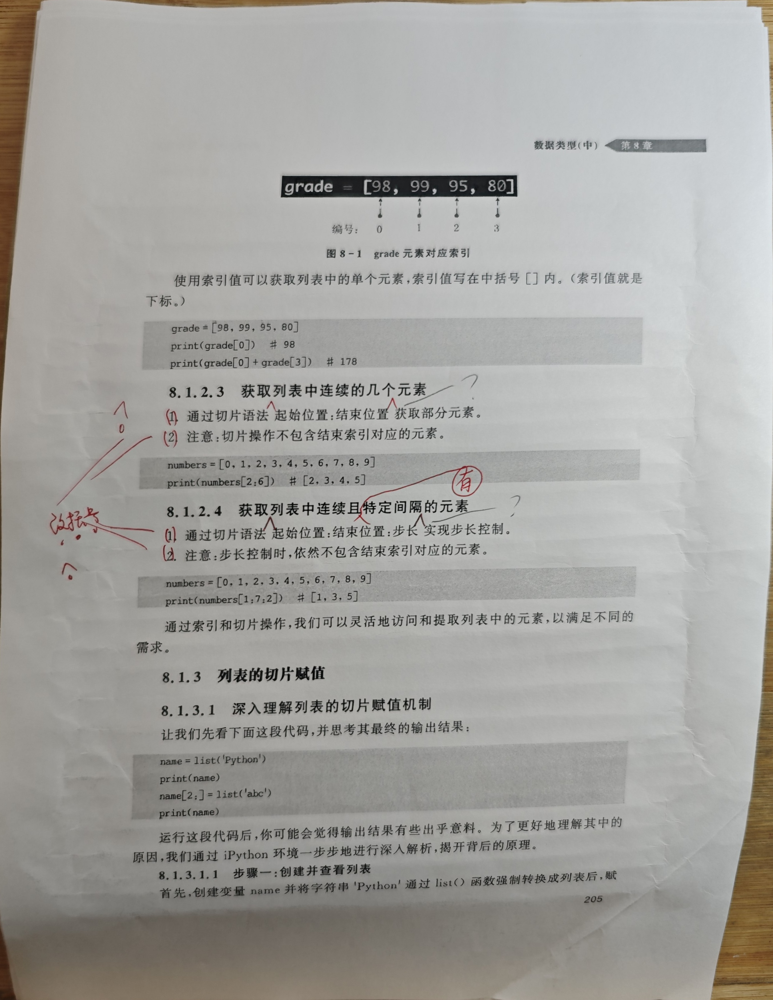

:::

:::: tip P205 页，Answer

- **Point 1**：可以改成括号；
- **Point 2**：标题：“**获取列表中连续且特定间隔的元素**” 可以添加：**有**；
- **Point 3**：对于 `起始位置:结束位置`、`起始位置:结束位置:步长` 可以添加 `[起始位置:结束位置]`、`[起始位置:结束位置:步长]`；

::::


## Suspicious point 13

::: details image，可以点击展开

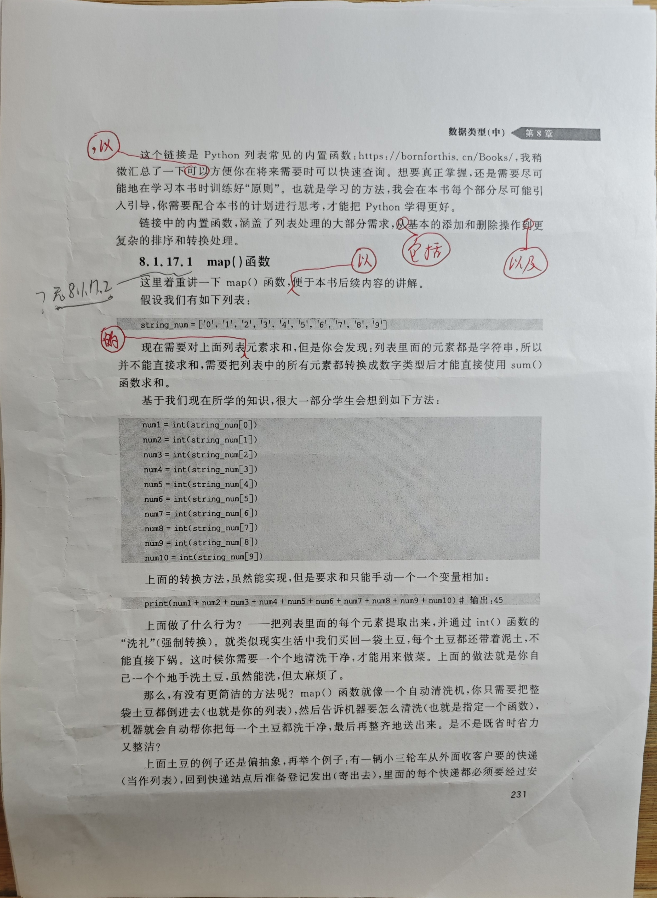

:::

:::: tip p231 页，Answer

按你的修改建议来。


::::


## Suspicious point 14

::: details image，可以点击展开

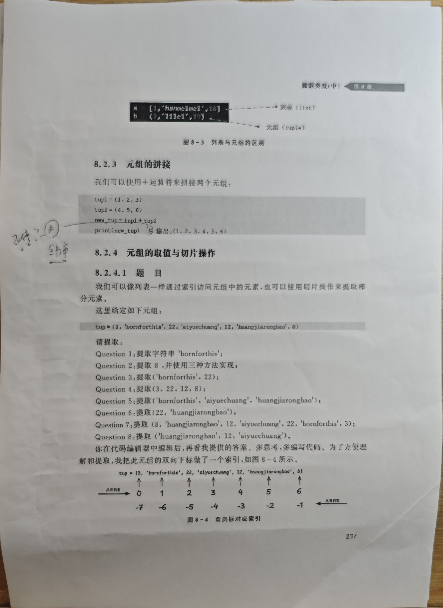

:::

:::: tip P237 页，Answer

~~没太理解问题。~~

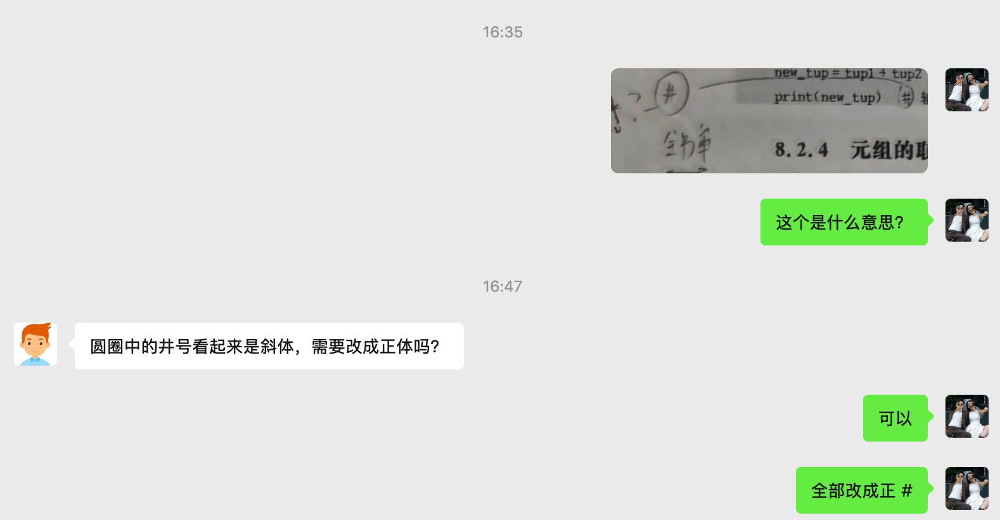

::::


## Suspicious point 15

::: details image，可以点击展开

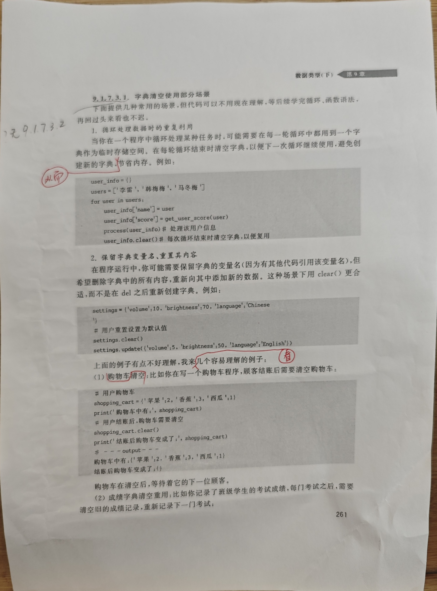

:::

:::: tip P261 页，Answer

- 序号可以去掉，或者改成合适的；
- 剩下的全部按你的修改建议来；

::::


## Suspicious point 16

::: details image，可以点击展开

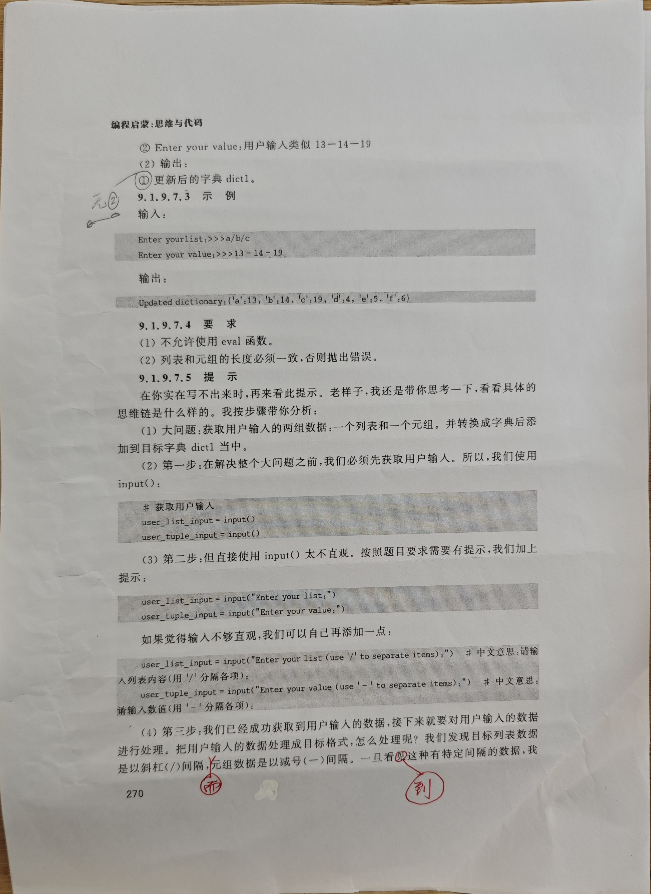

:::

:::: tip P270 页，Answer

- 按你的修改建议来；

- 至于你的疑问，是排版问题。需要改进，下面贴出原始排版效果：

    ::: details 点开查看图片

    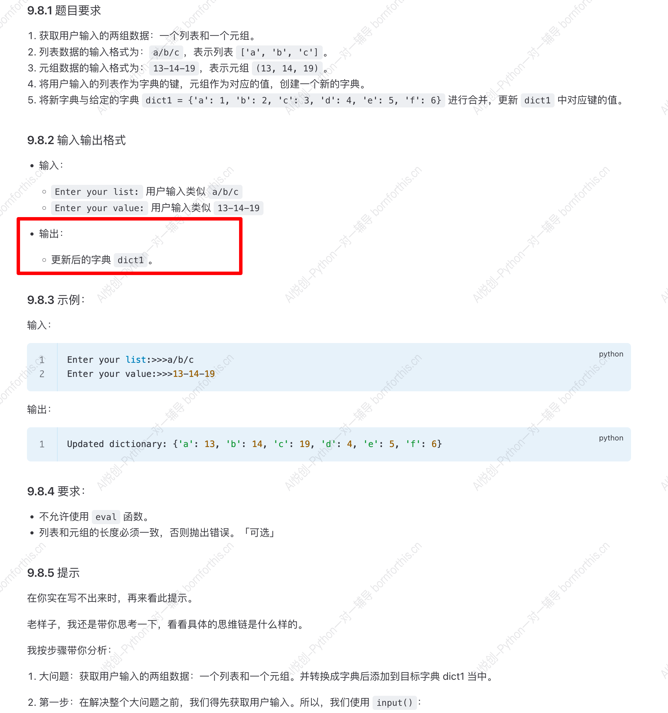

    :::

::::


## Suspicious point 17

::: details image，可以点击展开

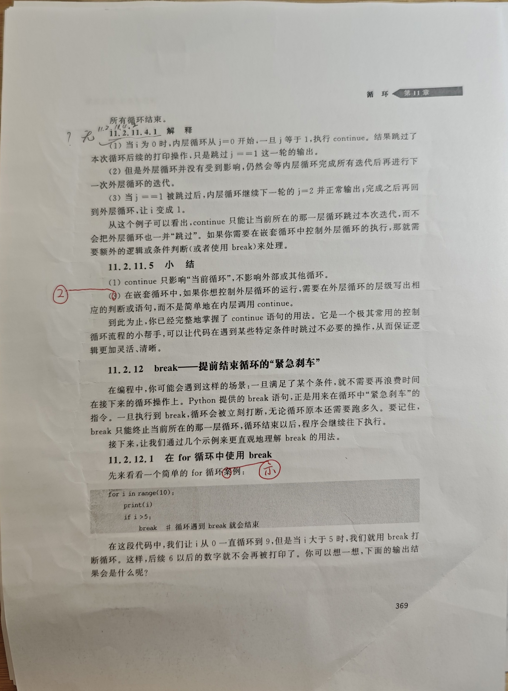

:::

:::: tip P369 页，Answer

全部按你的修改建议来即可。

::::


## Suspicious point 18

::: details image，可以点击展开

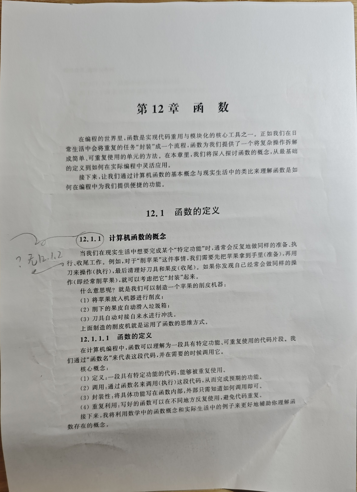

:::

:::: tip P383 页，Answer

因为是把原本的函数内容拆开排版，所以需要可以重置，重头开始制定就行。或者编辑有什么好的方法，可以直接定制。（按你的方法来。）

::::


## Suspicious point 19

::: details image，可以点击展开

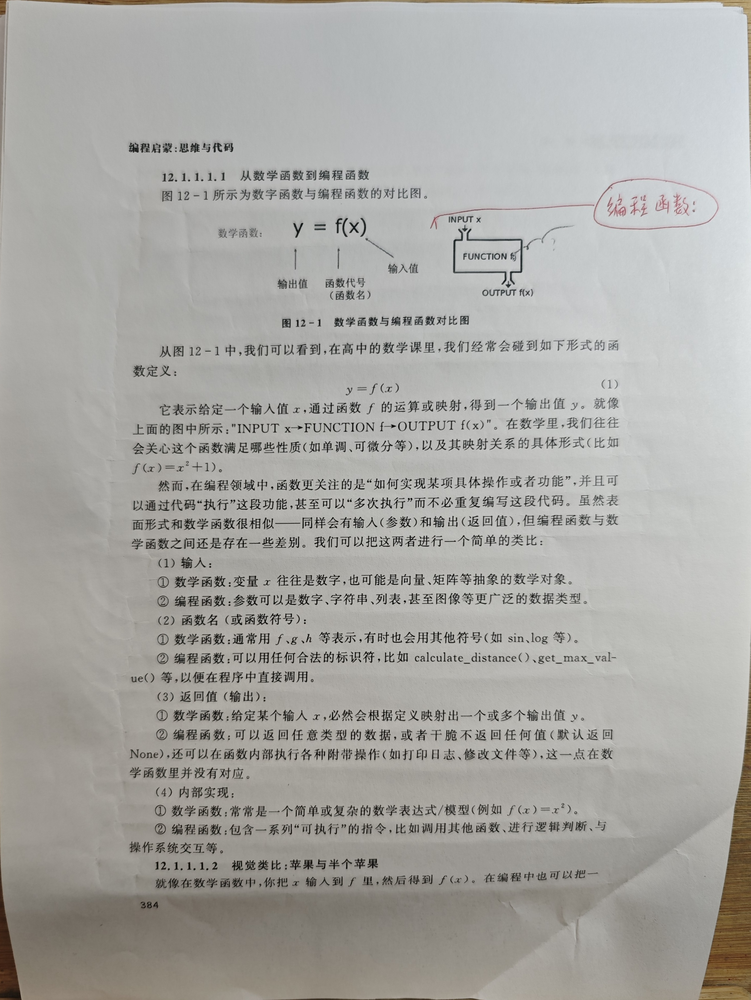

:::

:::: tip P384 页，Answer

按你的修改建议来，即可。


::::


::: details 公众号：AI悦创【二维码】


:::

::: info AI悦创·编程一对一

AI悦创·推出辅导班啦，包括「Python 语言辅导班、C++ 辅导班、java 辅导班、算法/数据结构辅导班、少儿编程、pygame 游戏开发、Web、Linux」，招收学员面向国内外，国外占 80%。全部都是一对一教学：一对一辅导 + 一对一答疑 + 布置作业 + 项目实践等。当然，还有线下线上摄影课程、Photoshop、Premiere 一对一教学、QQ、微信在线，随时响应！微信：Jiabcdefh

C++ 信息奥赛题解，长期更新！长期招收一对一中小学信息奥赛集训，莆田、厦门地区有机会线下上门，其他地区线上。微信：Jiabcdefh

方法一：[QQ](http://wpa.qq.com/msgrd?v=3&uin=1432803776&site=qq&menu=yes)

方法二：微信：Jiabcdefh

:::


::: details

`./Issue-5-two-change.assets/image-20251205184843458.png`

:::