**在此声明：**

::: center

#### 仅供学习交流使用！切勿使用代理参加任何政治评论！

##### 国安局在看着每一个人，不是你使用🪜他们不知道！

##### 本梯子已经不对外出售，不需要进行推荐啥的，仅限使用过的用户。（严格收缩）

##### 本人新书上市，买书送半年！好评再送半年！有意者，联系我购买即可！

:::

## 1. 安装包下载

[https://47.99.93.138:38742/down/l8xHmGaPU0oX](https://47.99.93.138:38742/down/l8xHmGaPU0oX)

**安装不做教程，安装软件都很简单。直接默认安装即可！**

## 2. 登录信息

**会直接发给你订阅链接，对于 Shadowrocket 订阅二维码，自行找网站把链接生成二维码即可。Clash Verge 订阅之后，也支持直接生成【订阅二维码】**

## 3. 代理配置

### 3.1 Clash Verge 配置订阅

::: tip

**不论是 Windows 还是 MacOS（苹果电脑）操作都是一样的！**

:::

::: tabs#ClashVerge

@tab 1. 苹果电脑启动

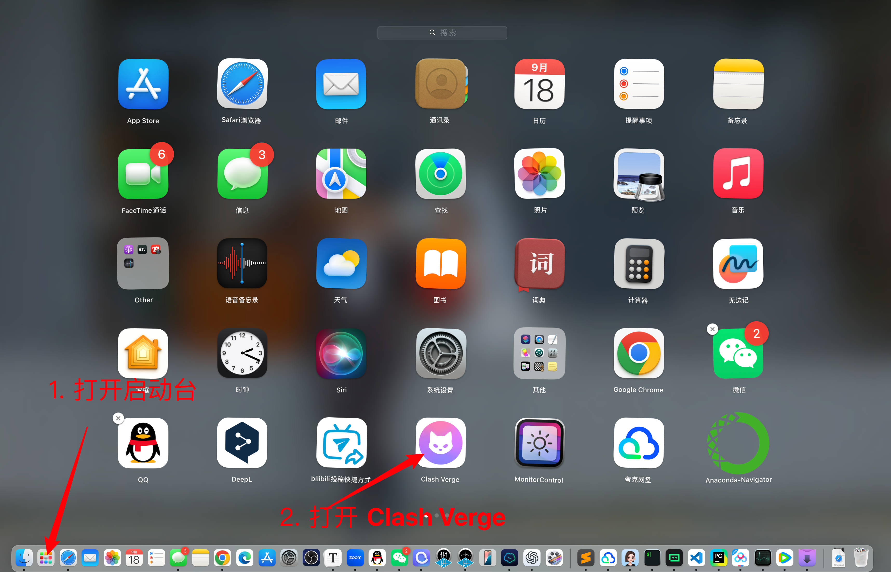

@tab 2. Windows 电脑启动

找到 Clash Verge 双击启动：

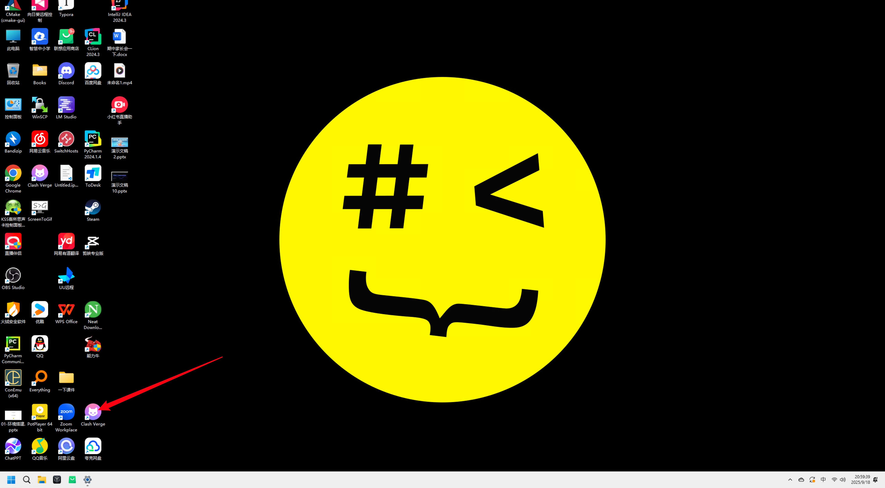

:::

启动之后，有可能不会直接显示程序界面。如果有显示当然最好，但是按目前使用情况来看，MacOS 大部分都是要我们自己手动启动。（Windows 有时候也是）

::: tabs#ClashVerge

@tab 1. 苹果电脑#1. 苹果电脑启动

这样就启动好了仪表盘。

@tab 2. Windows 电脑#2. Windows 电脑启动

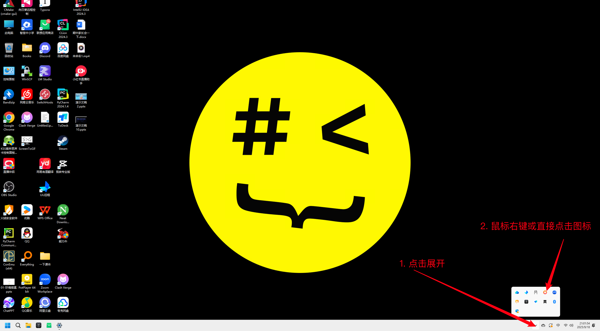

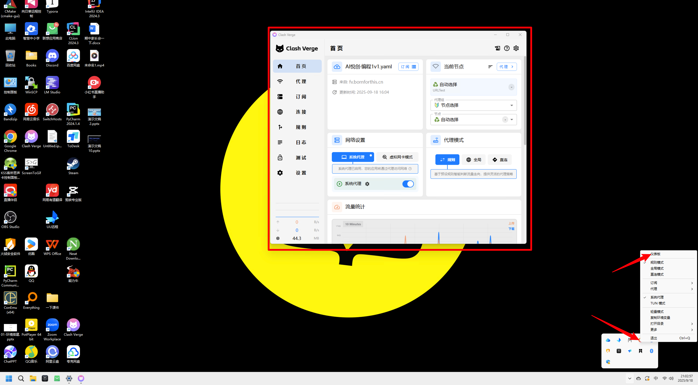

这样 Windows 仪表盘成功启动。

:::

接下来，我们进行基本配置和订阅配置。

按下面的流程进行配置即可：

:::: tabs

@tab 第一步：获取订阅链接

**会直接发专属订阅链接给你！**

::: warning

现在如果一点都不会、不研究，后期用梯子出现各种问题该怎么办？——靠自己，所以从一开始就要靠自己！

因为梯子本身不会出现问题，故而：你要自己学会排查～

支持付费配置：30¥/次。（不推荐）

:::

@tab 第二步：添加订阅

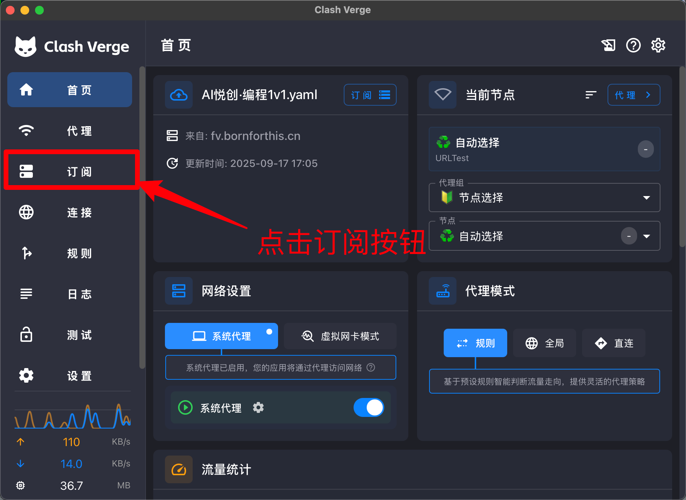

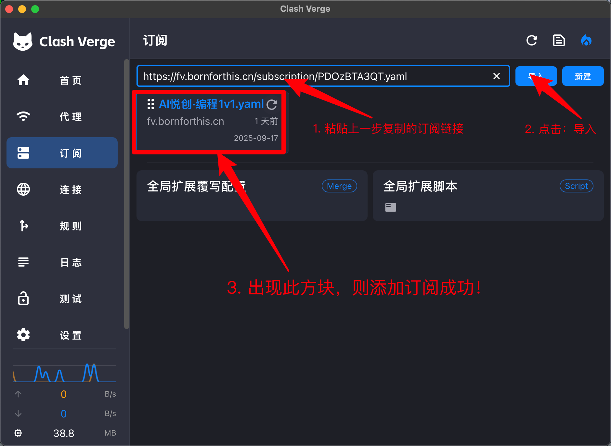

@tab 第三步：设置 Clash Verge

点击设置选项，进行设置：

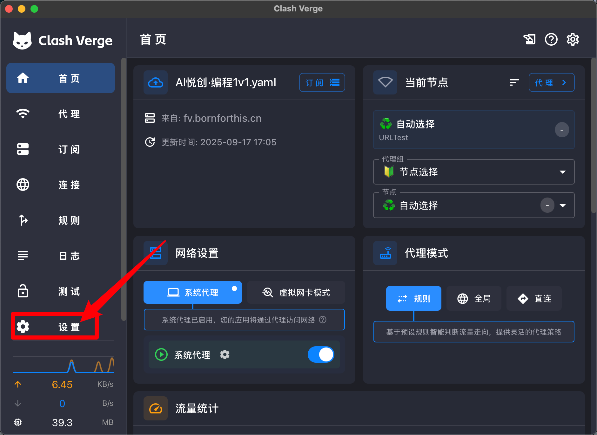

**把打勾的都打开！**

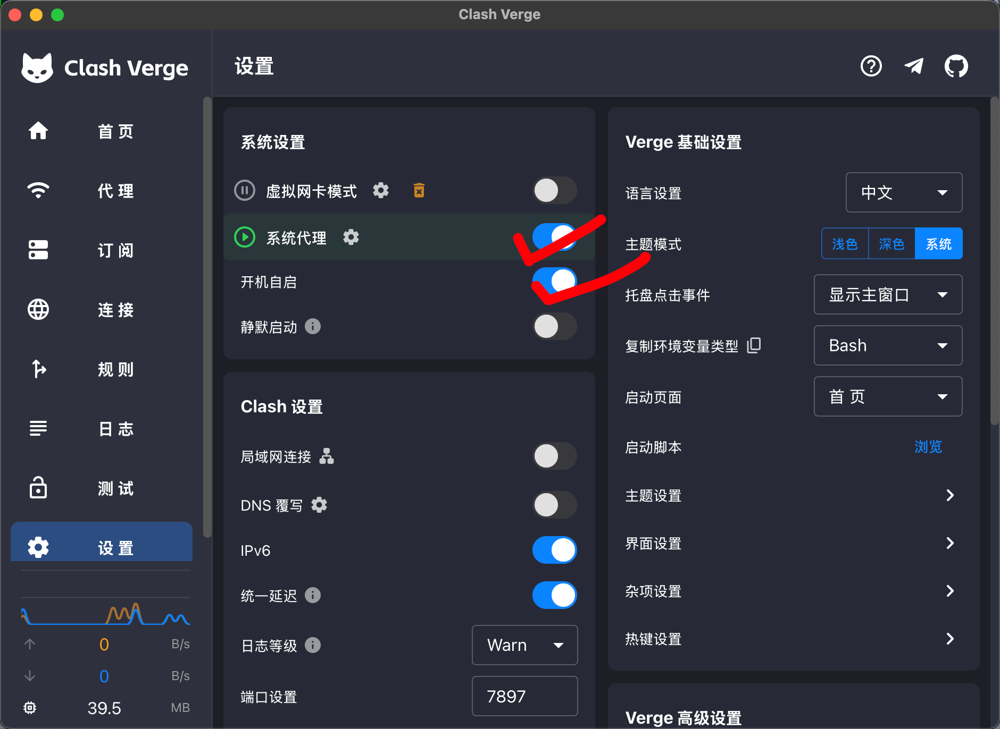

@tab 到此，全部完成✅

到此，全部完成✅。

你的代理，可以正常使用！

::::

### 3.2 iPhone Shadowrocket 配置订阅

:::: tabs

@tab 第一步：打开 Shadowrocket

打开软件后，左上角即可点击扫码：

::: center

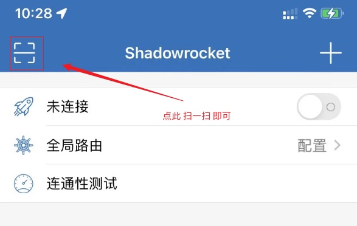

:::

@tab 第二步：登录订阅网站

【推荐】：**Clash Verge 订阅之后，也支持直接生成【订阅二维码】**

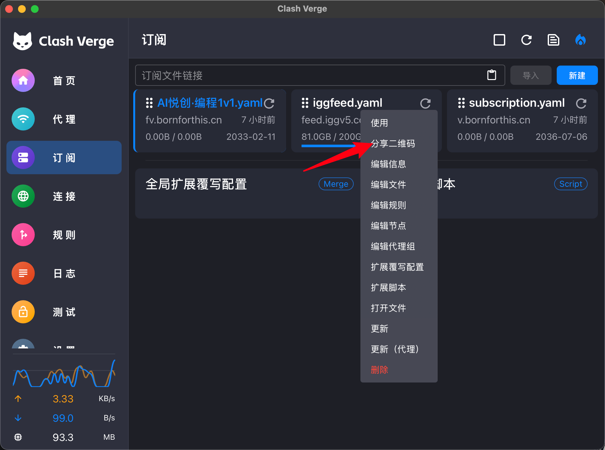

苹果手机还是很简单的，拿自己的订阅链接，使用这个网站生成二维码：[https://goqr.me/](https://goqr.me/)

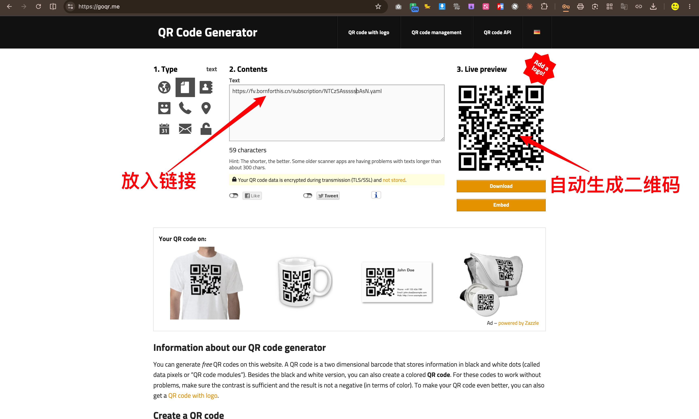

@tab 第三步：开启代理

扫码之后：点击"**未链接**"的按钮，即可打开代理。

::: center

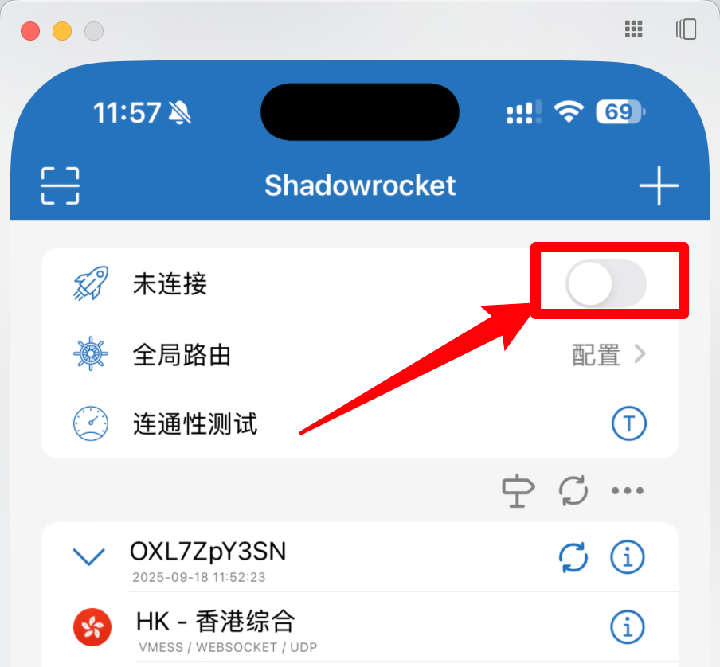

:::

::::

### 3.3 安卓手机配置「Clash For Android 教程」

::: tabs

@tab Step 1

**订阅链接已经直接发给你！**

@tab Step 2

手机上打开 clash，选择配置。

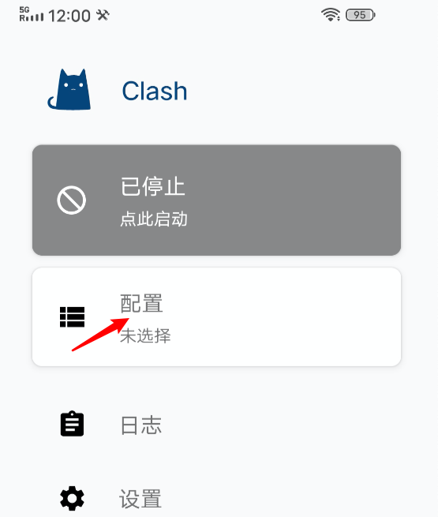

@tab Step 3

选择：`+新配置`

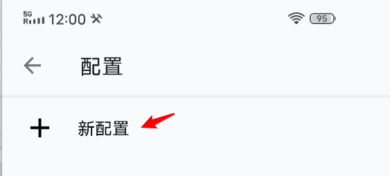

@tab Step 4

选择：从 URL 导入

@tab Step 5

**URL 就是我发给你的链接！**

此链接地址你也可以通过微信、QQ 等发送到手机上，然后复制。 也可以通过微信扫码等功能扫码，然后选择复制链接等方式拷贝。

- **名称不用叫 igg，直接改成：bornforthis**；
- **链接就是订阅网站复制的**；
- **自动更新随意，大部分推荐手动更新，毕竟安卓手机没那么好使**；

@tab Step 6

选中 bornforthis ， 然后返回。

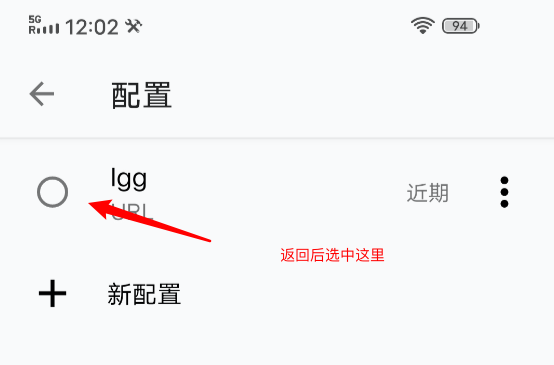

@tab Step 7

按下图点击：`已停止` 按钮开启 VPN 连接。

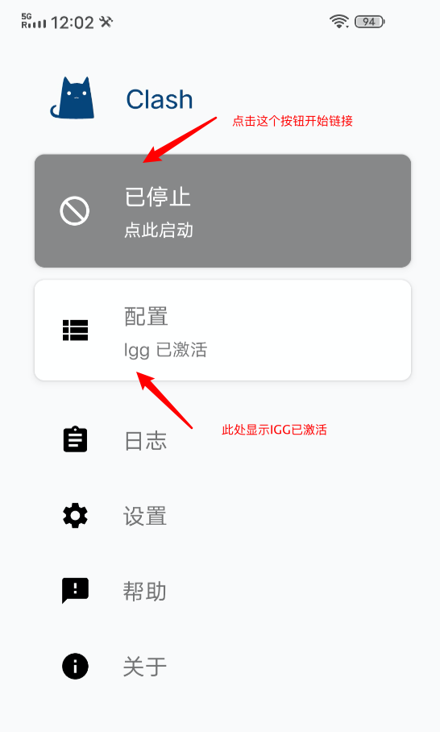

按下图显示：**运行中** ， 就代表连接成功。

:::

## 4. 代理更新相关

::: tip **通知：不理解复制去 AI 进行解释**

- **现在 Clash Verge 已经支持显示有效期**（手机也支持查看）

    ::: tabs

    @tab 电脑

    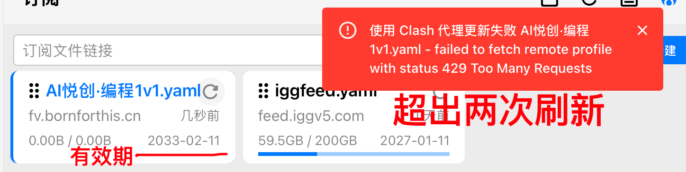

    @tab 手机

    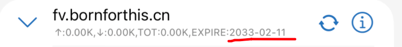

    :::

- 只要我没有更新代理信息、配置啥的，你刷新、订阅 1 次和 100 次都是一样的，并不会说刷新多次就会获取最新的；

- **所以不要想着一味的刷新，只要是最新的订阅数据，如果还不能用，那么就自行排查！**

- 没有去做流量显示，不用 care！（有人问，故而增加此问题！）

    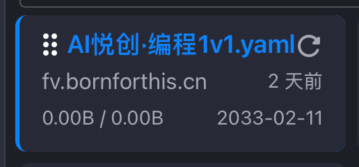

:::

::: tabs

@tab 1. 电脑手动更新

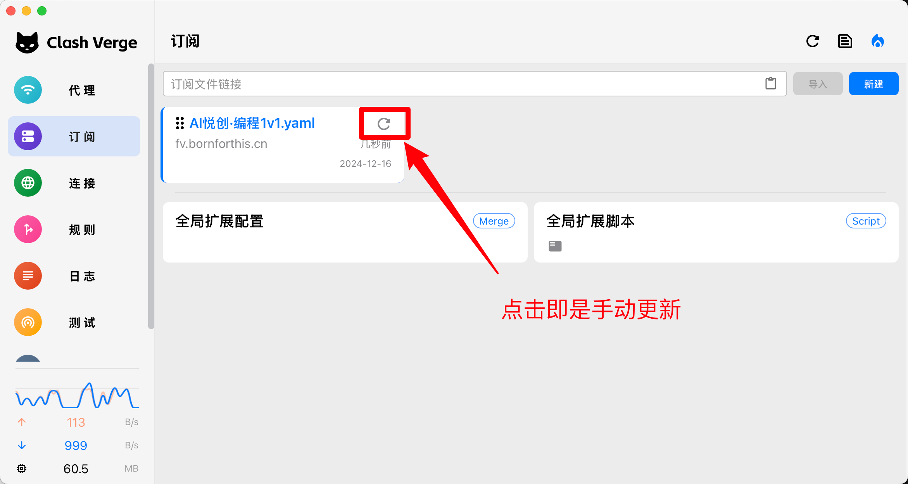

@tab 2. 苹果手机

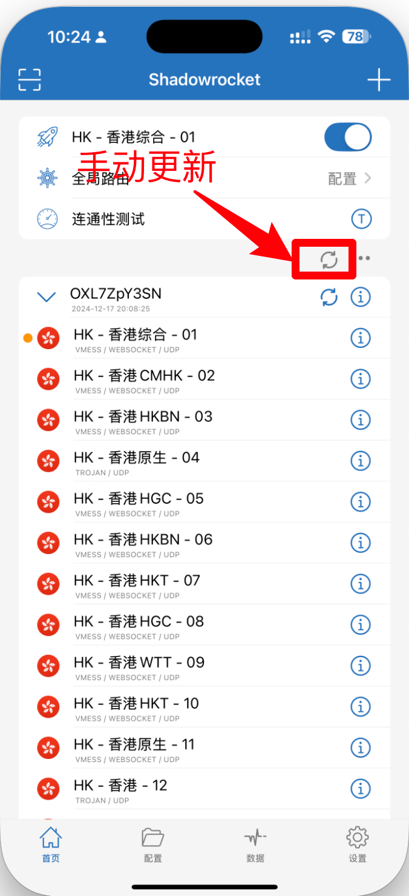

:::

## 5. 常见问题「必看！！！」

### 5.1 通用公告「必知」

::: warning

- 仅供学习使用！

- **开启代理**：更新完，记得开代理。有人更新完了，没开代理，跟我说不能用。😓

- 正常来说：**代理不需要特意关闭，除非你访问国内的某些网站不能正常使用，不然可以一直挂着！**

- **这个 🪜 我也在用，所以有问题我都会第一时间解决，有问题自行排查网络相关等～** 

- **注意**：大部分都不是 🪜 问题，我很多时候不会回复，自己的问题自己排查。

- **当你使用本代理时，发现所有代理节点都 timeout 可以考虑手动更新代理订阅。如果发现点击手动刷新按钮后显示失败，八成不是你网络问题，就是你订阅到期了；**

    **刷新成功后，还都是 timeout，那就可以考虑是你自己的网络问题！**

    > 不要觉得手动更新麻烦，是因为我自己也在用梯子，所以有什么速率慢或者失效的都会第一时间维护，因为是不定期维护，所以需要你们在不能用的时候进行手动刷新。（保证高可用的根本！）

- **如果手动更新失败，需要把代理先关闭再尝试更新！（前提：自己梯子没过期！）**

    > 稍微解释一下：你的本地代理失效，那么用失效的代理去请求代理更新，有时候还是会更新失败。

- Apple Store 更换 ID 教程：[https://blog.csdn.net/qq_33254766/article/details/130761916](https://blog.csdn.net/qq_33254766/article/details/130761916)
    - 更换完成之后，自行安装 Shadowrocket。
    - Shadowrocket 是 iOS 平台相对稳定且更新多年的 App，支持协议众多。
    
- 如果遇到某些网站无法访问会有如下原因：

    - 首先先说明：**绝不可能是代理问题！！！**

    - 自行切换节点测试，切换节点前请点击测速按钮！

    - 并且与你当前所使用的宽带（品牌、速率、设备等）与地区相关；

    - 推荐直接使用：**中国电信**；

        ::: tabs

        @tab 1. 电脑测速按钮

        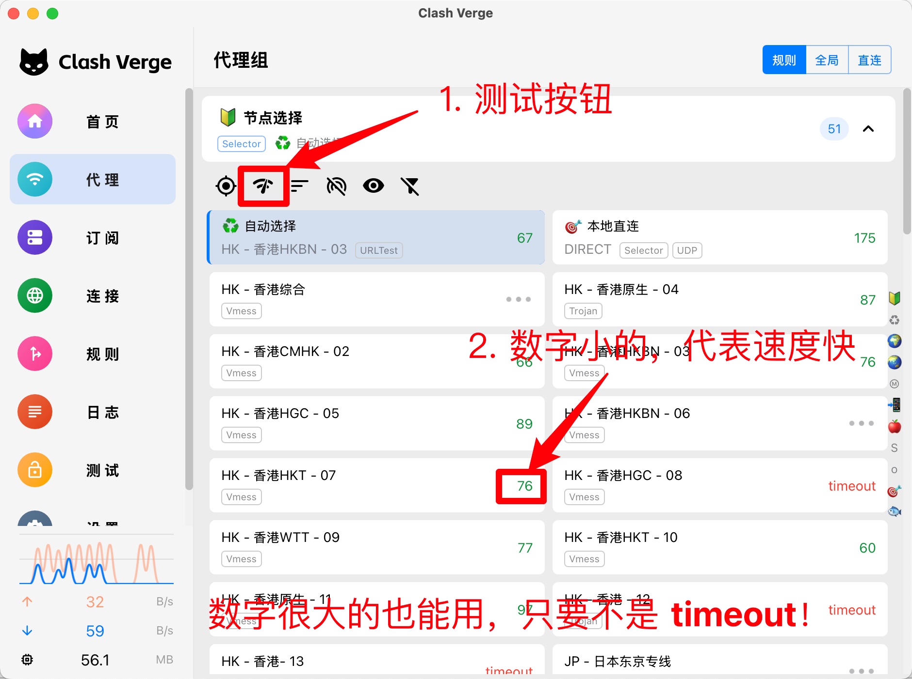

        @tab 2. iPhone 测试按钮
    
        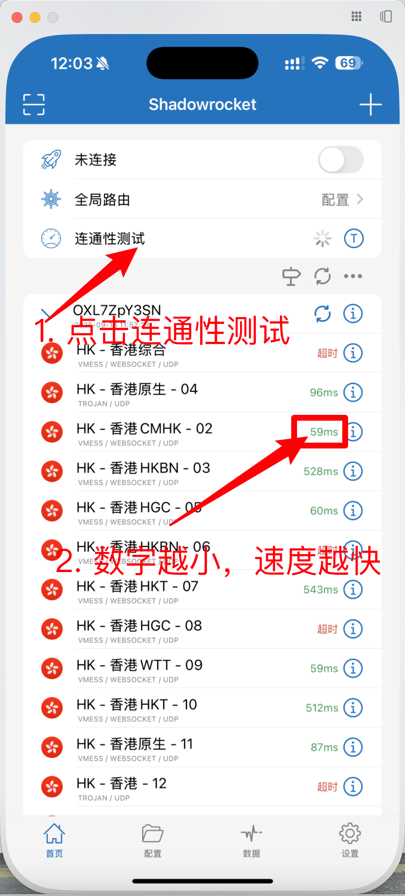
    
        :::

:::

### 5.2 操作类教程

::: tabs

@tab 1. Windows 11 如何关闭代理服务器

**如果你出现网络问题，推荐手动关闭 WIndows 的代理后，再手动开关 Clash Verge 的系统代理。**

其它 Windows 系统操作一致！

1. 设置，网络和 Internet，代理：

    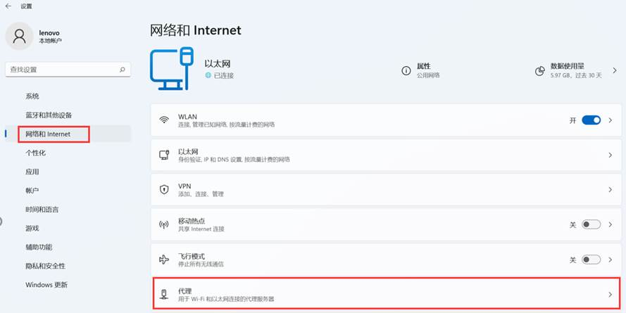

2. 点击设置：

    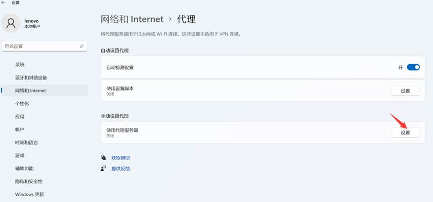

3. 关闭，保存：

    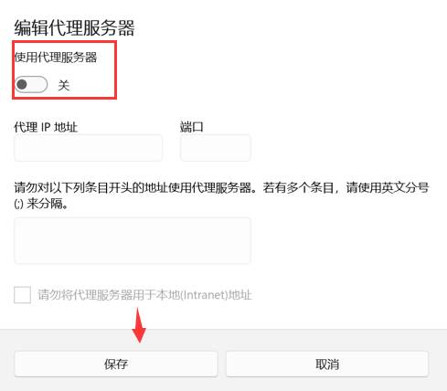

**到这一步，就可以再次去手动开关一次系统代理！**

@tab 2. 客户端软件更新

Clash Verge 支持直接更新，需要注意⚠️的是：需要在代理打开的情况下！

默认一步步玩下安装即可！

**如果直接更新失败，在你正常使用代理的情况下，可以自行去 Github 下载最新版进行覆盖安装：[https://github.com/clash-verge-rev/clash-verge-rev/releases](https://github.com/clash-verge-rev/clash-verge-rev/releases)。**

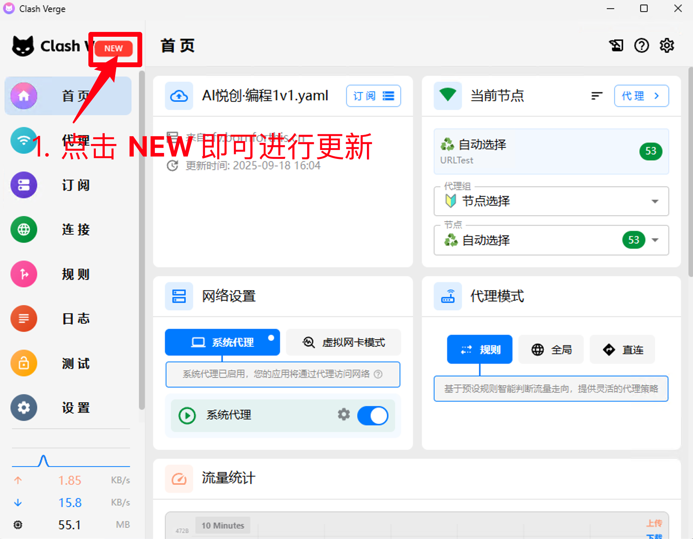

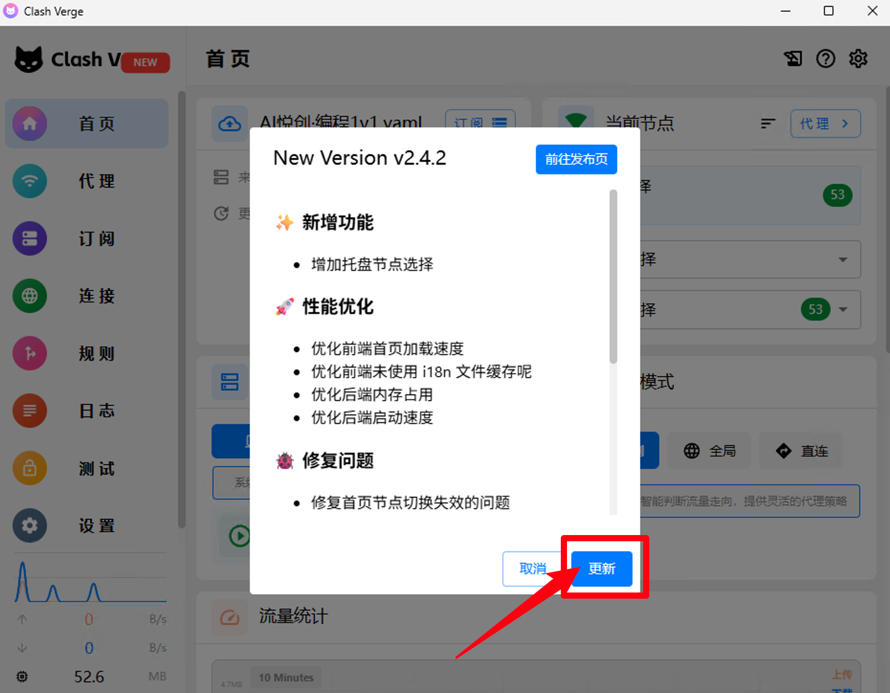

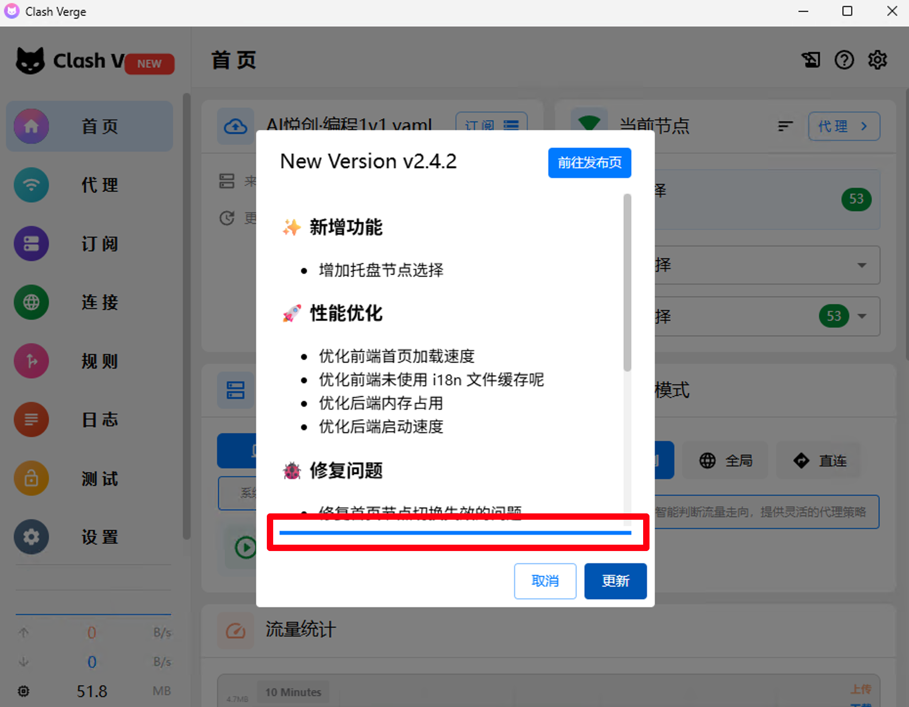

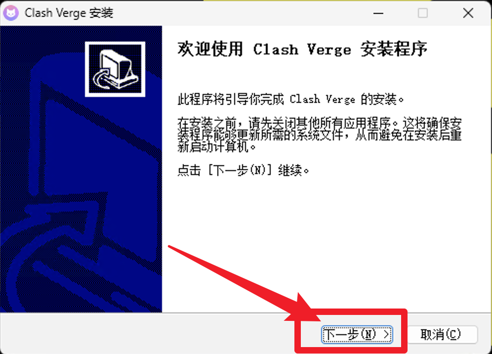

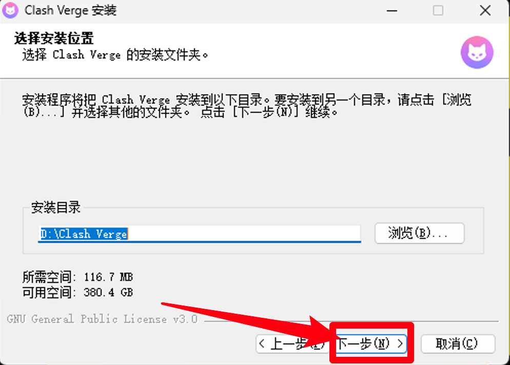

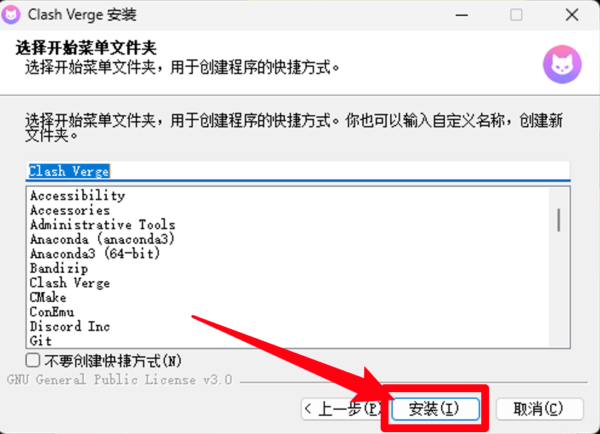

@tab 3. Mac 开机自启问题

Mac 电脑中，如果 Clash 设置了开机自启。有时你重启、开机电脑 Clash 会弹出如下窗口：

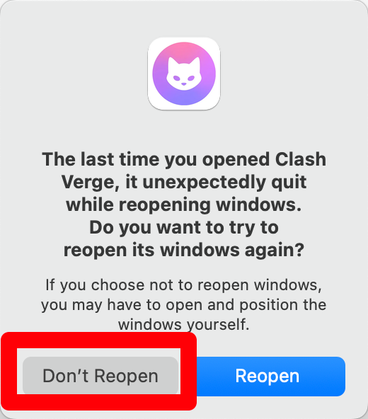

不要点击  Reopen，要点击：Don’t Reopen。然后自己去点击软件，正常启动即可。

:::

::: details 公众号：AI悦创【二维码】

:::

::: info AI悦创·编程一对一

AI悦创·推出辅导班啦，包括「Python 语言辅导班、C++ 辅导班、java 辅导班、算法/数据结构辅导班、少儿编程、pygame 游戏开发、Linux、Web全栈」，全部都是一对一教学：一对一辅导 + 一对一答疑 + 布置作业 + 项目实践等。当然，还有线下线上摄影课程、Photoshop、Premiere 一对一教学、QQ、微信在线，随时响应！微信：Jiabcdefh

C++ 信息奥赛题解，长期更新！长期招收一对一中小学信息奥赛集训，莆田、厦门地区有机会线下上门，其他地区线上。微信：Jiabcdefh

方法一：[QQ](http://wpa.qq.com/msgrd?v=3&uin=1432803776&site=qq&menu=yes)

方法二：微信：Jiabcdefh

:::

