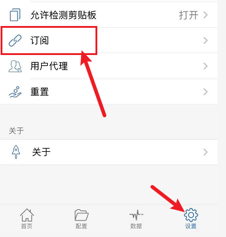
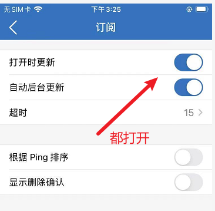

::: info

仅供内部学习使用

:::

服务器线路由于维护原因，需要经常更新删除过期的线路。我们使用的客户端大多数都是第三方开发的，并不是所有客户端程序都支持自动更新订阅，所以为了保持线路的流畅性与可用性，我们需要经常更新订阅，以便与服务器保持一致。

::: warning

手工**更新订阅的时候最好先断开当前连接，否则可能导致更新失败**。

:::

打开小火箭的自动更新订阅，这样以后就可以自动更新了。（有时候还是需要手动刷新的）

打开小火箭主界面，选择：设置——>订阅——>将：打开时更新 、 自动后台更新开启。

::: details 公众号：AI悦创【二维码】

:::

::: info AI悦创·编程一对一

AI悦创·推出辅导班啦，包括「Python 语言辅导班、C++ 辅导班、java 辅导班、算法/数据结构辅导班、少儿编程、pygame 游戏开发、Linux、Web全栈」，全部都是一对一教学：一对一辅导 + 一对一答疑 + 布置作业 + 项目实践等。当然，还有线下线上摄影课程、Photoshop、Premiere 一对一教学、QQ、微信在线，随时响应！微信：Jiabcdefh

C++ 信息奥赛题解，长期更新！长期招收一对一中小学信息奥赛集训，莆田、厦门地区有机会线下上门，其他地区线上。微信：Jiabcdefh

方法一：[QQ](http://wpa.qq.com/msgrd?v=3&uin=1432803776&site=qq&menu=yes)

方法二：微信：Jiabcdefh

:::

