## 1. 概念，搭建思路和运行环境

### 1-1 什么是 GitHub Pages？

[GitHub Pages](https://pages.github.com/) 是一组静态网页集合(Static Web Page)，这些静态网页由 [GitHub](https://github.com/) 托管(host)和发布，所以是 GitHub + Pages。

### 1-2 什么是Hugo？

[Hugo](https://gohugo.io/) 是用Go语言写的静态网站生成器(Static Site Generator)。可以把 Markdown 文件转化成 HTML 文件。

### 1-3 网站搭建思路

1. 创建 2 个GitHub仓库
    - **博客源仓库**：储存所有 blog 内容，以及 blog 中用到的图片等等
    - **GitHub Pages仓库**：将网页部署在 GitHub Pages
2. 将在**博客源仓库**中 Hugo 生成的静态 HTML 文件部署到远端 **GitHub Pages 仓库** 中。

### 1-4 运行环境

::: tip

这篇教程假设你已经：

1. 了解基本的终端命令行知识，如：`cd`, `ls`
2. 安装了 [Git](https://git-scm.com/)，并且了解基本的Git知识
3. 有一个 [GitHub](https://github.com/) 账号
4. 有自己偏好的代码编辑器（我使用的是 [VS Code](https://code.visualstudio.com/)）
5. xxx

:::

## 2. 安装Hugo

1. 这里使用包管理器安装 Hugo，我的操作系统是 Mac OS，所以使用 Homebrew 安装Hugo。如果你使用的是 Windows 或 Linux，可以根据 Hugo 文档提示的方式安装：[ Hugo文档：Install Hugo](https://gohugo.io/getting-started/installing/)

```shell
brew install hugo
```

2. 查看 Hugo 是否安装成功，显示 Hugo 版本号代表 Hugo 安装成功。

```shell
hugo version
```

## 3. 创建 GitHub 仓库

### 3-1 创建博客源仓库

1. 命名**博客源仓库**（whatever you want）
2.  勾选 **Public**，设置为公开仓库。
3.  勾选添加 **README** 文件

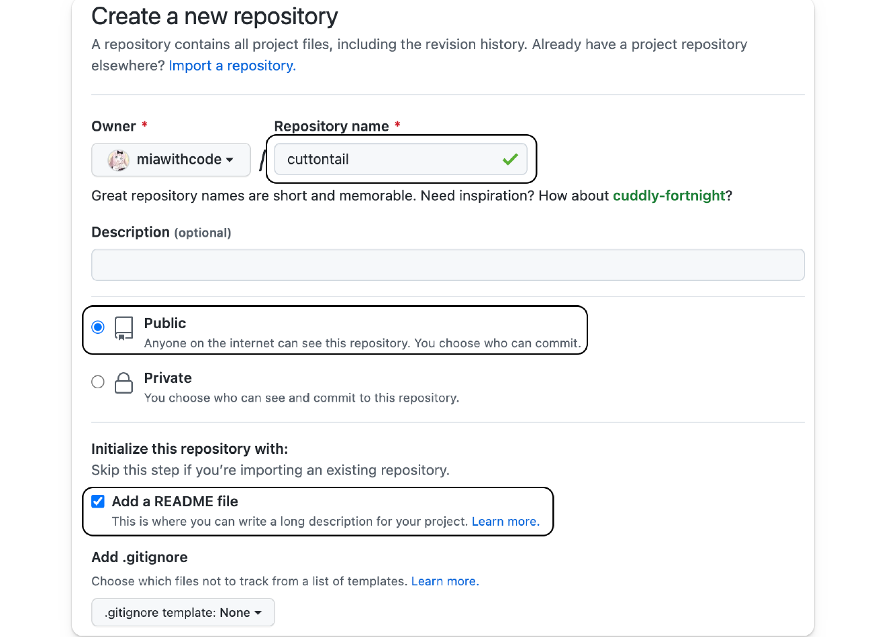

### 3-2 创建GitHub Page仓库

1. 命名 **GitHub Pages** 仓库，这个仓库必须使用特殊的命名格式 `<username.github.io>`， `<username>` 是自己的 GitHub 的用户名。
2.  勾选 **Public**，设置为公开仓库。
3.  勾选添加 **README** 文件，这会设置 `main` 分支为仓库的默认主分支，这在后面提交推送博客内容时很重要。

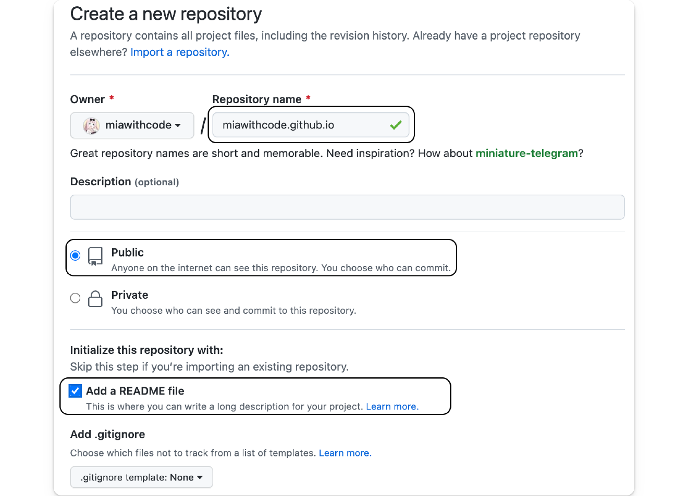

## 4. 克隆博客源仓库到本地

1. 打开想要在本地储存项目的文件夹（🌰: 我的项目的文件夹是 `project` ）

```shell
cd project
```

2. 克隆**博客源仓库**到项目文件夹，克隆时使用的 HHTPS 仓库链接在这里查看：

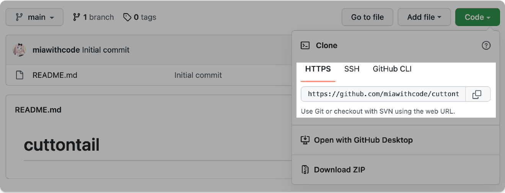

```shell
git clone https://github.com/miawithcode/cuttontail.git
```

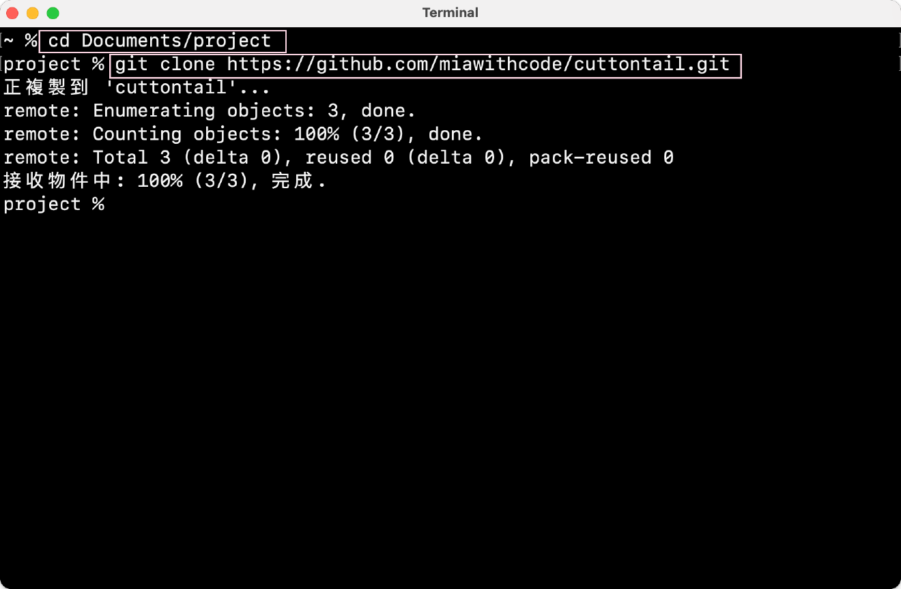

## 5. 使用 Hugo 创建网站

1. 进入刚刚克隆下来的**博客源仓库**文件夹（🌰: 我的博客源仓库文件夹名是 `cuttontail` ），在这个文件夹里用 Hugo 创建一个网站文件夹。
2. 用 Hugo 创建网站文件夹的命令是 `hugo new site 网站名字`。(🌰: 我的命名是 `cuttontail-blog`)

```shell
cd cuttontail
hugo new site cuttontail-blog
```

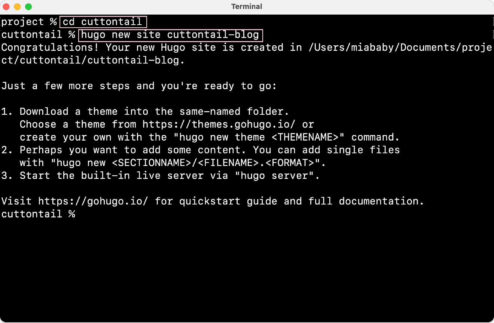

3. 用 Hugo 创建的网站共有 7 个文件夹和 1 个文件，这些文件分别代表：

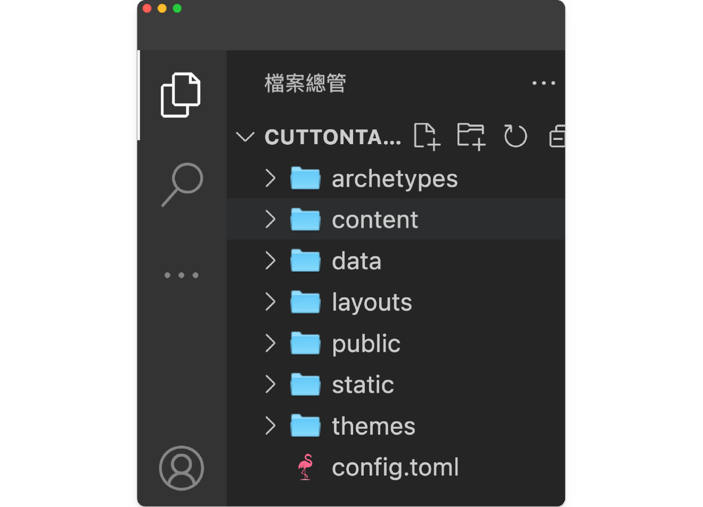

- **archetypes**：存放用 hugo 命令新建的 md 文件应用的 front matter 模版
- **content**：存放内容页面，如 Blog
- **layouts**：存放定义网站的样式，写在 `layouts` 文件下的样式会覆盖安装的主题中的 `layouts` 文件同名的样式
- **static**：存放所有静态文件，如图片
- **data**：存放创建站点时 Hugo 使用的其他数据
- **public**：存放 Hugo 生成的静态网页
- **themes**：存放主题文件
- **config.toml**：网站配置文件

## 6. 安装和配置Hugo主题

### 6-1 选择Hugo主题

可以从 [Hugo社区提供的主题](https://themes.gohugo.io/) 中选择一个喜欢的主题应用在自己的网站中。

### 6-2 安装 Hugo主题

1. 一般在你选择的 Hugo 主题的文档中，都会给出「如何安装这个主题」的命令，比如我选用的 **Hugo Bear Blog** 的文档中给出：

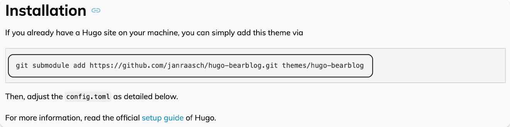

2. 打开刚刚用 Hugo 创建的网站文件夹（我的是 cuttontail-blog），在终端输入文档中给出的命令。

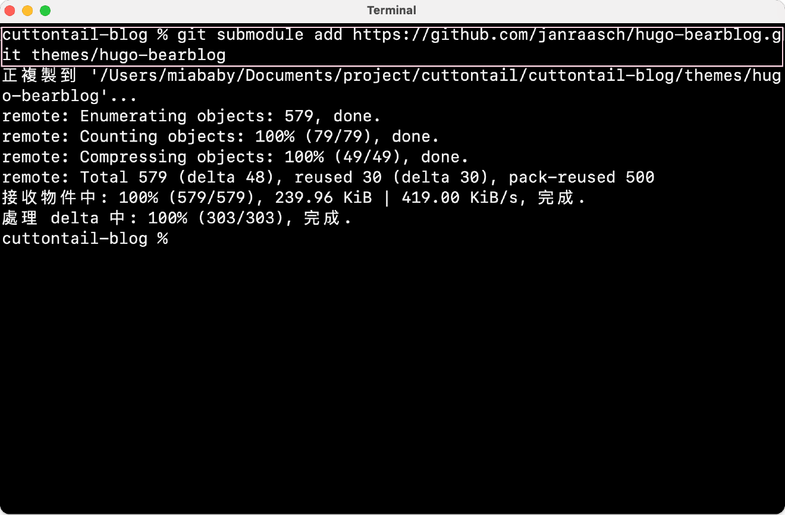

3. 这时可以看到在 themes 文件夹中，多出了刚刚安装的主题文件，代表主题安装成功。

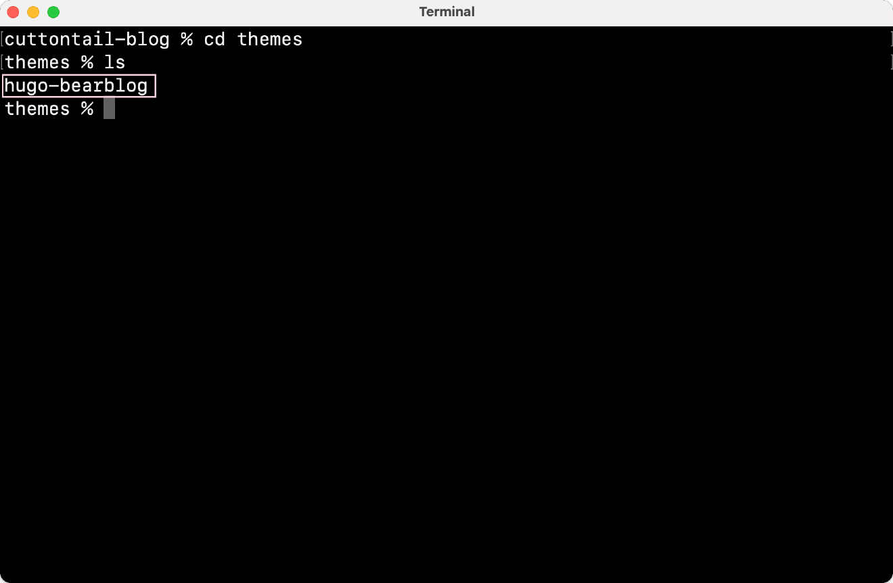

### 6-3 配置 Hugo 主题

1. 一般安装的 Hugo 主题的文件结构中都会有 `exampleSite` 文件夹，也是你在选择主题时参考的网站 demo。
2. **把 `exampleSite` 的文件复制到站点目录，在此基础上进行基础配置**。 非常推荐这么做，这样做能解决很多「为什么明明跟教程一步一步做下来显示的结果却不一样呢？」的疑惑。（这主要是因为不同的主题模版配置文件不同导致的。）
3. 在把 `exampleSite` 文件复制到站点目录时，根据**对应**文件夹进行复制文件

- 🌰：比如 `exampleSite` 下有 `content` ,  `static` 和 `config.toml` 3 个文件，就找到你自己的站点跟目录下这对应的三个文件。在把对应目录中的内容分别复制过去。

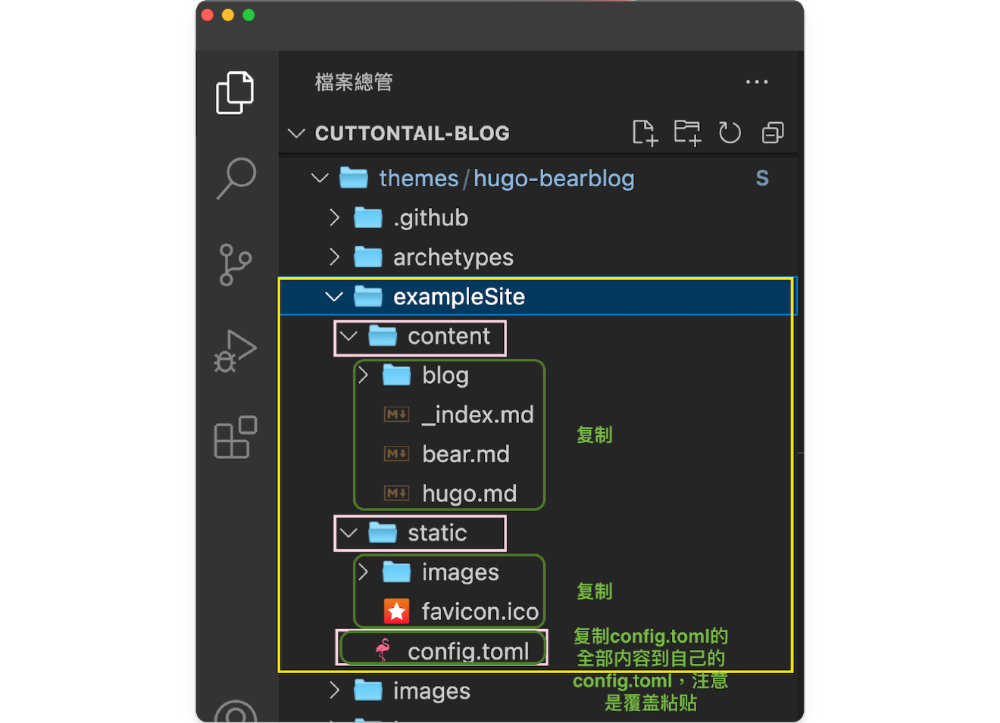

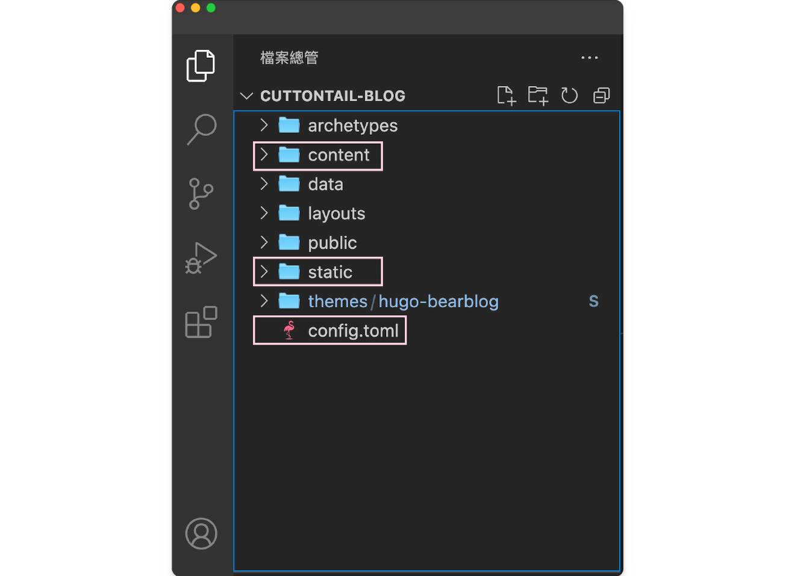

其中在复制 `config.toml` 的内容时要注意：

1. - baseURL

```shell
baseURL = "https://example.com/" #把https://example.com/改成自己的域名	        
```

如果你没有在 GitHub Pages 中设置自定义域名，这里的域名应该填 `https://<username>.github.io/` （⚠️注意：最后的`/`不要忘了加）

- **themes**

```shell
themes = "你选择的主题名字"。 #这一行命令代表启用你安装的主题
```

在 `config.toml` 中输入这行命令才能启用安装的主题，不过一般这行命令在你复制 `exampleSite` 的配置文件信息时，主题作者已经写好了这行。

## 7. 用 Hugo 创建文章

用 Hugo 创建一篇文章的命令是:

```shell
hugo new xxx.md
```

用这个命令创建的 Markdown 文件会套用 `archetypes` 文件夹中的 front matter 模版，在空白处用 Markdown 输入 blog 内容。

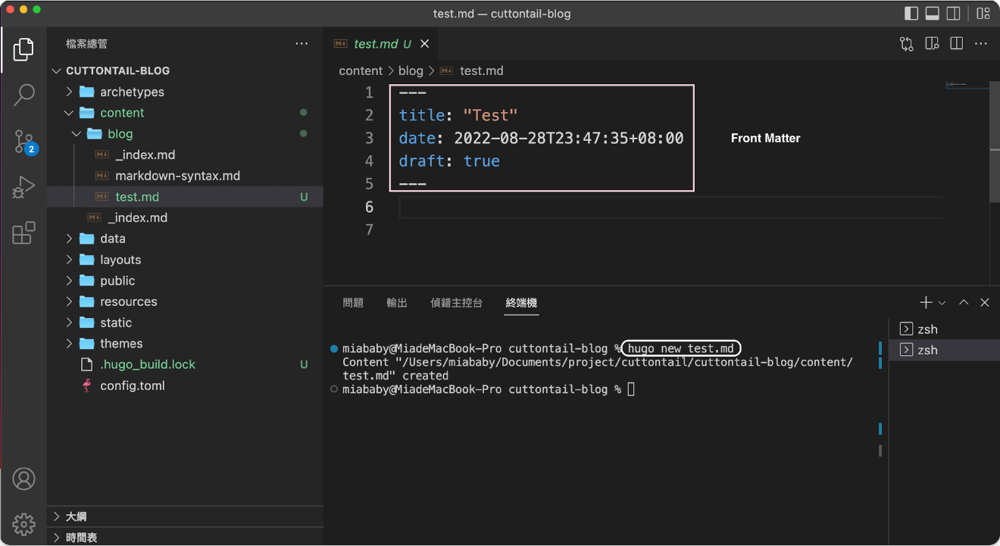

其中：`draft: true` 代表这篇文章是一个草稿，Hugo 不会显示草稿，要在主页显示添加的文章，可以设置 `draft: false`；或者直接删掉这行。

## 8. 本地调试和预览

1. 在发布到网站前可以在本地预览网站或内容的效果，运行命令：

```shell
hugo server
```

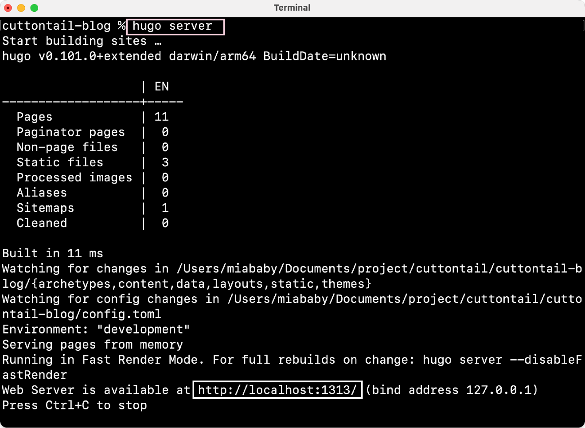

2. 也可以在本地编辑 Markdown 文件时，通过 `hugo server` 来实时预览显示效果。

3. `hugo server` 运行成功后，可以在 `http://localhost:1313/` 中预览网站

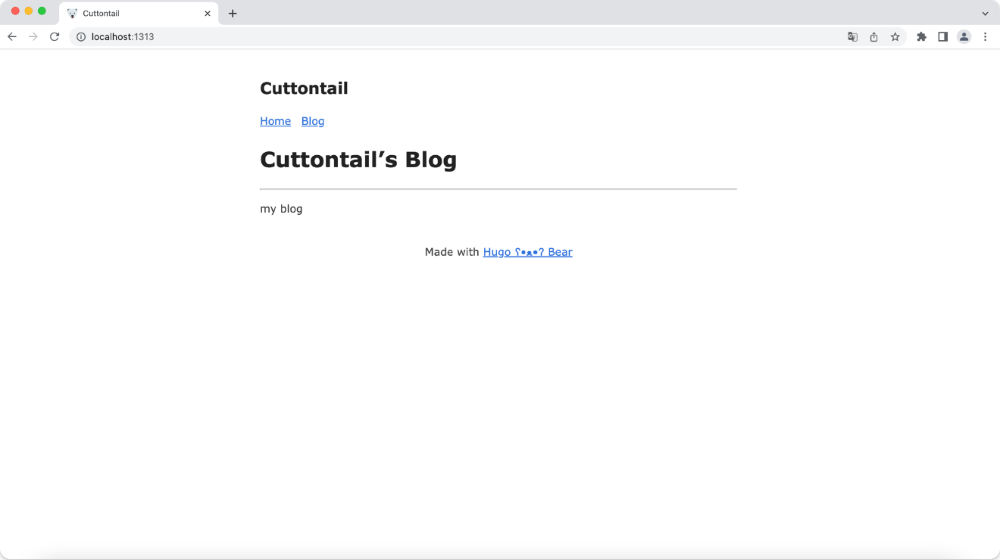

## 9. 发布内容

1. `hugo` 命令可以将你写的 Markdown 文件生成静态 HTML 网页，生成的 HTML 文件默认存放在 `public` 文件夹中。

```shell
hugo
```

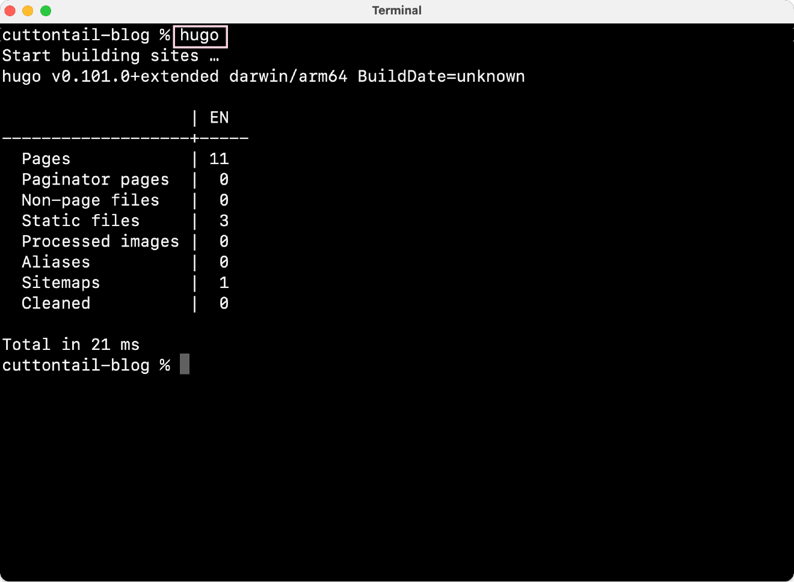

2. 因为`hugo` 生成的静态HTML网页文件默认存放在 `public` 文件中，所以推送网页内容只需要把 `public` 中的 HTML 网页文件发布到 GitHub Pages 仓库中。

3. 将 `public` 文件夹初始化为 Git 仓库，并设置默认主分支名为 `main`。✨这么做的原因是：

- GitHub 创建仓库时生成的默认主分支名是 `main`
- 用 `git init` 初始化 Git 仓库时创建的默认主分支名是 `master`
- 将 `git init` 创建的 `master` 修改成 `main` ，再推送给远端仓库 `<username>.github.io` ，这样才不会报错。

```shell
cd public
git init -b main
```

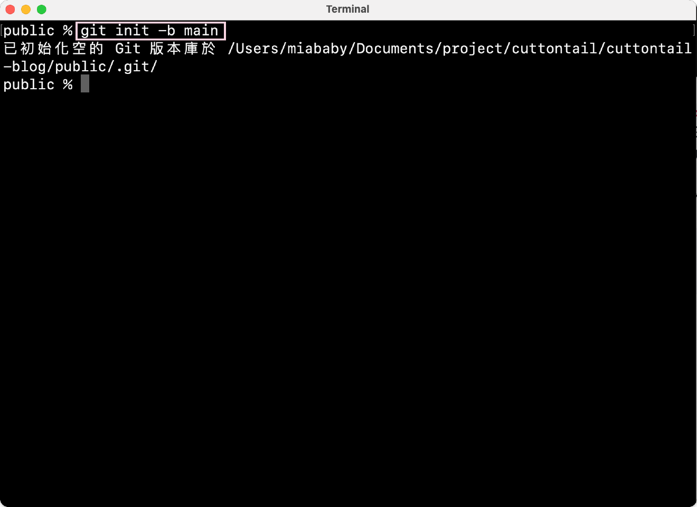

4. 将 `public` 文件夹关联远程 GitHub Pages 仓库，使用 GitHub Pages 仓库的 SSH 链接。

- （ ⚠️ 注意：要让 SSH 链接起作用，需要你添加过SSH Key。如果你没有设置 SSH Key，请参考[ 如何在Mac上为GitHub设置SSH Key](https://cuttontail.blog/blog/how-to-add-ssh-key-to-github-on-mac/)）
- **GitHub Pages 仓库的 SSH 链接可以在这里查看：**

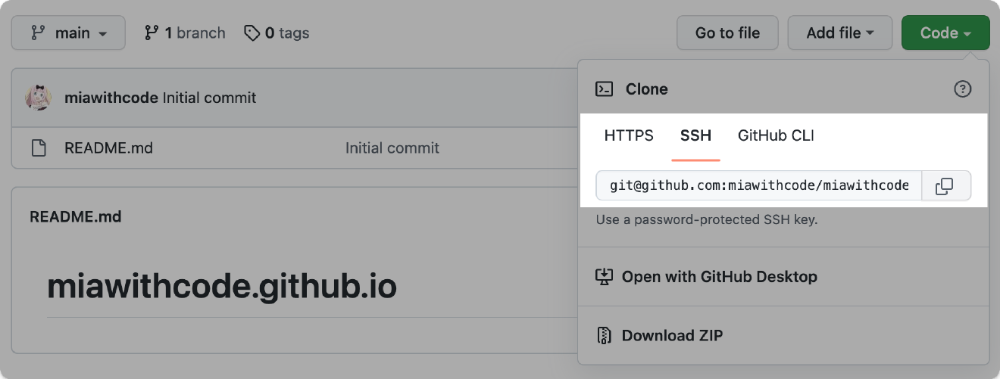

```shell
git remote add origin git@github.com:miawithcode/miawithcode.github.io.git
```

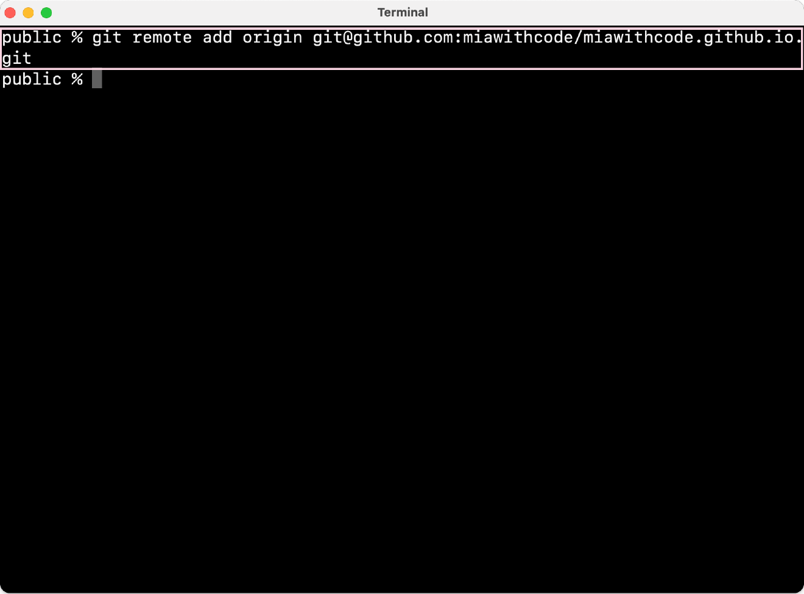

5. 推送**博客源仓库**的 `public` 文件夹中的 HTML 网页文件到 **GitHub Pages仓库** 中，在推送仓库内容前要先用 `git pull --rebase origin main` 和远端仓库同步，否则会报错。

```shell
git pull --rebase origin main 
git add .
git commit -m "...(修改的信息)" 
git push origin main
```

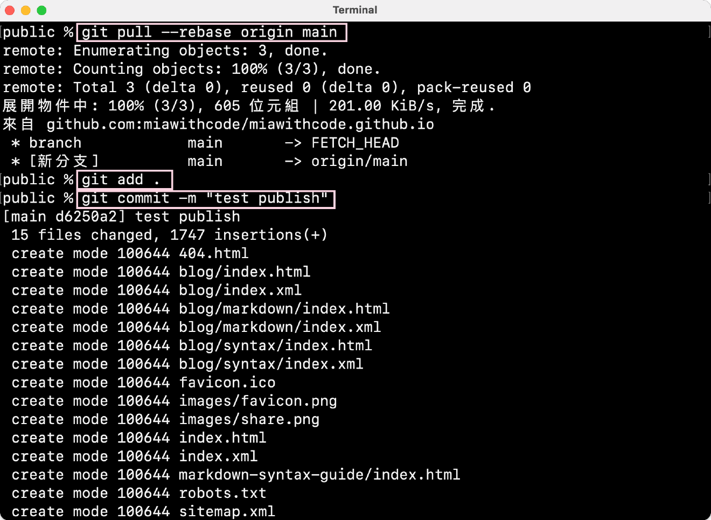

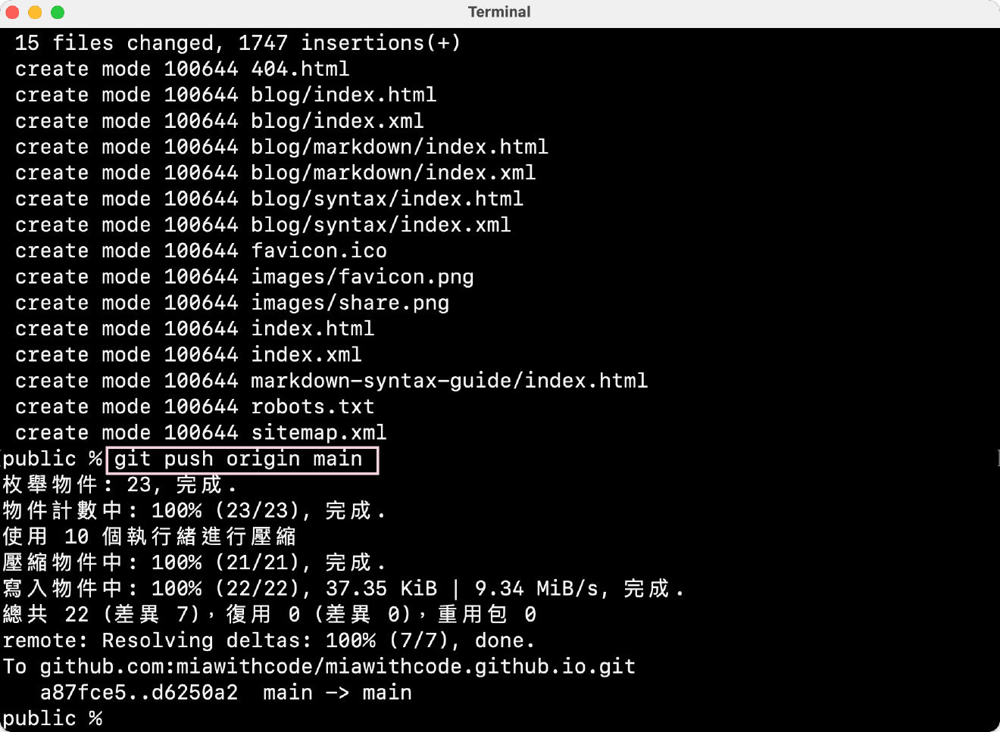

6. 转到 GitHub 中查看 **GitHub Pages仓库** 中是否存在刚刚推送的文件，存在则代表推送成功。

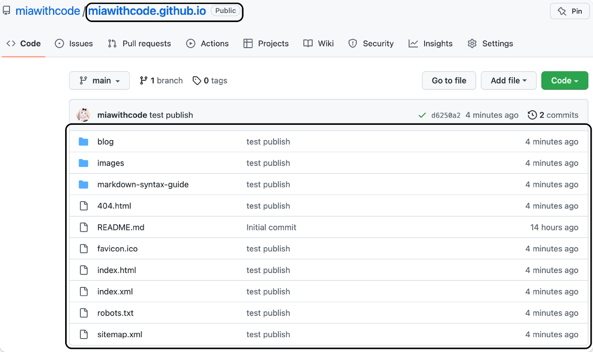

7. 如果你没有设置自定义域名，且把 `comfig.toml` 文件中的 `baseURL` 设置为 `https://<username>.github.io`，就可以在 [https://username.github.io](https://cuttontail.blog/blog/create-a-wesite-using-github-pages-and-hugo/) 中查看刚刚创建的网站。 ( 👀 我使用的是自定义域名，所以这里用我的自定义域名查看。)

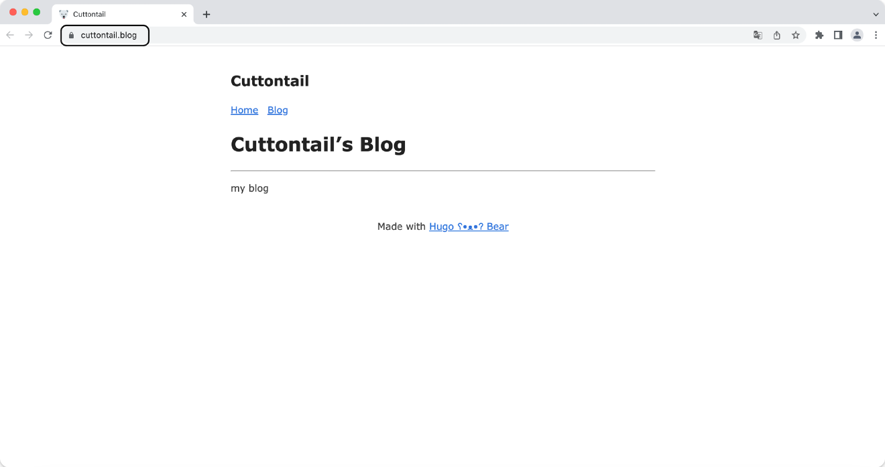

8. 后续的更新步骤：

1. `创建你的文章.md`
2. 用 `hugo server` 在本地预览，满意后准备发布。
3. 运行 `hugo` 命令将 Markdown 文件生成 HTML 文件。
4. 将修改先提交至**博客源仓库**

```shell
git add .
git commit -m "...(修改的信息)"
git push
```

5. 打开 `public` 文件

6. 运行：

```shell
git add .
git commit -m "...(修改的信息)" 
git pull --rebase origin main #可选,如果远端仓库与本地一致，则不需要合并。
git push origin main
```

- 如果你使用的是自定义域名，第一次推送成功后，GitHub Pages 仓库会生成 CNAME 文件，所以第二次推送还要再合并一次：`git pull --rebase origin main`。后续的更新 Blog 就不再需要使用这个命令了。（根据实际情况使用）

1. 发布内容除了手动发布，还能使用 GitHub Action 自动发布。但我认为刚刚搭建好一个网站，立刻就用 GitHub Action 有些 Overwhelming，先手动发布，熟练之后再开始使用 GitHub Action 自动发布会比较好。

欢迎关注我公众号：AI悦创，有更多更好玩的等你发现！

::: details 公众号：AI悦创【二维码】


:::

::: info AI悦创·编程一对一

AI悦创·推出辅导班啦，包括「Python 语言辅导班、C++ 辅导班、java 辅导班、算法/数据结构辅导班、少儿编程、pygame 游戏开发、Linux、」，全部都是一对一教学：一对一辅导 + 一对一答疑 + 布置作业 + 项目实践等。当然，还有线下线上摄影课程、Photoshop、Premiere 一对一教学、QQ、微信在线，随时响应！微信：Jiabcdefh

C++ 信息奥赛题解，长期更新！长期招收一对一中小学信息奥赛集训，莆田、厦门地区有机会线下上门，其他地区线上。微信：Jiabcdefh

方法一：[QQ](http://wpa.qq.com/msgrd?v=3&uin=1432803776&site=qq&menu=yes)

方法二：微信：Jiabcdefh

:::


