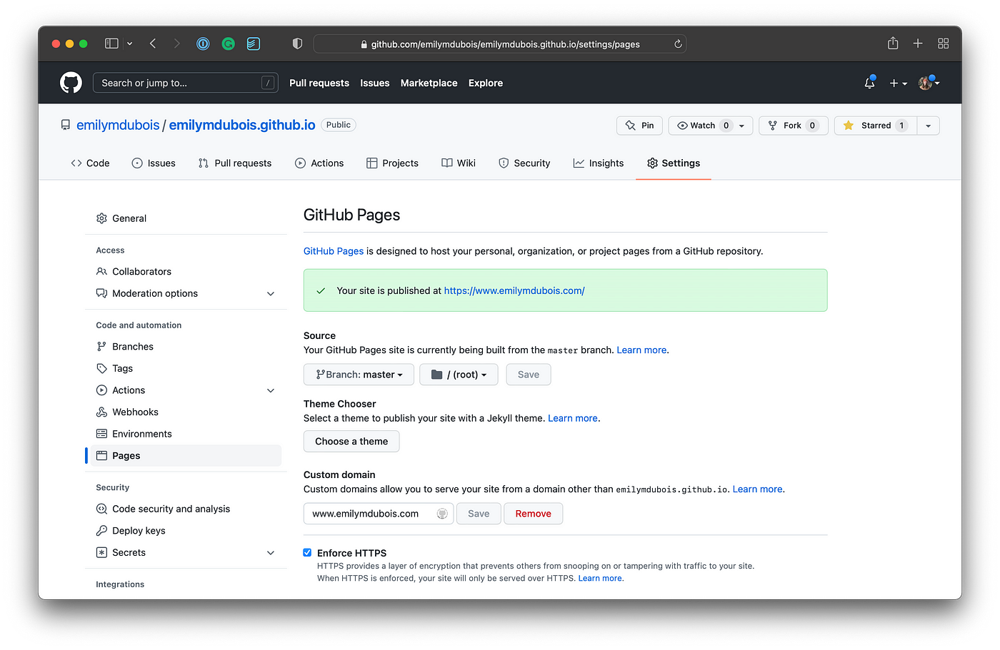
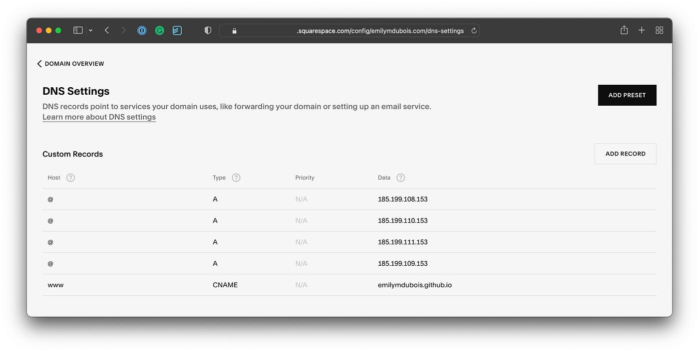
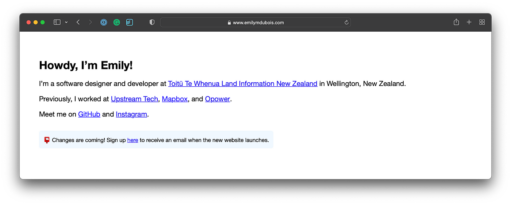

Hello, I'm Yue Chuang.

Creating your website with a custom URL is momentous. Your first entrance into fashionable Internet society. A digital debutante ball. A modern promenade. Many of us haven’t staked a claim like this since joining the AIM community behind a clever screen name.

This tutorial will teach you how to publish your website directly from GitHub to a Squarespace domain. GitHub also has a [Managing a custom domain for your GitHub Pages site](https://docs.github.com/en/pages/configuring-a-custom-domain-for-your-github-pages-site/managing-a-custom-domain-for-your-github-pages-site) document with helpful instructions.

## Prerequisites

1. A Squarespace domain. Search for and claim a domain [here](https://www.squarespace.com/domain-name-search/).
2. A GitHub user site repository in the `<user>.github.io` format. If you do not already have one, follow [this tutorial](https://pages.github.com/) to set one up.

## First, GitHub pages.

GitHub Pages is a static site hosting service that serves your custom website at a URL directly from a GitHub repository. Your user site repository automatically publishes updates to a URL of the same name, `<user>.github.io`. We need to enable the settings that allow an alternative domain to point to the content hosted in this repository.

1. Navigate to your `<user>.github.io` repository in the GitHub web application, and select **Settings** from the navigation menu.
2. Scroll down to the **Code and automation** > **Pages** section.
3. Note the selected branch and folder in the **Source** section. GitHub will automatically publish any content committed to this branch in this directory to your website.
4. In the **Custom domain** input, enter your Squarespace domain name. For example, I would input “www.emilymdubois.com” because I claimed [www.emilymdubois.com](https://emilymdubois.com/).
5. Ensure that **Enforce HTTPS** is selected. Note that it can take up to a day before this option is available.
6. At the top of the page, select **Code** from the navigation menu.
7. Select the branch from the drop-down menu you configured in the **Code and automation** > **Pages** > **Source** section.
8. You should now see a file entitled *CNAME* containing your domain name.

## Second, Squarespace.

Next, we need to point our custom domain’s DNS record to GitHub’s servers.

1. Navigate to [https://account.squarespace.com/domains](https://account.squarespace.com/domains).
2. Find the domain name that you have configured your `<user>.github.io` repository to point to. Click on the preview in the first column, or select **⋮ > Manage Domain Settings** in the last column.
3. Click on the domain name in the left sidebar.
4. Select **DNS Settings** from the sidebar navigation.
5. Add an “A*”* record with host “@” for each GitHub Pages IP address. Use the `dig <user>.github.io` command to get this list. At the time of authorship, they were `185.199.108.153`, `185.199.110.153`, `185.199.111.153`, and `185.199.109.153`.
6. Add a “CNAME” record with host “www” to point your subdomain to `<user>.github.io`.

## Third, patience.

It can take up to 24 hours for your new configuration to take effect. Don’t forget to select **Enforce HTTPS** in your GitHub Pages settings if you were previously unable to.

Once your changes have propagated, you should be able to navigate to your custom domain and see your `<user>.github.io` content. 🎉

欢迎关注我公众号：AI悦创，有更多更好玩的等你发现！

::: details 公众号：AI悦创【二维码】

:::

::: info AI悦创·编程一对一

AI悦创·推出辅导班啦，包括「Python 语言辅导班、C++ 辅导班、java 辅导班、算法/数据结构辅导班、少儿编程、pygame 游戏开发、Linux、Web 全栈」，全部都是一对一教学：一对一辅导 + 一对一答疑 + 布置作业 + 项目实践等。当然，还有线下线上摄影课程、Photoshop、Premiere 一对一教学、QQ、微信在线，随时响应！微信：Jiabcdefh

C++ 信息奥赛题解，长期更新！长期招收一对一中小学信息奥赛集训，莆田、厦门地区有机会线下上门，其他地区线上。微信：Jiabcdefh

方法一：[QQ](http://wpa.qq.com/msgrd?v=3&uin=1432803776&site=qq&menu=yes)

方法二：微信：Jiabcdefh

:::

