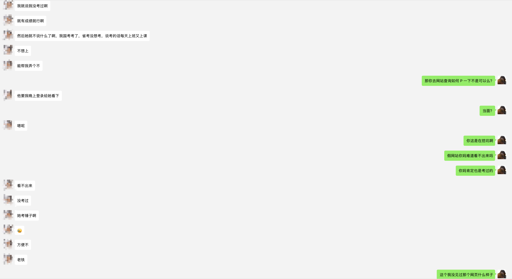
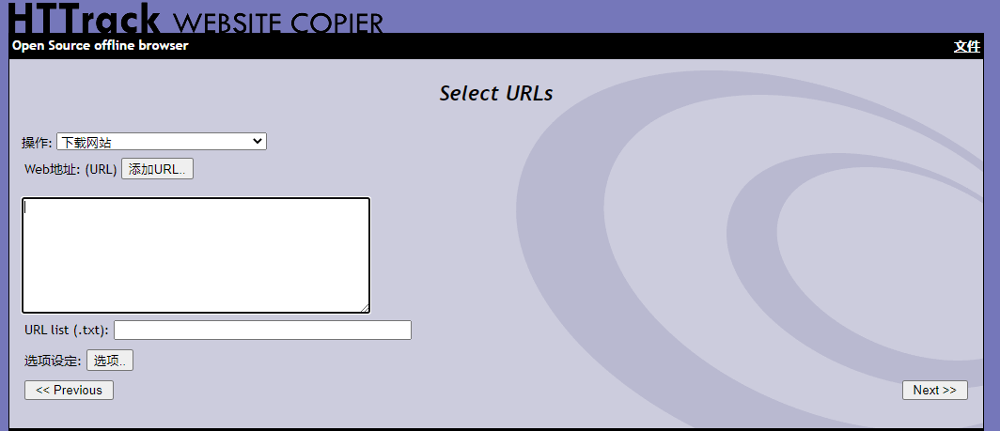
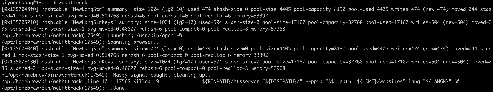
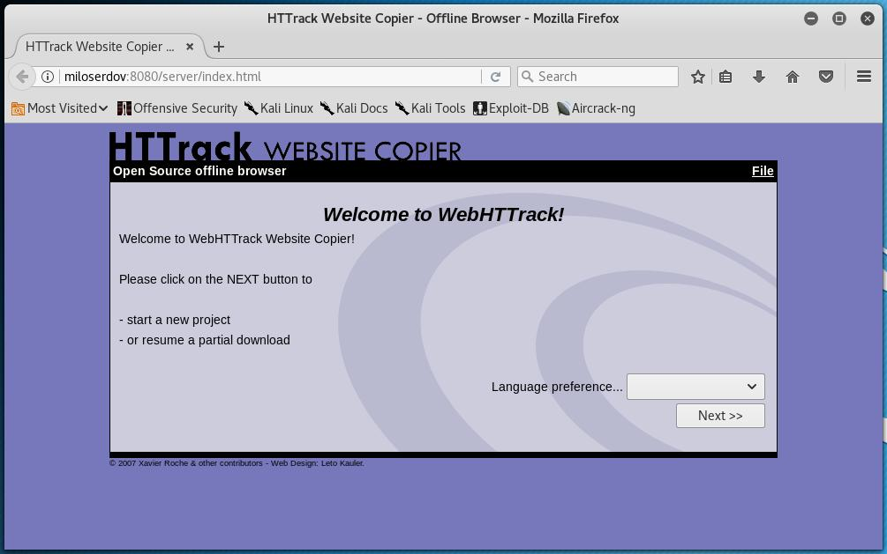
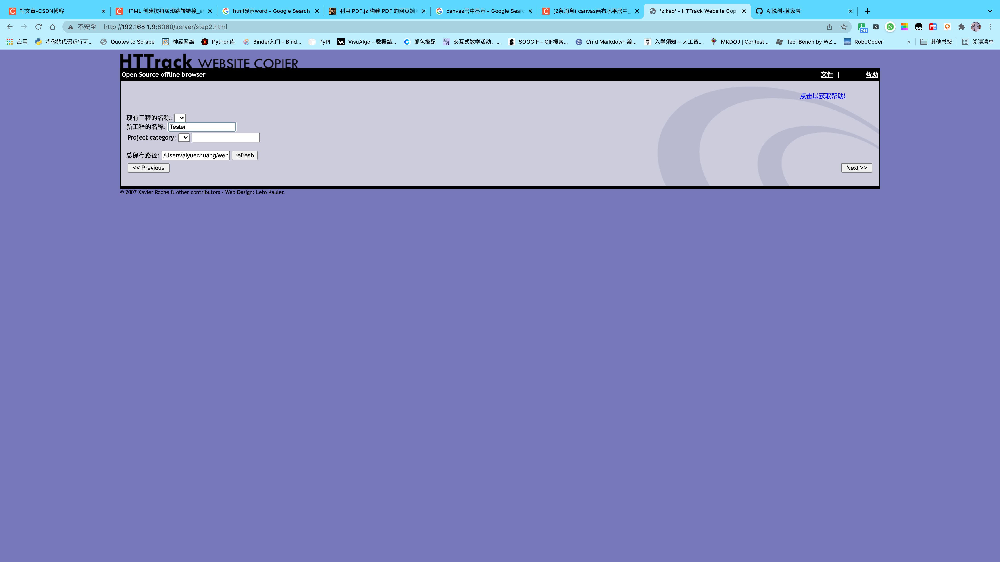
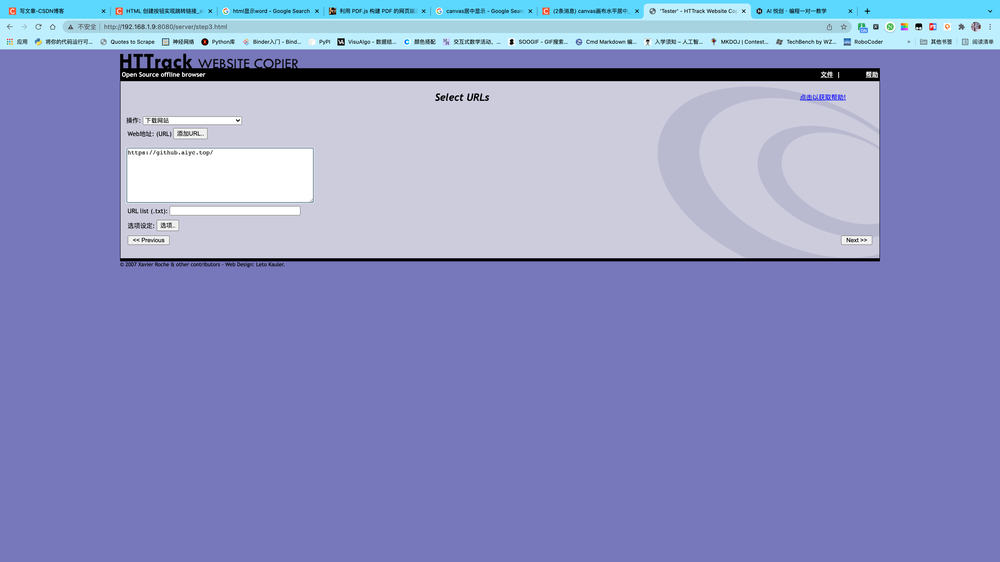
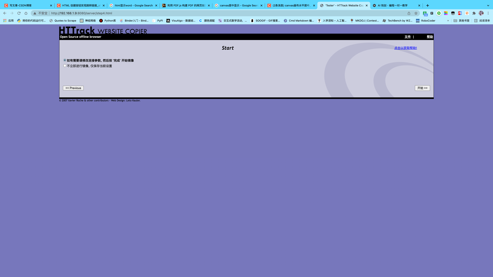
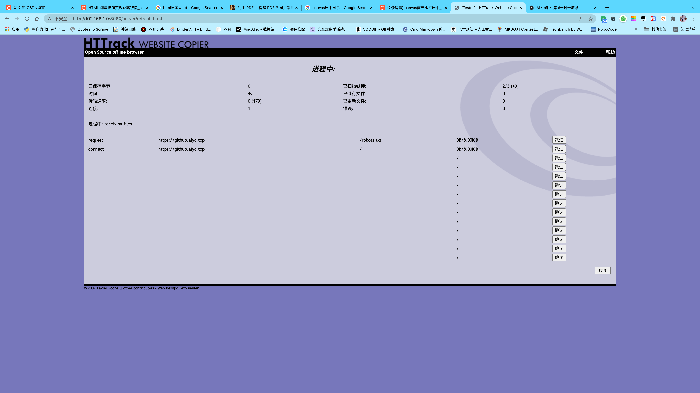
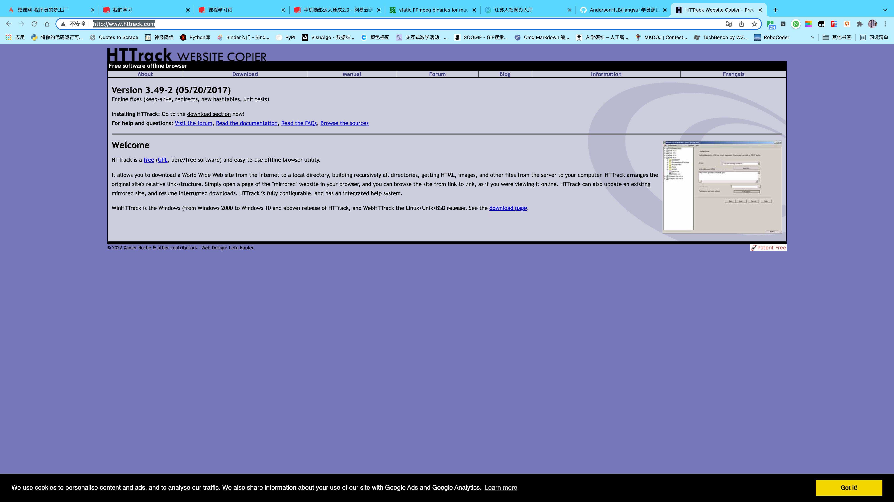
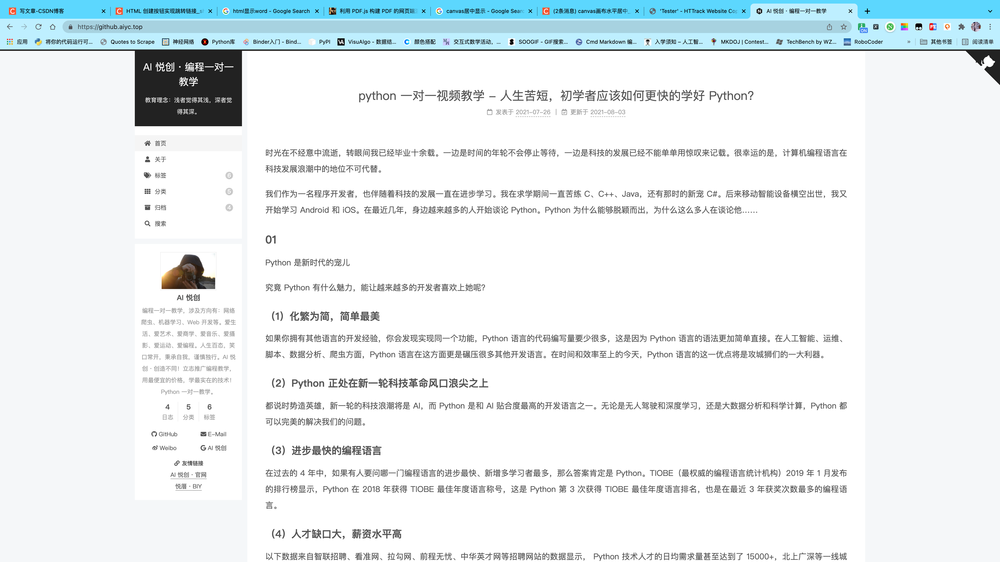

你好，我是悦创。

我的一个 Python 一对一学员，突然给我提了一个这样的需求：

大概就是上面的聊天记录一样，这个一对一学员的需求有点让我无语。

不过还是可以简单的实现一下，这个时候直接使用浏览器的直接保存是行不通的。因为，会有问题的。

所以我接下来推荐这个程序。

HTTrack 是一个免费的网站克隆工具。它允许您将 Internet 上的万维网站点下载到本地目录，以递归方式构建所有目录，并从服务器到计算机获取 HTML，图像和其他文件。HTTrack 安排原始站点的相对链接结构。只需在浏览器中打开“镜像”网站的页面，就可以从一个链接到另一个链接浏览该网站，就像您正在在线查看它一样。HTTrack 还可以更新现有的镜像站点，并恢复中断的下载。HTTrack 是完全可配置的，并且具有集成的帮助系统。

**安装 HTTrack**

1. apt-get 更新 `sudo apt-get update`
2. kali 安装 HTTrack `sudoapt-get install httrack webhttrack`

**运行 HTTrack**

1. 安装成功执行 `webhttrack`命令。
2. 浏览器输入[ http://localhost:8080](http://localhost:8080/)打开如下页面。

**网站克隆**

克隆我的博客，但是大家还是稍微克制一些哦！[https://aiyc.top/](https://aiyc.top/)

输入完成之后，一直 next 即可。最后克隆的网站预览。

哎，就是玩！

可能对于刚刚接触 html 的同学有用吧，可以更方便的学习人家的编码技巧,希望对你们有用。

官网地址： [http://www.httrack.com/](http://www.httrack.com/) 

欢迎关注我公众号：AI悦创，有更多更好玩的等你发现！

::: details 公众号：AI悦创【二维码】

:::

::: info AI悦创·编程一对一

AI悦创·推出辅导班啦，包括「Python 语言辅导班、C++ 辅导班、java 辅导班、算法/数据结构辅导班、少儿编程、pygame 游戏开发、Linux、Web 全栈」，全部都是一对一教学：一对一辅导 + 一对一答疑 + 布置作业 + 项目实践等。当然，还有线下线上摄影课程、Photoshop、Premiere 一对一教学、QQ、微信在线，随时响应！微信：Jiabcdefh

C++ 信息奥赛题解，长期更新！长期招收一对一中小学信息奥赛集训，莆田、厦门地区有机会线下上门，其他地区线上。微信：Jiabcdefh

方法一：[QQ](http://wpa.qq.com/msgrd?v=3&uin=1432803776&site=qq&menu=yes)

方法二：微信：Jiabcdefh

:::

