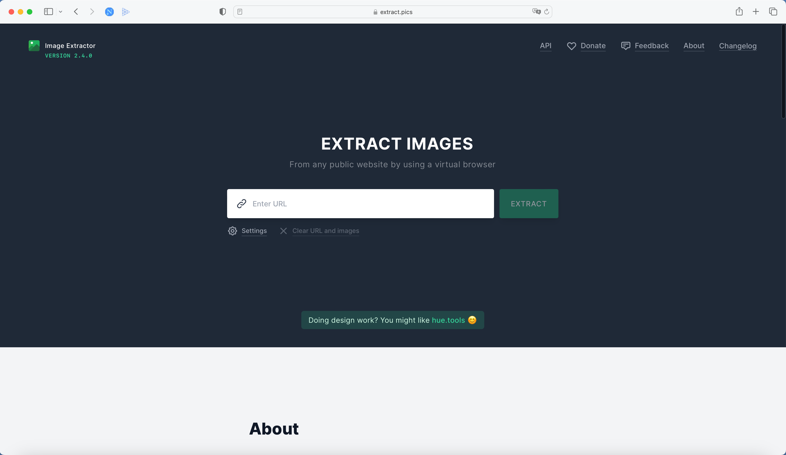
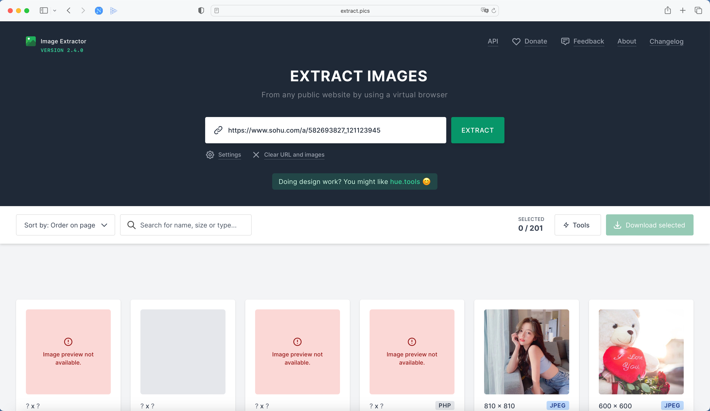
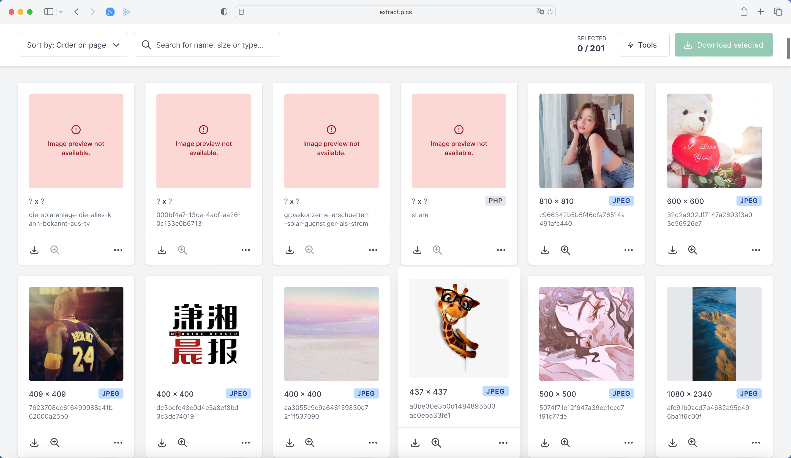
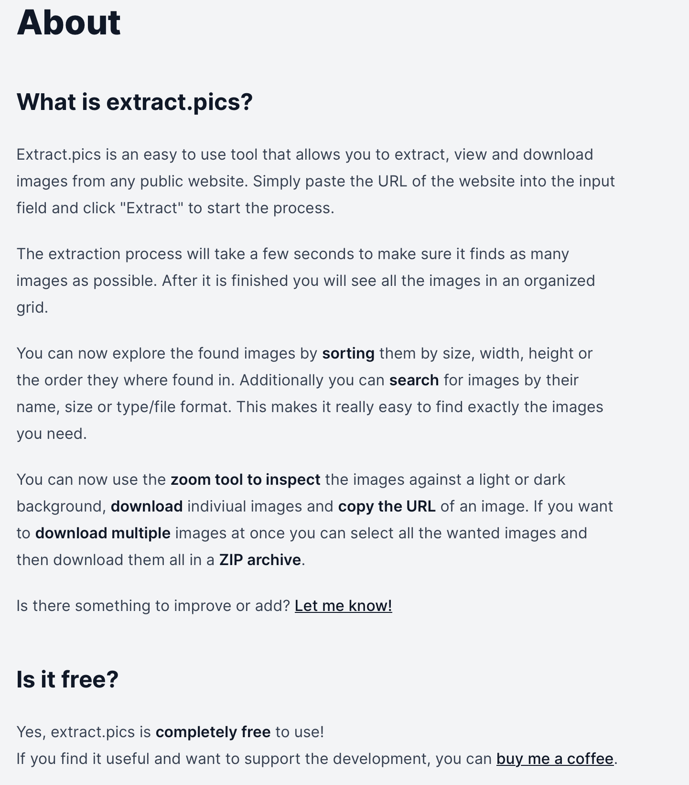
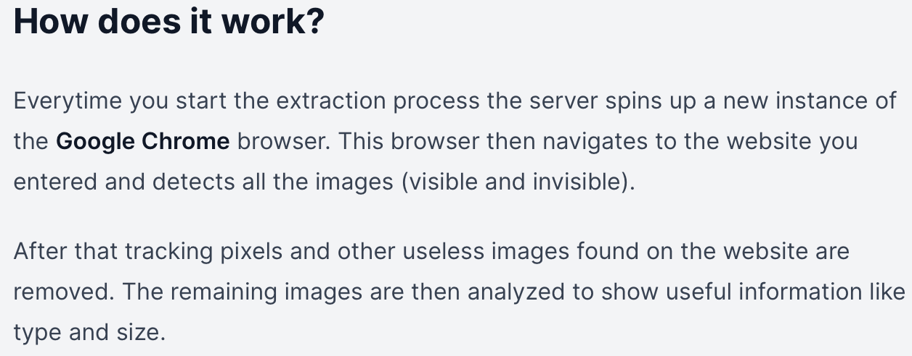

你好，我是悦创。

今天给大家推荐一个网站，可以一键下载分析和获取网页上的所有图片，并且可以一键打包下载！

## 介绍

开门见山了，这个网站的链接是：[extract.pics/](https://extract.pics)

长这个样子：

大家可以看到，打开之后就是一个醒目的输入框，可以直接输入一个网站链接，然后它就可以把网站上的图片都爬取下来。

我们来做一个测试吧。

比如我随便搜了一个包含一些手机壁纸图片的链接：[https://www.sohu.com/a/582693827_121123945](https://www.sohu.com/a/582693827_121123945)

那我们就直接把这个链接贴到 [extract.pics/](https://extract.pics) 就好了：

接下来，直接点击 EXTRACT 按钮即可。

这时候我们可以在网站下方看到一些“爬取”进度，比如启动爬取器、分析、滚动、提取等等。

稍等片刻，我们就可以发现所有的图片都被分析出来了：

看，所有好看的壁纸都在这里了！

接下来我们可以直接选中想要的图片，就可以直接下载到本地了，不用一个个保存～

当然也可以自行选择某张图片下载，非常方便！

## 原理

好，其实这个网站基本功能就这么多，当我们想要批量下载某个网页上的图片的时候，它就是一个不错的选择～

下面我们看看这个网站的原理究竟是啥。

滚动到页面下方，其实可以看到网站的一些介绍内容：

和我们理解的一样，就是用来快速提取公开网站图片的一个网站。

当然网站还提供了排序、搜索功能，让我们能更方便地找到想要的图片，也可以多选直接将多张图片以 zip 压缩包的形式下载下来。

网站同时也是完全免费的，当然我们也可以选择捐赠支持。

怎么运作的呢？

接着看。

其实原理也非常简单了，其实背后就是开了一个 Google Chrome 的浏览器，就是一个 Headless 的 WebDriver，估计大概率就是基于 Selenium、Pyppeteer、Playwright 等做的，然后自动化地把这个页面渲染出来，然后提取所有的图片并返回结果就行了。

似乎对于我们专门做爬虫的程序员来说，没什么稀奇的哈哈。

关于更多内容大家也可以到网站里面去了解下。

今天的分享就先到这里啦，感谢大家！

非常感谢你的阅读，更多精彩内容，请关注我的公众号「AI悦创」。

欢迎关注我公众号：AI悦创，有更多更好玩的等你发现！

::: details 公众号：AI悦创【二维码】

:::

::: info AI悦创·编程一对一

AI悦创·推出辅导班啦，包括「Python 语言辅导班、C++ 辅导班、java 辅导班、算法/数据结构辅导班、少儿编程、pygame 游戏开发、Linux、Web全栈」，全部都是一对一教学：一对一辅导 + 一对一答疑 + 布置作业 + 项目实践等。当然，还有线下线上摄影课程、Photoshop、Premiere 一对一教学、QQ、微信在线，随时响应！微信：Jiabcdefh

C++ 信息奥赛题解，长期更新！长期招收一对一中小学信息奥赛集训，莆田、厦门地区有机会线下上门，其他地区线上。微信：Jiabcdefh

方法一：[QQ](http://wpa.qq.com/msgrd?v=3&uin=1432803776&site=qq&menu=yes)

方法二：微信：Jiabcdefh

:::

