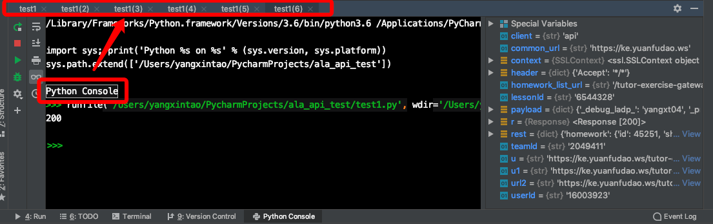
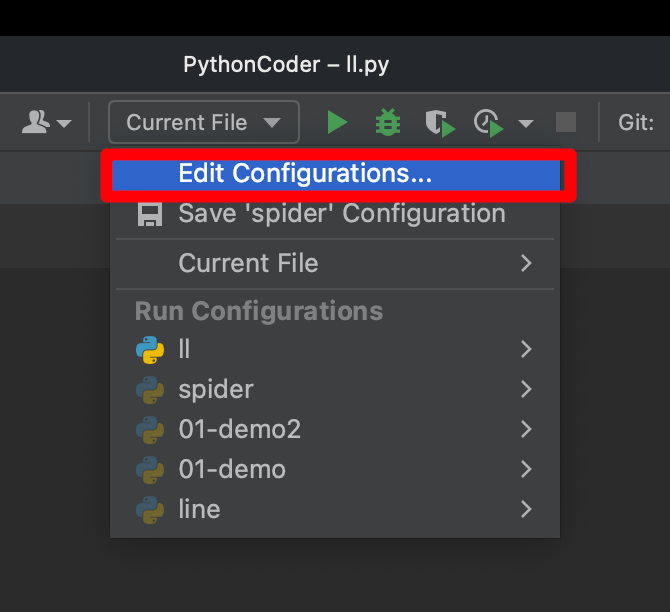
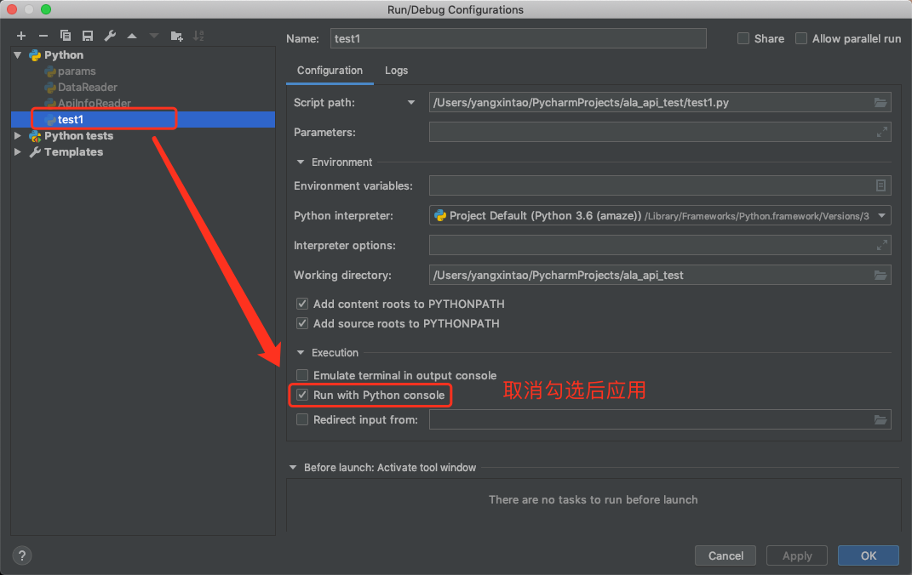
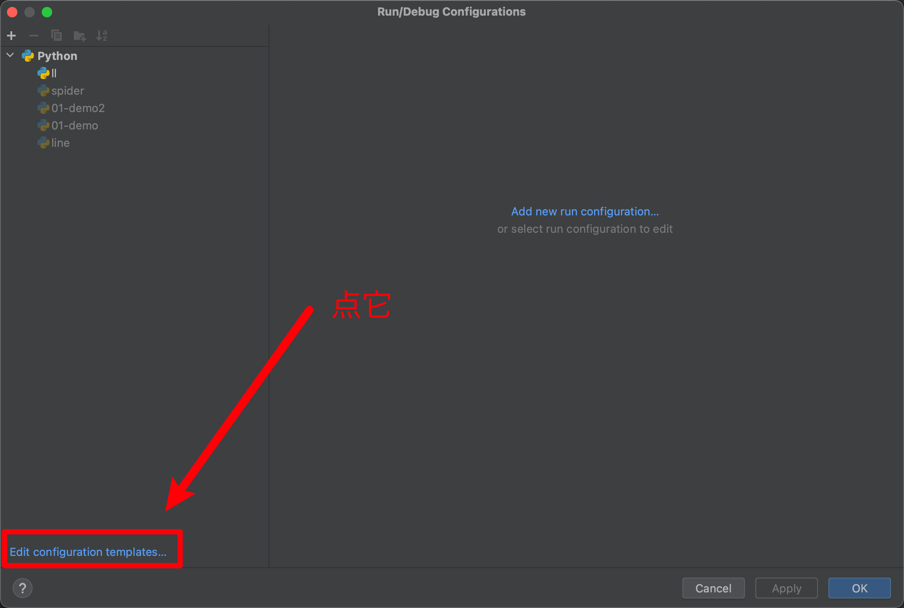
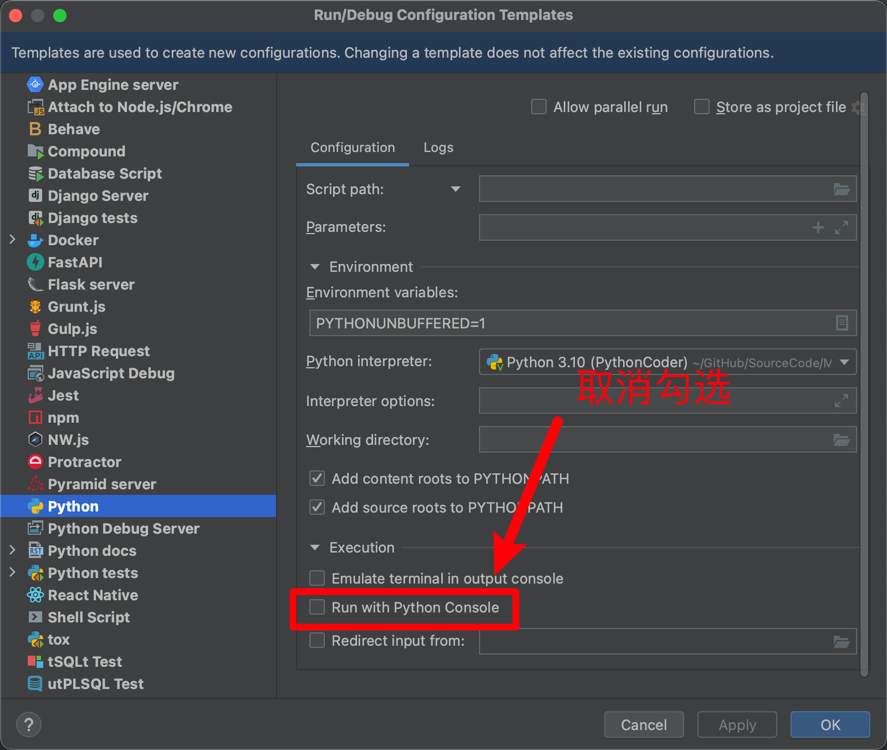
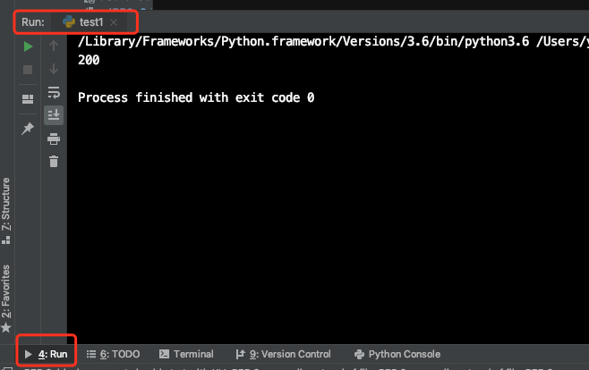

## 关闭 Python Console 运行模式

你好，我是悦创。

::: info

我是在写代码的过程中，无意间打开这个模式的，但是真的很烦。

:::

在 Python 里 run 的时候突然会发现，进入的不是 run 模式，而是 console 模式，这种运行模式能保留你每次的运行历史，因为会重开一个运行小页面，对于强迫症来说，甚是不爽啊，比如 🔽

Python console 运行模式如下：

**看到这种不爽的情况，我立马嘶吼：还我 Run 模式！**

来，跟我一起，讨回 run！

本人使用的是 Pycharm 编辑器，所以，以这个为例图解一下关闭流程：

1. 点击右上角配置，如图，在 Pycharm 右上角运行文件地方，打开下拉列表，点击第一个

::: center

:::

当前文件操作界面，右侧如图位置，取消勾选后点击 Apply 应用

::: center

:::

**注：此时当前 py 文件的 console 模式已经关闭了，关闭此页面运行即可**

##### 但是！！！咱们要彻底解决问题，瓦碎地方一切基础，那就看下图

3. 点击下图位置，进行设置：

然后关闭此页面，重新右键 run 一下，ok，你会发现，恢复正常的 run 界面了，如图↓

**嘿！大获全胜，给力！**

::: center

:::

欢迎关注我公众号：AI悦创，有更多更好玩的等你发现！

::: details 公众号：AI悦创【二维码】

:::

::: info AI悦创·编程一对一

AI悦创·推出辅导班啦，包括「Python 语言辅导班、C++ 辅导班、java 辅导班、算法/数据结构辅导班、少儿编程、pygame 游戏开发、Linux、Web全栈」，全部都是一对一教学：一对一辅导 + 一对一答疑 + 布置作业 + 项目实践等。当然，还有线下线上摄影课程、Photoshop、Premiere 一对一教学、QQ、微信在线，随时响应！微信：Jiabcdefh

C++ 信息奥赛题解，长期更新！长期招收一对一中小学信息奥赛集训，莆田、厦门地区有机会线下上门，其他地区线上。微信：Jiabcdefh

方法一：[QQ](http://wpa.qq.com/msgrd?v=3&uin=1432803776&site=qq&menu=yes)

方法二：微信：Jiabcdefh

:::

