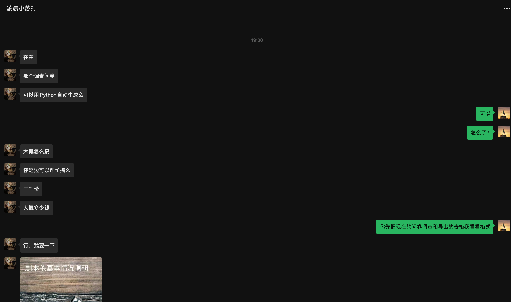
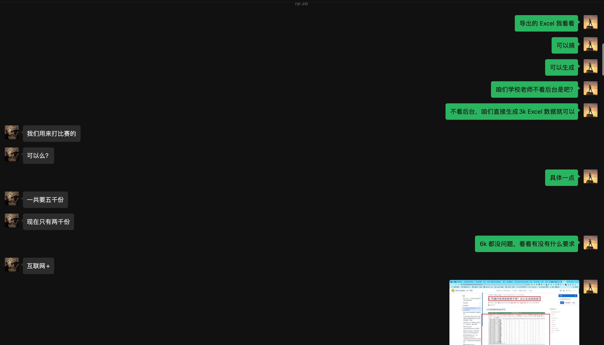
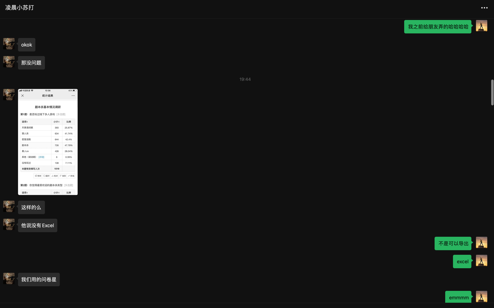
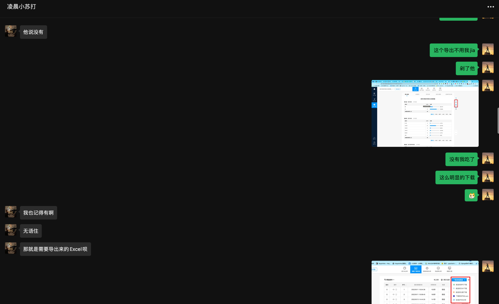
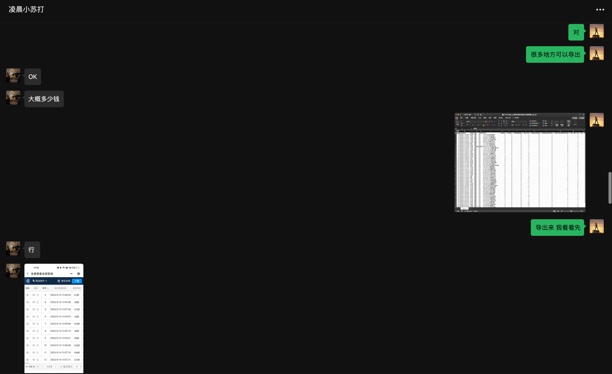
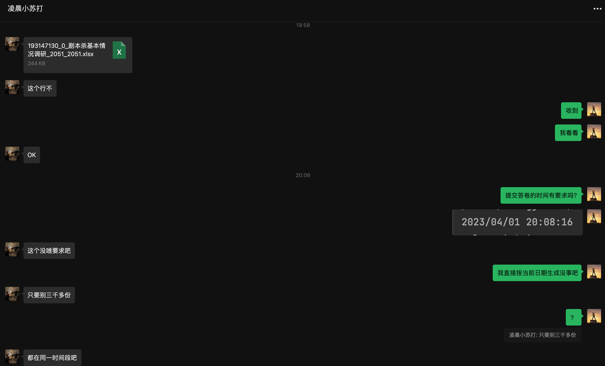
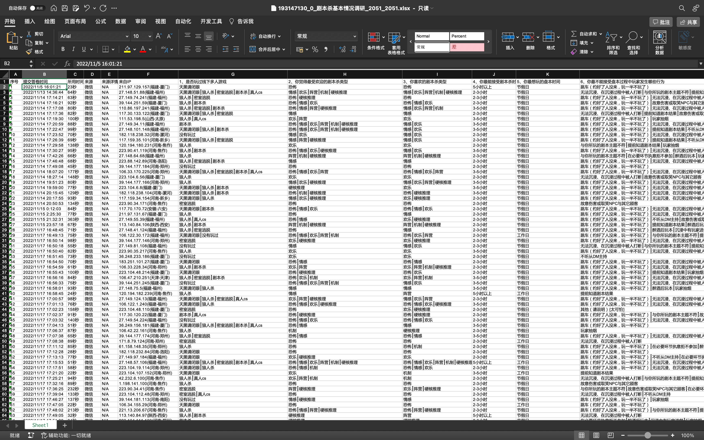

**学弟问我问卷调查数据，能不能一次性生成五千份？**

你好，我是悦创。

::: details 聊天记录













:::

## 问卷调查



<button name="button" style="color: black"><a href="/web_runing/blog/2023/04moth/193147130_0_剧本杀基本情况调研_2051_2051.xlsx" target="_blank">原文件下载</a></button>

## Python 生成随机日期

要生成指定范围内的随机时间，您可以使用 `random` 库和 `time` 库。首先，您需要确定时间范围的起始和结束时间戳，然后在这个范围内生成一个随机时间戳。最后，将这个随机时间戳转换为可读的时间格式。以下是一个示例，演示如何生成2010年1月1日至2020年12月31日之间的随机时间：

```python
import random
import time

# Define the start and end date (YYYY, MM, DD)
start_date = (2010, 1, 1)
end_date = (2020, 12, 31)

# Convert the dates to timestamps
start_timestamp = time.mktime(start_date + (0, 0, 0, 0, 0, 0))
end_timestamp = time.mktime(end_date + (23, 59, 59, 0, 0, 0))

# Generate a random timestamp within the range
random_timestamp = random.uniform(start_timestamp, end_timestamp)

# Convert the random timestamp to a readable date-time format
random_date_time = time.strftime('%Y/%m/%d %H:%M:%S', time.localtime(random_timestamp))

print(random_date_time)
```

这个示例首先将起始和结束日期转换为时间戳，然后在这个范围内生成一个随机时间戳。接着，使用 `time.strftime()` 和 `time.localtime()` 将随机时间戳转换为可读的日期时间格式。

这里是一个将上述代码封装为函数的示例，该函数接受两个参数：开始日期和结束日期。函数返回一个指定范围内的随机日期字符串。

```python
import random
import time
from typing import Tuple

def generate_random_date(start_date: Tuple[int, int, int], end_date: Tuple[int, int, int]) -> str:
    # Convert the dates to timestamps
    start_timestamp = time.mktime(start_date + (0, 0, 0, 0, 0, 0))
    end_timestamp = time.mktime(end_date + (23, 59, 59, 0, 0, 0))

    # Generate a random timestamp within the range
    random_timestamp = random.uniform(start_timestamp, end_timestamp)

    # Convert the random timestamp to a readable date-time format
    random_date_time = time.strftime('%Y/%m/%d %H:%M:%S', time.localtime(random_timestamp))

    return random_date_time

# Example usage
start_date = (2010, 1, 1)
end_date = (2020, 12, 31)
random_date = generate_random_date(start_date, end_date)
print(random_date)
```

现在，您可以使用 `generate_random_date()` 函数生成指定范围内的随机日期。只需提供开始日期和结束日期作为参数即可。


欢迎关注我公众号：AI悦创，有更多更好玩的等你发现！

::: details 公众号：AI悦创【二维码】


:::

::: info AI悦创·编程一对一

AI悦创·推出辅导班啦，包括「Python 语言辅导班、C++ 辅导班、java 辅导班、算法/数据结构辅导班、少儿编程、pygame 游戏开发、Linux、Web全栈」，全部都是一对一教学：一对一辅导 + 一对一答疑 + 布置作业 + 项目实践等。当然，还有线下线上摄影课程、Photoshop、Premiere 一对一教学、QQ、微信在线，随时响应！微信：Jiabcdefh

C++ 信息奥赛题解，长期更新！长期招收一对一中小学信息奥赛集训，莆田、厦门地区有机会线下上门，其他地区线上。微信：Jiabcdefh

方法一：[QQ](http://wpa.qq.com/msgrd?v=3&uin=1432803776&site=qq&menu=yes)

方法二：微信：Jiabcdefh

:::


