ASSIGNMENT #3  DUE DATE: FRIDAY OF WEEK 8

## Title

Digital Portrait Sketch

## Learning Objectives

Identify the process of preparing 2D concept art

## Instructions

- Referencing a photo to create an original representation of a self-portrait
- Sketch a line drawing of your self-portrait
- Use the Adobe Photoshop transform tool to create an extreme exaggeration of your features

## Deliverables

- Adobe Photoshop File (11” x 15”, 300 DPI, RGB)
- Reference files in .JPG format
- VGC101_A3_Firstname.psd

## Percentage of Final Grade

25%

## 0. 新建项目

::: tabs

@tab 新建图层

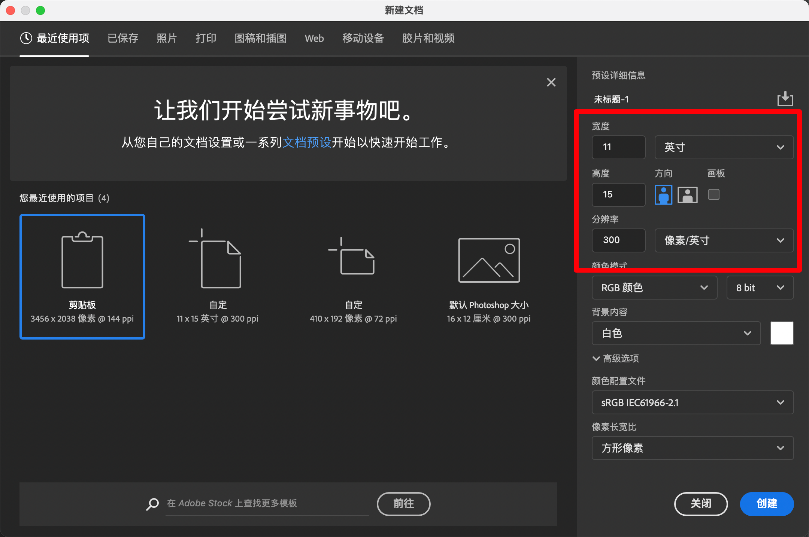

@tab 素材

:::

## 1. 线稿提取

::: tabs

@tab 1. 栅格化图层

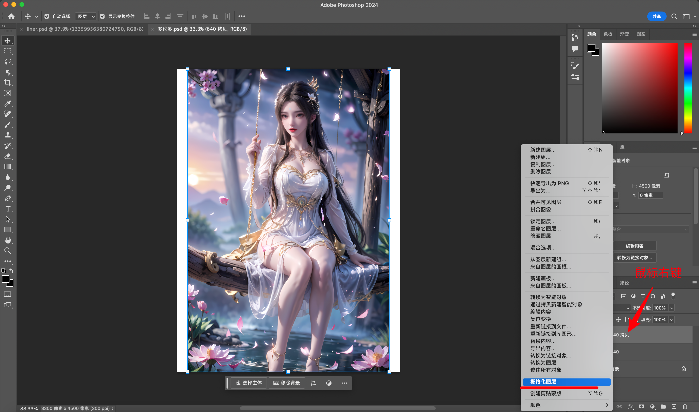

@tab 去色

- 快捷键：Ctrl/Command + Shift + U

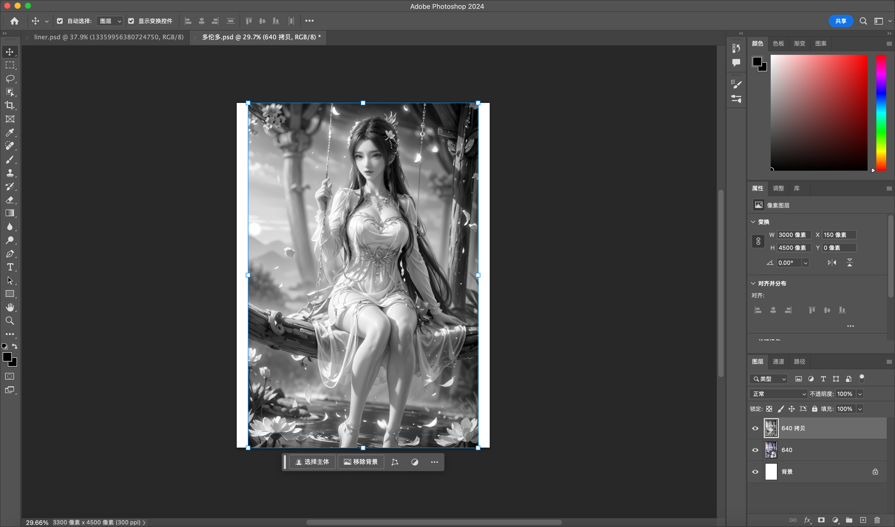

@tab 反向

- Ctrl/Command + I

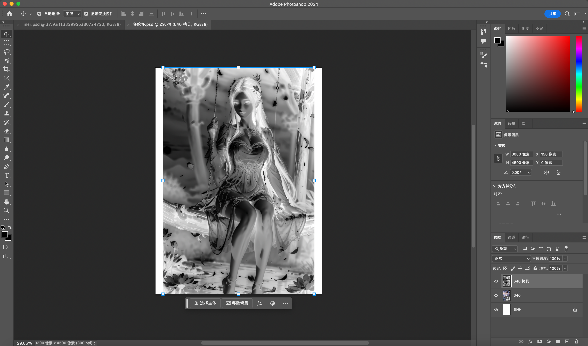

@tab 颜色减淡（混合选项）

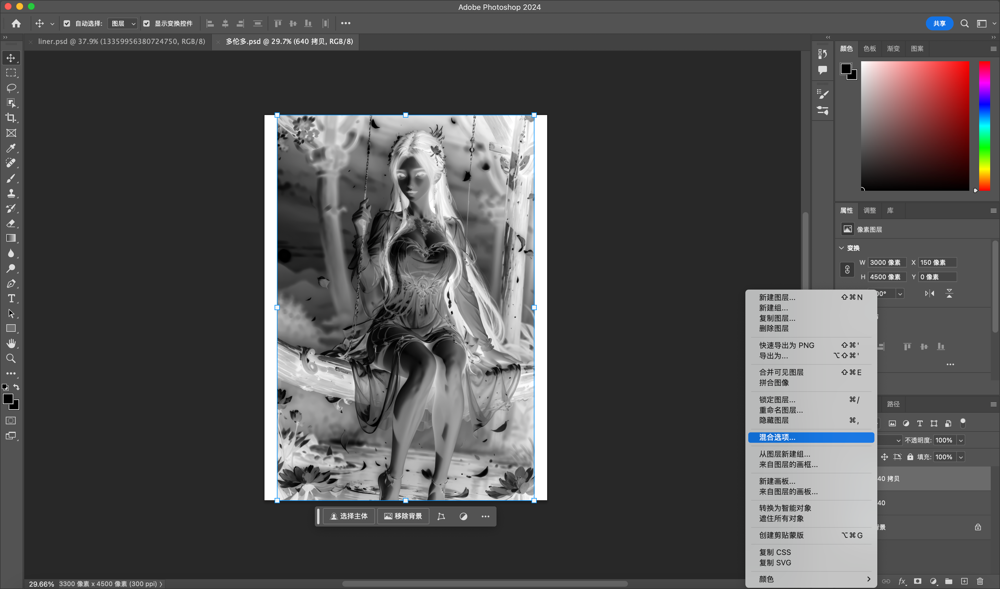

@tab 混合模式

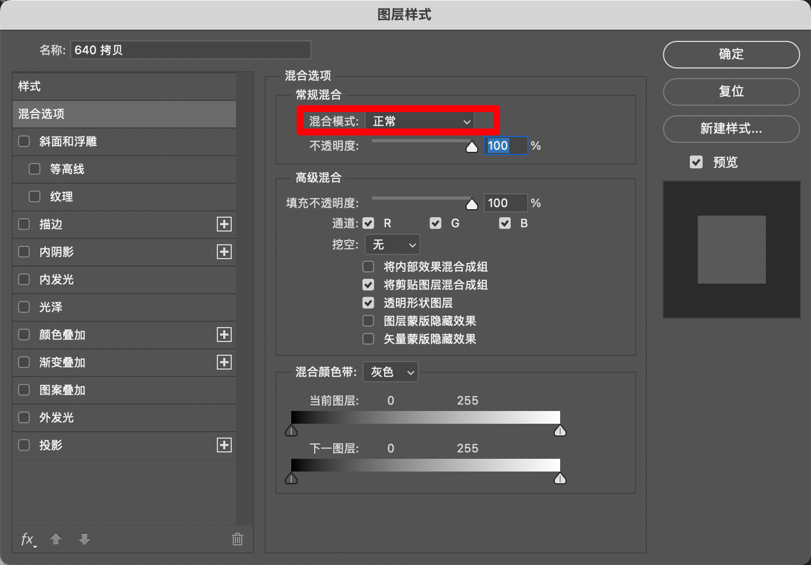

@tab 线性减淡

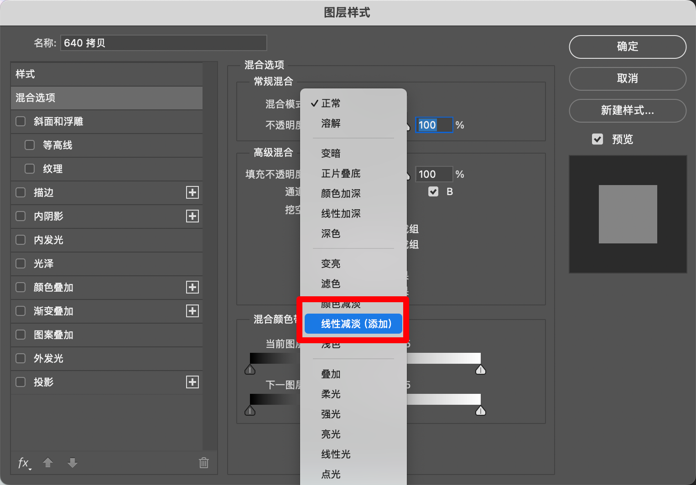

@tab 滤镜

- 滤镜—>其它—>最小值

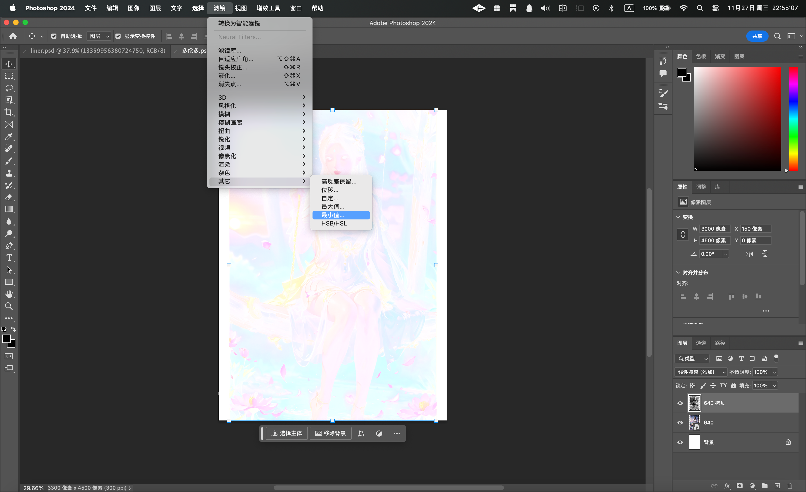

@tab 数值大小就是线条粗细

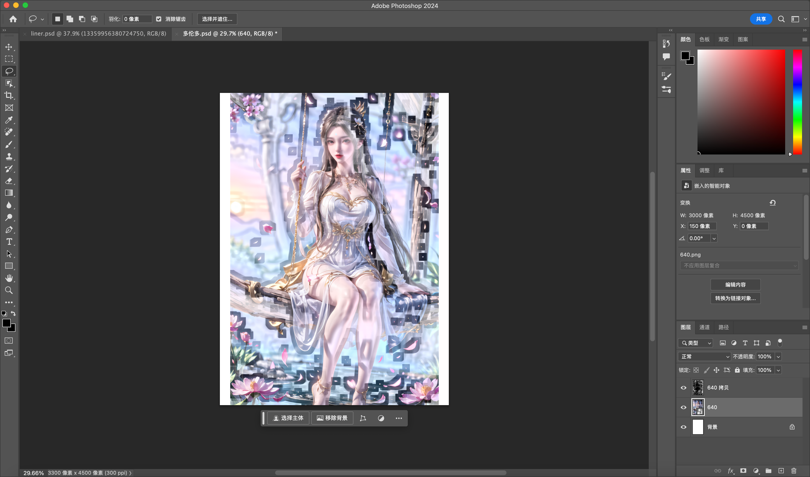

@tab 解决问题

- 去除背景

1. 复制原图图为图层1:Ctlr+shift+U (去色)

2. 复制图层1为图层2: Ctrl+I (反向)>图片类型-颜色减淡>滤镜其它-最小值(1~2)

3. 为图层2建立蒙版: 滤镜-杂色-添加杂色>滤镜-模糊-动感模糊

4. ctrl+shift+alt+E (盖印图)为图层3: 图片类型-正片叠底>调整其不透明度

:::

## 2. 夸张

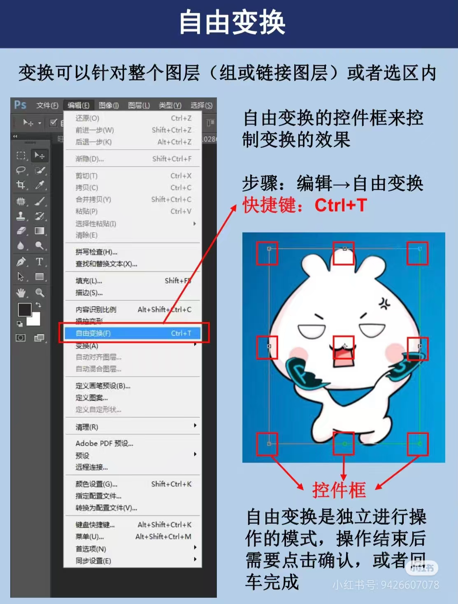

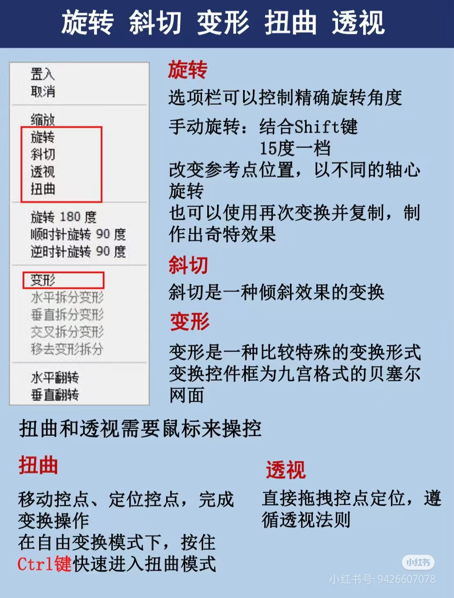

欢迎关注我公众号：AI悦创，有更多更好玩的等你发现！

::: details 公众号：AI悦创【二维码】

:::

::: info AI悦创·编程一对一

AI悦创·推出辅导班啦，包括「Python 语言辅导班、C++ 辅导班、java 辅导班、算法/数据结构辅导班、少儿编程、pygame 游戏开发、Linux、Web 全栈」，全部都是一对一教学：一对一辅导 + 一对一答疑 + 布置作业 + 项目实践等。当然，还有线下线上摄影课程、Photoshop、Premiere 一对一教学、QQ、微信在线，随时响应！微信：Jiabcdefh

C++ 信息奥赛题解，长期更新！长期招收一对一中小学信息奥赛集训，莆田、厦门地区有机会线下上门，其他地区线上。微信：Jiabcdefh

方法一：[QQ](http://wpa.qq.com/msgrd?v=3&uin=1432803776&site=qq&menu=yes)

方法二：微信：Jiabcdefh

:::

