你好，我是悦创。

本地生成公钥，将本地公钥配置到远程 GitHub ，这个公钥相当于本地和远程 GitHub 的链接桥梁。

## 1. 准备

注册 github 得到账号密码。比如：账户：`yjt_it@163.com` ，密码：`-- 520yangjingtao`，本地安装好 git。

## 2. 开始

首先右击 --`git Bash here` 打开 git 命令行工具，检查用户名和邮箱是否配置。

```bash
git config --global  --list
```

如未配置，则执行以下命令进行配置：

```bash
git config --global  user.name "这里换上你的用户名"
```

```bash
git config --global user.email "这里换上你的邮箱"
```

然后执行以下命令生成秘钥：

```bash
ssh-keygen -t rsa -C "这里换上你的邮箱"
```

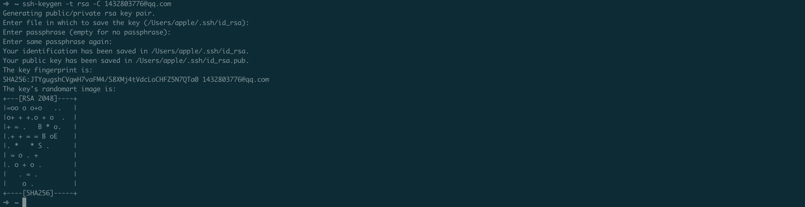

执行上面的命令后需要进行 3 次或 4 次确认：

1. 确认秘钥的保存路径（如果不需要改路径则直接回车）；
2. 如果上一步默认的保存路径下已经有秘钥文件，则需要确认是否覆盖（如果之前的秘钥不再需要则直接回车覆盖，如需要则手动拷贝到其他目录后再覆盖）；
3. 创建密码（如果不需要密码则直接回车）；
4. 确认密码如果不需要密码则直接回车)；

在指定的保存路径下会生成 2 个名为 `id_rsa` 和 `id_rsa.pub` 的文件：

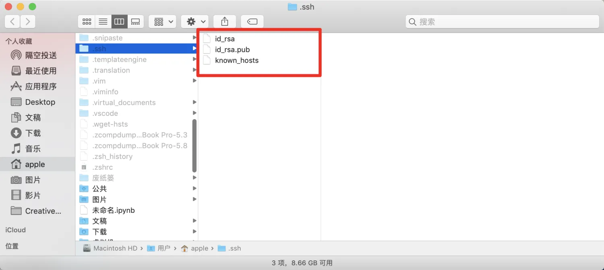

添加公钥到你的远程仓库（Github），再打开你的 Github，进入配置页： `Settings` ——>`SSH and GPG keys`

::: tabs

@tab 旧版界面

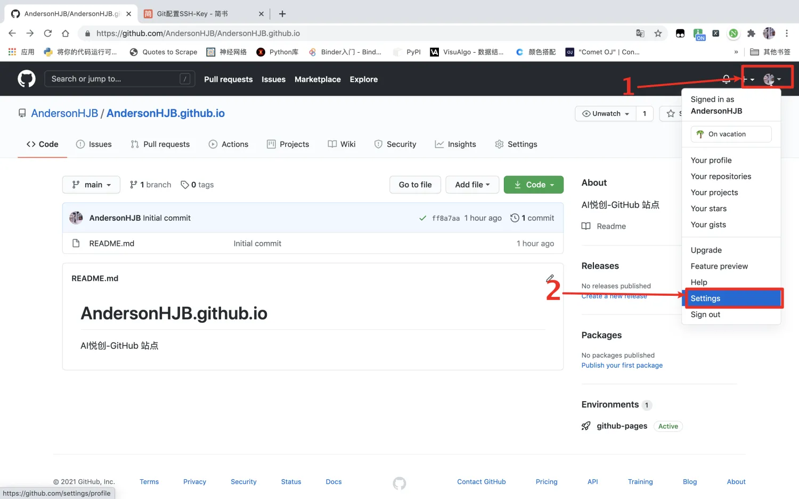

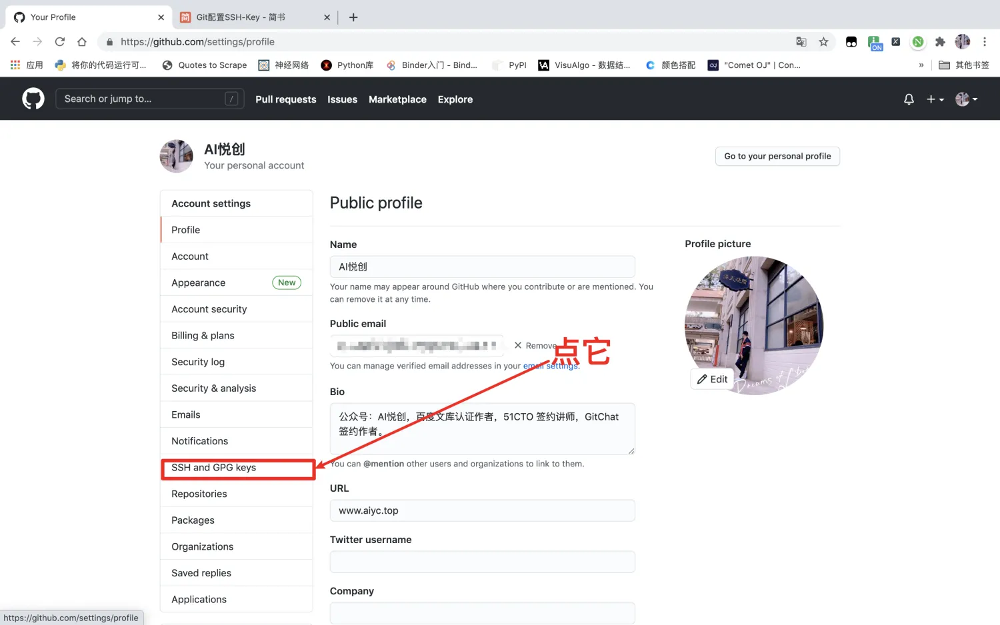

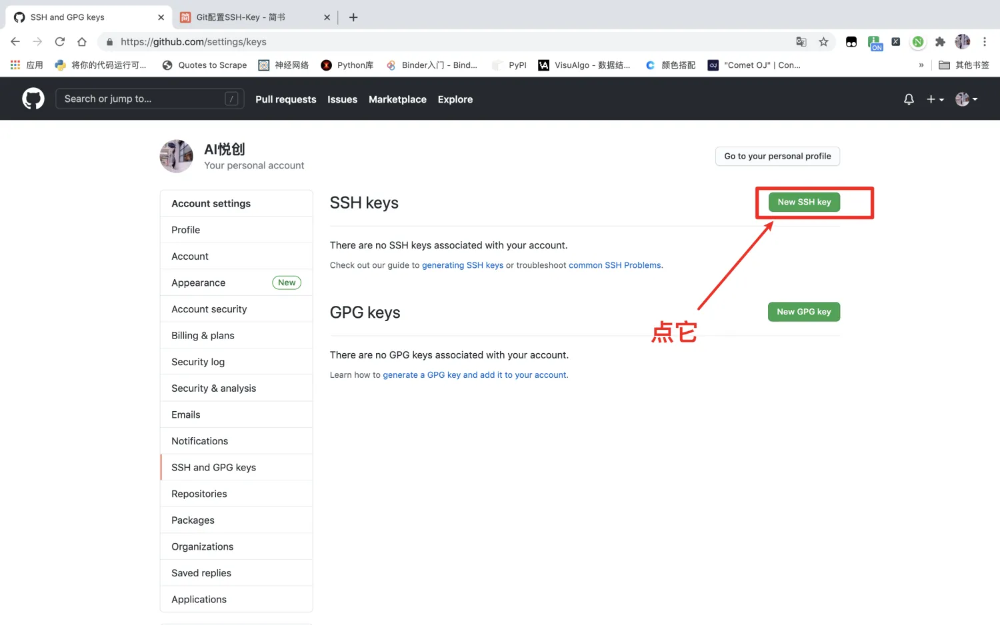

@tab:active 2026 新版界面


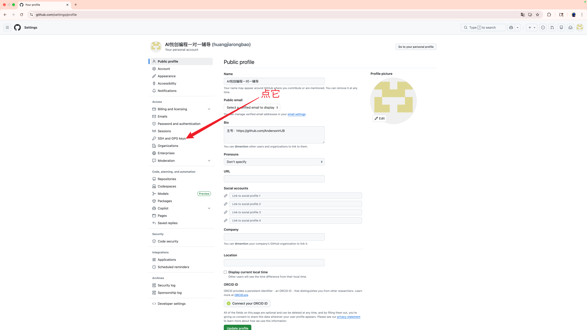

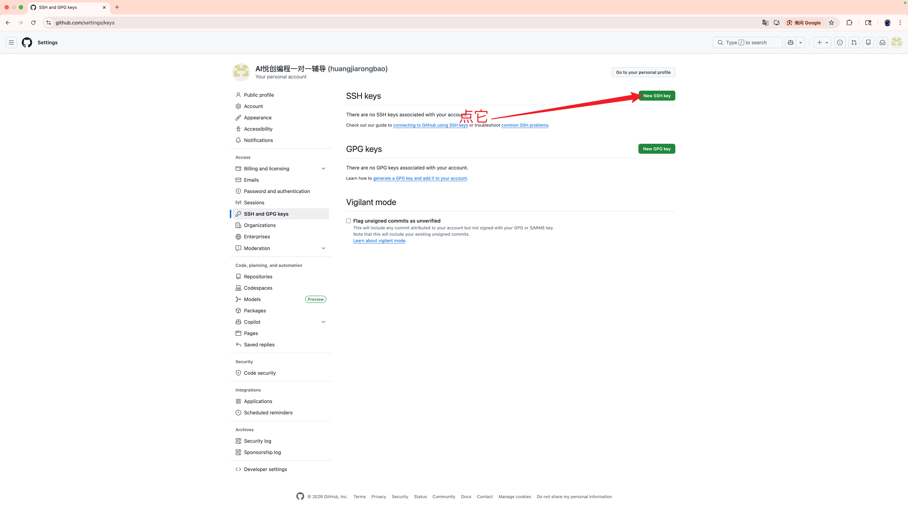

:::


然后用文本工具打开之前生成的 `id_rsa.pub` 文件，把内容拷贝到 key 下面的输入框，并为这个 key 定义一个名称（通常用来区分不同主机），然后保存。

::: tabs

@tab 旧版界面

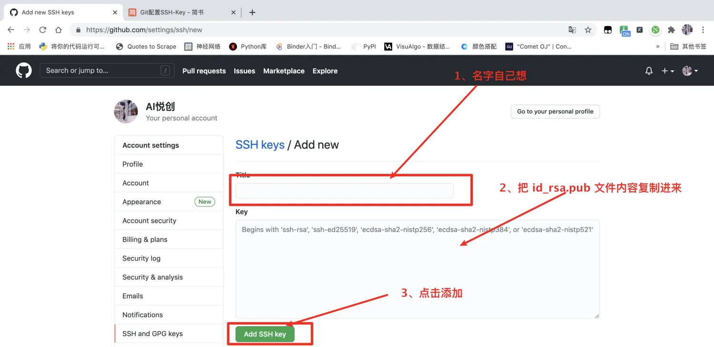


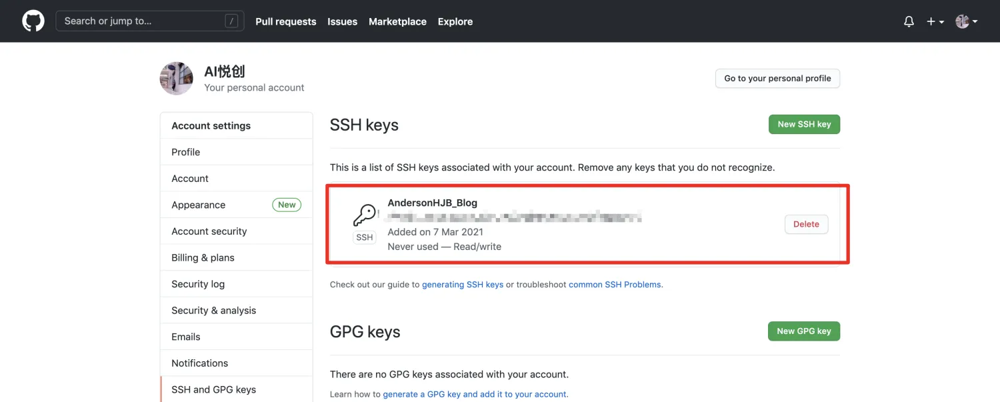

@tab 2026 新版界面

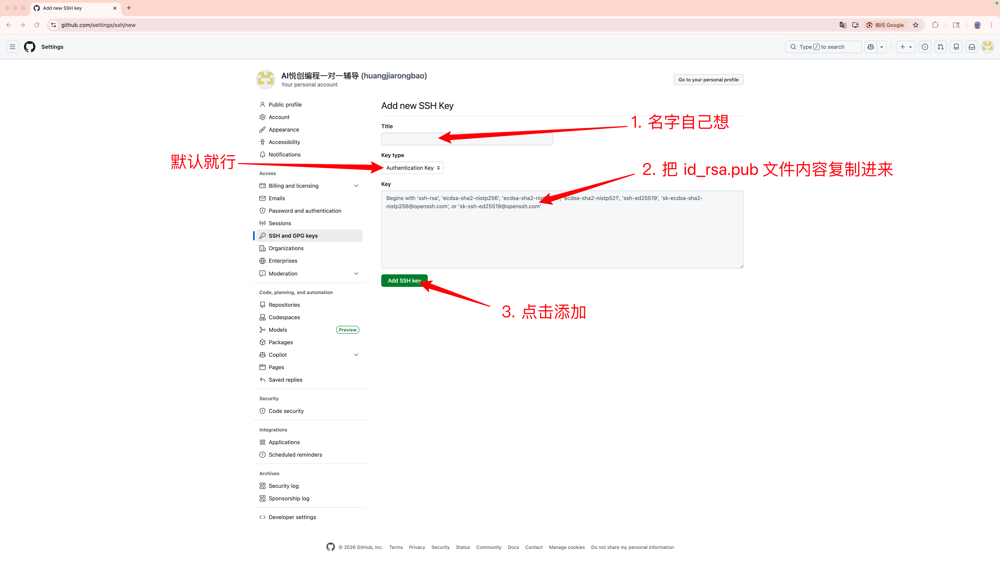

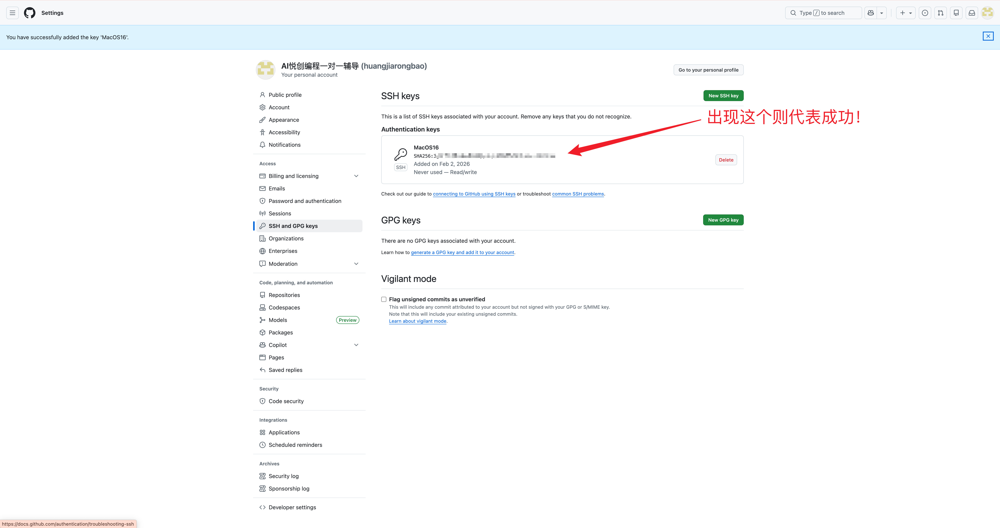

:::

测试是否配置成功，用 ssh 链接 git，命令如下：

```bash
ssh -T git@github.com
```

你将会看到：

```bash
➜  ~ ssh -T git@github.com
The authenticity of host 'github.com (13.229.188.59)' can't be established.
RSA key fingerprint is SHA256:nThbg6kXUpJWGl7E1IGOCspRomTxdCARLviKw6E5SY8.
Are you sure you want to continue connecting (yes/no)?
```

选择 yes。

```bash
Warning: Permanently added 'github.com,13.229.188.59' (RSA) to the list of known hosts.
Hi AndersonHJB! You've successfully authenticated, but GitHub does not provide shell access.
```

如果看到 Hi 后面是你的用户名，就说明成功了。


欢迎关注我公众号：AI悦创，有更多更好玩的等你发现！

::: details 公众号：AI悦创【二维码】


:::

::: info AI悦创·编程一对一

AI悦创·推出辅导班啦，包括「Python 语言辅导班、C++ 辅导班、java 辅导班、算法/数据结构辅导班、少儿编程、pygame 游戏开发、Linux、Web 全栈」，全部都是一对一教学：一对一辅导 + 一对一答疑 + 布置作业 + 项目实践等。当然，还有线下线上摄影课程、Photoshop、Premiere 一对一教学、QQ、微信在线，随时响应！微信：Jiabcdefh

C++ 信息奥赛题解，长期更新！长期招收一对一中小学信息奥赛集训，莆田、厦门地区有机会线下上门，其他地区线上。微信：Jiabcdefh

方法一：[QQ](http://wpa.qq.com/msgrd?v=3&uin=1432803776&site=qq&menu=yes)

方法二：微信：Jiabcdefh

:::


