你好，我是悦创。

需要代考直接联系我即可！微信：Jiabcdefh。

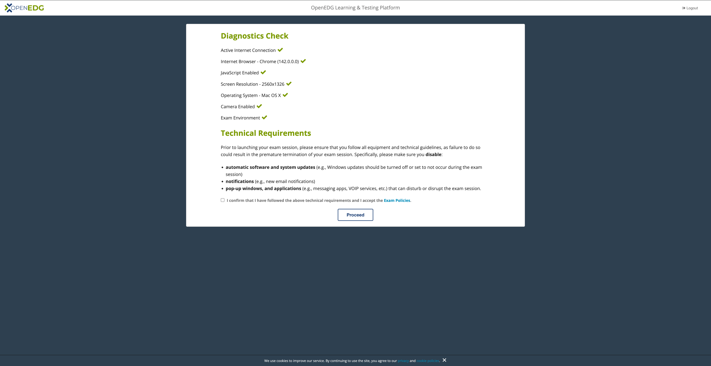

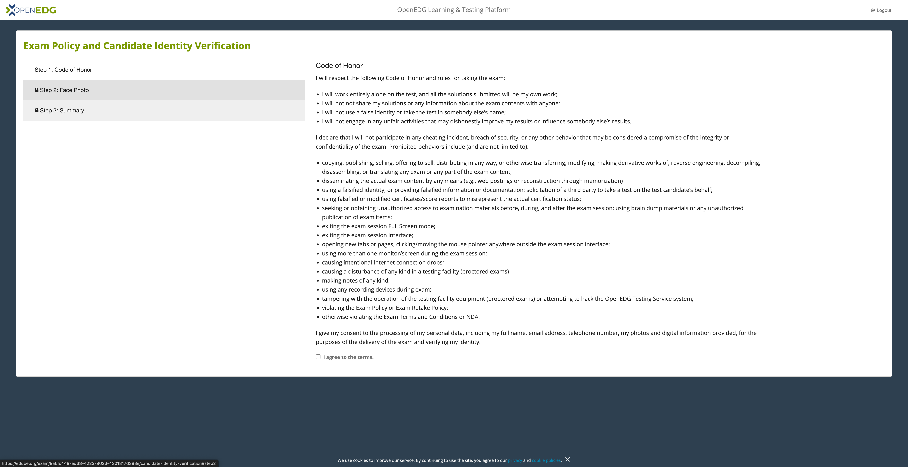

``

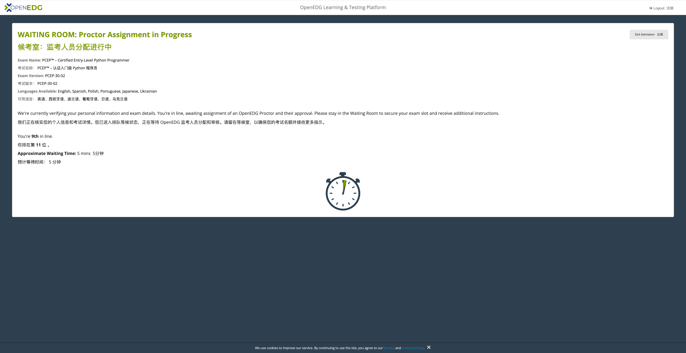

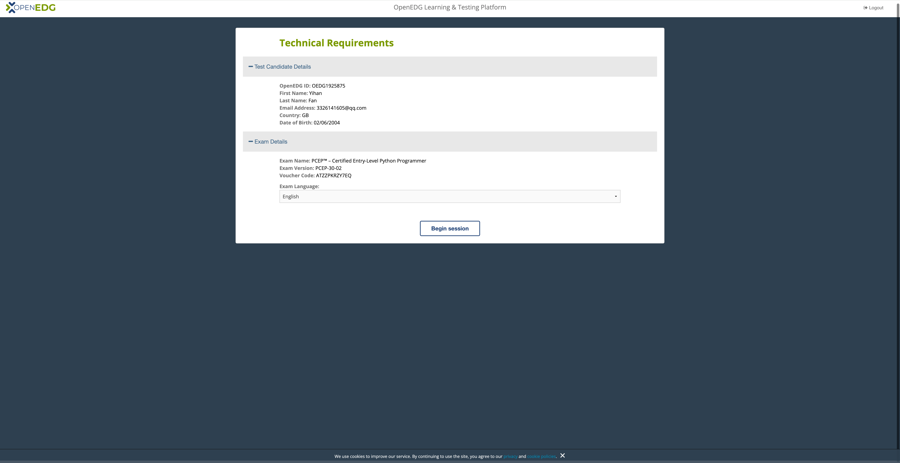

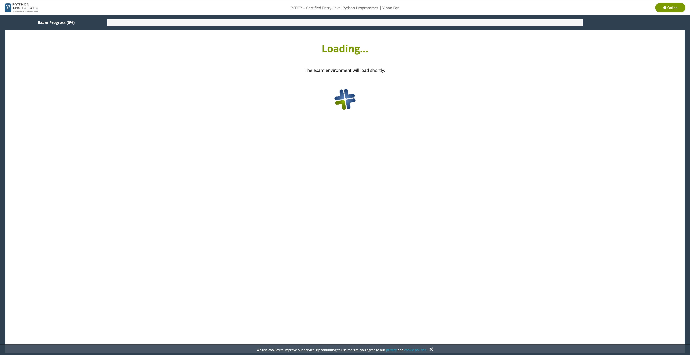

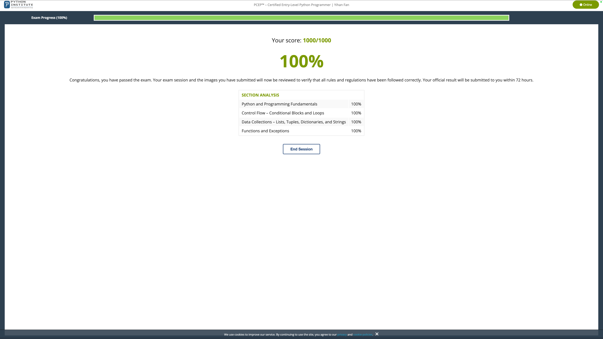

感受：其实有钱的人，啥证书都可以花钱购买，如果不能，那就是钱不够多哈哈哈哈。——2025 年 11 月 17 日

幸好找的是我，我有三个屏幕，不然还真不好拿下。

``

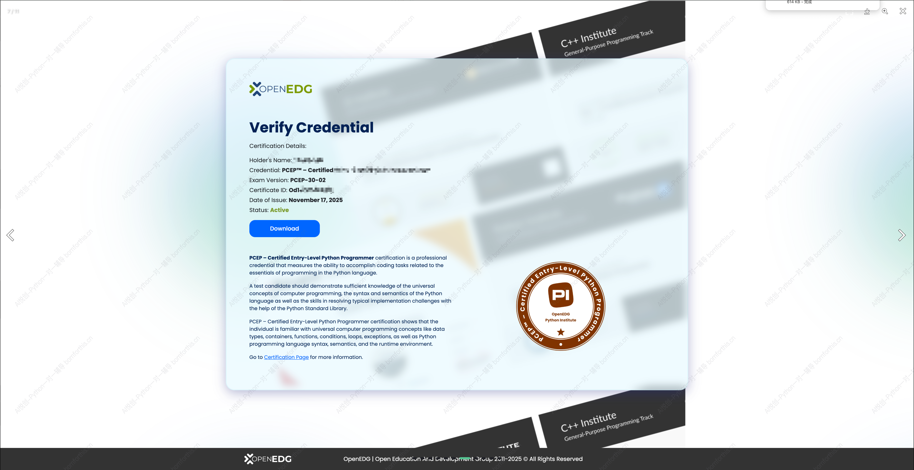

``

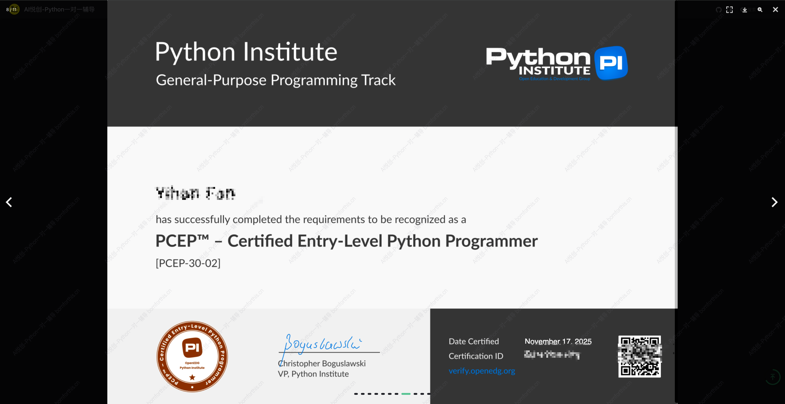

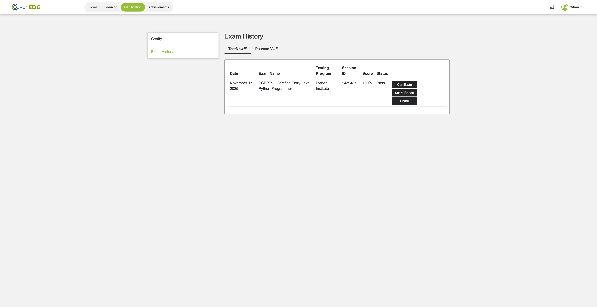

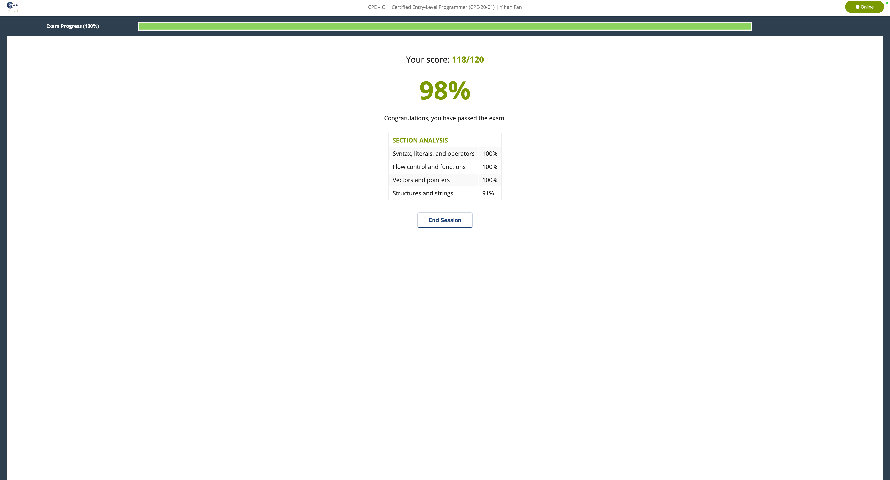

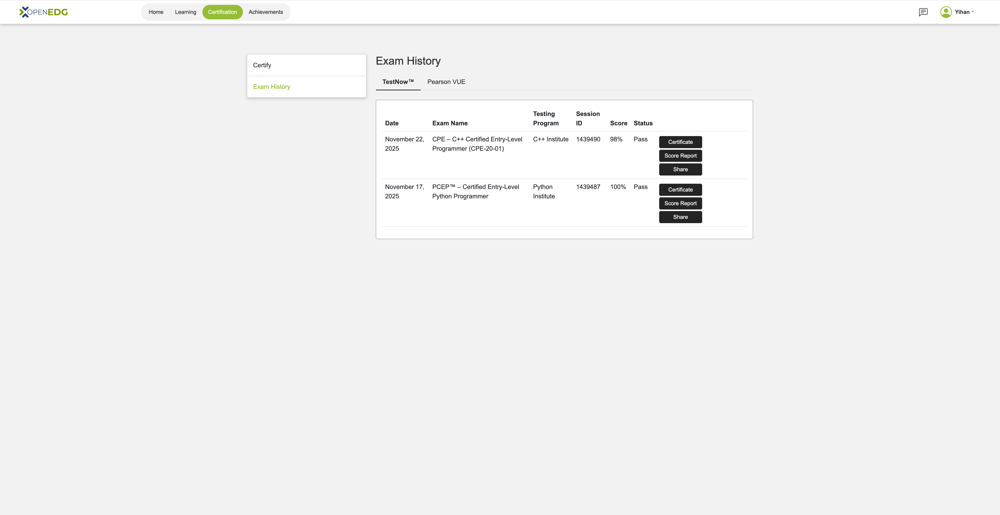

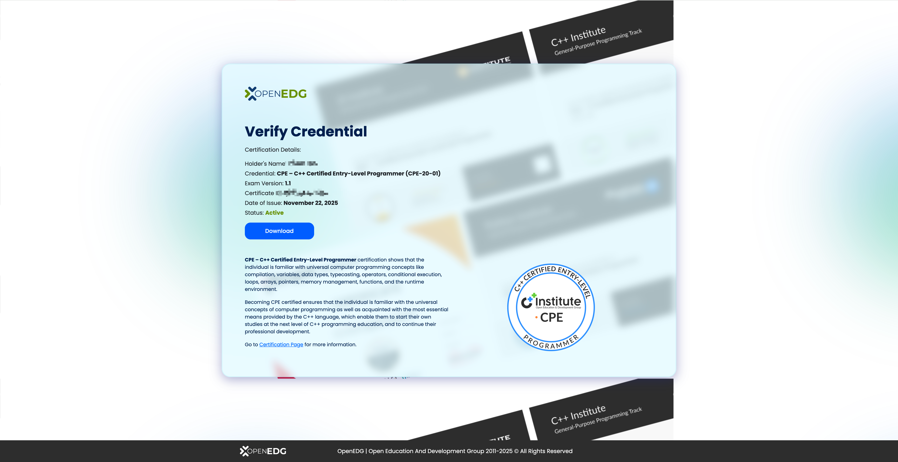

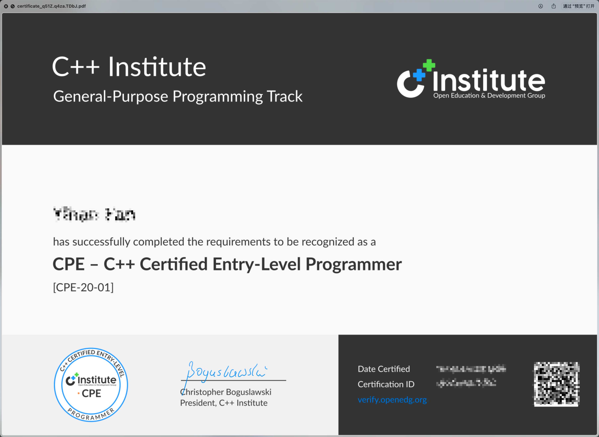

::: details 公众号：AI悦创【二维码】

:::

::: info AI悦创·编程一对一

AI悦创·推出辅导班啦，包括「Python 语言辅导班、C++ 辅导班、java 辅导班、算法/数据结构辅导班、少儿编程、pygame 游戏开发、Web、Linux」，招收学员面向国内外，国外占 80%。全部都是一对一教学：一对一辅导 + 一对一答疑 + 布置作业 + 项目实践等。当然，还有线下线上摄影课程、Photoshop、Premiere 一对一教学、QQ、微信在线，随时响应！微信：Jiabcdefh

C++ 信息奥赛题解，长期更新！长期招收一对一中小学信息奥赛集训，莆田、厦门地区有机会线下上门，其他地区线上。微信：Jiabcdefh

方法一：[QQ](http://wpa.qq.com/msgrd?v=3&uin=1432803776&site=qq&menu=yes)

方法二：微信：Jiabcdefh

:::

