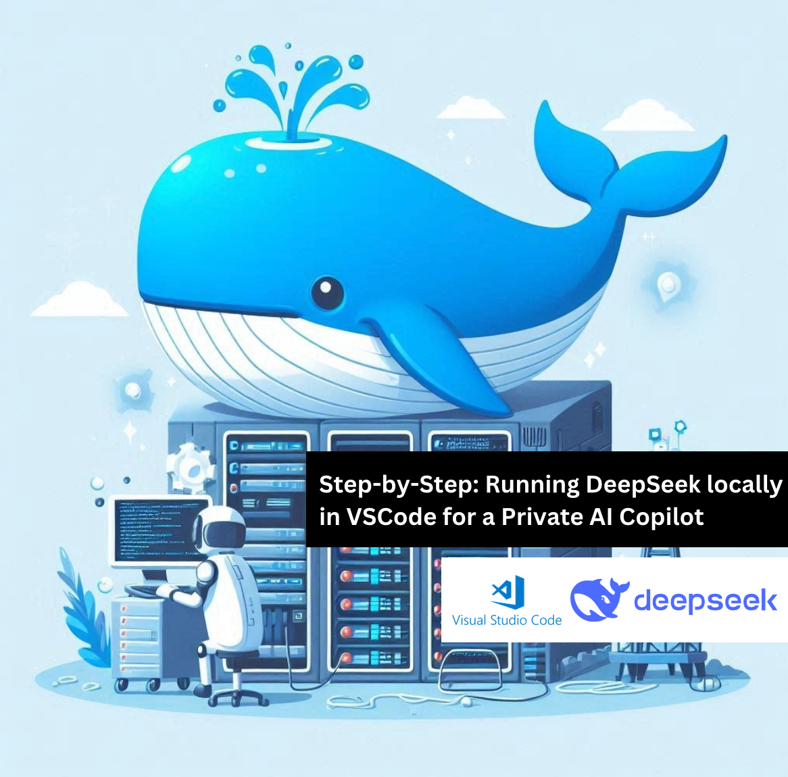
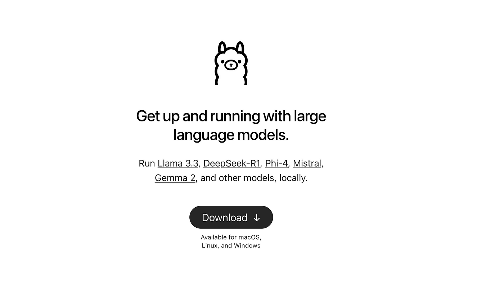
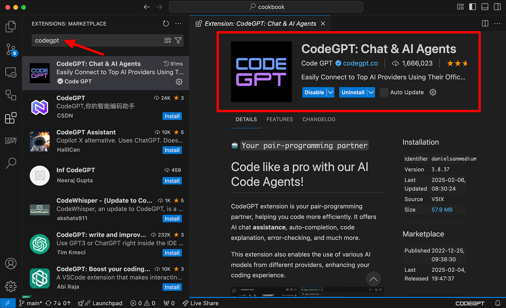
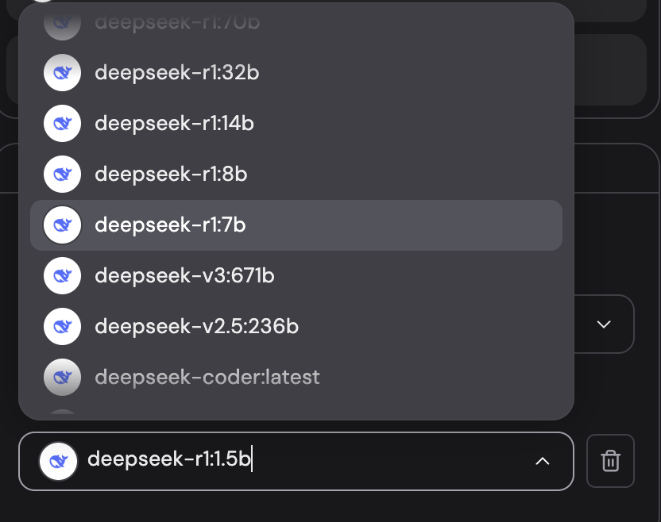
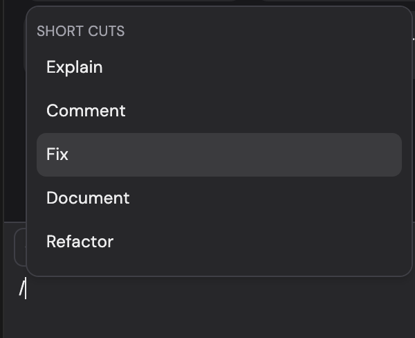

This step-by-step guide will show you how to install and run DeepSeek locally, configure it with CodeGPT, and start leveraging AI to enhance your software development workflow, all without relying on cloud-based services.



## Step 1: Install Ollama and CodeGPT in VSCode

To run DeepSeek locally, we first need to install **Ollama**, which allows us to run LLMs on our machine, and **CodeGPT**, the VSCode extension that integrates these models for coding assistance.

### Install Ollama

Ollama is a lightweight platform that makes running local LLMs simple.

**Download Ollama**

- Visit the official website: https://ollama.com



- Download the installer for your operating system (Windows, macOS, or Linux).

- **Verify the Installation**

    After installation, open a terminal and run:

```bash
ollama --version
```

If Ollama is installed correctly, it will display the installed version.

### Install CodeGPT in Visual Studio Code

- **Open VSCode** and navigate to the **Extensions Marketplace** (Ctrl + Shift + X or Cmd + Shift + X on macOS).
- **Search for “CodeGPT”** and click **Install**.



- Or you can create a free account here: [https://codegpt.co](https://codegpt.co/)

With Ollama and CodeGPT installed, we’re now ready to download and configure DeepSeek to start coding with AI locally. 🚀

## Step 2: Downloading and Setting Up the Models

Now that you have successfully installed both Ollama and CodeGPT, it’s time to download the models you’ll be using locally.

- **Chat model: \*deepseek-r1:1.5b\***, which is optimized for smaller environments and will run smoothly on most computers.
- **Autocompletion model: \*deepseek-coder:1.3b.\*** This model utilizes **Fill-In-The-Middle (FIM)** technology, allowing it to make intelligent autocompletion suggestions as you write code. It can predict and suggest the middle part of a function or method, not just the beginning or the end.

### Download the Chat Model (deepseek-r1:1.5b)

To get started with the chat model:

- Open **CodeGPT** within **VSCode**.
- Navigate to the **Local LLMs** section in the sidebar.
- From the available options, select **Ollama** as the local LLM provider.
- Choose the model **deepseek-r1:1.5b**.
- Click the **Download** button. The model will begin downloading automatically.

---

Introducing DeepSeek R1:1.5b Running Locally in Cursor! In less than 4 minutes, I set up the DeepSeek R1:1.5b model, download it, and run it locally to seamlessly work with code in Cursor The video is shown in real-time, with the model impressively running on an Intel Core i5 😱 using Ollama and the CodeGPT extension👇

**视频**

> First, Install CodeGPT in Cursor: [https://docs.codegpt.co/docs/tutorial-basics/installation](https://docs.codegpt.co/docs/tutorial-basics/installation)
>
> That's it! Now open the extension, and you'll be able to install all the deepseek_ai models to run them locally and completely privately.
>
> 

---

Once the download is complete, CodeGPT will automatically install the model. After installation, you’re ready to start interacting with the model.

You can now easily query the model about your code. Simply highlight any code within your editor, add extra files to your queries using the **#** symbol, and leverage powerful command shortcuts such as:



- **/fix** — For fixing errors or suggesting improvements in your code.
- **/refactor** — For cleaning up and improving the structure of your code.
- **/Explain** — To get detailed explanations of any piece of code.

This chat model is perfect for assisting with specific questions or receiving advice on your code.

### Download the Autocompletion Model (deepseek-coder:1.3b)

For enhanced code autocompletion:

- Open a **Terminal** in VSCode.
- Run the following command to pull the *deepseek-coder:1.3b* model:

```bash
ollama pull deepseek-coder:1.3b
```

- This command will download the autocompletion model to your local machine.
- After the download completes, return to **CodeGPT** and navigate to the **Autocompletion Models** section.
- Select **deepseek-coder:1.3b** from the list of available models.

---

Deepseek running locally and privately for autocompletion in VSCode! 🙌 In less than a minute, I'll show you how to download Deepseek-coder and set it as the autocompletion model in VSCode. You’ll need to use ollama to download the model and CodeGPT to select it as the autocompletion model. Enjoy the best models running locally with [http://codegpt.co](https://t.co/2TwiyF71HB) :)

**视频**

---

Once selected, you can start coding. As you type, the model will begin providing real-time code suggestions, helping you complete functions, methods, and even entire blocks of code with ease.

## Step 3: Enjoy Seamless Local and Private AI-Powered Coding

Once you’ve set up the models, you can now enjoy the full benefits of working with these powerful tools without relying on external APIs. By running everything locally on your machine, you ensure complete privacy and control over your coding environment. No need to worry about data leaving your computer, everything stays secure and private 👏

Clap if you enjoyed this article 👏 👏 👏


欢迎关注我公众号：AI悦创，有更多更好玩的等你发现！

::: details 公众号：AI悦创【二维码】


:::

::: info AI悦创·编程一对一

AI悦创·推出辅导班啦，包括「Python 语言辅导班、C++ 辅导班、java 辅导班、算法/数据结构辅导班、少儿编程、pygame 游戏开发、Linux、Web 全栈」，全部都是一对一教学：一对一辅导 + 一对一答疑 + 布置作业 + 项目实践等。当然，还有线下线上摄影课程、Photoshop、Premiere 一对一教学、QQ、微信在线，随时响应！微信：Jiabcdefh

C++ 信息奥赛题解，长期更新！长期招收一对一中小学信息奥赛集训，莆田、厦门地区有机会线下上门，其他地区线上。微信：Jiabcdefh

方法一：[QQ](http://wpa.qq.com/msgrd?v=3&uin=1432803776&site=qq&menu=yes)

方法二：微信：Jiabcdefh

:::


[.](https://medium.com/@dan.avila7/step-by-step-running-deepseek-locally-in-vscode-for-a-powerful-private-ai-copilot-4edc2108b83e)


