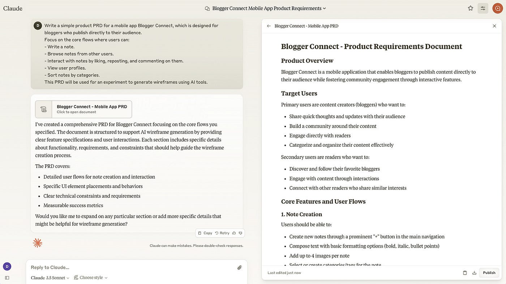
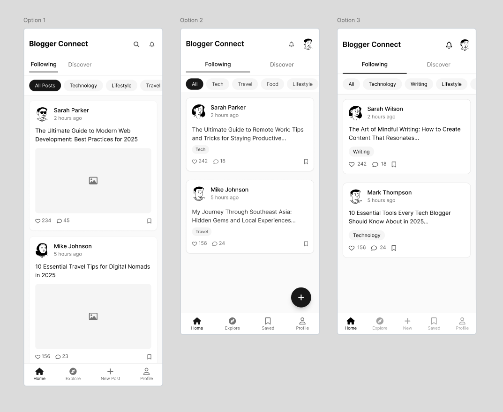
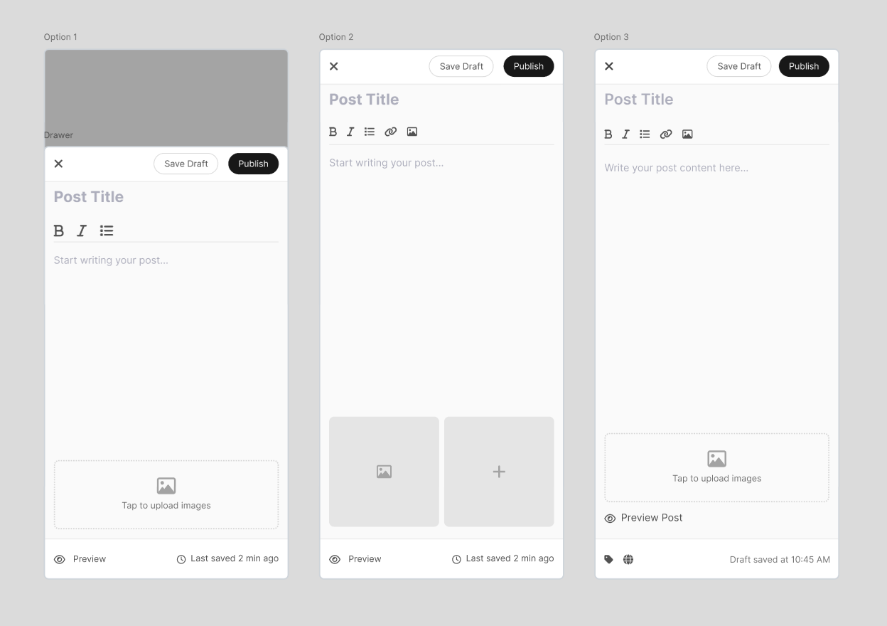
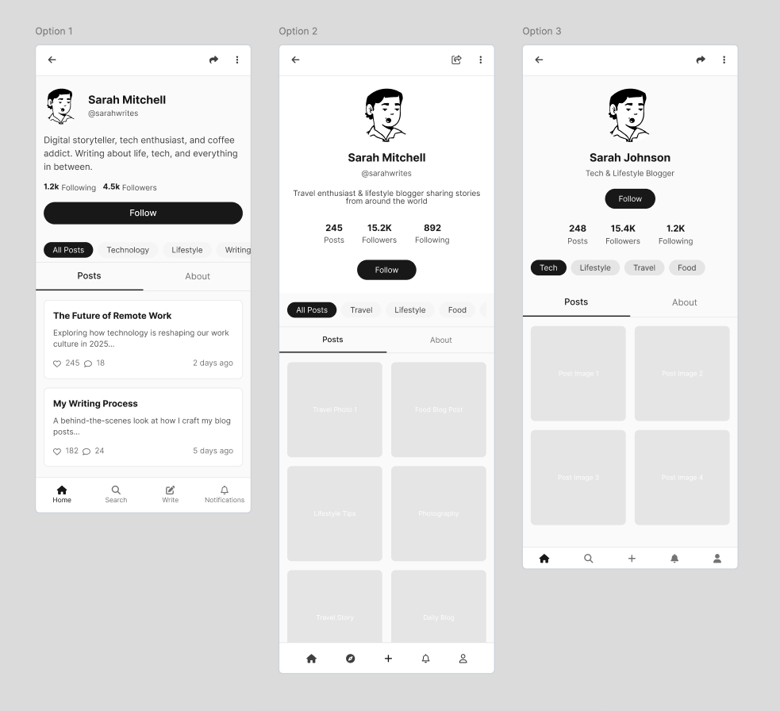
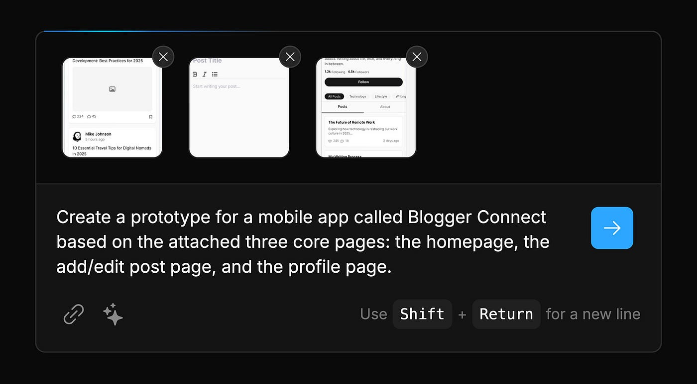
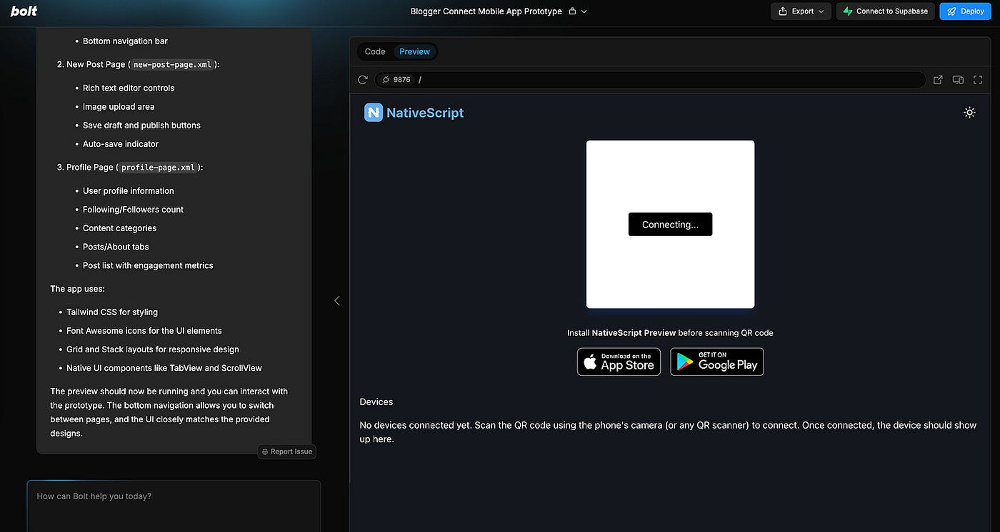
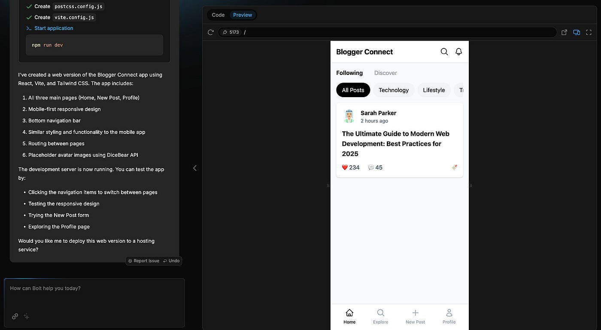
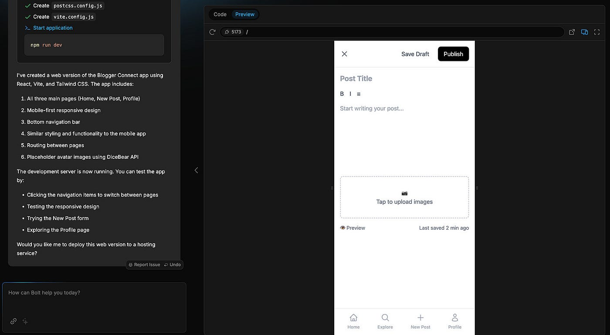
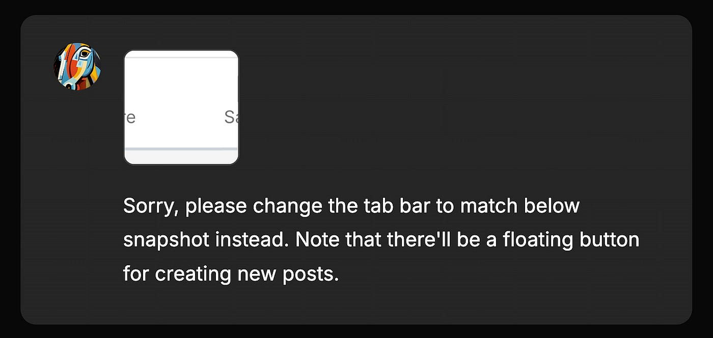

What if you could take an idea, explore design options, and create a working prototype — all in just an hour?

What if that prototype wasn’t just a basic design in Figma, but a more advanced, code-powered one?

And what if you could achieve all of this with only minimal coding skills?

In today’s newsletter, I’ll walk you through an experiment I did step by step:

- Drafting the requirements
- Generating wireframes
- Generating a prototype
- Making revisions

Let’s get started!

## The outcome

Before we dived in, here’s a brief demo of the outcome:


## Step 1: Draft the requirements

I asked Claude to generate a simple product requirement document:

```bash
Focus on the core flows where users can:
- Write a note.
- Browse notes from other users.
- Interact with notes by liking, reposting, and commenting on them.
- View user profiles.
- Sort notes by categories.
This PRD will be used for an experiment to generate wireframes using AI tools.
```

Here’s Claude’s response:



The generated requirements was quite thorough, but it was much more complex than I needed.

So my next step was simplifying the requirement and making some tweaks.

### 💡 Tips

It is helpful to leverage Claude or ChatGPT to generate prompts. That said, it’s usually better not to copy and paste the prompts directly into other AI tools.

Instead, only pick the relevant parts and simplify them to fit your specific needs.

This gives you more control over the prompt and helps save tokens by leaving out irrelevant details.

## Step 2: Generate wireframes

I could have skipped this step, but I wanted to explore some design options to have more control over the design before jumping straight into prototyping.

On top of that, I could have continued using Claude to ideate wireframes, but its responses fit better for simple proof-of-concept tasks than creating usable designs.

So I used UX Pilot, a tool I also touched upon in [**a newsletter** ](https://designwithai.substack.com/p/i-tested-4-ai-tools-to-generate-ui)last October.

I broke down the simplified PRD by pages, then provided them into UX Pilot — one page at a time.

For example, here’s my prompt for the homepage design:

```bash
The app enables bloggers to write, publish, browse, and interact with notes shared by others directly with their audience. 
Home Screen Components
- Navigation tabs:
  - Following
  - Discover
- Category filter bar
- Post cards showing:
  - Writer name/avatar
  - Post preview
  - Engagement metrics
  - Timestamp
```

Then I used the UX Pilot’s Figma plugin to generate 3 design options:



Using the same approach, I generated 3 design options for the add/edit post page :



Finally, the profile page:



Then I selected my preferred designs and made minor revisions.

### 💡 Tips

I chose to use UX Pilot’s Figma plugin instead of its web platform, even though the platform offers more features — such as creating a set of screens for an entire user flow based on the prompt and exporting the wireframes to Figma for editing.

However, those features were behind a paywall. That’s why I broke the prompt down page by page and generated wireframes for each page individually in the plugin.

## Step 3: Generate a prototype

Claude can handle some basic prototyping work, but I needed an AI tool specifically designed for the tasks like this.

I chose Bolt for this experiment (and will talk about V0 another time).

### What is Bolt?

Bolt is a AI-powered tool to turn text prompts into full-stack applications.

It is based on [**StackBlitz**](https://stackblitz.com/)**,** a browser-based development platform, so I don’t need to set up things on my local computer.

It handles miscellaneous tasks like:

- Install and run npm tools and libraries
- Run Node.js servers
- Deploy to production from chat
- Share my work via a URL

My experience of installing libraries and dependencies in its browser environment was great.

By comparison, I had to go through tedious installation process previously while I was building the [**SEO description tool**](https://designwithai.substack.com/p/how-i-built-an-seo-tool-with-ai) and [**Doc-to-Slides tool**](https://designwithai.substack.com/p/how-i-built-a-tool-from-scratch-with-ai) in my local computer.

### The first attempt

I asked Bolt to create a prototype using those revised wireframes as a reference.



It used NativeScript to build the mobile application and asked me to use my phone to scan the QR code to access the preview.



For the sake of simplicity and easier access, I asked Bolt to create a web version of this app instead.

So it switched direction, regenerating a web app using React and Vite.

Here’s its first attempt with several pages generated:





## Step 4: Make revisions

Bolt’s first attempt was a decent start, but it lacked some details, had visual inconsistencies with my prompt, and was not interactive.

So I used natural language to request specific improvements:

Ask it to fix minor design bugs:

- Add the floating button.
- Fix the tap bar.
- Revise the layout and components.

Ask it to add certain interaction behaviors:

- When the user clicks the “like” icon, it should switch to the enabled state.
- When the user clicks the floating “+” icon, an add/edit drawer should slide up from the bottom. Clicking the “x” icon should close the drawer.

I had to revise those small details one by one, but the process was fairly straightforward and not as tedious as expected.

Here’s an example of me taking a snapshot of the tab bar in the wireframe and asking Bolt to fix a visual inconsistency:



### 💡 Tips

Bolt provides 200k free tokens daily.

Depending on the project’s complexity and the number of iterations you make, you might be able to use them to complete an entire project or exhaust them within just a few commands.

Unless you don’t care about the expense, it is inevitable and important to know how to use tokens efficiently.

Some token-optimizing strategies:

- Start with a detailed initial prompt to reduce the need for revisions.
- Specify upfront where to deploy the app, whether as web app or native mobile app.
- Using snapshot references proved to be quite effective.
- Combine similar batches of instructions into one message if possible.

Another tip: even if you reach the token limit, you can keep working by using its code editor.

In my case, after I hit the limit, I was still able to take the prototype to the finish line in the code editor, with the assistance from Claude.

I believe token strategies (cost management) is an increasingly important but overlooked topic.

Will talk more about it on designwithai.co in the future.


欢迎关注我公众号：AI悦创，有更多更好玩的等你发现！

::: details 公众号：AI悦创【二维码】


:::

::: info AI悦创·编程一对一

AI悦创·推出辅导班啦，包括「Python 语言辅导班、C++ 辅导班、java 辅导班、算法/数据结构辅导班、少儿编程、pygame 游戏开发、Linux、Web 全栈」，全部都是一对一教学：一对一辅导 + 一对一答疑 + 布置作业 + 项目实践等。当然，还有线下线上摄影课程、Photoshop、Premiere 一对一教学、QQ、微信在线，随时响应！微信：Jiabcdefh

C++ 信息奥赛题解，长期更新！长期招收一对一中小学信息奥赛集训，莆田、厦门地区有机会线下上门，其他地区线上。微信：Jiabcdefh

方法一：[QQ](http://wpa.qq.com/msgrd?v=3&uin=1432803776&site=qq&menu=yes)

方法二：微信：Jiabcdefh

:::


[.](https://medium.com/design-bootcamp/how-to-turn-an-idea-into-a-prototype-with-ai-6863bbeb56e4)


