## 1. 环境配置

1. brew

```bash
/bin/bash -c "$(curl -fsSL https://raw.githubusercontent.com/Homebrew/install/HEAD/install.sh)"
```

2. nodejs

```bash
brew install nodejs
```

3. pnpm

```bash
npm install -g pnpm
```

4. 自行下载并安装 [VSCode](https://code.visualstudio.com/Download)
5. 注册 GitHub
6. 在 GitHub 上创建 `UserName.github.io` 「切记不要点击创建 README.md」
7. 配置 SSH：[https://bornforthis.cn/blog/2024/7month/git-ssh.html](https://bornforthis.cn/blog/2024/7month/git-ssh.html)

## 2. 初始化项目

1. 在电脑上创建文件夹（路径自行选择）；
2. 命令行要在你创建的文件夹上；
3. 执行命令，来初始化网站：`pnpm create vuepress-theme-hope .`
4. 剩下的按提示操作即可；

## 3. 发布网站

### 3.1 命令行操作

```bash
git add .
git commit -m "first commit"
git branch -M main
git remote add origin xxx
git push -u origin main
```

### 3.2 GitHub 设置

::: tabs

@tab Step 1：点击 Settings

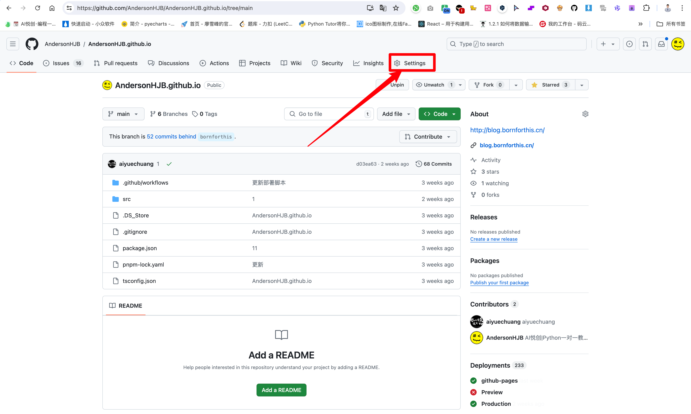

@tab Setp 2：点击 Pages

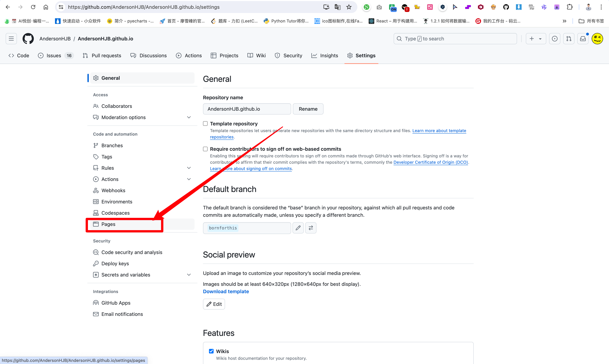

@tab Step 3：切换分支

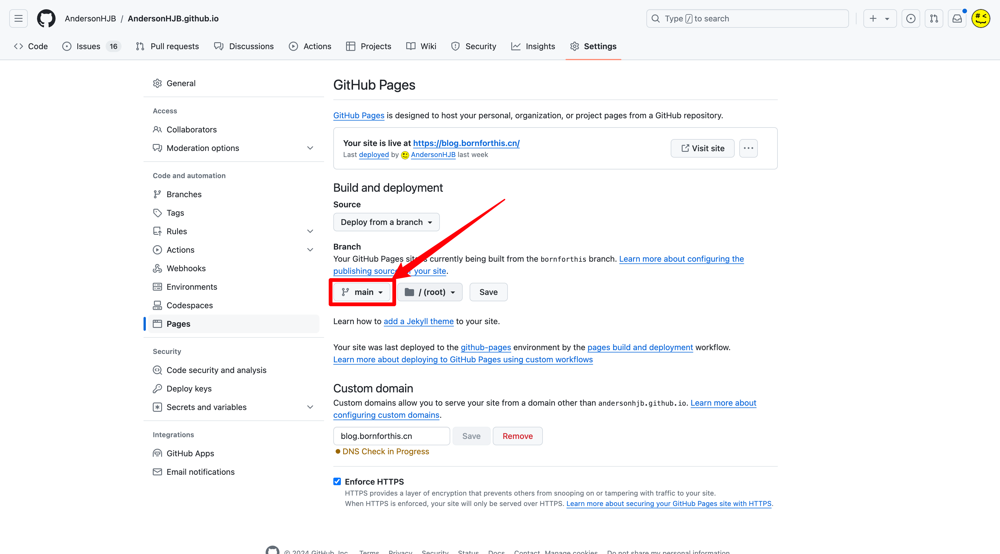

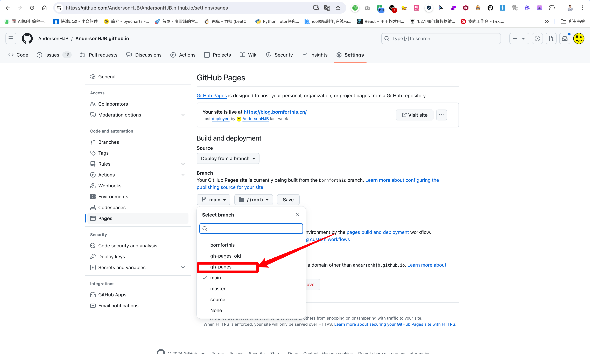

@tab Step 4：Save

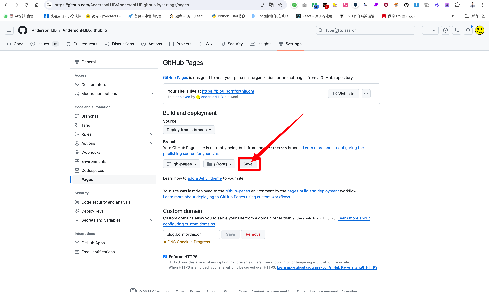

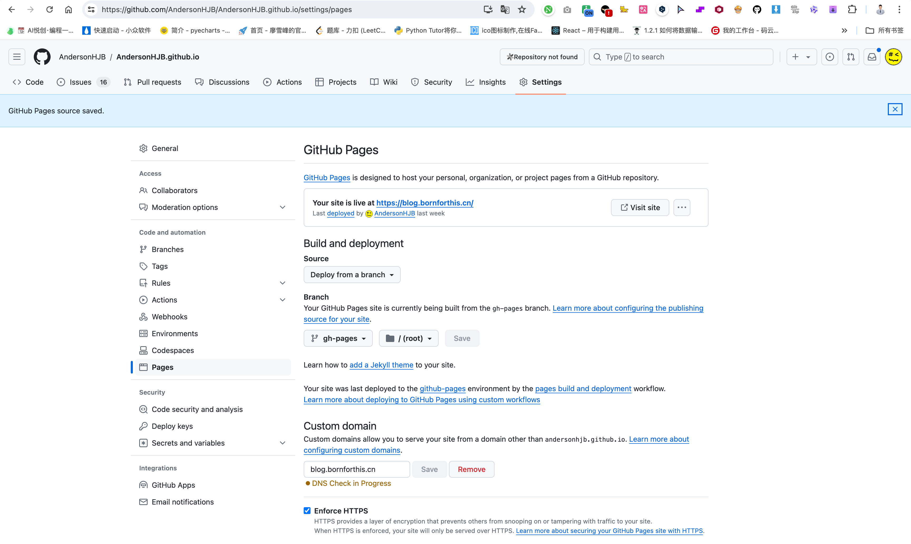

:::

### 3.3 绑定域名

1. 打开阿里云，进入阿里云域名管理；
2. 解析域名，解析类型 CNAME，值：GitHub 仓库名称；
3. 命令行要在网站路径下
4. 输入：`code .`
5. `src/.vuepress/public/` 下创建名为：CNAME

### 3.4 发布更新网站

::: tabs

@tab Step 1：打开 VSCode

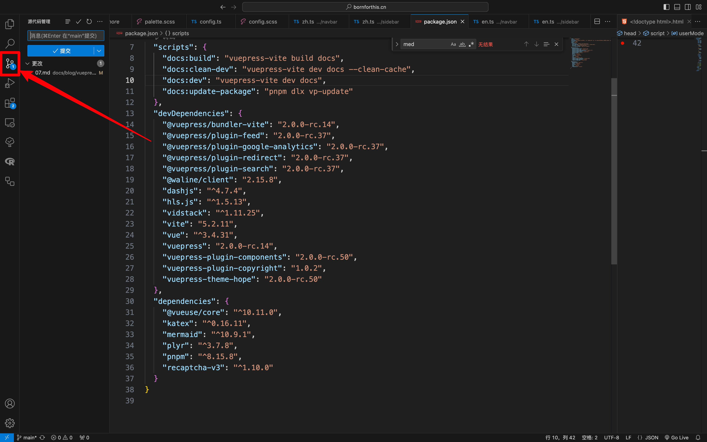

@tab Step 2：输入本次的修改（也可以随便打）

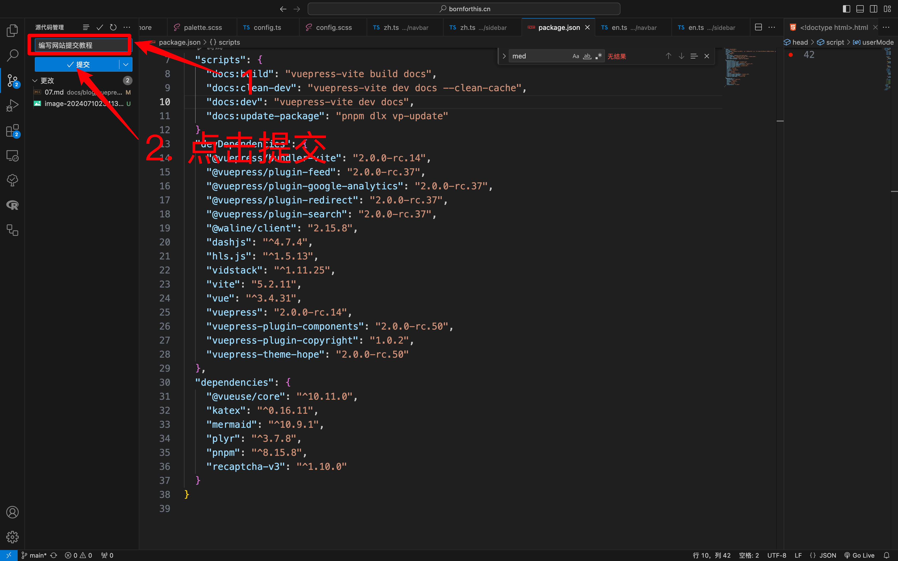

@tab Step 3：点击「同步更改」

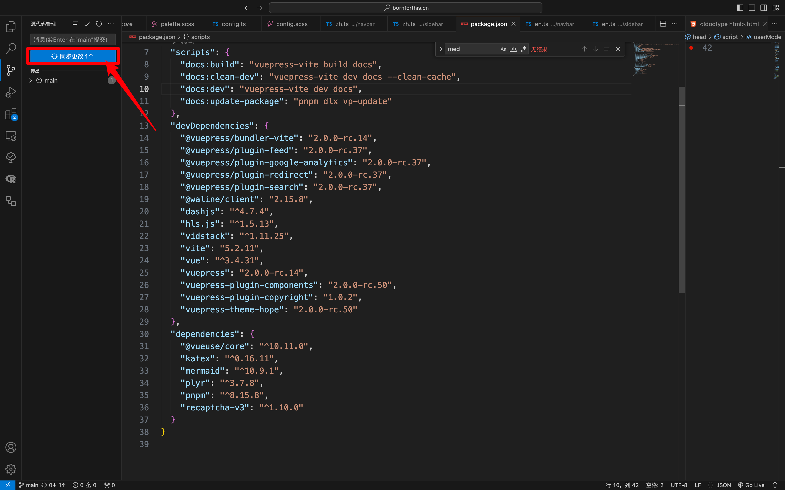

:::

### 3.5  本地运行网站

1. 进到你网站文件夹；
2. 鼠标右键选中
3. 服务——>New Iterm2 Tab Here
4. 启动命令：`pnpm run docs:dev`
5. 如果报错、停止，都可以输入上面的命令重新运行（如果报错，则需要先把报错解决）

## 4. 网站评论区

::: warning

所有的命令，都是需要在你网站的路径下；

:::

1. 命令行输入如下命令进行安装：

```bash
pnpm add -D @waline/client
```

2. 注册云存储服务：[https://console.leancloud.app/register](https://console.leancloud.app/register)

3. 注册 Vercel：[https://vercel.com/new/clone?repository-url=https%3A%2F%2Fgithub.com%2Fwalinejs%2Fwaline%2Ftree%2Fmain%2Fexample](https://vercel.com/new/clone?repository-url=https%3A%2F%2Fgithub.com%2Fwalinejs%2Fwaline%2Ftree%2Fmain%2Fexample)

4. 按照要求输入 Vercel 项目名称与 GitHub 仓库名称。

    Vercel 会基于 waline 模板帮助你新建并初始化该仓库。仓库初始化完毕后，需要在 Environment Variables 中配置 `LEAN_ID`, `LEAN_KEY` 和 `LEAN_MASTER_KEY` 三个环境变量。它们的值分别对应上一步在 LeanCloud 中获得的 `APP ID`, `APP KEY`, `Master Key`。

    设置好环境变量后，点击 `Deploy` 部署，一两分钟即可部署完成。之后在主题设置中设置 vercel 地址:

    ```typescript
    import { hopeTheme } from "vuepress-theme-hope";
    
    export default {
      theme: hopeTheme({
        plugins: {
          comment: {
            provider: "Waline",
            serverURL: "YOUR_SERVER_URL", // your server url
          },
        },
      }),
    };
    ```

5. Waline 评论的其他配置将在 [Waline 配置](https://ecosystem.vuejs.press/zh/plugins/blog/comment/waline/config.html) 中列出。

6. 图标配置：[https://unpkg.com/browse/@waline/emojis@1.2.0/](https://unpkg.com/browse/@waline/emojis@1.2.0/)

7. 


## 突破 GitHub 限制🚫

::: tabs

@tab Step 1: New organization

创建一个组织「理论上可以创建无数个」

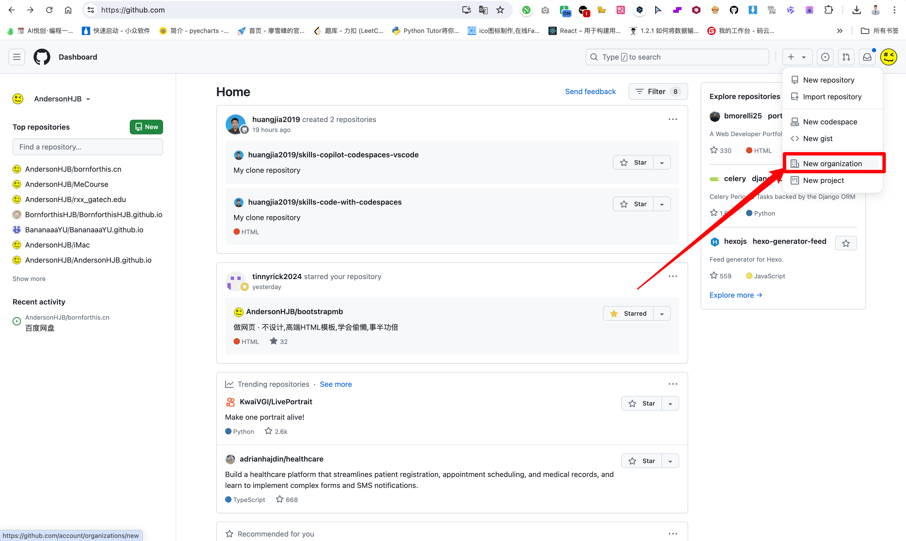

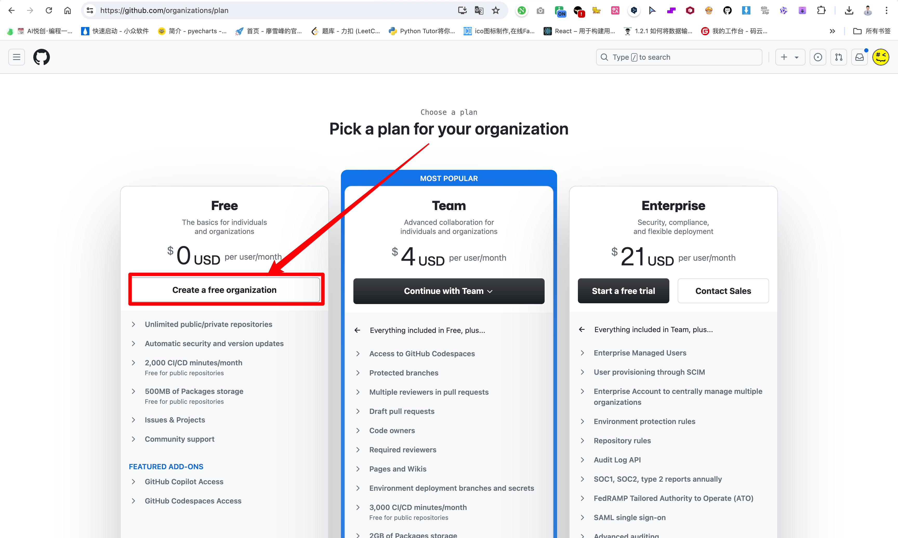

@tab Step 2：创建组织

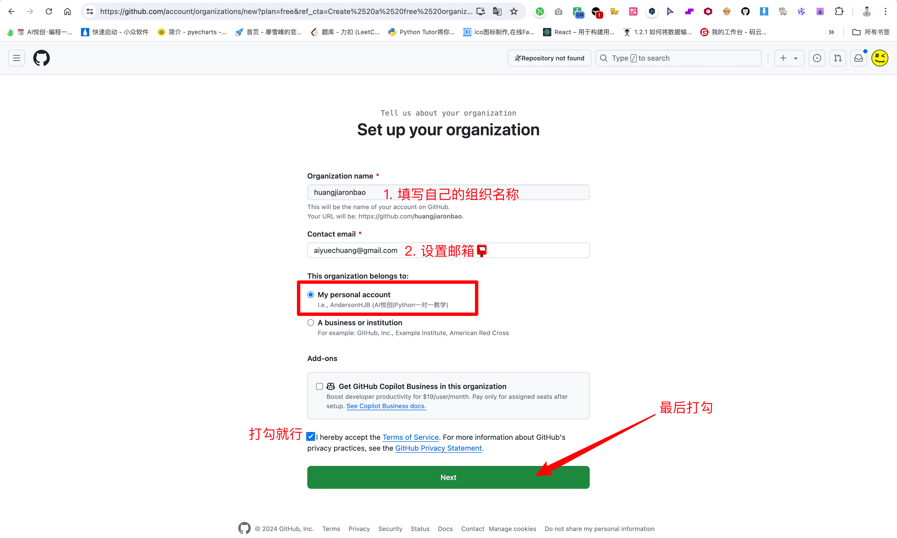

@tab Step 3：Skip this step

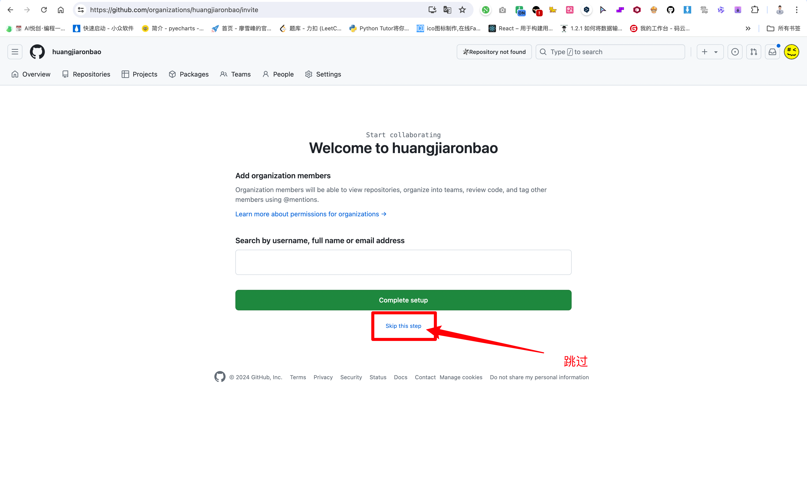

@tab Step 4：剩下的照旧

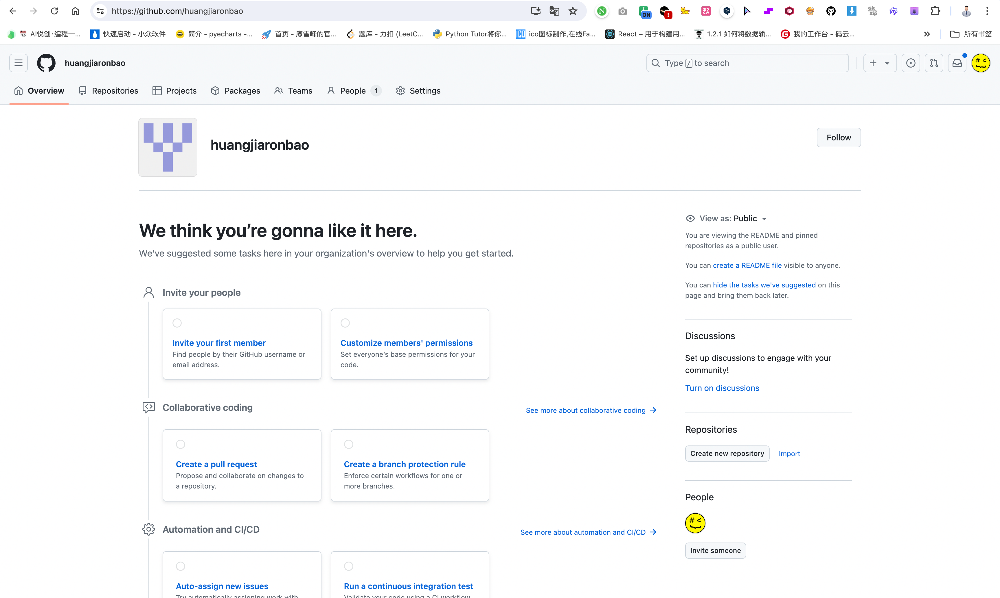

:::


## 快捷键

1. 显示隐藏文件：`Command + Shift + 。`
2. 


欢迎关注我公众号：AI悦创，有更多更好玩的等你发现！

::: details 公众号：AI悦创【二维码】


:::

::: info AI悦创·编程一对一

AI悦创·推出辅导班啦，包括「Python 语言辅导班、C++ 辅导班、java 辅导班、算法/数据结构辅导班、少儿编程、pygame 游戏开发」，全部都是一对一教学：一对一辅导 + 一对一答疑 + 布置作业 + 项目实践等。当然，还有线下线上摄影课程、Photoshop、Premiere 一对一教学、QQ、微信在线，随时响应！微信：Jiabcdefh

C++ 信息奥赛题解，长期更新！长期招收一对一中小学信息奥赛集训，莆田、厦门地区有机会线下上门，其他地区线上。微信：Jiabcdefh

方法一：[QQ](http://wpa.qq.com/msgrd?v=3&uin=1432803776&site=qq&menu=yes)

方法二：微信：Jiabcdefh

:::


