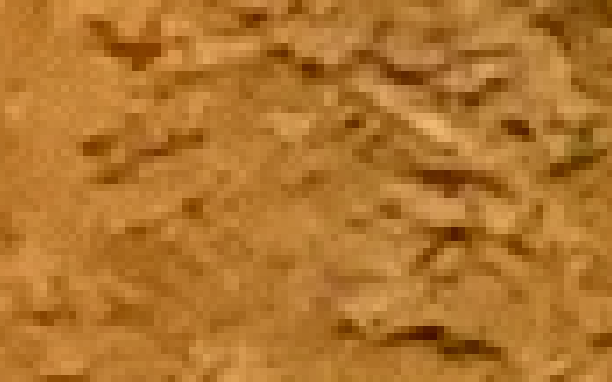
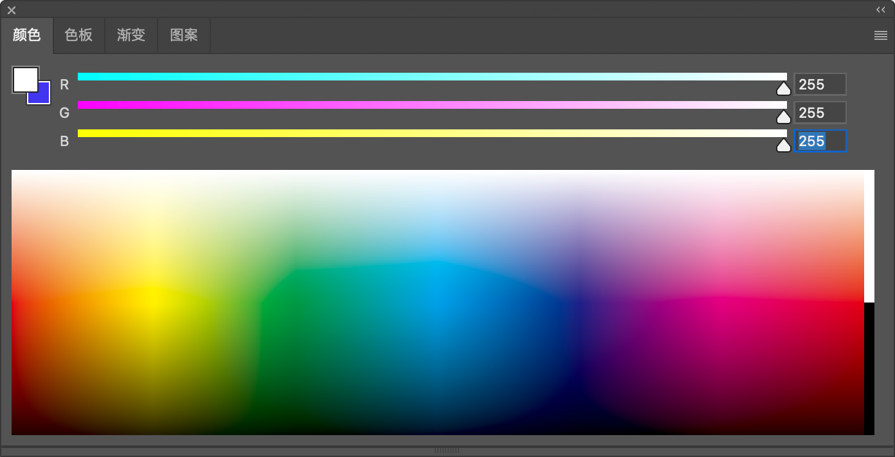
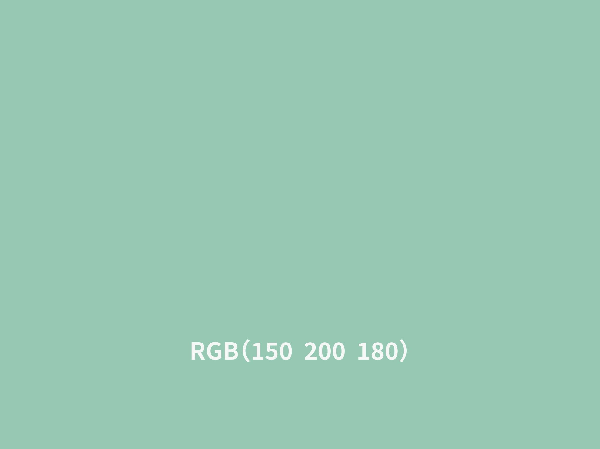
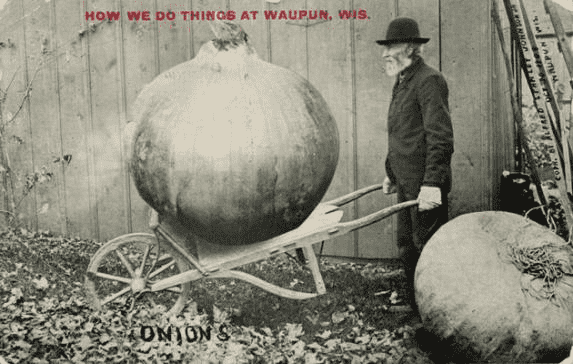
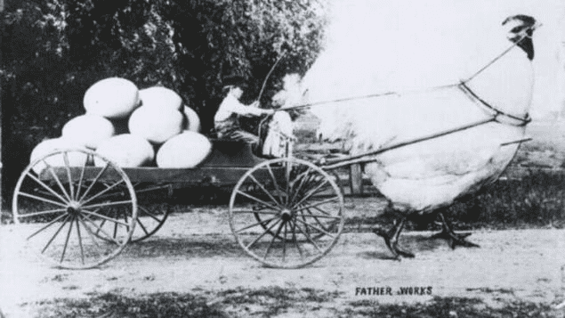

我们在日常生活中越来越离不开手机，而其中一个特别常用的功能就是——**一键美颜**。只要打开相机或者导入一张照片，轻轻一点，软件便能自动调整肤色、柔化瑕疵，让画面中的人立刻焕然一新。

这种自动美颜的效果，几乎让人以为手机里藏着一个美术大师。但如果你稍加思考，就会发现一个有趣的问题：我们人类知道哪儿是眼睛、哪儿是鼻子，是因为我们有大脑、有常识。可计算机既没有视觉器官，也没有人的直觉，它**是如何理解一张照片的内容**，又是怎样识别并美化其中的图像细节的呢？

答案，隐藏在**颜色的数字表达**和**图像的像素化结构**中。

## 1. 图像不是照片，是像素构成的“数据网格”

请你靠近看一看电脑、电视或手机屏幕，如果你将屏幕放大，会发现整个图像其实是由一格一格的小点组成的。每一个小点，称为一个“**像素**”，是“图像要素”的缩写。可以说，像素就是构成图像的最基本单位。

当我们说一台设备是“4K分辨率”时，其实说的是它在水平方向上大约有**4096个像素点**。像素越多，图像越清晰。而每一个像素点，不是单一的颜色，而是由 **红（Red）、绿（Green）、蓝（Blue）** 三种子颜色组成的。（其中 k 在这里表示千的意思）

这三种颜色组合在一起，构成了屏幕上几乎所有你能看到的色彩。

1. 红加绿变黄；
2. 绿加蓝变青；
3. 红加蓝成紫；
4. 三色全加就是白；

不过，这些像素还有一个小秘密，有时候就算你拿着放大镜也发现不了。那就是，每个像素还可以分成3小格，一格**红色**、一格**绿色**、一格**蓝色**。这3个小格子发出的光，决定了屏幕上显示出来的颜色，也是让计算机看见东西的关键。通过控制每种颜色的“亮度”，计算机能够模拟出**超过一千六百万种颜色**，足以表现我们所能感知的世界。

实际例子：如果我们把下面的**三星堆文化**的青铜雕像头像，进行放大我们会看见如下效果。

放大之前：

放大之后：

## 2. 从色彩到数字：计算机看图像的“方式”

计算机并不理解颜色的概念，它只理解数字。

在美术课上，我们曾学过如何通过将不同颜料混合来获得新颜色。

类似地，如果两种光不一样亮，也就是说它们的亮度不是 1:1，而是 1:2、1:3 等等等等，那混合出来的颜色就又不一样了。调整每个像素里三格不同颜色的亮度，屏幕就可以显示出更多的颜色了。

那倒过来，咱们也可以用这种方式让计算机看到颜色。这就牵扯到咱们之前说的“**问题转化**”思想了。我们要把每种颜色的光，转化成数字来表示。

此时，工程师们想出一种方法，把颜色的亮度转化成数字来处理。

在一般的 RGB 系统中，每种颜色的亮度用 0 到 255 的整数表示：

1. 0 表示最暗，即完全没有该颜色；

2. 255 表示最亮，即该颜色最强。

3. 从 0 到 255，红、绿、蓝每种颜色都分出了**256 种亮度**。

所以，当：

1. 红色为255、绿色为0、蓝色为0，就表示“纯红”；
2. 红绿蓝三色各设为150、200、180，则构成一个柔和的淡绿灰调，其组合就可以表示为：`(150, 200, 180)`。

你可以把这三组数字看成是**颜色的身份证**，每个不同的组合，都对应一种具体的色彩。计算机就依靠这样的方式，将“颜色”抽象为可以存储、比较、处理的“数字”，从而完成对图像的理解。

## 3. 让电脑“理解”颜色

用数字编号表示颜色，有什么好处呢？这就是“**问题转化**”思维起作用的地方了，计算机虽然看不懂颜色，但它认识数字呀。通过这种方法，我们可以把任何颜色变成一串数字，计算机就可以处理了。

当然了，一张图片上一般不会只有一种颜色。没关系，我们可以把图片上每一个像素的颜色都变成一串数字，这样，在计算机眼中，一张图片就成了密密麻麻一大团数字。这样，计算机就能看懂照片了。

接下来，它就可以对图片进行处理了，也就是说，你能随心所欲地给照片美颜了！那么，美颜的时候，计算机又是怎么做的呢？

## 4. 美颜的秘密：处理一张“数字组成”的照片

理解了颜色的数字化表达，我们就能明白计算机是如何进行图像美化的了。

在计算机眼中，一张图片其实是一个**数字矩阵**：每个像素的位置记录着三个颜色通道的数值（R、G、B）。如果脸上某处出现一个黑点，其周围都是亮色像素，那么这个黑点在数值上就显得特别“突兀”。

计算机程序可以通过“取平均值”的方式，**用周围像素的平均亮度来替代这个异常像素**，这样黑点的亮度就提高了。看起来，就是变白了。从而实现“去瑕疵”的效果。这个过程非常快速，而且可以被精准地编写成算法。

在美颜程序里，还有很多很多的工具，比如把腿拉长，把脸变小等等。这都离不开像素的功劳。

这正是**编程中的“抽象”与“问题转化”思想**在现实中的应用：把看不懂的图像，变成一串可识别的数字，再对这些数字进行逻辑处理，就能达到肉眼可见的图像效果。

## 5. 数字图像处理，原来百年前就有“雏形”

虽然数字化图像是近几十年的科技产物，但照片“修改”这件事，其实早在百年前就已经有人尝试过了。

20 世纪初的美国，当时，由于交通不便，许多民众终生难以出远门，明信片成为他们了解外面世界的窗口。一些摄影师为了让家乡看起来更有趣，就动起了“照片拼接”的念头。他们将洋葱、玉米等农产品的近景特写，与背景照片拼贴到一起。并且把不够美观的部分通过剪裁和拼接手法加以改善。再重新拍照制作成明信片——于是便出现了“人高的洋葱”、“马拉的母鸡”等极具想象力的图像。

这种手工“照片合成术”与今天的 Photoshop 美图并无本质不同，只是那时靠剪刀和胶水，现在靠的是像素与算法。

## 6. 编程的魔力：让机器“看见”这个世界

回到我们最开始的问题：计算机没有眼睛，它是如何看图的？

答案就是：通过把图像变成像素，再把像素的颜色变成数字，计算机就可以“看”到这世界。只不过，它看到的不是色彩斑斓的画面，而是一堆包含坐标和亮度的数字矩阵。

然而，就是这些冰冷的数据，让计算机能够进行皮肤美白、脸型调整，甚至还能识别图像中的物体轮廓、分析表情特征。背后支撑这一切的，正是“将现实问题转化为数据处理问题”的**编程思维**。

科学家利用编程思维中的**问题转换方法**把画面转化成了一个个小小的像素点，然后又把各种颜色的像素点转化成了计算机能够看懂的数字，这样一来，**计算机就能和我们一样看见世界了**。

在现实生活中，你要学会善于使用问题转换的方法。有时候直接实现有难度或无法实现，此时不妨换一个方法来间接实现。注意：掌握问题转换这种思维是原则，使用原则应对变化的大千世界！

## 7. 思考一下：计算机能分清猫和狗吗？

到这里，我们已经看到：计算机虽然没有人的大脑，也不懂图画的含义，但通过像素和数字，它就能“理解”图像内容，并作出精准的修改与分析。

这也引出一个新的问题：如果我们想让计算机区分一只猫和一只狗，该怎么做？它能否学会像人一样看图识物？

这个问题不只是计算机视觉的技术挑战，更是一种更高层次的“智能模拟”。

下一篇，我们就将进入这个领域，一起探索**计算机如何学习识别图像中的对象**，并向“真正的视觉智能”迈出关键一步。

## 8. 选择题

1. 计算机是如何识别颜色的？

    A. 通过电子眼观看

    B. 把不同的颜色转化成不同的数字

    C. 把不同的颜色转化成不同的物体

2. 以下哪一块电子屏的分辨率属于 4K？

    A. 2096 像素的电子屏

    B. 3096 像素的电子屏

    C. 4096 像素的电子屏

3. 每个像素可以分成哪三种颜色的小格？

    A. 红、橙、黄

    B. 红、黄、蓝

    C. 红、绿、蓝

## 9. 图片来源（不放进书稿！）

- [Tall-tale Postcard: Onions](https://www.wisconsinhistory.org/Records/Image/IM44418)
- [Tall Tale Postcards of the Twentieth Century](https://www.amusingplanet.com/2010/11/tall-tale-postcards-of-twentieth.html)

