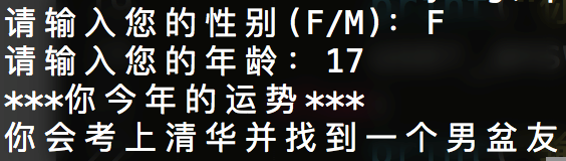

::: center

## 1. 作业说明

请按以下要求完成程序：

:::

1. 对用户进行提问并获取用户输入
2. 当用户输入不同信息时程序输出不同的运势预测结果
3. 注意：考虑用户在输入错误时程序如何处理。

::: center

## 2. 示例程序

## 3. 可能会用到的函数

- `input()`

- `print()`

- `if 条件判断语句`

:::

