## 1. 认识互联网数据分析

### 1.1 互联网数据分析通用课程-导学

#### 1.1.1 随着互联网的发展，任何岗位都离不开数据分析

事实上，不管你做什么工作， 从事什么行业，数据是你一定会接触到的内容。

随着互联网的不断发展，我们每天都在产生大量数据，这些数据又反向的产生价值。——**数据分析，就是发现数据的价值。**

- **用户**：作为用户，我们网上购物的时候，会根据评价，购买量，价格——去挑选一件商品。当然，商家也会反向的分析，我们这些用户行为，进一步决定：挑选什么样的商品、如何定价、如何宣传文案等；
- **产品经理**：那作为产品经理，在进行设计和优化的时候，也会跟踪用户行为路径，根据监测到的数据制定方案、设计产品。
- **运营**：作为运营，为了提升成交量，每天都需要关注和销售量相关的数据指标，比如：拉新数、转化数等等，明确有效的运营方案。

我可以很直接的告诉你，在未来对于任何岗位，数据的处理和分析能力，都一定会成为工作中，必备的能力之一。那具体而言，你需要掌握哪些数据分析必备的技能呢？

#### 1.1.2 数据分析师，必须掌握的技能

数据分析技能主要分两类：

- 硬技能
- 软技能

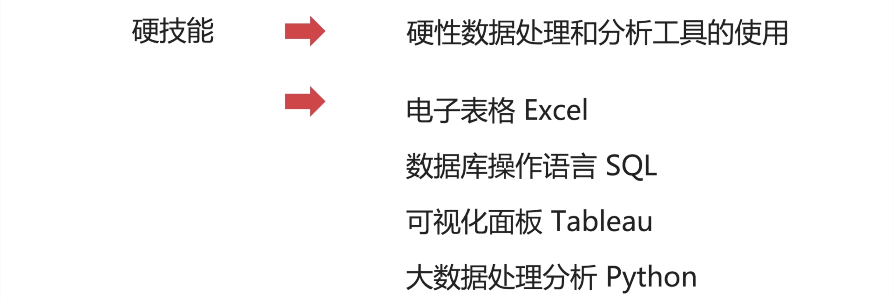

**什么是硬技能呢？**

——硬性的数据处理和分析工具的使用。

比如：

- 电子表格 Excel
- 数据库操作语言 Sql
- 可视化面板 Tableau
- 大数据处理分析 Python

那这些工具，你会就是会，不会就是不会。很容易识别。所以，经常作为数据分析的硬性门槛，是你必须要掌握的技能。

**那什么是软技能呢？**

——对事物的认知方式，以及经验积累。

 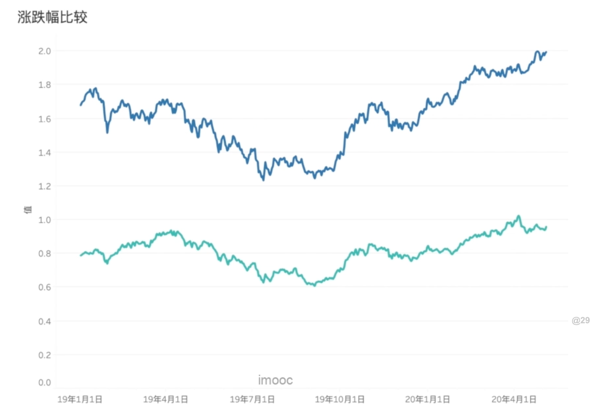

比如：给你一组股票价格的走势图， 深蓝色的代表股票 A，浅蓝色的代表股票 B。

- 那对于不太了解股票的人（小猿），你能做出的判断就是：**A 的价格比 B 要高** ；

- 但对于有投资经验的（小悦），会分析出：**股票 A 的市值比 B 高，所以价格才会对应的高**；

    还可以通过它们的波动程度，分析出：**A 的波动率是大于 B 的，而波动率也意味着风险程度，也就是说  A 的风险大于 B 的。**

那显然小悦的软技能，也就是认知水平，思维水平，是高于小猿的。这个是由他的**经验**决定。

再来一个人 Austin，Austin 和 小悦一样，都是有投资经验的，Austin 知道每一个节点产生的背景，也就是说：

- **行情下跌，它是由于某个事件，或者某一个政策导致的；**
- **上涨，它又是由于某一个事件或者政策导致的。**

那么，Austin 的软技能会比小悦、小猿更高。因为，他具有更宏观的思维方式与框架，而以上所有提到的硬技能、软技能我都将教学给你。

#### 1.1.3 课程优势

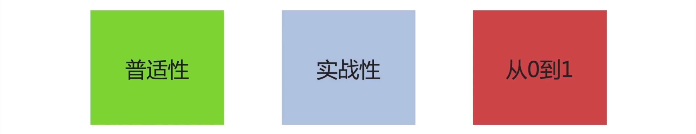

- **普适性**：只要你需要数据，进行数据分析的，都可以跟我学。
    - 如果说，你是运营、产品、市场或者销售，这门课不仅仅是带你掌握数据分析的硬技能，还会帮你补充互联网行业经验。
    - 哪些经验呢：比如互联网的细分行业有哪些、对应的龙头企业有哪些、商业模式如何。
    - 以及针对整个用户周期，如何利用数据分析技能，提升数据表现。比如有哪些运营策略，思维模型，如何拆分业务指标等等。

- **实战性**：实战性强指的是，在我这门课程中，所有的数据都是真实的，可以追溯的。所有的数据分析案例，也都很接地气，也都是从我们日常工作中，提取出来的。非常通俗易懂。
    - **第一个阶段**：大数据人才需求分析、销售情况分析；「第一个可以为大家找工作服务，第二个是实用性『适用性』比较高，你完全可以替换为财务类、运营类的数据」
    - **第二个阶段**：第二个阶段的案例，会更贴近，工作中的业务场景，包括：用户行为分析、用户画像分析、营销渠道分析、留存转化分析等。并且相关的数据，思维模型，包括分析工具的模版，我都会提供给你。

- **从 0 到 1**：指的就是数据分析的全流程，也就是说：从目标确定，数据获取，数据清洗，数据探索，洞察结论，数据报告——这整个流程，我都会带着你，一步一步的实现。告诉你怎么去做，告诉你重点在哪里，要注意什么。

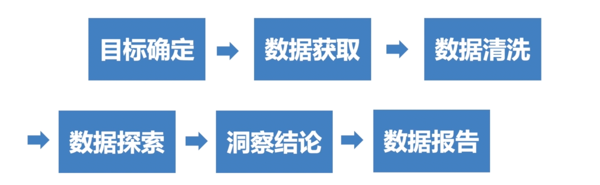

### 1.2 从互联网数据分析说起

#### 1.2.1 什么是互联网数据分析？

- 互联网指的是信息传输的一种载体，这种载体是线上的，通过电子化的方式留存信息，与我们传统线下基于实物的传输方式相对应；

举个简单的例子，纸币「硬币」和数字货币，它们都是货币，可以用来交易，只是交易的方式不同。

- 一个是线下的，实物的，可以看到摸到的。
- 一个是线上的，相对虚拟的形式。
- 但是两者，大部分情况下是等值的。

 那么，数据分析前面加了 **互联网** 又是什么含义呢？

- 数据分析，我们知道，就是通过数据的规律进行总结、提炼。来帮组我们，做出决策。
- 举个例子：我想要了解数据分析岗位人才需求的总体情况：
    - 首先，我得拿到招聘信息的数据——招聘信息
    - 接着，在基于我拿到的数据，统计数据分析岗位的职位数——统计职位数「等相关指标」
    - 那同时为了比较，我还需要统计其它类似岗位的招聘数，比如：大数据开发，产品，运营，销售，市场等等，来明确数据分析岗的需求，是否旺盛——同类比较

    

那我如果在数据分析前面加上互联网，什么意思呢？

**互联网数据分析岗位人才需求**——就是说：这些信息是基于互联网平台存在的，也就说：线上存在的。比如：我从某某招聘网站上面抓取的数据，这个就叫互联网数据分析。

那如果是线下，比如调研，用户调研得来的，这个就不能叫做互联网数据分析。

**大家可以感觉到区别吗？**

——实际上就是一个获取场景的区别。

不过，随着互联网科技的发展，获取信息的渠道，都逐渐从线下转移到线上。

所以，当我们聊到数据分析的时候，默认指的就是：基于互联网，基于线上的数据分析。

**而数据，就是我们最原始的生产材料。**

那在后续的课程中，我们讲进一步认识数据的类型，与基本特性。让大家学会，如何快速的理解和描述一组数据。

#### 1.2.2 章节回顾

我们学习了互联网的基本概念，互联网指的是线上的一种传输方式。还学习了数据分析的基本概念，数据分析指的是利用数据规律进行决策。而互联网数据分析呢，指的是对基于线上产生的数据进行分析。

#### 1.2.3 作业

以下哪个是基于互联网的数据分析：

A. 统计某产品线下调研结果

B. 分析某课程线上引流效果

::: details 答案

B 线上的

:::

## 2. 常见的数据类型

### 2.1 什么是数据

#### 2.1.1 从认识数据开始

- 数据分类
- 统计指标
- 分布形态
- 数据分析流程
- 常用数据分析工具

对于数据分析来说，这是非常基础也很重要的一章。就好比我们学习写作之前，你需要学习基本的遣词造句一样，后续的数据分析内，都用到本文讲到的知识点。

#### 2.1.2 什么是数据

**数据是对事物的描述和记录。**

其实，我们思考一下，我们日常生活中，到处都充斥着数据。我们在描述的过程中，也无法离开数据。

我们上网，看到的这些网站、网页，它上面都布满了数据。

我们用的报表，文档，甚至看到的菜单等等，都是由数据所组成的

#### 2.1.3 数据的特性

根据数据的计量层次，进一步对数据进行分类；

根据数据的计量层次，我可以从低到高的，对数据进行进一步的分类；

那什么是计量层次呢？我来带大家理解一下。

- 黄瓜，番茄，森林，书本，无法计算比较，计量层次低
- 1，2，3， 4，5，这些数据可以计算比较，那么计量层次就高

首先，我们观察第一组数据，黄瓜，番茄，森林，书本，你会发现这样的数据会有一个特点，他是文字描述型的数据。你没有办法对他进行一定顺序的排序，或者是大小的比较。那对于这样的数据来说：我无法进行计算比较的数据，我们就说这是计量层次比较低的数据类型。

那对于数值型的，1，2，3， 4，5，这样的数据，它们很明显可以进行排序，计算差异，做加减乘除，做比较。那么我们就会说，这样的数据，它的计量层次是比较高的。

#### 2.1.4 定类数据

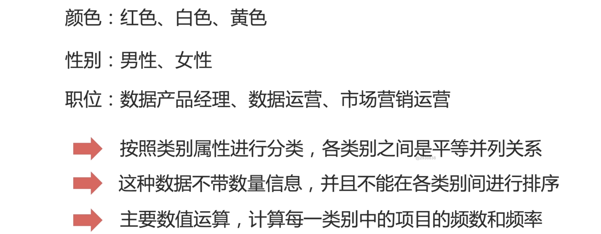

- 颜色：红色、白色、黄色
- 性别：男性、女性
- 职位：数据产品经理、数据运营、市场营销运营

观察一下，上面的数据有什么特点？

你会发现，给的这几组数据，它们之间会按照：

- 按照数据的类别进行分类的，各类之间是平等并列的；
- 比如：红色、白色、黄色，红色是否优于白色，或者劣于黄色，你是没有办法进行这样的排序吧。
- 这一类的数据，我们叫做定类数据。
- 这种数据没有数量信息，并且不能在各类别间，进行排序。
- 针对于这些数据，我们通常想要去计算的话，就是统计每一个类别它们的频数「次」和频率。

#### 2.1.5 定序数据

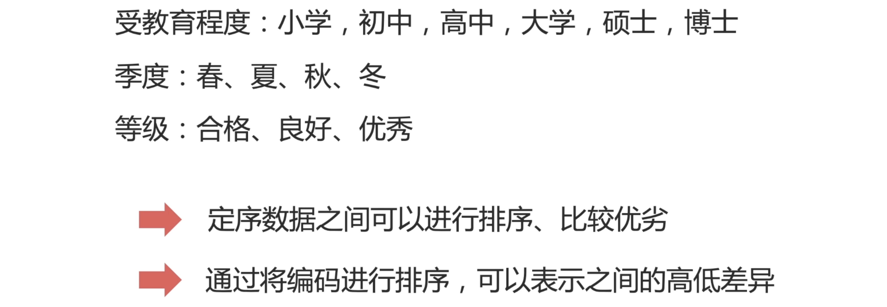

- 受教育程度：小学，初中，高中，大学，硕士，博士
- 季度：春，夏，秋，冬
- 等级：合格、良好、优秀

你可以观察到，这几组数据。受教育程度，季度，等级，你可以观察到，这几组数据和我们的**定类数据**，有个共同点，都是文字描述型的数据。

但是，又有些不同。

- 你会发现，这些数据之间是可以进行排序的，可以去比较优劣的。
- 比如受教育程度：小学，初中，高中，大学，硕士，博士，它是按照受教育的程度「先后」来进行排序的。
- 季度上按照时间的标准去排序的；
- 等级是按照成绩的大小去排序的「合格、良好、优秀」；
- 这也是说，在实际的使用过程中，我们不但能文字描述，进行基础的排序。我们也可以通过对文字进行对应的 **数字编码** 进行一个默认的大小排序。
- 比如说：小学我分配的编码是 01、初中：02、高中：03、大学：04、硕士：05、博士：06，那么通过编码的方式，我们可以很方便的对它们进行排序。

#### 2.1.6 定距数据

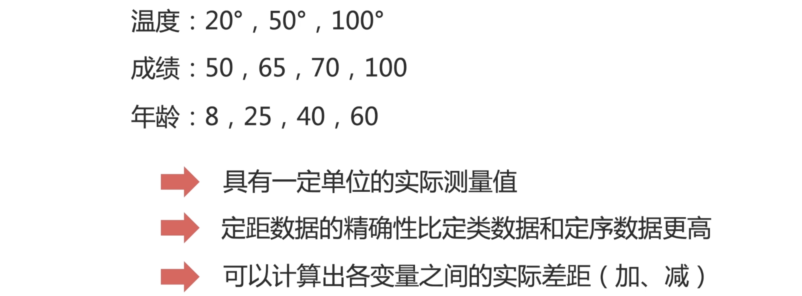

- 温度：20º、50º、100º
- 成绩：50、65、70、100
- 年龄：8、25、40、60

我们可以观察一下，上面的数据，你会发现：从这一组数据开始，数据开始变为数值型的数据。也就是说，它是具有一定单位的实际测量值。比如温度，它的单位是度。成绩它的单位是分数。年龄它的单位是年。

而对于这样的数据，它的精确性一定是比前面定类和定序数据要更高的。

对于这些数据，我们不仅仅可以做排序、大小比较、我们也可以做简单的加减运算。

#### 2.1.7 定比数据

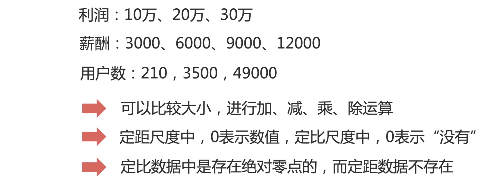

- 利润：10万、20万、30万
- 薪酬：3000、6000、9000、12000
- 用户数：210、3500、49000

对于这些数据，它们不但可以进行大小的比较、排序、加、减、乘、除运算。那这个时候，我们回忆一下，刚刚讲到的**定距数据**，你会发现它是没办法做乘除运算的，比如说：针对于温度，你可以说今天的温度比昨天的温度高20º或者低20º，但是你不能将两个温度的变量去做乘除运算，它们产生不出任何意义。

那这个是什么情况？这是因为，对于定距数据中，在定距尺度中，0 是表示一个数值，而在定比数据中，0 代表没有。

比如，在**定距数据中**以温度为例 0 度就是表示 0º ，我每一个数值，它后面每一个单位都是相同的，它表示的含义都是一样的。

而在于**定比数据**中，它是有一个所谓绝对零点的存在，我如果是 0 就是没有，那这样的特性，可以让它去做任何的数学运算。

当你拿到一个数值型的数据时，你可以思考一下，它到底属于定比数据还是定距数据。——那其中的关键点就是刚刚聊到的，绝对 0 点。如果存在绝对 0 点，那它就是定比，如果不存在，就是定距。

#### 2.1.8 定性、定量数据

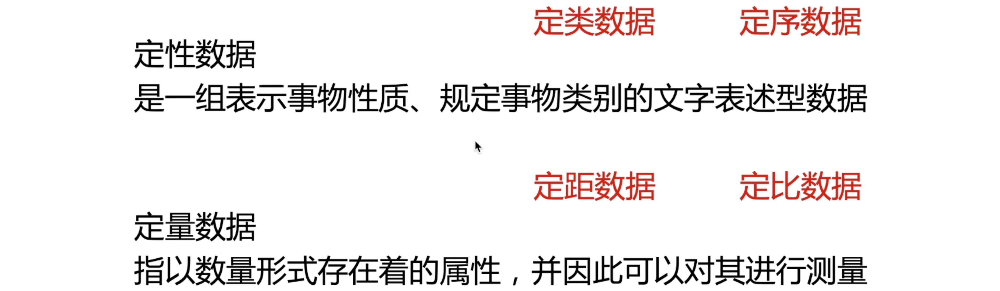

我们来总结一下，我们聊到的四个数据，它可以统称为：定性数据和定量数据。

- 定性数据（定类数据「对事物数据进行分类」、定序数据「对事物进行排序或有一个默认标准的顺序」）
    - 是一组表示事物性质、规定事物类别的文字表述型
- 定类数据（定距数据、定比数据）->都可以直接进行数学运算的
    - 指以数量形式存在着的属性，并因此可以对其进行测量的数值型数据

#### 2.1.9 数据矩阵/二维数据表

上面的数据，以一定标准组成起来的时候，就组成了数据矩阵。——也就是我们经常接触到的二维数据表。

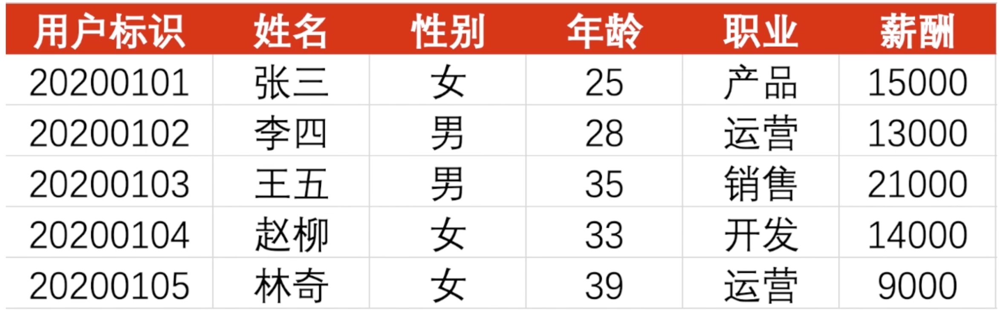

我们把数据表横的一行，称为观测值或者说记录。

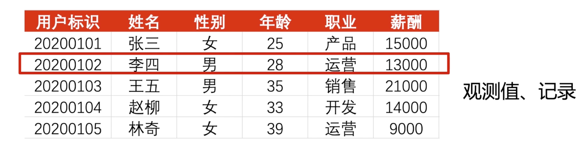

我们把数据表开头的，第一行的数据「列表字段」称为我们的数据属性或者数据纬度。

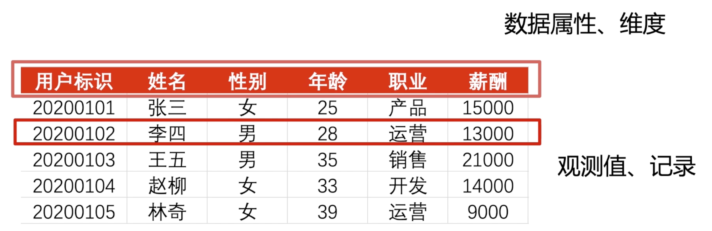

而这也是我们展现数据的主要方式，

#### 2.1.10 章节回顾

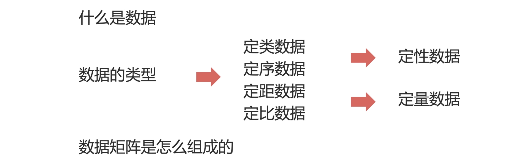

1. 什么是数据
2. 数据的类型
    1. 定类数据 => 定性数据
    2. 定序数据 => 定性数据
    3. 定距数据 => 定量数据
    4. 定比数据 => 定量数据
3. 数据矩阵是怎么组成的

#### 2.1.11 课后作业

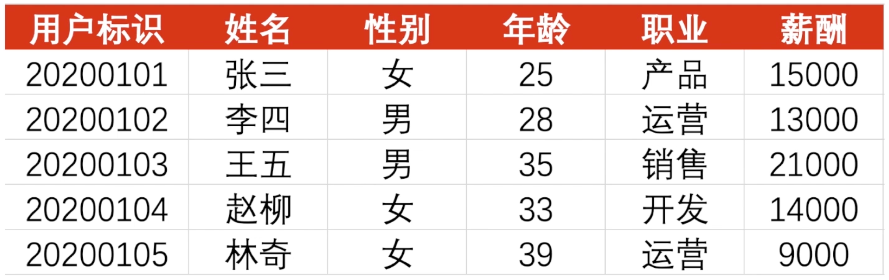

基于上面的二维数据表，大家观察一下，第一列的列字段，也就是我们的数据属性、数据维度。请告诉我：它们对应的数据类型时哪一个。

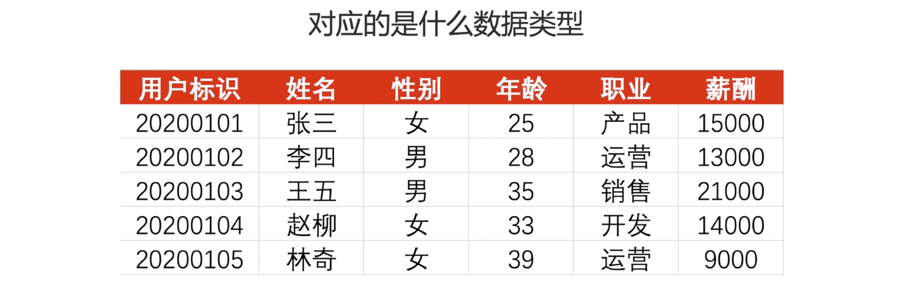

### 2.2 【学习任务】根据所学知识辨识对应的数据类型

基于下面这个二维的数据表，根据第一列的列字段，也就是我们的数据属性和数据维度，告诉我对应的是什么数据类型？

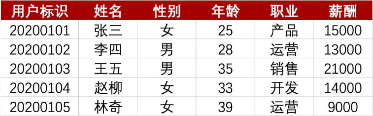

> 1. 定性：姓名、性别、职业
> 2. 定量：用户标识、年龄、薪酬

1、定⽐：主要是数值或数字类型，可以做加减运算，⽬的是得到更加精确的值，⽐如⾝⾼或者体重之类的

2、定距：主要是数值或数字类型，有单位，可以做加减运算，但是不能做乘除运算，⽐如温度之类的

#### 2.2.1 问答

> 学员：用户标识不是定序数据，属于定性数据吗？为什么会是定量数据呢
>
> 答：其实看情况的，比如 id 形式是乱码的就是定性，如果是一二三四有序的可以是定序 or 定量，因为可以通过加减获取用户量等等

---

> 学员：数据类型的转换
>
> 将姓名等定类数据按照拼音首字母进行排序这种是什么方法呢？将性别中的男和女定义为 0和1 这种又是什么方法呢？
>
> 答：
>
> 第一个，正常排序就是按照汉字的首字母进行顺序排序的
>
> 第二个，可以使用替换的方式，值为男性的替换为1，植性的替换为0

---

> 用户标识：为定距数据；
>
> 姓名、性别、职业：为定类数据；
>
> 年龄、薪酬：为定比数据；
>
> 没有定序数据；
>
> 定性数据：姓名、性别、职业。
>
> 定量数据：用户标识、年龄、薪酬。

### 2.3 什么是统计指标

#### 2.3.1 什么是统计指标

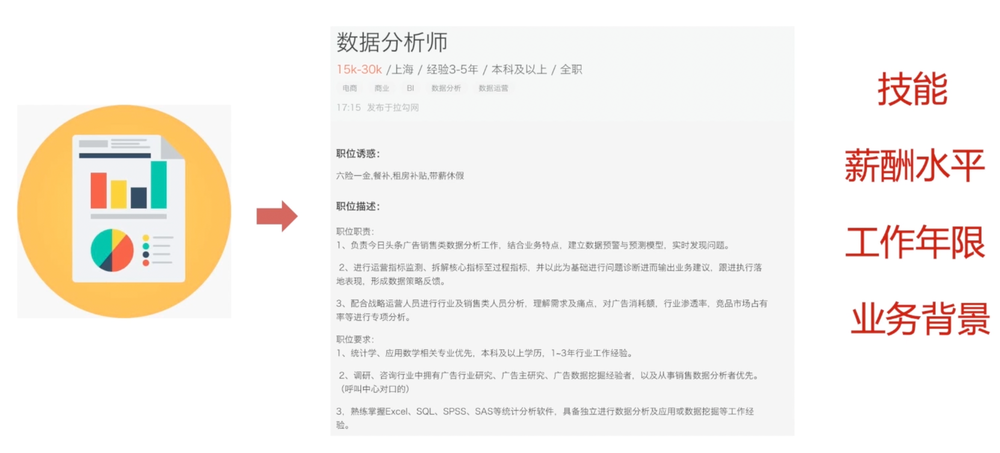

如果把数据分析比喻成找工作的过程，招聘网站发布的职位信息，就是我们要分析的职位对象。我们想要通过职位信息，分析出：它对应岗位需要的技能有哪些、它的整体薪酬水平和我能力溢价水平是否相符、它对工作年限是否有要求、它对业务背景是否有偏好？——这些问题，我们需要什么依据，才能回答这些问题呢？

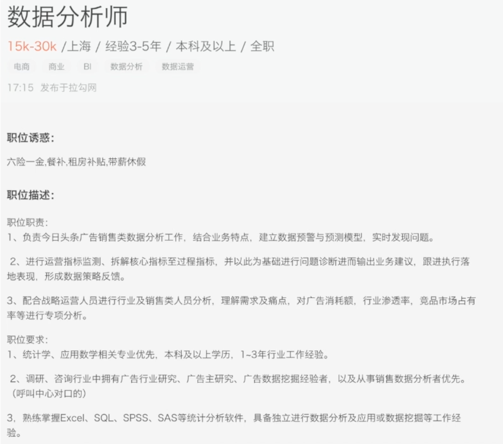

首先我们需要寻找大量的职位信息，通过观察这些信息，提取有用的部分。比如：薪酬数据、地点数据、工作年限、教育背景、技能数据等。那通过对这些关键信息的汇总、处理、计算得到初步的结论。

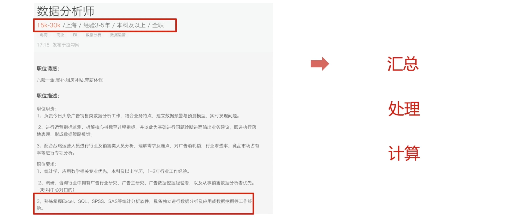

那这个过程就是在计算统计指标，帮助我们去回答，我们要解决的问题。

统计指标，简单说就是体现总体数量特征的一个概念和数值。

根据分析目的不同，统计指标也会一直在变化。

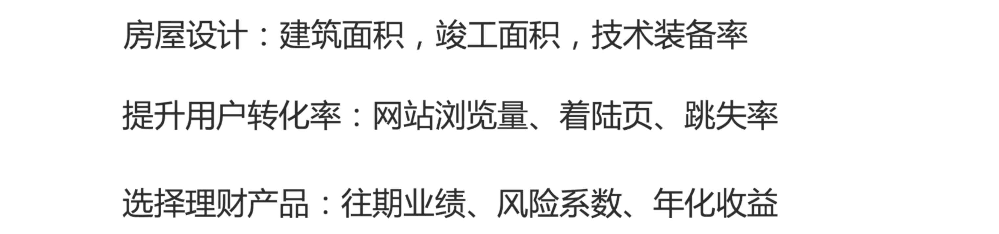

比如，在做房屋设计的时候，我们统计对象是建筑面积，竣工面积，技术装备率；

在分析用户转化率的业务问题上，我们需要对网站浏览量，着陆页，跳失率等等环节，去进行统计计算。——找到最薄弱的环节，分析原因。以此，提出解决方案。从而提升我们的用户转化率。

在选择理财产品的时候，我们需要去考察它往期的业绩是否优秀，它的风险系数是否符合我自己的需求，如果是保守的，那么风险系数应该在什么范畴。如果是激进的，又在什么范畴。那它的年化收益，是否是正的、是否跑赢通胀、是否满足我自己的需求等等。

通过这样的方式去选择适合自己的理财产品，那统计指标可以通过它体现的内容，可以分为：总体和相对两大类。

#### 2.3.2 总量指标

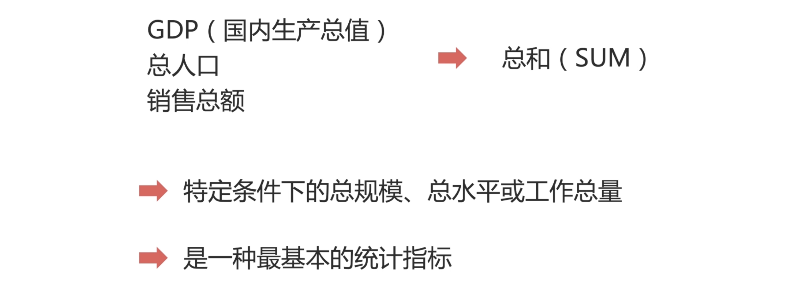

那当我们想计算 GDP（国内生产总值）、总人口、销售总额，这种体现总体规模，总体水平或者工作总量的时候，我们就需要总量指标。那也是我们通常意义上的所说的总和（SUM）。「也就是累加和」这也是一种最基本的统计指标。

#### 2.3.3 平均指标「集中趋势指标」

那当我们想要描述一组数据的平均水平的时候，我们会使用平均指标。——用一个数字，去显示总体的其一般水平。那我们常说的平均值，就是平均指标的一种。平均指标又叫：集中趋势指标。那这一章节的内容，我们会在下一节课具体说。

#### 2.3.4 相对指标

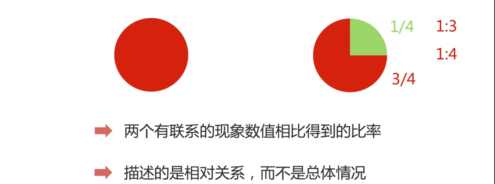

那总体指标是体现总体情况的，这样一个指标，我以一个完整的圆来表示。那相对指标就是体现相对情况的指标。

相对指标是通过两个有联系的现象数值，相比较得到的比率。

它描述的是相对关系，而不是总体的情况。

我以上图右边的圆为例，绿色部分占总体部分的 1/4。红色面积占总体的 3/4，那绿色与红色部分，相对应得到的比例是 1:3，这个是它们相对关系的值。而绿色相对于整个圆的面积，得到的比例是 1:4，那这就是部分与整体的相对关系。

#### 2.3.5 比例、比率、倍数

那我们以销售额的数据为例：

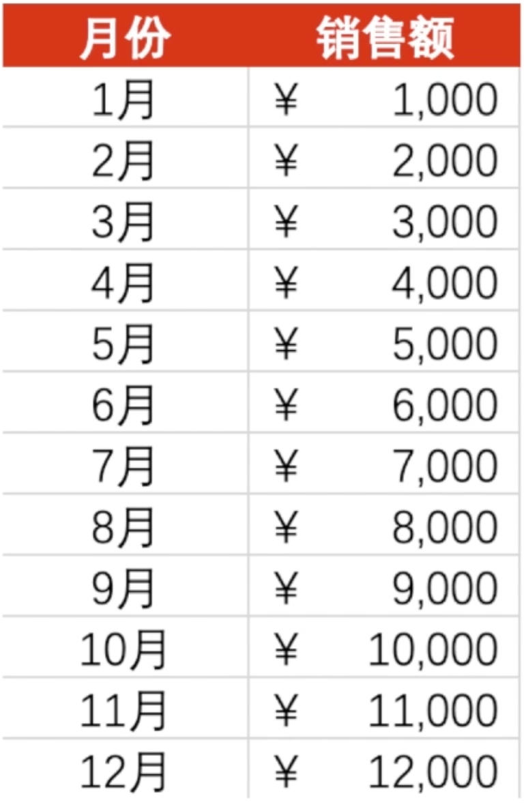

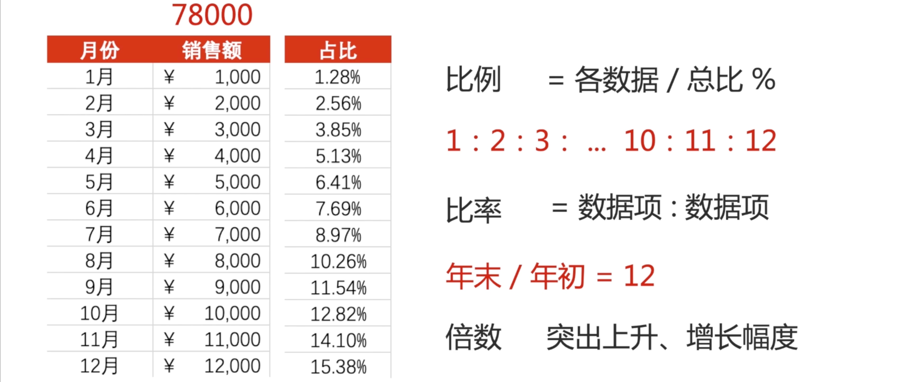

上面的数据是 1 到 12 月，一整年销售额数据，通过计算总和「也就是：总量指标」我们一年销售额数据是 78000，那用每个月销售额数据去除以我们的总量指标，我们就可以得到每个月相对于总体的占比数。——那这个占比数据，就是我们俗称的比例。`比例 = 各数据 / 总比 %` 它指的的是总体中，各数据占总体的比重，反应的是总体的构成和比例，体现的是部分与整体的关系。

那么如果我们想要观察每个月相对的关系，我们可以把每个月的数据拿出来，除以它们的公约数 1000。——像这样体现部分与部分之间关系的，我们叫做比率。

我们还可以通过年末数据和年初数据，进行相除。`年末除以年初得到倍数`。看倍数是突出上升、增长的幅度。

可以发现，比例、比率、倍数更多体现的是数值与数值之间的大小关系、相对关系。

在分析销售额数据的时候，我们更多关注的是增长率。

#### 2.3.6 环比、同比

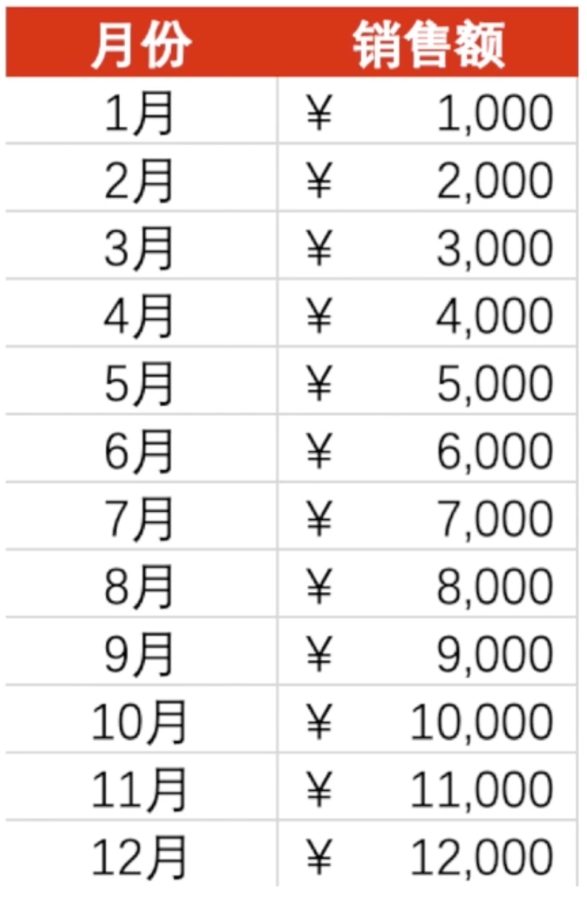

就是我们想知道，每个月的业务是增长的趋势还是下跌的趋势。

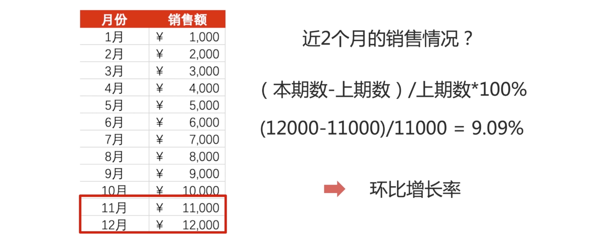

 比如：我想知道近两个月的销售情况是怎么样的？

是增长的，还是下跌的。

那以 12月和 11月的数据为例，可以通过公式计算 **环比** 、增长率。`(本期数 - 上期数) / 上期数 * 100%` 。我们12月的数据 12000，11月 的数据 11000。带入公式：`(12000 - 11000) / 11000 * 100% = 9.09%` 这个 9.09% 就是环比增长率。

代表的是我们当前 12月的周期和上一个周期的增长速率是什么样的「也就是短期的增长速率是怎么样的」

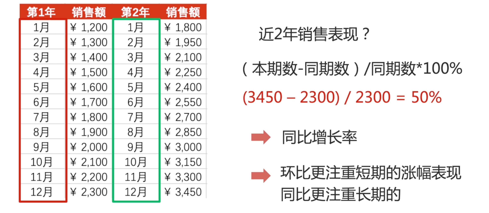

那如果我们要了解长期的增长速率，比如说第一年的销售数据和第二年的销售数据进行比较，我们可以使用第二年年末的数据除以第一年年末的数据。来以此去判断业务整体的增长趋势，那计算方式也是和环比一样的 `(本期数 - 同期数) / 同期数 * 100%`。也就是本期数 12月的 3450 减去上一个周期「去年12月，上一年同一个月份的销售额」2300，再除以起初的 2300 这个数据，得到 50%。`(3450 - 2300) / 2300* 100% = 50%` 。这个 50% 就是我们的同比增长率。

**也就是说：环比和同比的区别，环比更注重短期的涨幅表现；同比更注重长期的涨幅表现。**

#### 2.3.7 章节总结

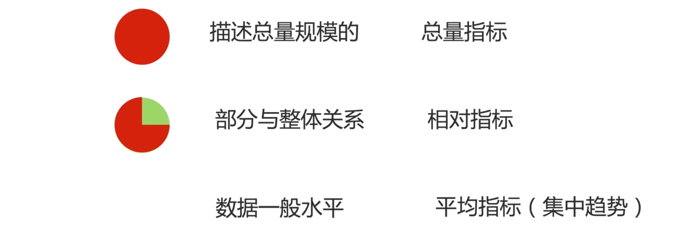

#### 2.3.8 课后作业

请根据本节课所学内容，依据下方的销售额数据表回答一下问题：

1. 今年的销售总额是多少？
2. 每月占总销售的占比是多少？
3. 平均每月的销售额是多少？

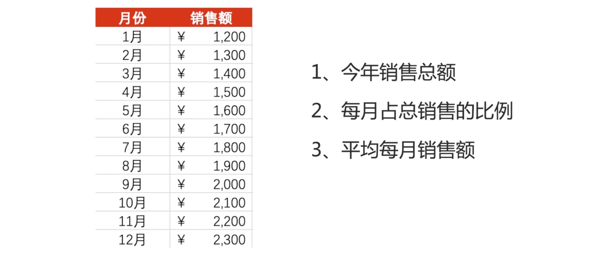

**Tips：本节课的答案在我们的代码仓库里面可以找到哦~**

### 2.4 【学习任务】根据销售额数据回答问题

请根据本节课所学内容，依据下方的销售额数据表回答一下问题：

1. 今年的销售总额是多少？
2. 每月占总销售的占比是多少？
3. 平均每月的销售额是多少？

**Tips：本节课的答案在我们的代码仓库里面可以找到哦~**

### 2.5 统计指标：集中趋势

#### 2.5.1 集中趋势指标的特点

在数据分析的过程中，我们会经常遇到下面的问题：

- 哪个营销渠道引流效果最佳？
    - 便于我们决定将资源、钱、精力，投入到哪个营销渠道。
- 什么岗位的薪酬水平最高？
    - 又或者哪个岗位的薪酬水平最高，以数据分析为例：有运营的、有产品的、有市场营销的等，我们通过比较这些岗位的薪酬水平，来决定我更想去哪个岗位，或者哪个岗位的发展前景更好。
- 哪个产品最受欢迎？
    - 又或者我们相知道哪个产品更受欢迎，帮组我们去了解现在的市场，以及消费者的偏好。
- .....

那这个时候，一个简单的方法就是：**就是通过计算平均值，来了解不同选择的平均水平是怎么样的，以便我们得到初步结论。**

**那这个平均值，就是集中趋势指标的一种。**

#### 2.5.2 什么是集中趋势指标？

集中趋势指标体现的就是同来体现数据一般水平的指标，帮助我们快速了解数据概况。最常用的，就是上面提到的集中趋势指标，也就是就是 **平均值**。

#### 2.5.3 平均值

平均值的计算方式很简单：`平均值=所有数据相加/数据个数`

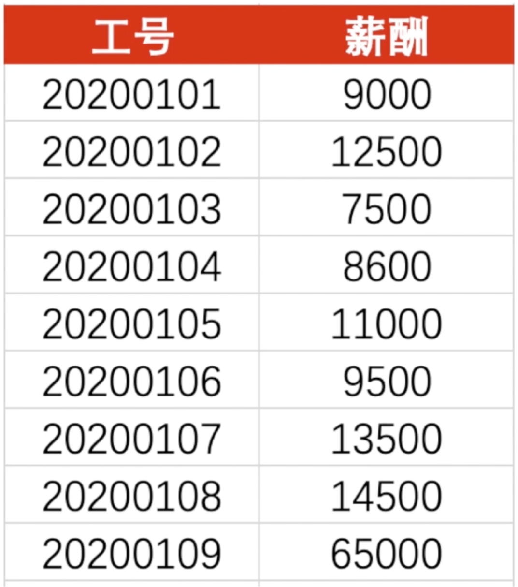

- 加和：151100
- 平均值：16789

那通过观察，你会发现：16789 的平均值，其实符合我们整体薪酬水平的概念吗？我上标中大概有八个都没有达到平均值，这个时候你可以思考一下：是什么原因？

你会发现表中有一个很凸匹的值：65000，也就是一个比其他薪酬高出两到三倍的数值，这也就是我们所说的异常值。大大的拉高了我们平均值的水平。

那关于异常值的识别和处理，在这个章节我会用两课时带你了解一下，这也是我们做数据分析前期或者数据分析过程中必做的一步。

如果你不用一些科学的方法，去处理异常值的话，它「异常值」会导致你平均值等，集中趋势指标出现异常「谬误」。

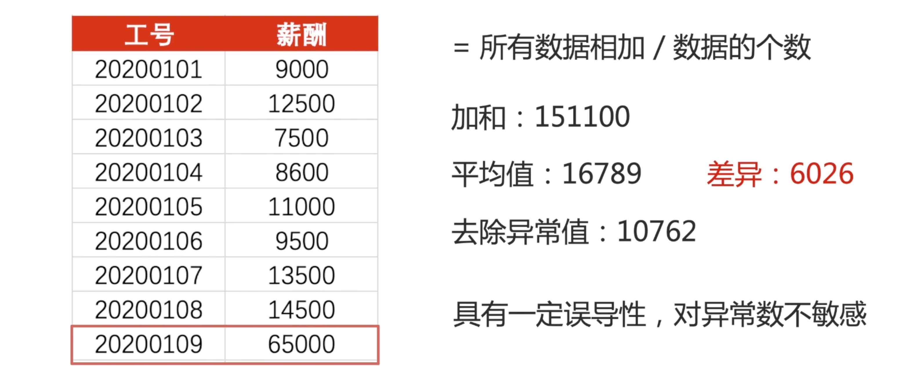

这个时候，我们把异常值去除，去除之后。我们再一次计算八个数据的加和、除以个数就可以得到平均值：`去除异常值后的平均值：10762`。

我们可以发现，有异常值和无异常值的平均值，中间差异值会达到：6026。这是一个非常大的差异值。

**也就是说：单纯的去计算平均值，是具有一定误导性的，因为平均值对于异常值「异常数据」不敏感。**

那这个时候，我们可以引入 **中位数** 的概念。

#### 2.5.4 中位数

中位数指的是，一组数据按顺序排列后，居于中间位置的数。

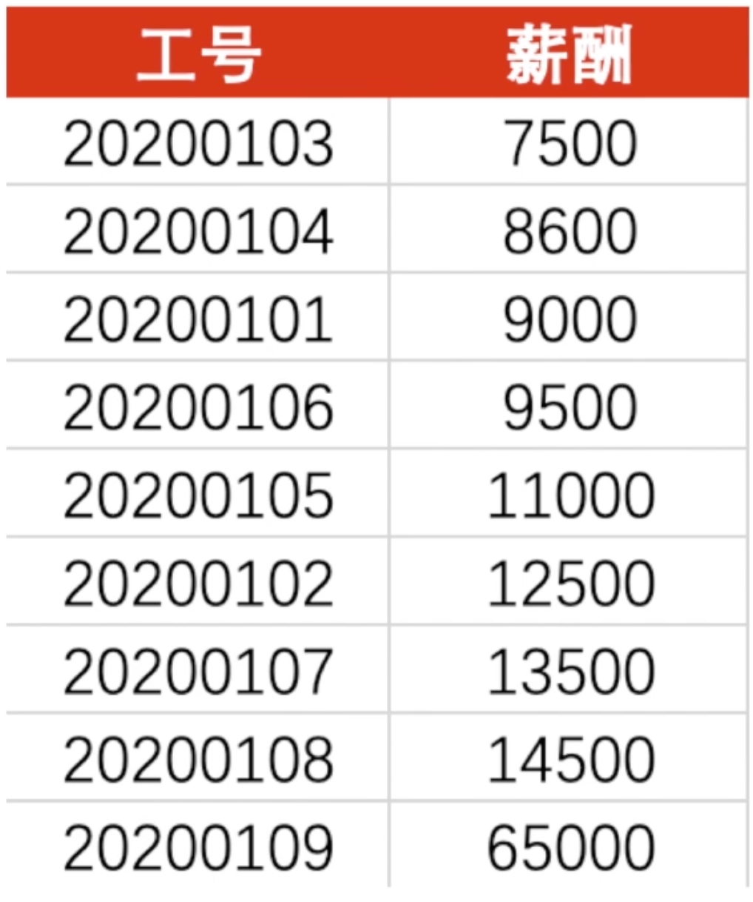

我们讲刚刚上面九个人的薪酬，从小到大排列一下。

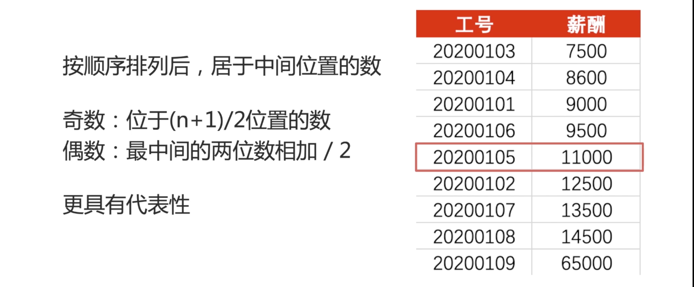

最小的 7500，最大的 65000。位于中间的数值 11000。「也就是 (9 + 1)/2 的位置」

如果整体数据数量是偶数，那就是最中间的两位数相加/2。

这里的中位数是 11000，这个值相对于平均值 10762。显然中位数更能代表这组数据的中间水平。「**中位数更具有代表性**」

#### 2.5.5 众数

众数指的是出现次数最多的数值。

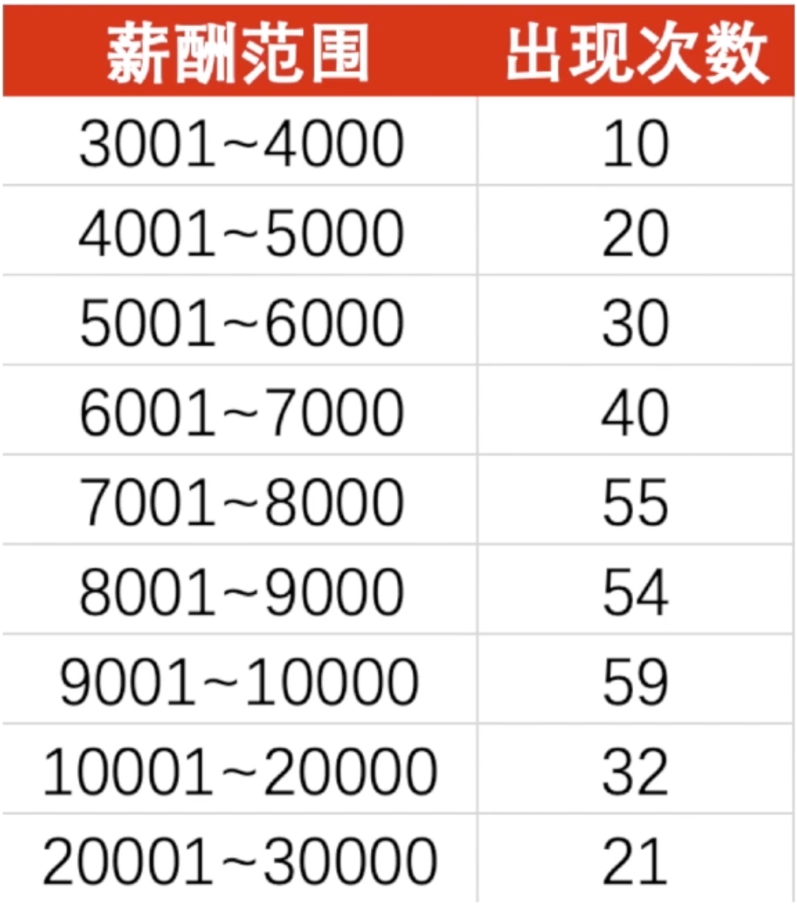

我现在统计三百多人的薪酬，并且将这九个薪酬分为九个不同范围，对应薪酬范围人员出现次数，我也统计在上标中了。

我们可以发现出现次数最大的值是 59，也就是它对应的 9001 到 10000 是我们这里所提到的众数。

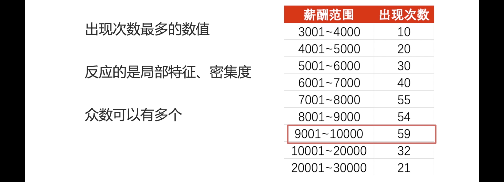

众数反应的是局部的特征，也就是最密集、最频繁出现的数据项，就是我们所说的众数。对于众数来说，是可以有多个的。

假设我们 7001～8000、8001～9000 它们对应出现的次数都是 59，那么它们都是众数。

那对于，集中趋势指标。不同的，统计方式、统计标准。——都是从不同的维度，反应了我们的样本特性。那将刚刚的薪酬区间与对应的次数「人数」，画成折线图，我们得到下面的图表格。

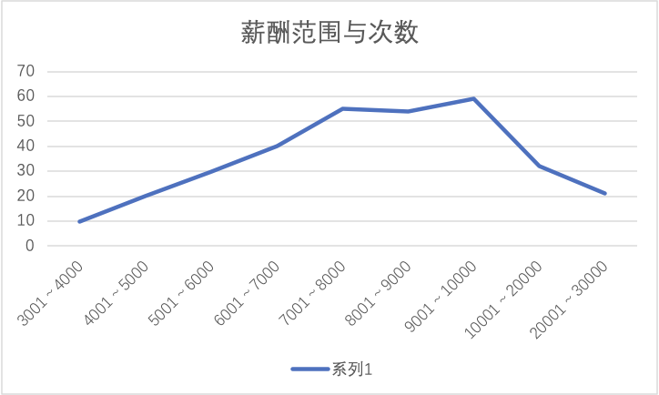

x 轴是我们的薪酬范围。纵轴「y」是我们的人数。通过连点成线的方式，我们得到了中间高两边低的折线图。

那以这张图为例，我们来回顾一下今天学习的内容：

- 平均值：平均值是所有数据加和得到的值，除以它的个数。在上图也就是我们所有 300 多人的薪酬相加在一起，除以三百多人的个数。得到的平均值是 9500。

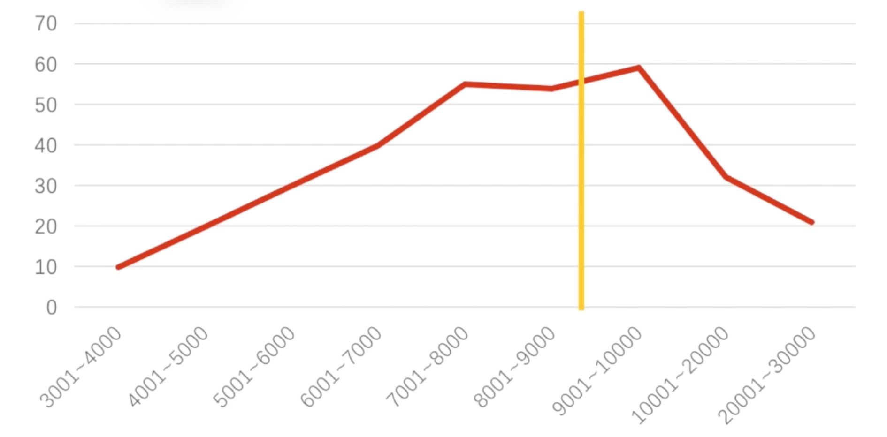

也就是我们每个人能拿到的钱是 9500「平均值」。

- 中位数：指的是数据项从小到达排列之后，处于中间的值。也就是 7001～8000。如果，你在这三百多人中，拿到了八千以上的薪酬，那说明你的薪酬是处在中上位置的。

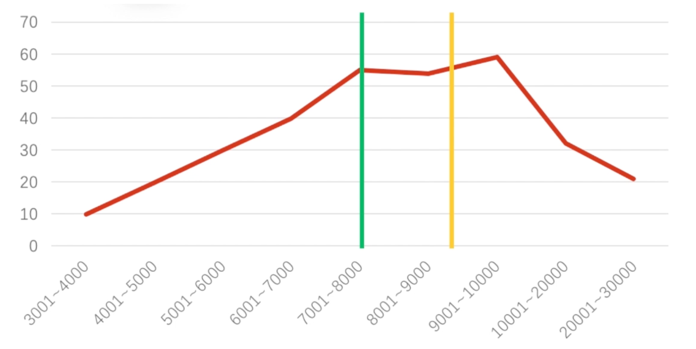

- 众数：指的是出现次数最多的数值，也就是这里最高的点所对应的 9001～10000。也就是说：在这三百多人中，拿 9001～10000 是最普遍的现象。

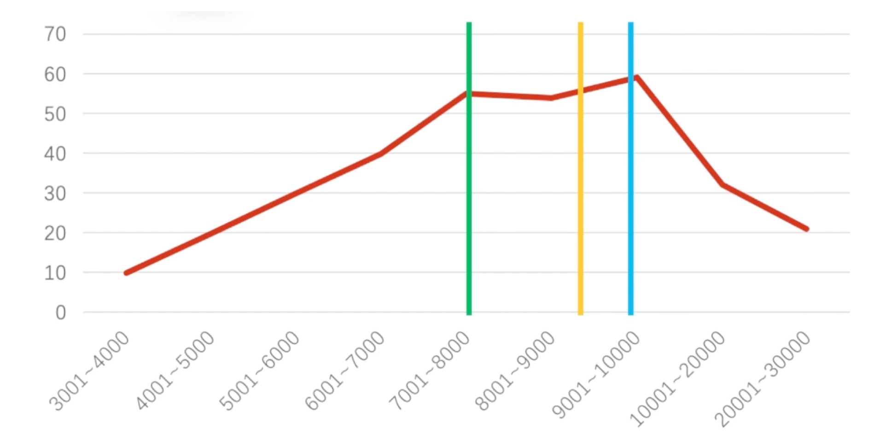

#### 2.5.6 课后作业

基于本节课所学习的内容，给大家两组薪酬数据，计算这两组薪酬数据的 **平均值、中位数、众数** ，并根据平均值、中位数和众数来判断哪一组的薪酬水平更高，原因是什么？

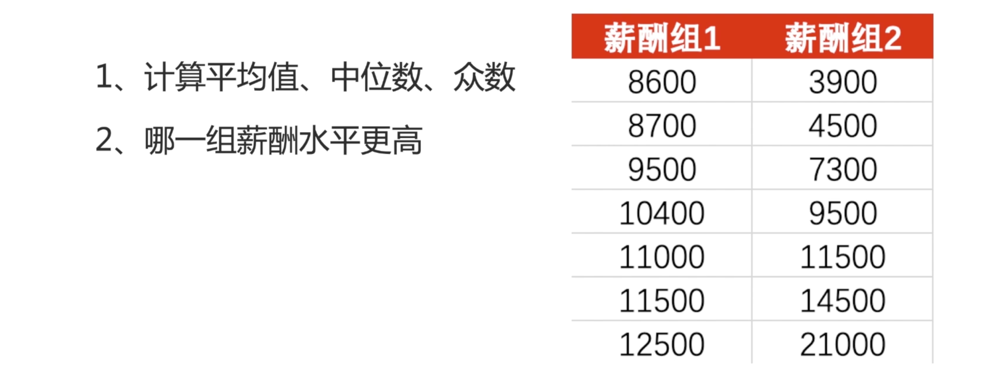

你也可以把自己判断的理由和根据发表出，大家一起讨论～～

> **Tips**：这两组薪酬数据的平均值是相等的哦，本节课作业的答案也会放到代码仓库去。

### 2.6 【讨论题】计算两组薪酬数据的平均值、中位数、众数

基于本节课所学习的内容，给大家两组薪酬数据，计算这两组薪酬数据的**平均值、中位数、众数**，并根据平均值、中位数和众数来判断哪一组的薪酬水平更高，原因是什么？

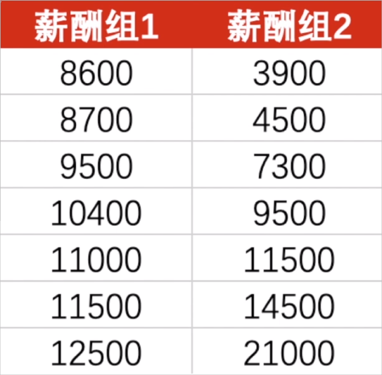

你也可以把自己判断的理由和根据发表出，大家一起讨论～～

> **Tips**：这两组薪酬数据的平均值是相等的哦，本节课作业的答案也会放到代码仓库去。

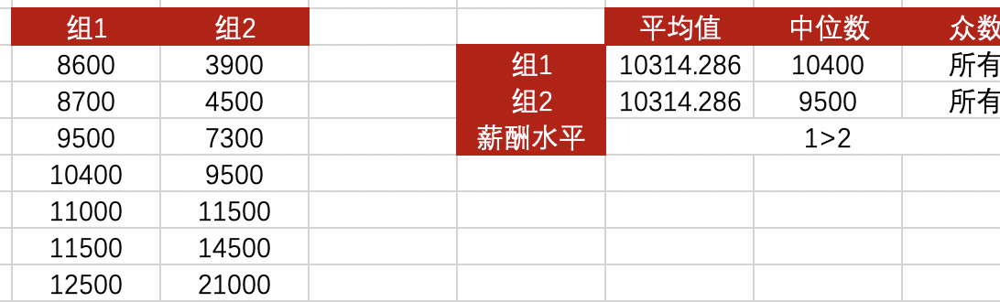

### 2.7 统计指标：离散趋势 

前面我们学习了，集中趋势指标，并通过计算平均值、中位数、众数，了解了数据样本的一般水平。这节课，我们学习离散趋势指标，来了解一个数据的内部差异有多大。

#### 2.7.1 什么是离散趋势指标

我以两支股票价格波动数据为例：

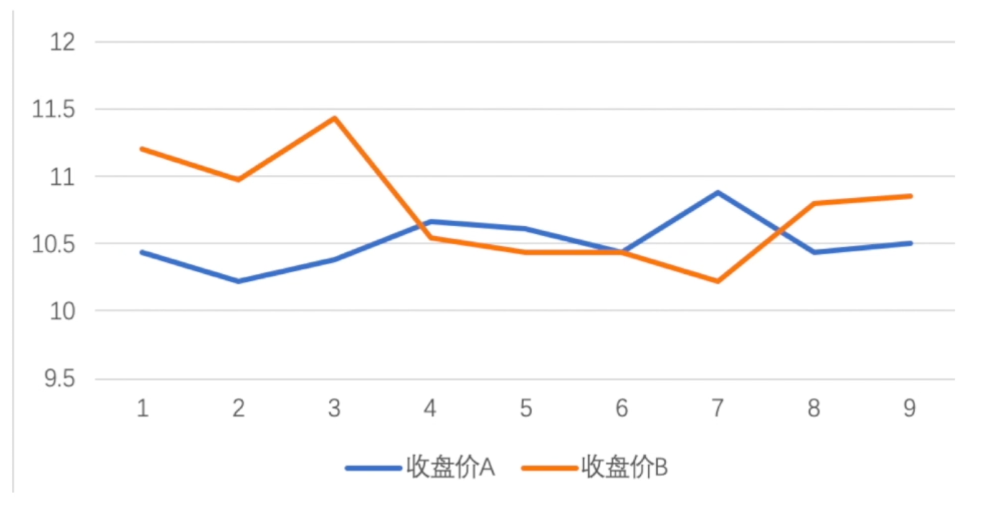

可以看到，股票 A，也就是蓝色这条线，它的波动比较平缓。股票 B 也就是橘色的那条，波动比较大。

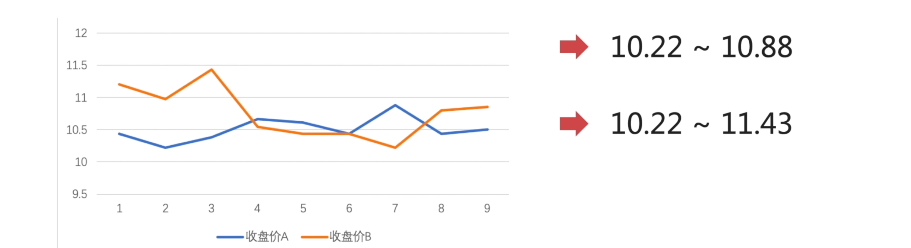

那用数值化来表示，股票 A 的波动幅度是在：10.22～10.88 之间；

股票 B 的波动幅度是在 10.22～11.43 之间。

通过图示，我们可以得出一个很简单的结论：股票 A 相对于股票 B——波动的幅度是更小的。「股票 B 比股票 A 更离散」

**离散趋势指标，作为体现样本数据内部差异度的指标。** 主要有三类指标可以表示：

- 极差
- 平均差
- 标准差

接下来，我们来看看这几个指标的具体概念和区别。

#### 2.7.2 极差

我们将收盘价的数据，以折线图的形式进行表示：

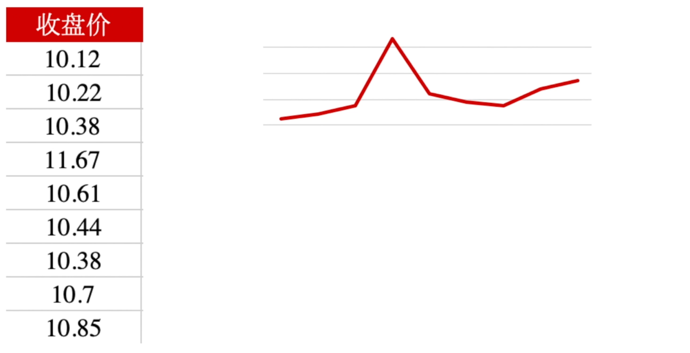

**极差就是求：两个相差最远点的之间的距离。**

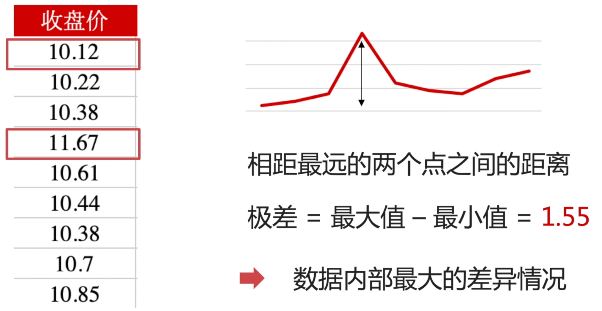

那在上面的收盘价中，最小的值是 10.12，最大的值是 11.67。那通过计算：**极差=最大值-最小值=1.55** ，它体现的就是数据内部最大的差异情况。

**那么极差大样本的数据，内部一定离散程度高吗？**

我们来观察两组数据：

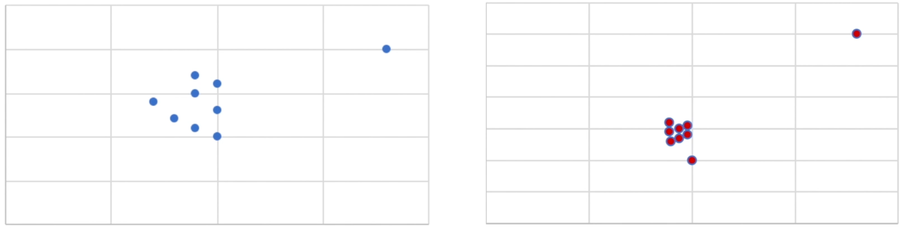

可以试想一下，上图左边是公司项目组 A 的业绩情况，右边是公司项目组 B 的业绩情况。

在项目组 A 中，表现最好与表现最差的，它们相差额度是 100万。

在项目组 B 中，表现最好与表现最差的，它们相差额度是 200万。

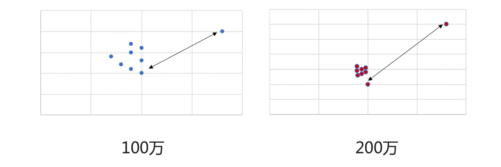

那么，通过观察我们的图表，项目组 A 相差 100 万，它们内部的离散程度，一定比项目组 B 相差 200 万极差的数据，离散程度要更小吗？——其实不一定的，也就是说： **极差不能体现，数据内部真正的离散程度** 。那么想要知道一组数据内部真正的差异情况，我们可以使用平均差。

#### 2.7.3 平均差

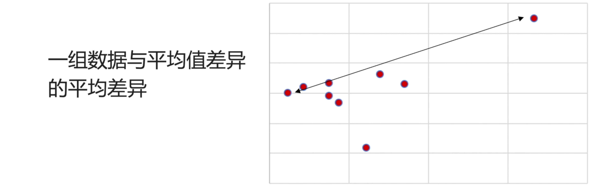

平均差，就是指：每一个点，每一个数据，它相对于我们的平均值，与平均值之间的平均距离——也就是点与点之间的平均差异程度，就是我们的平均差。

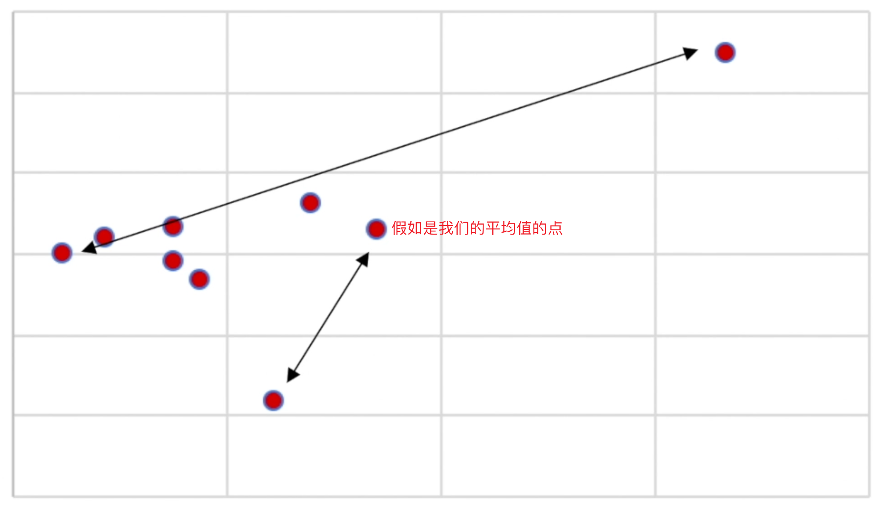

公式：

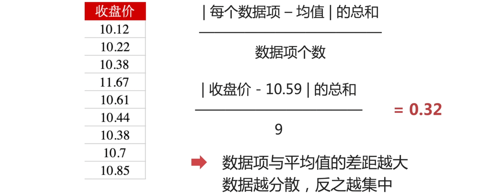

上面的 0.32 指的就是我内部的价格差异。

观察公式我们可以发现，我们 **数据项个数** 其实是不会变的，而分母的 **|收盘价-均值|** 差异越大，不就证明我这个公式的分母就越大。我这个平均差的指标就会越大，那数据内部的离散程度就越大。

这个时候，我们稍微的计算收盘价，头两天的交易差价，大概在 0.1 左右。头三天是在 0.26 = 10.38 - 10.12。

这几个值，你算起来都比 0.32 小的。那这个时候，你就要思考一下，是不是存在 **异常值** 导致这个平均差，比我们实际的真实情况要更大。

那为了，更好的观察到，我们每天收盘价的变化，我把涨跌幅也放进去。

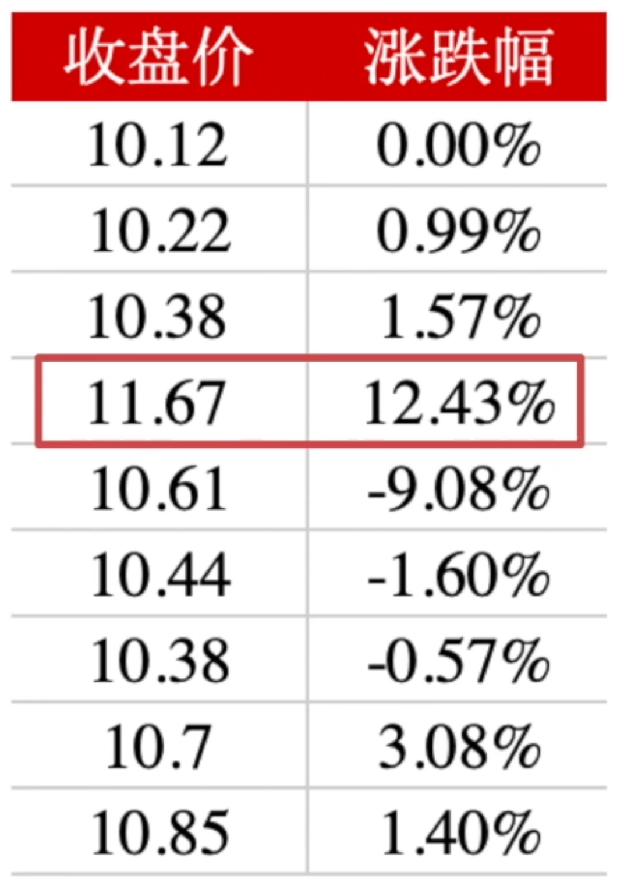

大家可以观察一下，它明显是一个异常值的数据。

那这个异常值，产生的原因有很多。

- 在股票市场中：可能是股东回购，导致这个市值上涨；或者是行业或者政策的利好；又或者是因为，供需失衡，导致市场对于这一家公司业务需求度上涨，然后导致股票的估值也上涨。当然还有其他原因。。。都会导致数据的异常。
- 但问题是：这种问题虽然是由事件驱动型，导致的异常数据，在样本量较小的时候，容易导致误差。但是！这个异常数据又是真实存在的数据，我们不能通过简单的刨除、或者使用其他数值来代替这个数据。
- 那这个时候，为了更好的去突出，对于离散程度，对于这种异常数据的敏感度，我们基于平均差，发展出了 **标准差**。

#### 2.7.4 标准差

标准差的公式和平均差很相似：

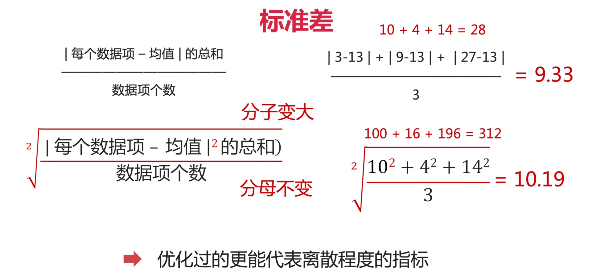

相对于平均差，标准差更能够体现离散程度指标。说白了，更加放大了，它们之间的差异程度。

我们还是用刚刚的收盘股票数据，来验证一下。收盘价 A 是原有的收盘价数据，收盘价 B 是把异常值换成了和上一个交易日相同的数据。（也就是抹去了异常值的存在）

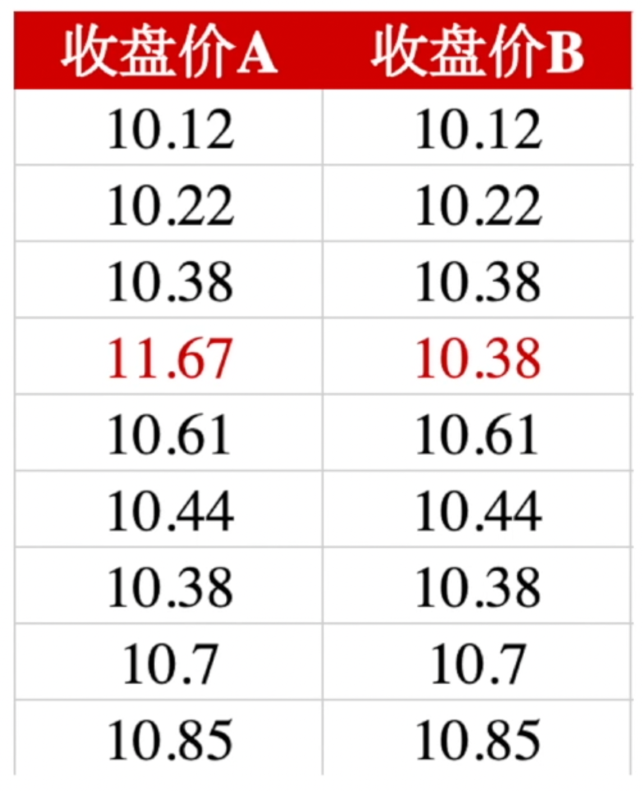

那这个时候，我们计算这两组数据的平均差和标准差。

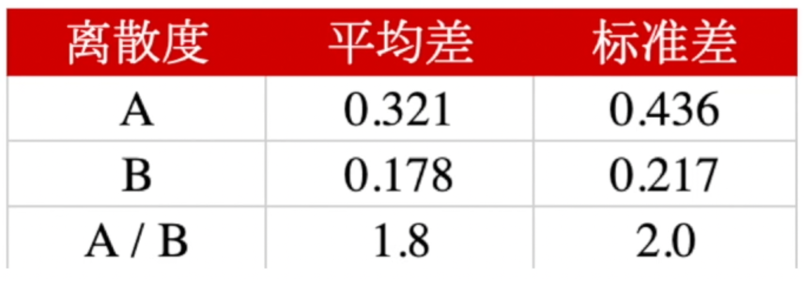

A/B 的平均差，差了 1.8 倍。标准差差了 2.0 倍。也就是说用标准差更能「更直观」体现数据内部的差异程度。「离散程度」

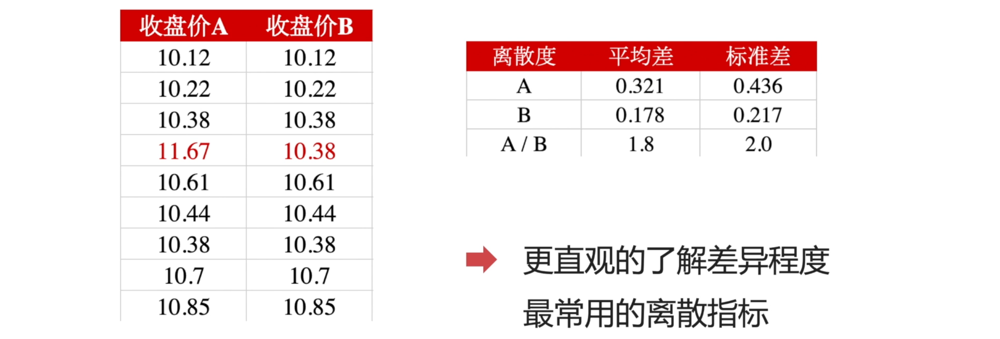

实际上，标准差也是我们最常用的离散指标。在风控相关的：比如股票投资品类的风险的时候，我们都是使用标准差来对价格数据进行计算。

**标准差越大的，风险也就会越大。因为，它的波动幅度越大。**

#### 2.7.5 章节回顾

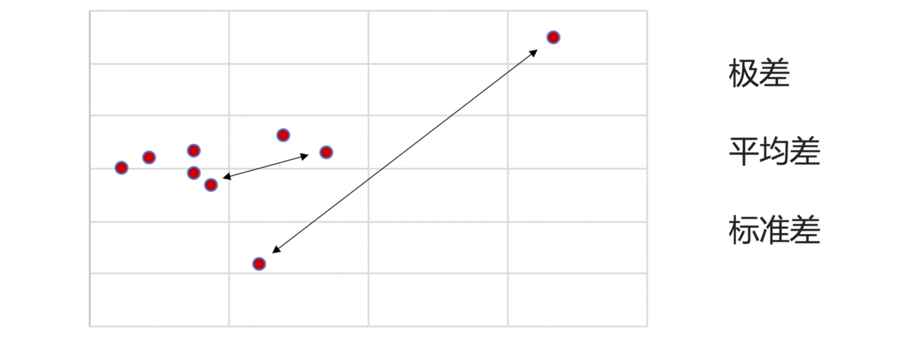

#### 2.7.6 课后作业

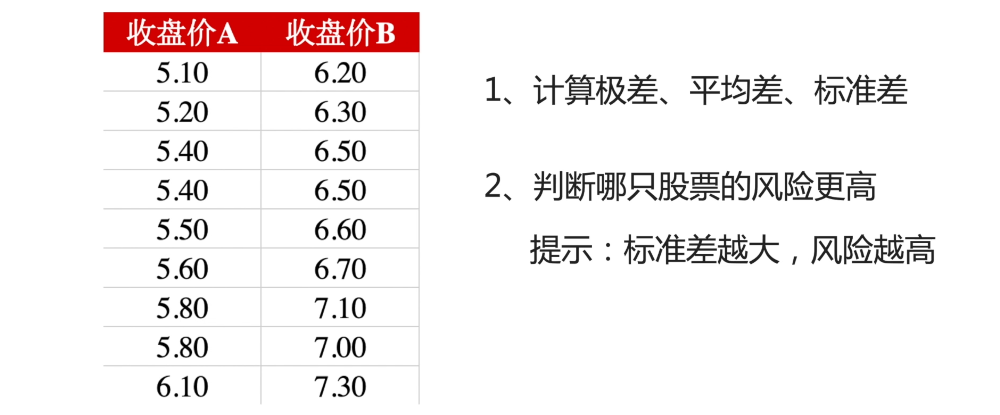

### 2.8 【学习任务】动手算两组股票数据的统计指标

### 任务描述

根据给出的两组股票数据，动手算一下它们的极差、平均差、标准差：

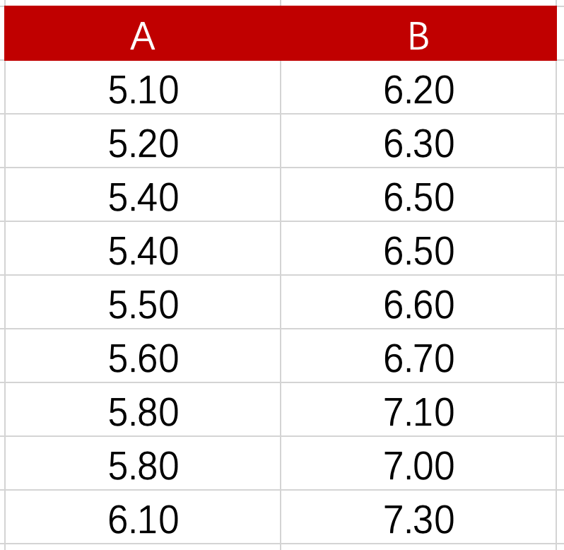

计算完成之后可以判断一下哪一支股票的风险更大呢？

> **Tips**：股票标准差越大，说明价格波动就越大，相对应风险就会更高一些。

- 极差：max-min

::: center

## 期待你和我一起，用数据解析世界

:::

::: details 公众号：AI悦创【二维码】

:::

::: info AI悦创·编程一对一

AI悦创·推出辅导班啦，包括「Python 语言辅导班、C++ 辅导班、java 辅导班、算法/数据结构辅导班、少儿编程、pygame 游戏开发、Web、Linux」，招收学员面向国内外，国外占 80%。全部都是一对一教学：一对一辅导 + 一对一答疑 + 布置作业 + 项目实践等。当然，还有线下线上摄影课程、Photoshop、Premiere 一对一教学、QQ、微信在线，随时响应！微信：Jiabcdefh

C++ 信息奥赛题解，长期更新！长期招收一对一中小学信息奥赛集训，莆田、厦门地区有机会线下上门，其他地区线上。微信：Jiabcdefh

方法一：[QQ](http://wpa.qq.com/msgrd?v=3&uin=1432803776&site=qq&menu=yes)

方法二：微信：Jiabcdefh

:::

