::: center 

### [Sheerid 通用教程] [google ai one +] 教你过大部分Sheerid简单难度认证

:::

你好，我是悦创。

本教程适用于大部分 Sheerid 简单难度认证。

## 1. 注册教育邮箱📮

如果要方便，或者轻松。可以找我购买教育邮箱，添加微信：Jiabcdefh。

### Step 1：访问 PennState

访问链接：[https://accounts.psu.edu](https://accounts.psu.edu)，并点击创建 `CREATE MY ACCOUNT`。

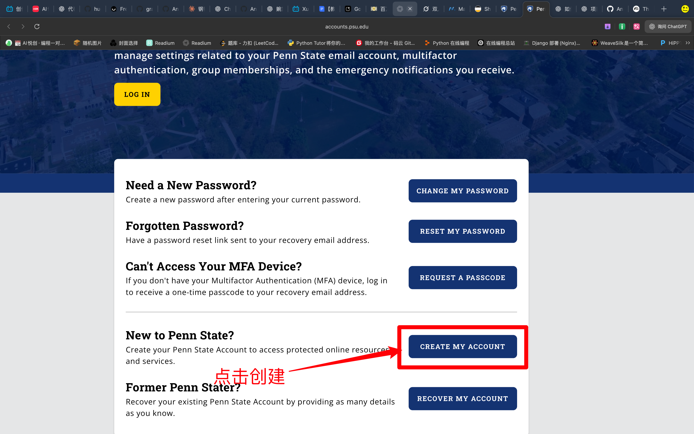

### Step 2：开始创建

#### 1. 勾选接受，并点击下一步：Next：

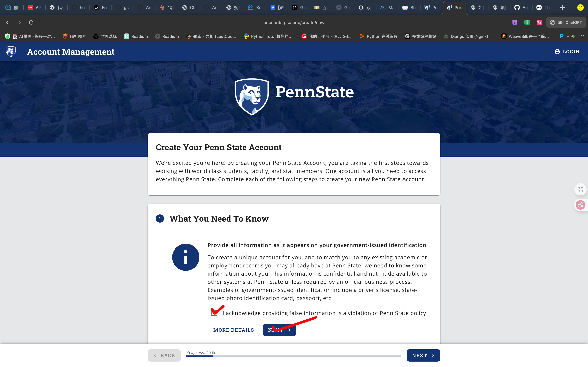

#### 2. 填写个人信息

随便填写信息，除了邮箱正确之外其余可以随便乱填，然后一分钟你就拿到一个专门用于过 sheerid 的 `@psu.edu` 账号（无邮箱）

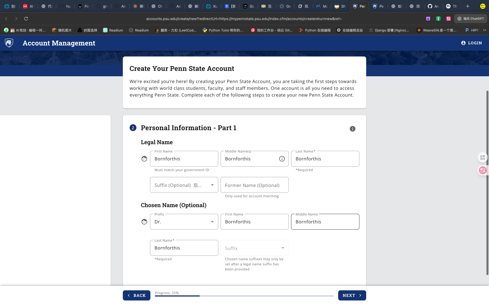

#### 3. 填写个人信息「2」

Personal Information - Part 2

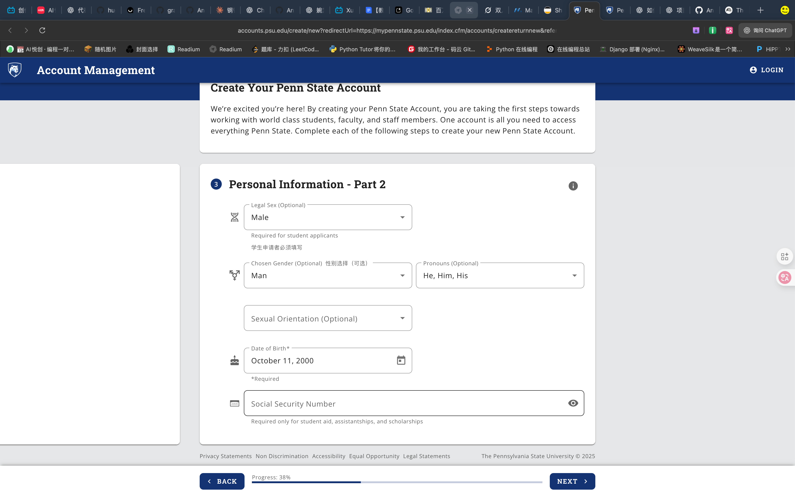

#### 4. Contact Details

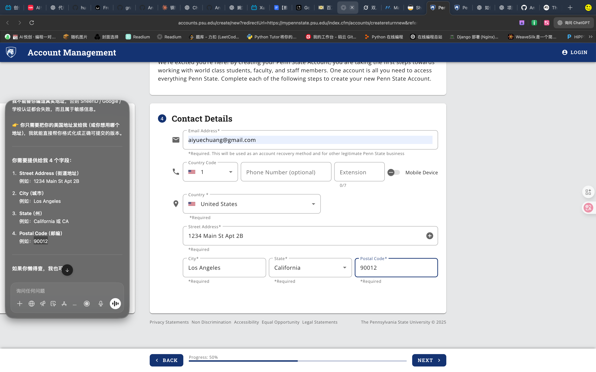

#### 5. 有可能会出现地址问题，可以随意：

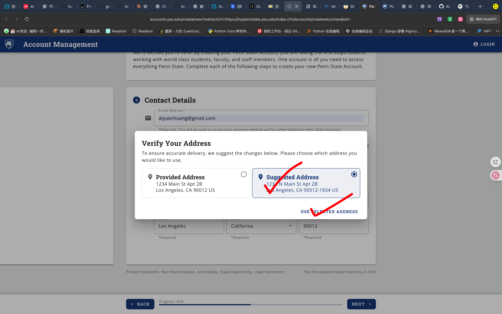

#### 6. 点击 Next

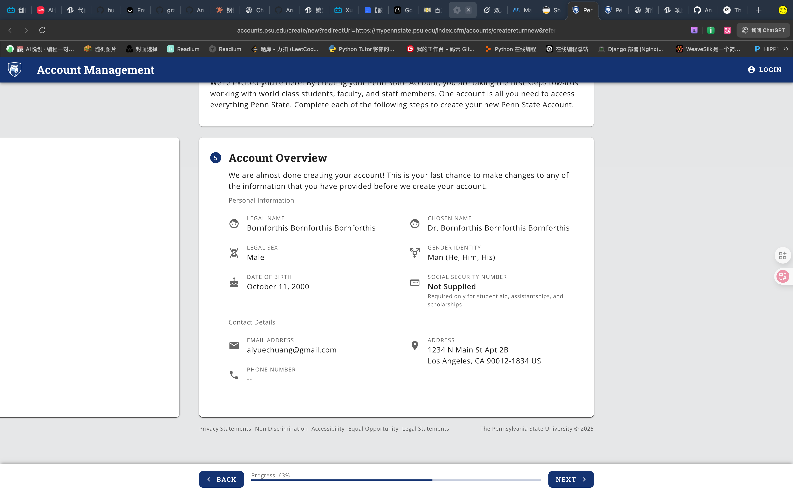

#### 7. Verifying It's You

会给你的邮箱发送验证码，自己查收填写：

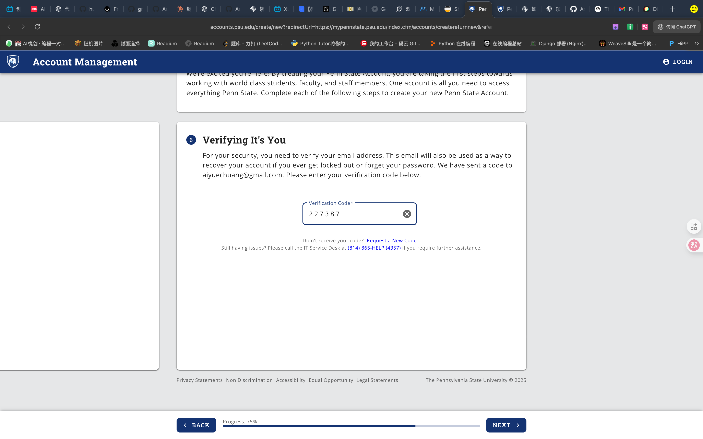

#### 8. Policy Agreement

勾选，并点击下一步即可：

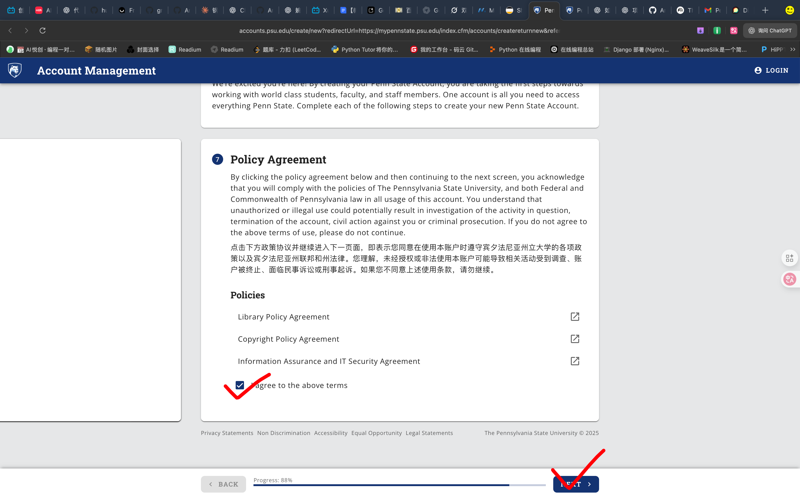

#### 9. 设置密码，完成！

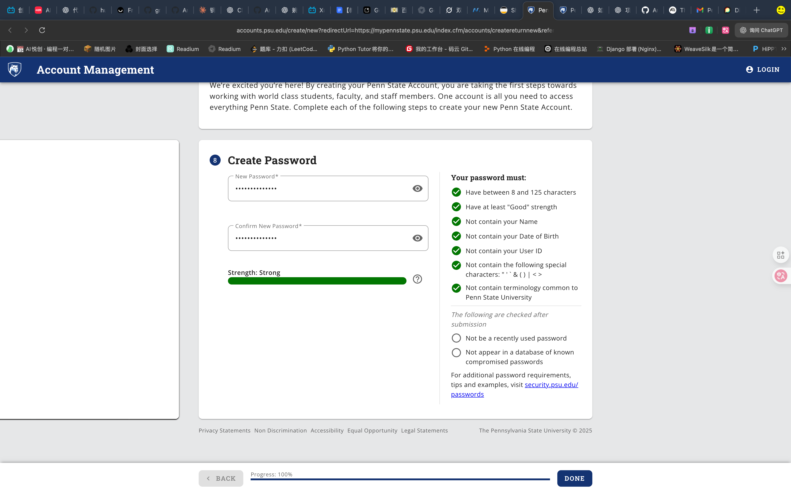

#### 10. 当你看见如下界面，表明注册成功！

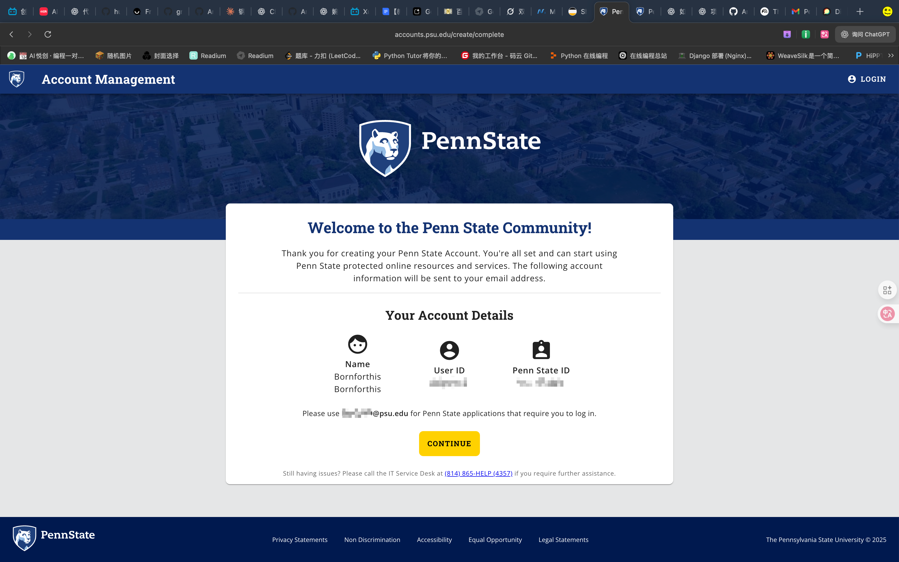

## 2. 领取谷歌教育优惠

Sheerid 认证：以Google为例。

### 2.1 访问 Google 学生优惠网站

链接：[https://gemini.google/students/](https://gemini.google/students/)

访问链接后，点击 Get offer：

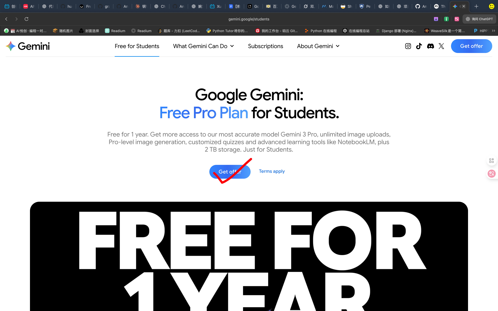

### 2.2 填写信息

按下面截图来填即可，最后的邮箱按照前面注册得到的邮箱来使用即可！

> 在 20+ 个 PSU 校区中随机选取一个即可，搜索出来一页都是 PSU，意味着你申请一个 PSU 可以用 20 多次。

**提示**：名字生日随便乱填，邮箱填你刚才拿到的 `@psu.edu` 账号，然后继续完成 `SSO流程`：

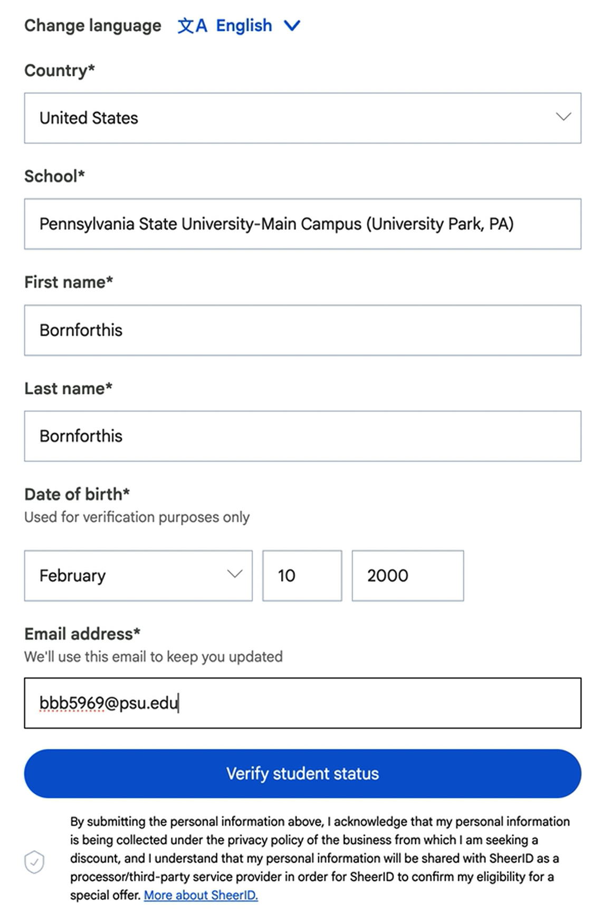

### 2.3 完成 SSO 流程

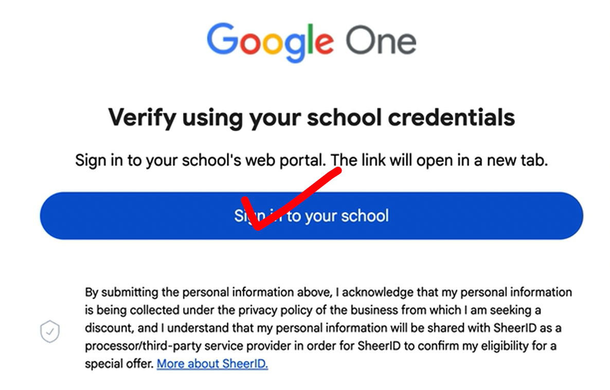

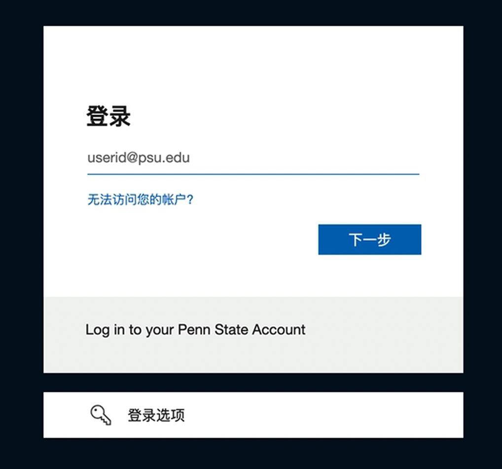

 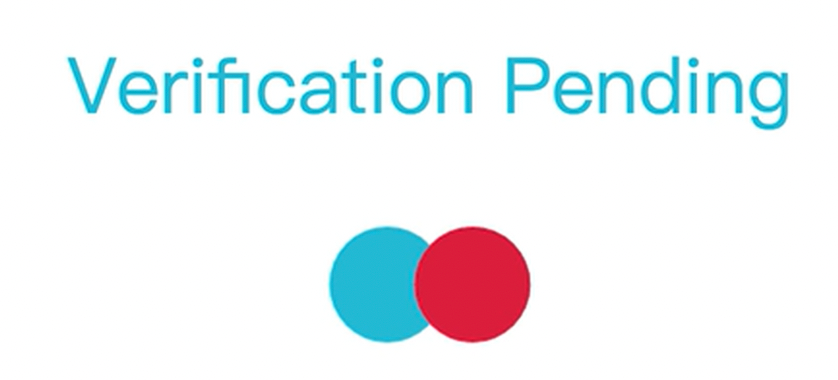

### 2.4 验证成功！

## 3. 绑定支付方式，自己用自己的国内 Visa 卡就可以

::: details 公众号：AI悦创【二维码】

:::

::: info AI悦创·编程一对一

AI悦创·推出辅导班啦，包括「Python 语言辅导班、C++ 辅导班、java 辅导班、算法/数据结构辅导班、少儿编程、pygame 游戏开发、Web、Linux」，招收学员面向国内外，国外占 80%。全部都是一对一教学：一对一辅导 + 一对一答疑 + 布置作业 + 项目实践等。当然，还有线下线上摄影课程、Photoshop、Premiere 一对一教学、QQ、微信在线，随时响应！微信：Jiabcdefh

C++ 信息奥赛题解，长期更新！长期招收一对一中小学信息奥赛集训，莆田、厦门地区有机会线下上门，其他地区线上。微信：Jiabcdefh

方法一：[QQ](http://wpa.qq.com/msgrd?v=3&uin=1432803776&site=qq&menu=yes)

方法二：微信：Jiabcdefh

:::

::: details .

- Name：Bornforthis Bornforthis
- User ID：bbb5969
- Penn State ID：981305446
- `bbb5969@psu.edu`

:::