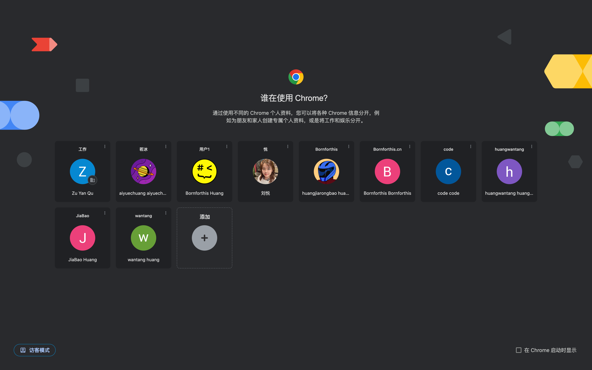
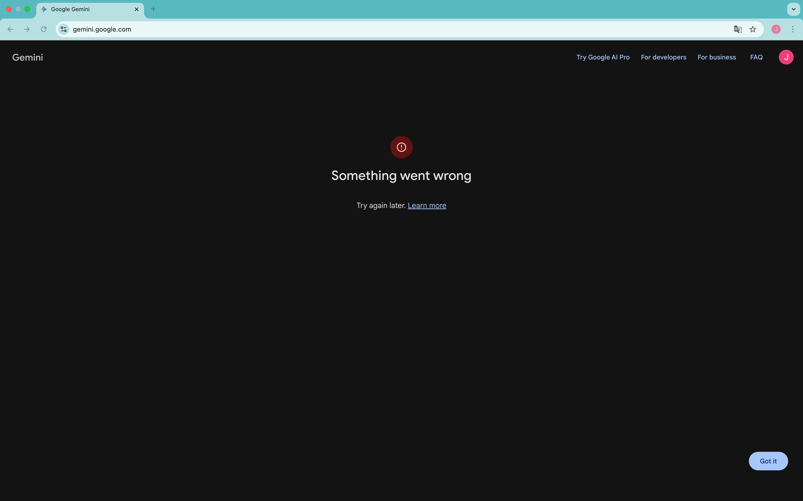
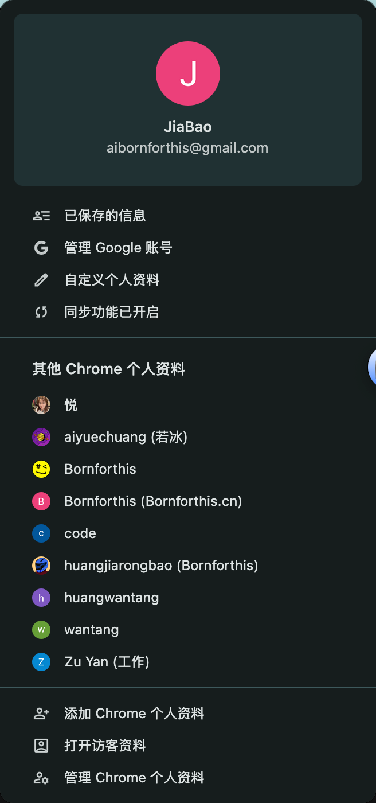
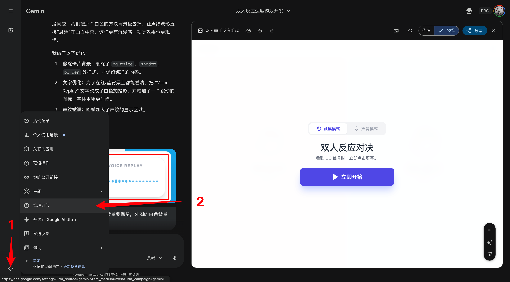
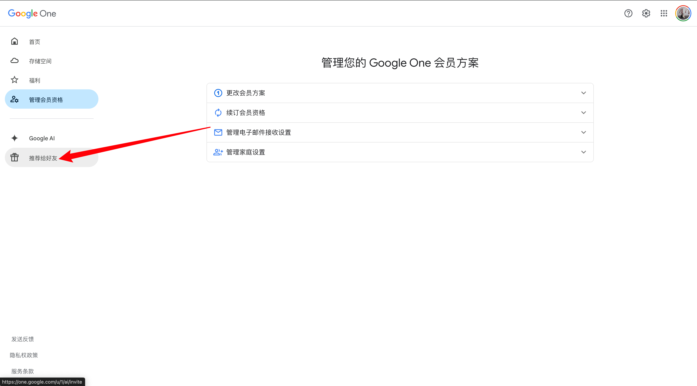
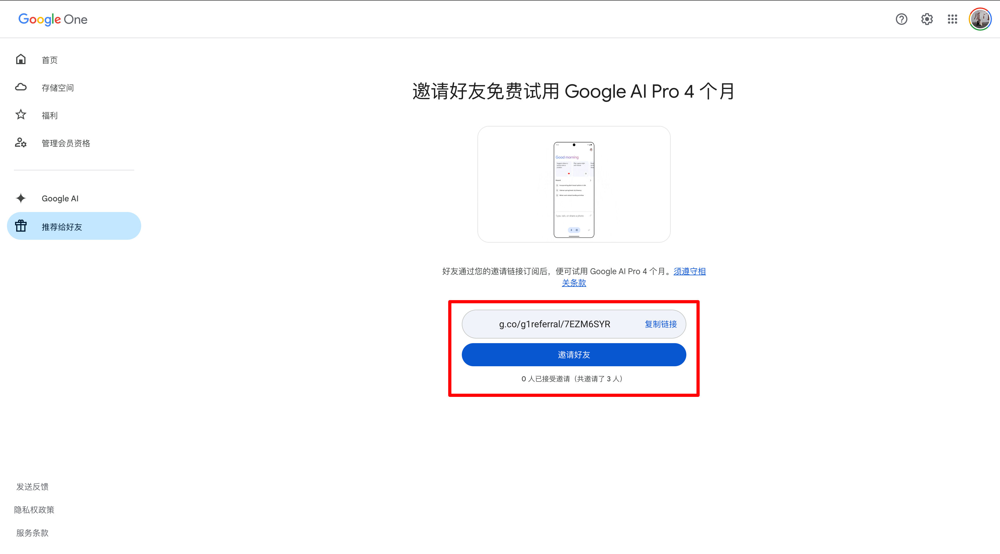

你好，我是悦创。

Gemini 我说权威，没有人比我更权威了。（打趣一下，至少含量在这。）

如果你遇到了如下情况：

我可以告诉你，网络上没有任何有效的方法可以解决。因为我已经替你试过了，我注册了许多谷歌账号进行测试！

## 1. 方法一：手机端试用

没有别的方法，只能选择手机使用：Gemini，用几天后再次尝试给网页版。

当然，有网友说给你谷歌 help 发邮件，过几天就会好。也可以考虑试一试，不知道具体结果怎么样。

## 2. 方法二：邀请新入制

这个方法最快速，最省时间，但是需要花些钱。那就是：开会员，不过 Gemini 支持邀请体验。可以让已经是 Pro 会员的人，复制专属邀请链接给你。（每个人只能邀请 3 人，不知道会不会像 Sora 2 那样，过段时间就恢复邀请额度。）

### 2.1 步骤 1：打开管理订阅

### 2.2 步骤 2：选择推荐给好友

### 2.3 步骤 3：复制链接邀请好友即可（仅限新用户）

如果是老用户（也就是之前注册、尝试使用过 Gemini 的）只能花费 1.99$ 美元来购买，还是很优惠了。

## 3. 方法三：直接开通付费

花钱可以直接解决，但是这个没办法的办法～

::: details 公众号：AI悦创【二维码】

:::

::: info AI悦创·编程一对一

AI悦创·推出辅导班啦，包括「Python 语言辅导班、C++ 辅导班、java 辅导班、算法/数据结构辅导班、少儿编程、pygame 游戏开发、Web、Linux」，招收学员面向国内外，国外占 80%。全部都是一对一教学：一对一辅导 + 一对一答疑 + 布置作业 + 项目实践等。当然，还有线下线上摄影课程、Photoshop、Premiere 一对一教学、QQ、微信在线，随时响应！微信：Jiabcdefh

C++ 信息奥赛题解，长期更新！长期招收一对一中小学信息奥赛集训，莆田、厦门地区有机会线下上门，其他地区线上。微信：Jiabcdefh

方法一：[QQ](http://wpa.qq.com/msgrd?v=3&uin=1432803776&site=qq&menu=yes)

方法二：微信：Jiabcdefh

:::

