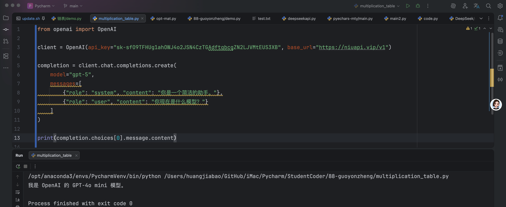
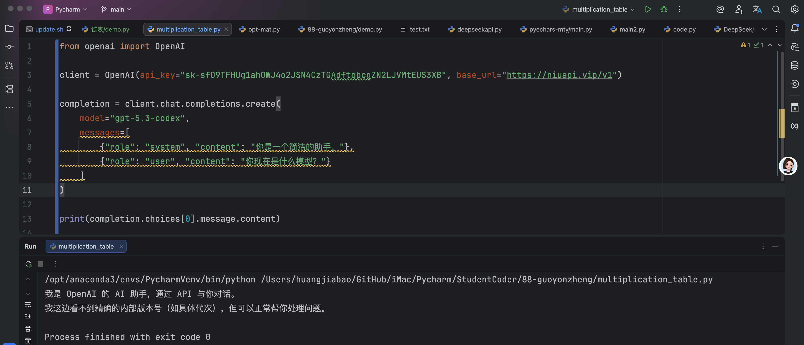
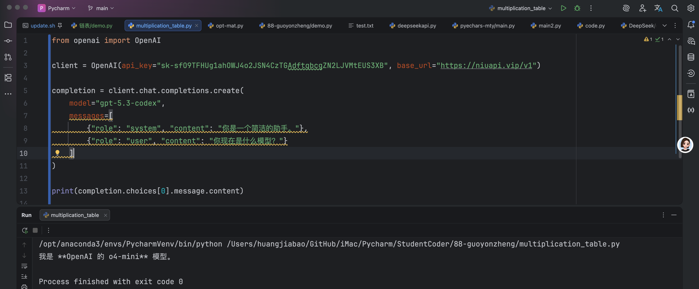
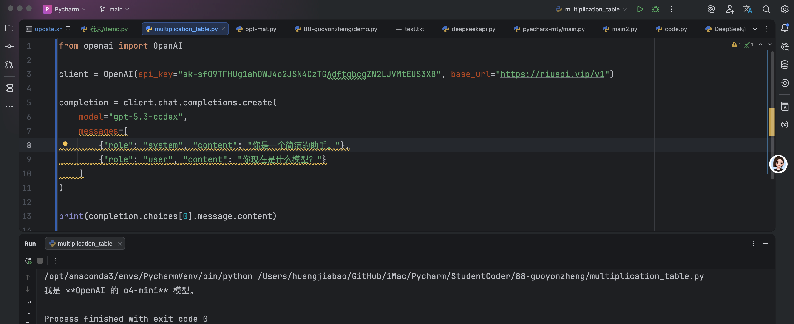

## 1. 基础调用测评

```python
from openai import OpenAI

client = OpenAI(api_key="sk-sfO9TFHUg1ahOWJ4o2JSN4CzTGAdftqbcgZN2LJVMtEUS3XB", base_url="https://niuapi.vip/v1")

completion = client.chat.completions.create(
    model="gpt-4o-mini",
    messages=[
        {"role": "system", "content": "你是一个简洁的助手。"},
        {"role": "user", "content": "帮我写一句产品介绍。"}
    ]
)

print(completion.choices[0].message.content)
```

::: tabs

@tab img1



@tab img2



@tab img3



@tab img4



:::

整体感觉还行，有可能有些模型会与实际“不符”。不过这个有待考究，仁者见仁·智者见智。

不过如果可以真便宜、聪明，那确实可以尝试。

接下来，测试一下对于龙虾是否可用。

## 2. 测试龙虾效果

### 2.1 配置龙虾

官方有自动生成的途径，有想要体验的可以自己去生成试一试。

官方有邀请注册：[https://niuapi.vip/register?aff=UmVz](https://niuapi.vip/register?aff=UmVz) 欢迎点击我的邀请链接注册体验。

### 2.2 测试效果

1. 发送屏幕截屏：
2. 把摄像头发送给我；
3. 整理飞书文档；
4. 操作飞书文档；
5. 学习 Skills；


::: details 公众号：AI悦创【二维码】


:::

::: info AI悦创·编程一对一

AI悦创·推出辅导班啦，包括「Python 语言辅导班、C++ 辅导班、java 辅导班、算法/数据结构辅导班、少儿编程、pygame 游戏开发、Web、Linux」，招收学员面向国内外，国外占 80%。全部都是一对一教学：一对一辅导 + 一对一答疑 + 布置作业 + 项目实践等。当然，还有线下线上摄影课程、Photoshop、Premiere 一对一教学、QQ、微信在线，随时响应！微信：Jiabcdefh

C++ 信息奥赛题解，长期更新！长期招收一对一中小学信息奥赛集训，莆田、厦门地区有机会线下上门，其他地区线上。微信：Jiabcdefh

方法一：[QQ](http://wpa.qq.com/msgrd?v=3&uin=1432803776&site=qq&menu=yes)

方法二：微信：Jiabcdefh

:::

