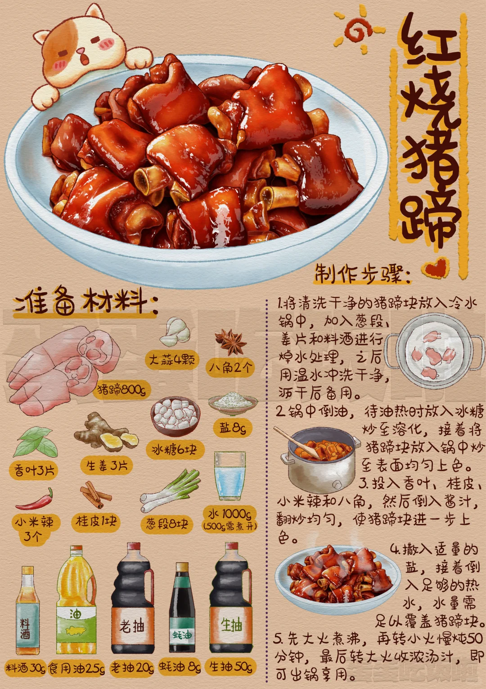
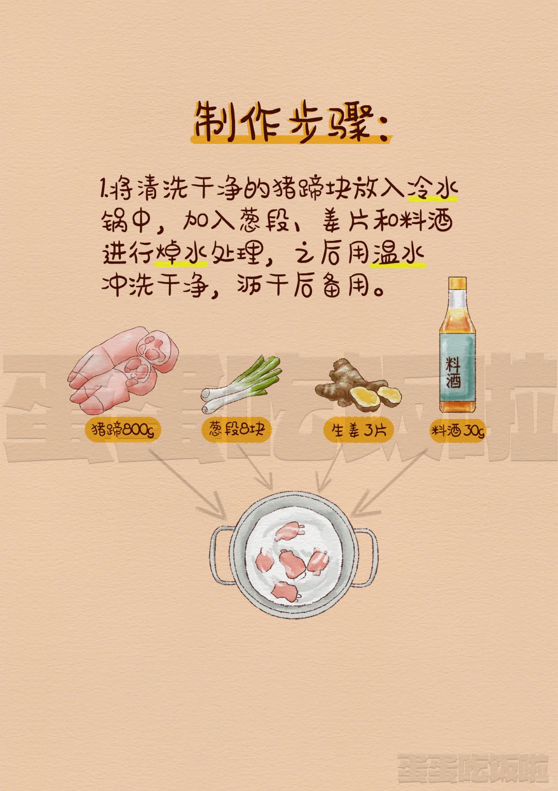
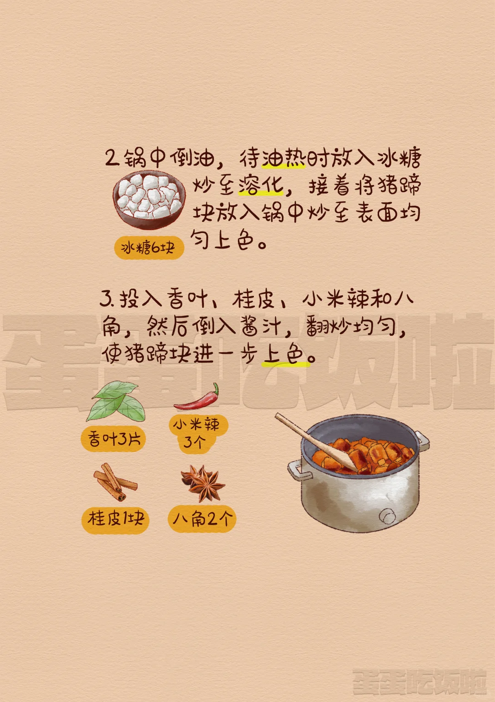
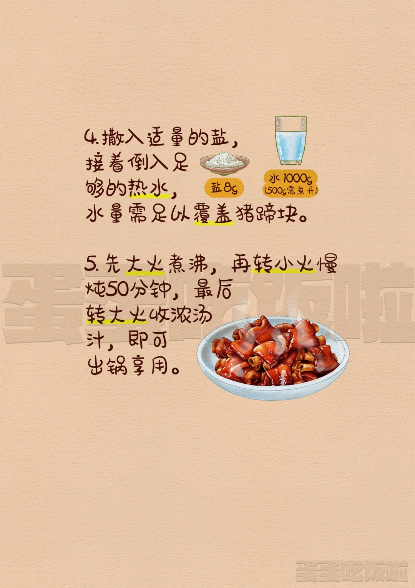

## 1. 食材

| 猪蹄     | 桂皮       | 八角     | 香叶                 | 葱姜蒜   | 老冰糖   | 酱油       |
| -------- | ---------- | -------- | -------------------- | -------- | -------- | ---------- |
| **老抽** | **干辣椒** | **葱结** | **白胡椒粉「可选」** | **大葱** | **生姜** | **花雕酒** |

## 2. 步骤

1. 焯水：肉类都是冷水下锅，加入大葱、姜片、花雕酒，煮开。（浮沫边出边捞）——>放凉，清洗（或者：温水清洗）

2. 锅热，加入适量的油——>加入老冰糖——>出现红色冒泡就可以加入：滤干的猪蹄——>翻炒均匀；（上色）

3. 加入：桂皮、八角、香叶、葱、姜、蒜、干辣椒、小米辣（可选）——>翻炒均匀，炒出香味；

4. 加入：生抽、老抽、花雕酒、蚝油（可选）——>翻炒均匀；

    > （我们在做这种不容易上色的食材时，前五分钟是它们上色的黄金时期）

5. 加入：一点点的老冰糖（可选）、葱结（可选）、一点点：盐；

6. 加入：温水，没过猪蹄——>高压锅；

7. 出锅：大火收汁；

::: details

什么‼️30秒就能让自己吃上一个大猪蹄子😻‼️

【原料】 

- 猪蹄800g（剁成块）🐽🐽🐽🐽🐽 
- 冷水、开水各900g💦💦💦 
- 食用油25g🥜🥜🥜 
- 冰糖6块🍬🍬🍬 
- 葱段8个，姜3片（混合备用）🧅 
- 香叶3片，桂皮1块，干辣椒3个，八角2个（混合备用） 
- 料酒30g🥃🥃🥃 
- 调酱汁：料酒30g，生抽50g，老抽30g，蚝油15g，搅拌均匀🥣🥣🥣 
- 食用盐5g 

【制作步骤】 

1. 洗净的猪蹄块冷水下锅，倒入葱段、姜、料酒焯水后用温水洗净盛出备用。
2. 锅中倒油，热后放冰糖炒化，倒入猪蹄炒至上色。 
3. 加入香叶、桂皮、干辣椒、八角，倒入酱汁翻炒上色。 
4. 加盐，倒入开水，没过猪蹄即可。 
5. 大火煮开转小火焖煮50分钟，大火收汁，出锅。 香气扑鼻的红烧猪蹄就做好啦！ 快快@你的饭搭子一起制作并享受这道红烧猪蹄带来的美味吧！

:::

::: details 公众号：AI悦创【二维码】

:::

::: info AI悦创·编程一对一

AI悦创·推出辅导班啦，包括「Python 语言辅导班、C++ 辅导班、java 辅导班、算法/数据结构辅导班、少儿编程、pygame 游戏开发、Web、Linux」，招收学员面向国内外，国外占 80%。全部都是一对一教学：一对一辅导 + 一对一答疑 + 布置作业 + 项目实践等。当然，还有线下线上摄影课程、Photoshop、Premiere 一对一教学、QQ、微信在线，随时响应！微信：Jiabcdefh

C++ 信息奥赛题解，长期更新！长期招收一对一中小学信息奥赛集训，莆田、厦门地区有机会线下上门，其他地区线上。微信：Jiabcdefh

方法一：[QQ](http://wpa.qq.com/msgrd?v=3&uin=1432803776&site=qq&menu=yes)

方法二：微信：Jiabcdefh

:::

