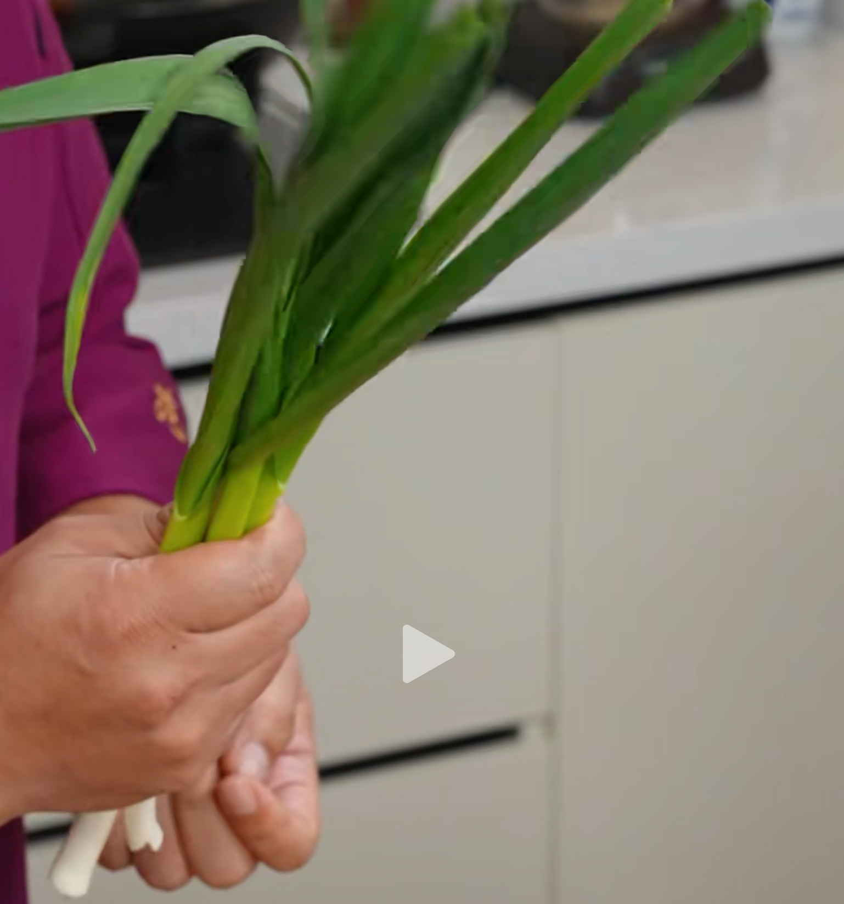
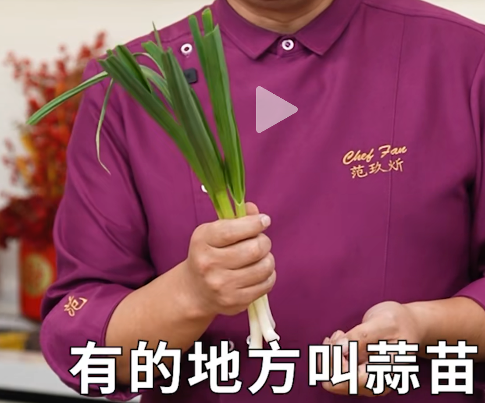
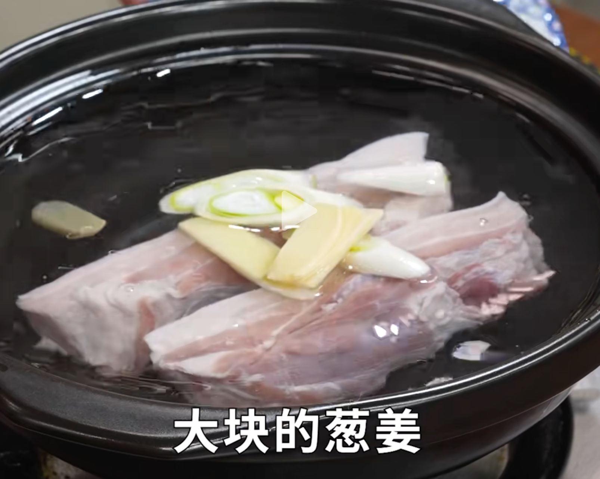
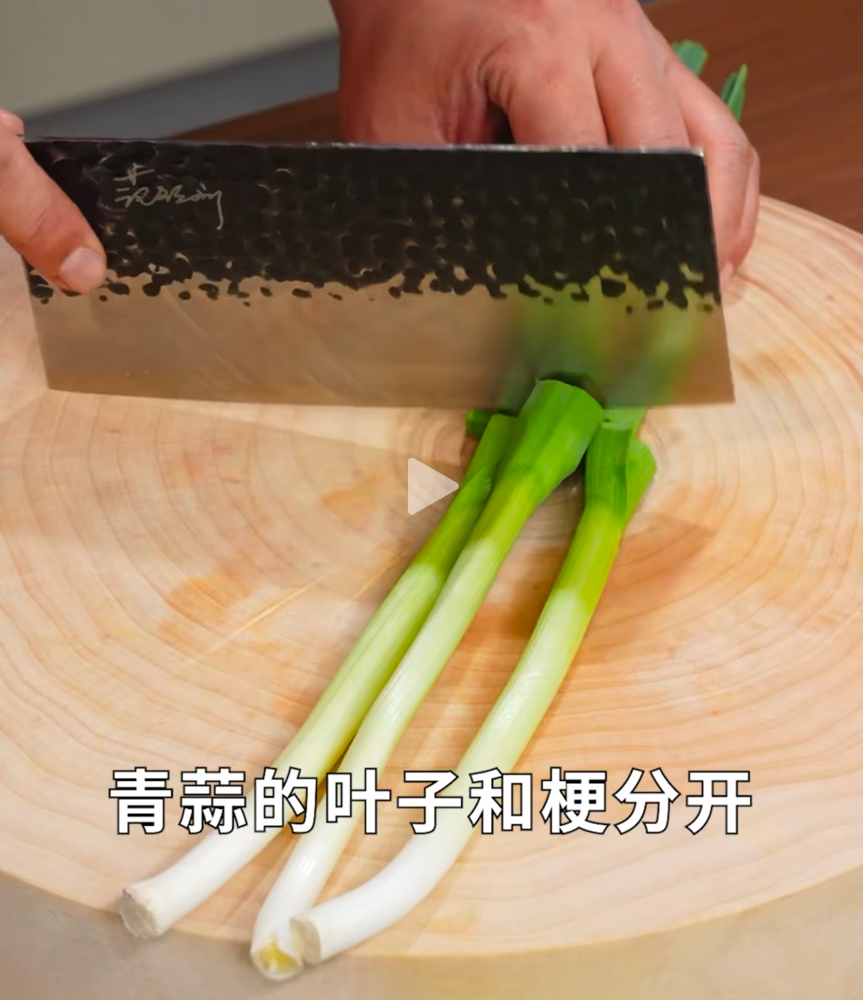
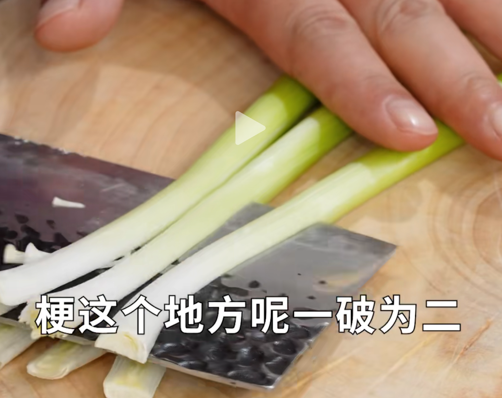
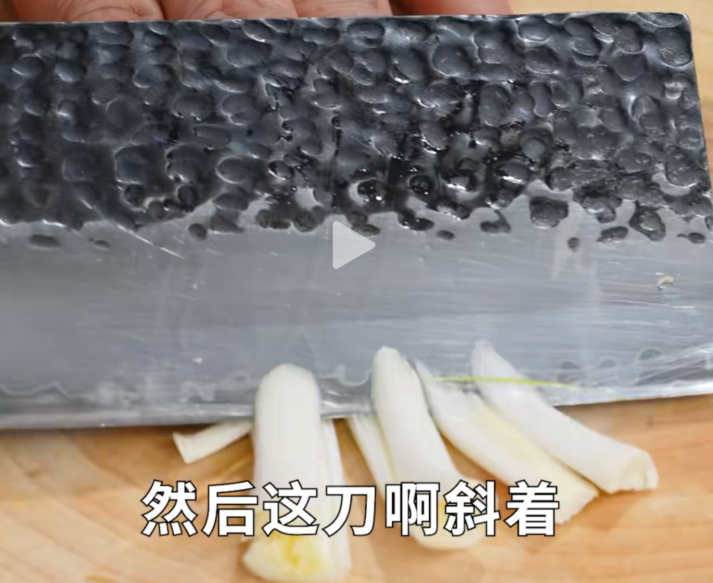
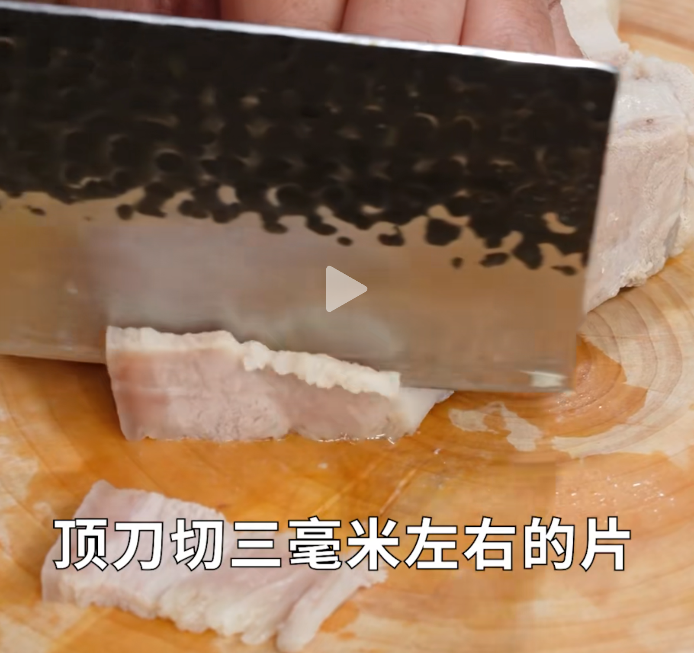

## 1. 食材

| 五花肉   | 蒜苗（有的地方叫青蒜） | 红椒 | 葱姜蒜 | 郫县豆瓣酱（川菜之魂） | 豆豉 | 甜面酱 |
| -------- | ---------------------- | ---- | ------ | ---------------------- | ---- | ------ |
| **陈醋** |                        |      |        |                        |      |        |

::: details

:::

1. 食材选择：传统回锅肉用二刀肉，现推荐用五花肉，配菜用蒜苗（有的地方叫青蒜）、红椒、葱姜蒜。

2. 肉的处理：五花肉冷水下锅，加葱姜、花椒、酒，煮好捞出晾凉切片，厚度约 3 毫米。

3. 配菜处理：
    - 蒜苗叶和梗分开，梗破为二，斜刀切薄；蒜苗叶切寸段；
    - 准备红椒、葱姜蒜。 
4. 调料准备：
    - 需要郫县豆瓣酱；
    - 永川豆豉；
    - 甜面酱，甜面酱可增加香气和甜味。
5.  炒制过程：锅烧热下油，先下肉片中火炒出肥肉油脂至透明状，下豆瓣酱、豆豉炒香后与肉混合，加甜面酱，再加葱姜蒜炒香，先下蒜苗梗，调味用酱油，下红椒、蒜苗叶大火炒匀，出锅前沿锅边加一点醋解腻增香。

## 2. 步骤

> 回锅肉顾名思义，熟肉再回锅炒。

1. 冷水下锅五花肉——>加入：葱姜、花雕酒——>煮熟；

    ::: details

    

    :::

2. 青蒜的叶子和梗分开——>梗的部分，一开二，斜着切，叶子直接切段即可；（分开放）

    ::: details

    

    

    

    :::

3. 红椒切小块；（主要为了配色）

4. 准备好：葱姜蒜；

5. 开始切肉：顶刀切 3mm 左右的片；

    ::: details

    

    :::

6. 锅热，加油——>加入肉片，炒到肥肉有透明状态；

7. 把肉推到锅边，下入：郫县豆瓣酱、豆豉——>炒出香味；

8. 加入：甜面酱；（为了取甜面酱的酱香气、和甜面酱的一丝丝甜）

9. 加入：葱姜蒜——>炒香；

10. 加入：青蒜梗——>不好熟；

11. 加入：酱油——>炒匀；

12. 加入：红椒块、青蒜叶；（保持大火）

13. 加入：一点点醋，实现解腻增香的作用；

## 3. 制作日期

- [x] 2025-06-08 19:12:49 晚 郫县豆瓣酱看情况加入，不吃辣则少，吃辣则多！红椒要切小一点，不好在后期快速熟透。

::: details 公众号：AI悦创【二维码】

:::

::: info AI悦创·编程一对一

AI悦创·推出辅导班啦，包括「Python 语言辅导班、C++ 辅导班、java 辅导班、算法/数据结构辅导班、少儿编程、pygame 游戏开发、Web、Linux」，招收学员面向国内外，国外占 80%。全部都是一对一教学：一对一辅导 + 一对一答疑 + 布置作业 + 项目实践等。当然，还有线下线上摄影课程、Photoshop、Premiere 一对一教学、QQ、微信在线，随时响应！微信：Jiabcdefh

C++ 信息奥赛题解，长期更新！长期招收一对一中小学信息奥赛集训，莆田、厦门地区有机会线下上门，其他地区线上。微信：Jiabcdefh

方法一：[QQ](http://wpa.qq.com/msgrd?v=3&uin=1432803776&site=qq&menu=yes)

方法二：微信：Jiabcdefh

:::

