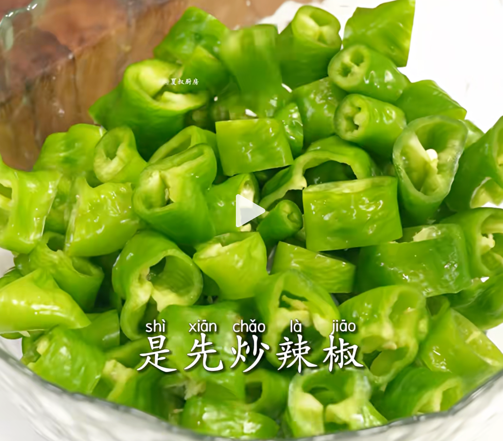
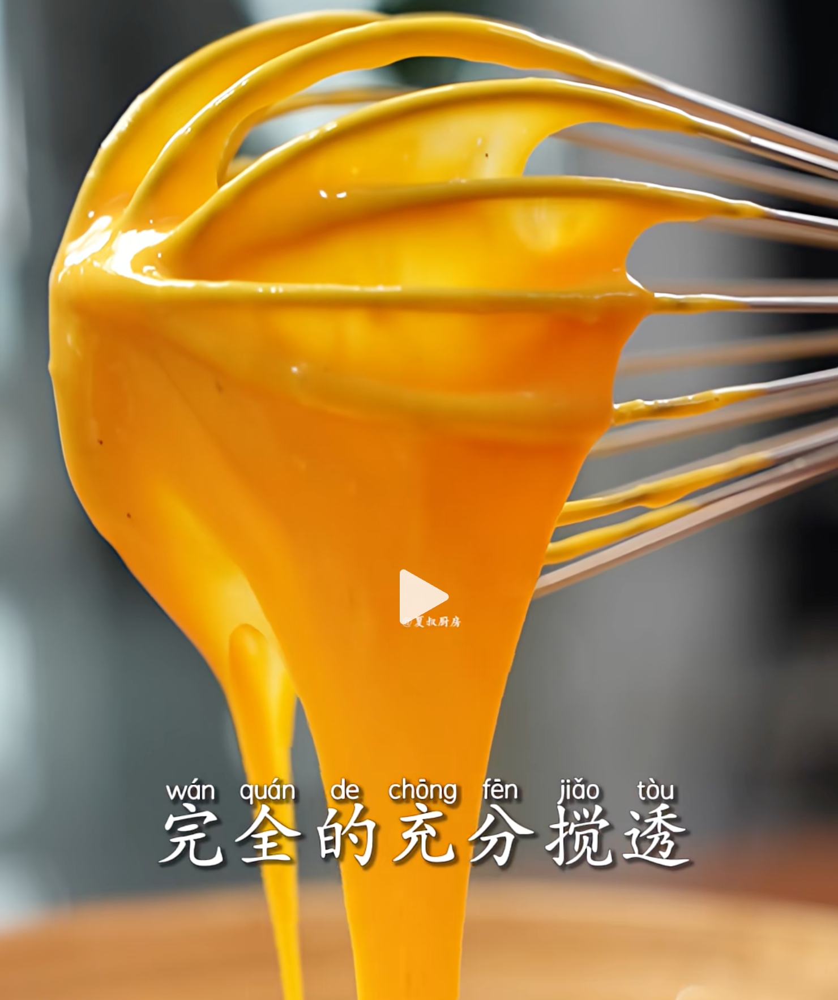
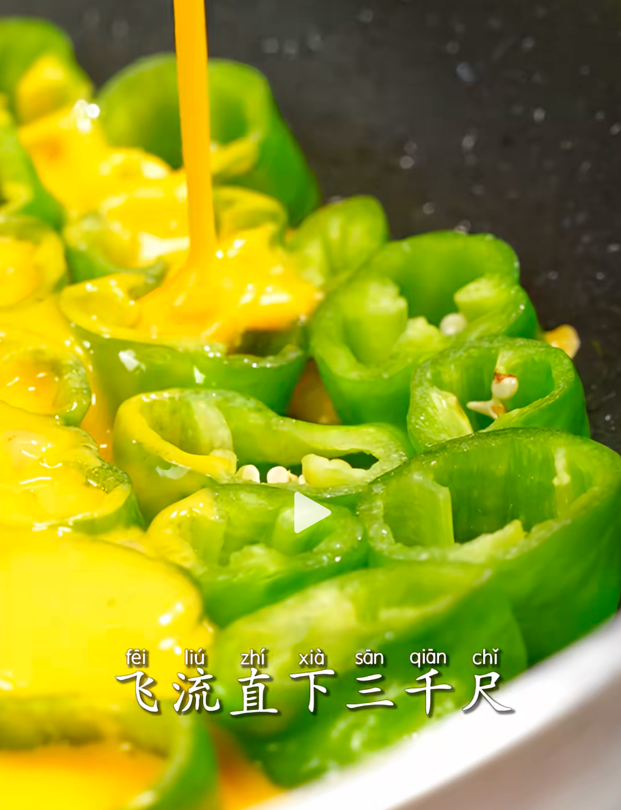

## 1. 食材

|螺丝椒|鸡蛋||

## 2. 步骤

1. 螺丝椒切成一段段小圈；

    ::: details

    

    :::

2. 准备鸡蛋液：盐、白胡椒粉、香油、面粉；

    ::: details

    

    :::

3. 半煎半炒：锅中油适量，因为后面要加入鸡蛋液。把螺丝椒段开口都朝上：

    ::: details

    

    :::

4. 淋入鸡蛋液：

    ::: details

    

    :::

5. 煎制的时候，顶部再喷些油，准备封面煎制、翻炒；

6. 

::: details 公众号：AI悦创【二维码】

:::

::: info AI悦创·编程一对一

AI悦创·推出辅导班啦，包括「Python 语言辅导班、C++ 辅导班、java 辅导班、算法/数据结构辅导班、少儿编程、pygame 游戏开发、Web、Linux」，招收学员面向国内外，国外占 80%。全部都是一对一教学：一对一辅导 + 一对一答疑 + 布置作业 + 项目实践等。当然，还有线下线上摄影课程、Photoshop、Premiere 一对一教学、QQ、微信在线，随时响应！微信：Jiabcdefh

C++ 信息奥赛题解，长期更新！长期招收一对一中小学信息奥赛集训，莆田、厦门地区有机会线下上门，其他地区线上。微信：Jiabcdefh

方法一：[QQ](http://wpa.qq.com/msgrd?v=3&uin=1432803776&site=qq&menu=yes)

方法二：微信：Jiabcdefh

:::

