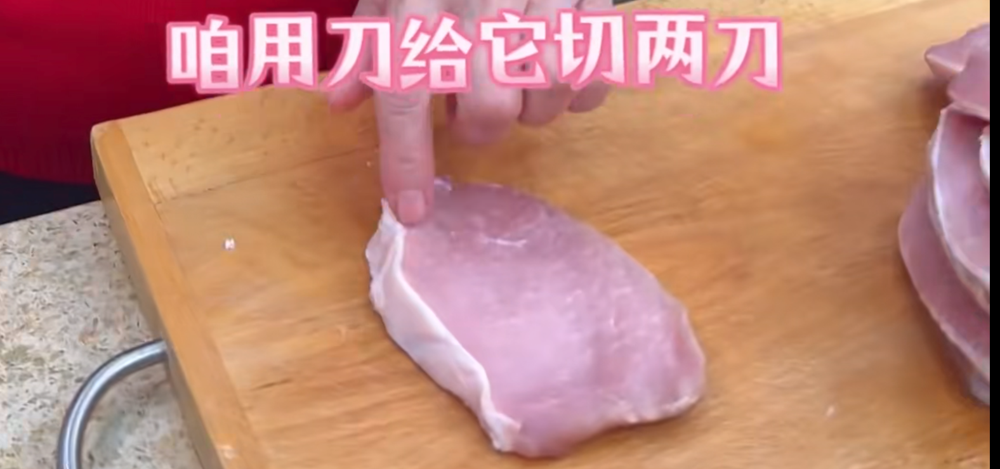
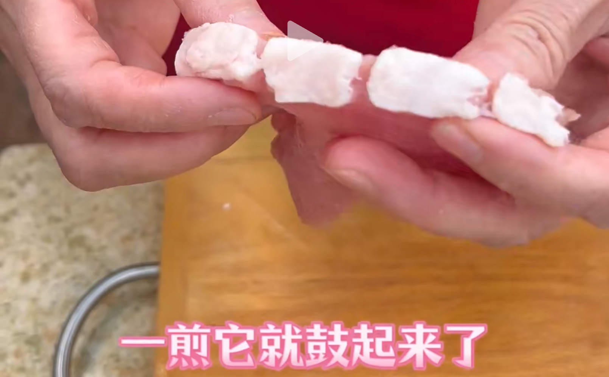
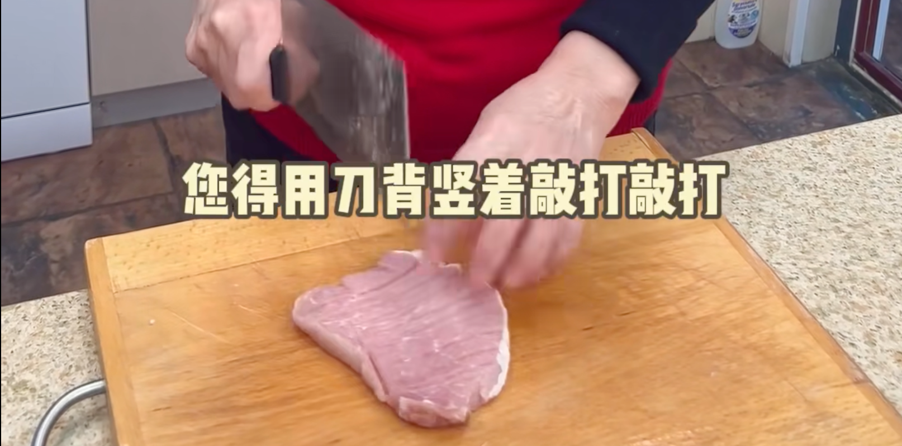
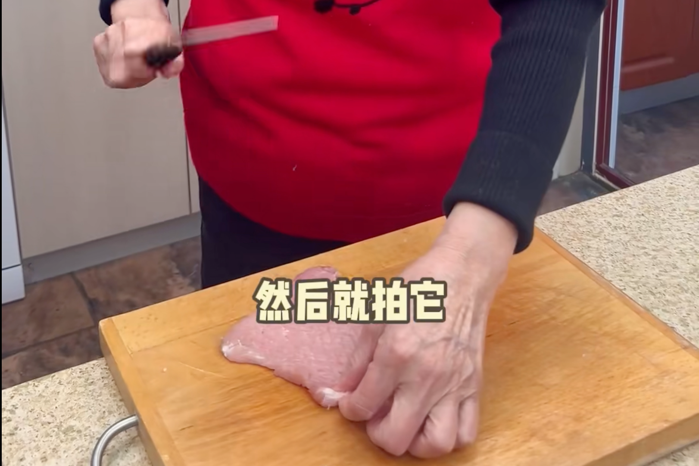
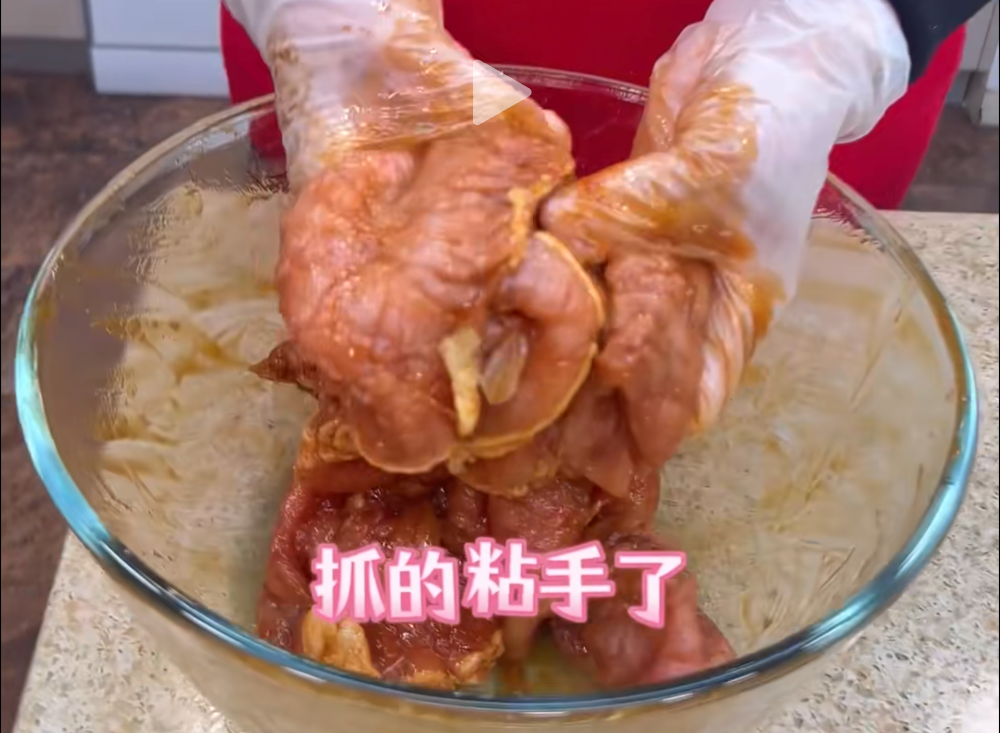
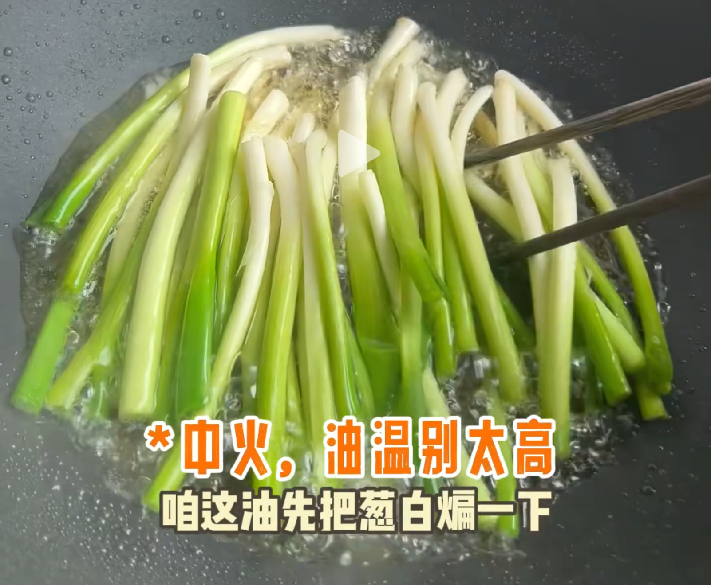
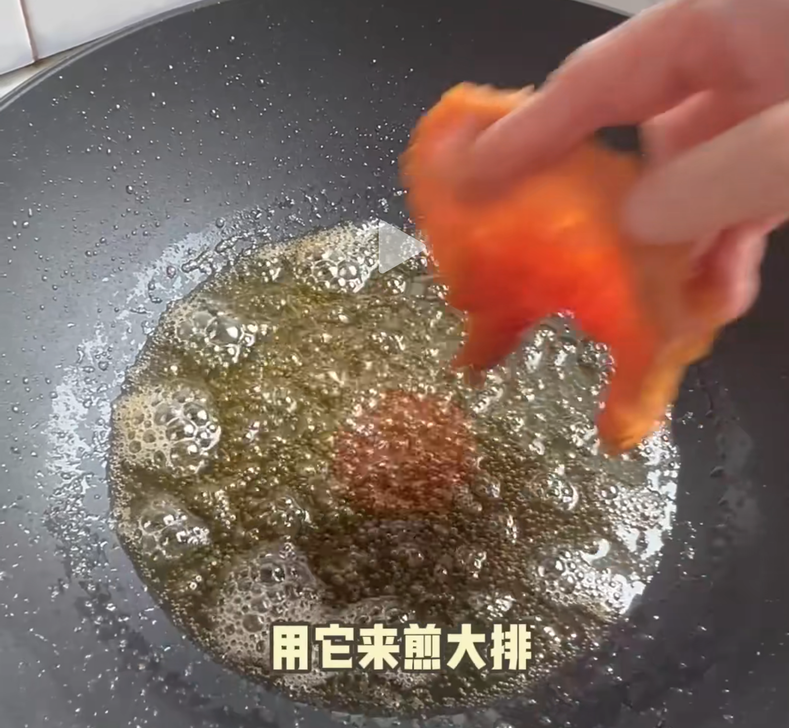
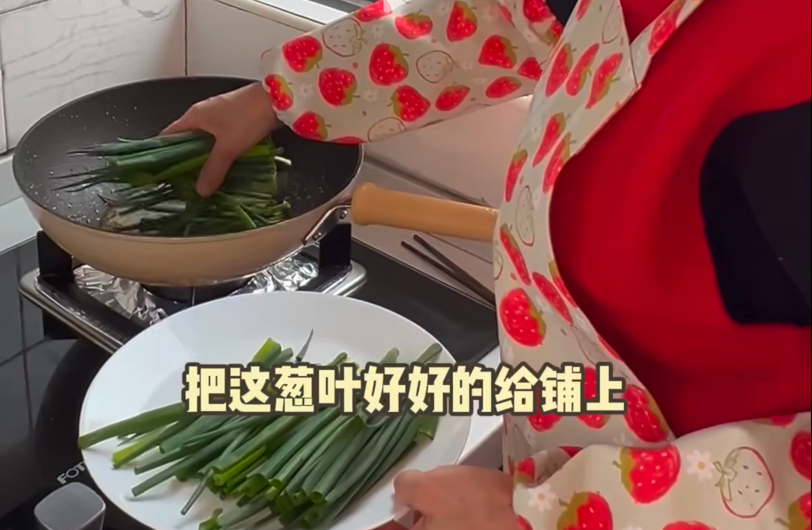
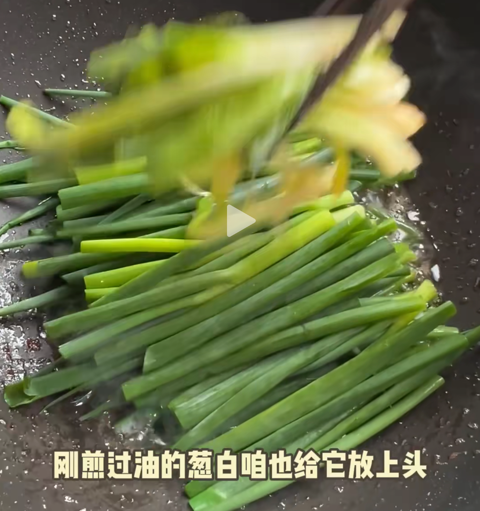
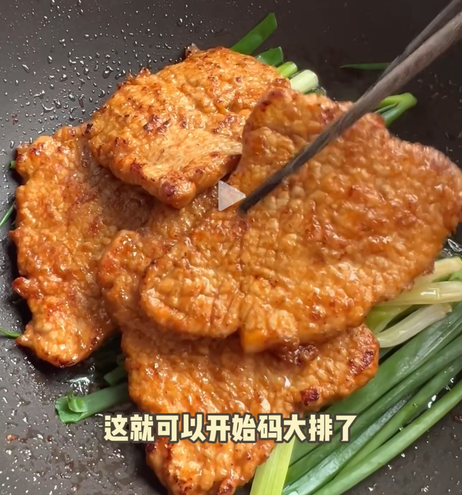

::: tabs

@tab 咸味太重「失败！」

## 1. 食材

| 猪里脊两斤 | 小葱300克  | 葱       | 姜       | 盐           | 料酒     |
| ---------- | ---------- | -------- | -------- | ------------ | -------- |
| **糖**     | **白胡椒** | **老抽** | **鸡蛋** | **玉米淀粉** | **生抽** |

**葱烧大排：**

- 猪里脊两斤，小葱300克；
- 腌制：葱姜水100毫升（葱30克姜10克盐1克，水100毫升），盐5克，糖20克，白胡椒1克，老抽10毫升，鸡蛋一个，淀粉30克。
- 酱汁：料酒10毫升，老抽10毫升，生抽50毫升，水100毫升

## 2. 步骤

1. 大里脊切厚块，如果有筋膜就把筋膜进行切开，否则煎的时候会鼓起来；

    ::: details

    

    

    :::

2. 猪排嫩的关键 1：

    ::: details

    

    :::

3. 关键 2：拍大

    ::: details

    

    :::

4. 葱姜水汁：葱（30g）、姜（10g）、盐（1g）、水（100 ml）——>倒入猪排抓匀；

5. 加入：盐5克，糖20克，白胡椒1克，老抽10毫升，鸡蛋一个——>接着抓匀；

6. 加入：玉米淀粉30克——>抓匀；

    ::: details

    

    ::: 

7. 油热，把葱白煸炒一下，这样油就变成葱油：

    ::: details

    

    

    :::

8. 捞出葱白，煎大排 4～5min：

    ::: details

    

    :::

9. 煎好大排，锅里还有油。加入葱叶：

    ::: details

    

    

    :::

10. 铺上大排

    ::: details

    

    :::

11. 加入料汁：料酒10毫升，老抽10毫升，生抽50毫升，水100毫升；

12. 中火炖煮 10 分钟；

13. 出锅，开吃。

@tab new

:::

::: details 公众号：AI悦创【二维码】

:::

::: info AI悦创·编程一对一

AI悦创·推出辅导班啦，包括「Python 语言辅导班、C++ 辅导班、java 辅导班、算法/数据结构辅导班、少儿编程、pygame 游戏开发、Web、Linux」，招收学员面向国内外，国外占 80%。全部都是一对一教学：一对一辅导 + 一对一答疑 + 布置作业 + 项目实践等。当然，还有线下线上摄影课程、Photoshop、Premiere 一对一教学、QQ、微信在线，随时响应！微信：Jiabcdefh

C++ 信息奥赛题解，长期更新！长期招收一对一中小学信息奥赛集训，莆田、厦门地区有机会线下上门，其他地区线上。微信：Jiabcdefh

方法一：[QQ](http://wpa.qq.com/msgrd?v=3&uin=1432803776&site=qq&menu=yes)

方法二：微信：Jiabcdefh

:::

