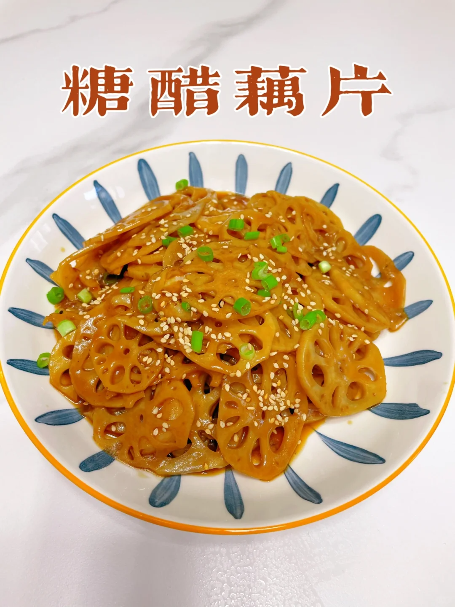
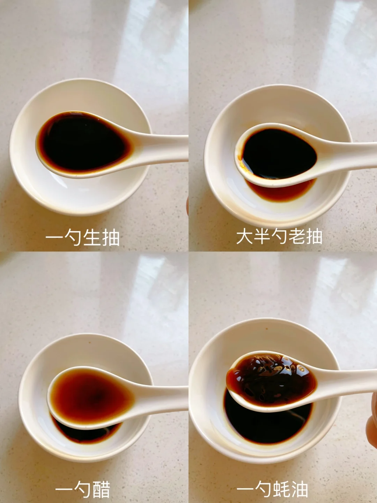
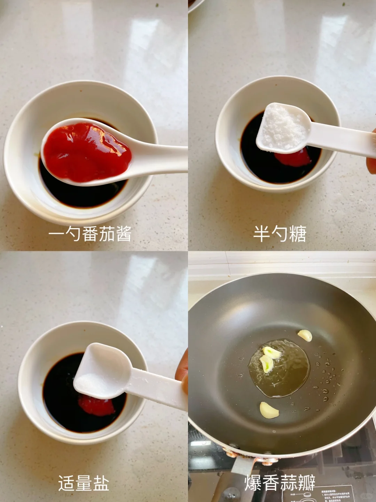
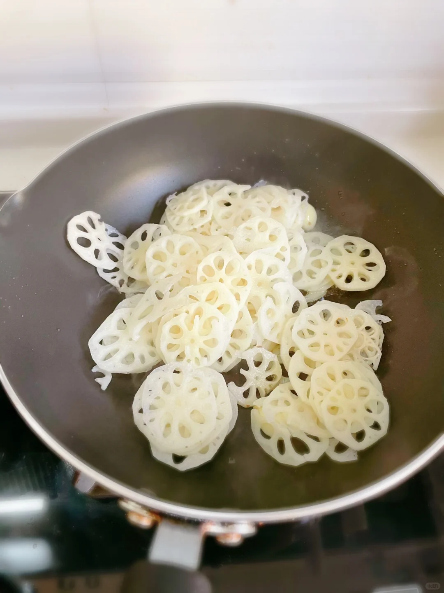
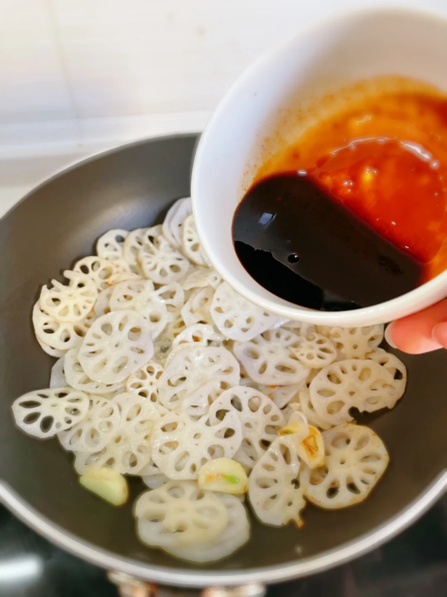
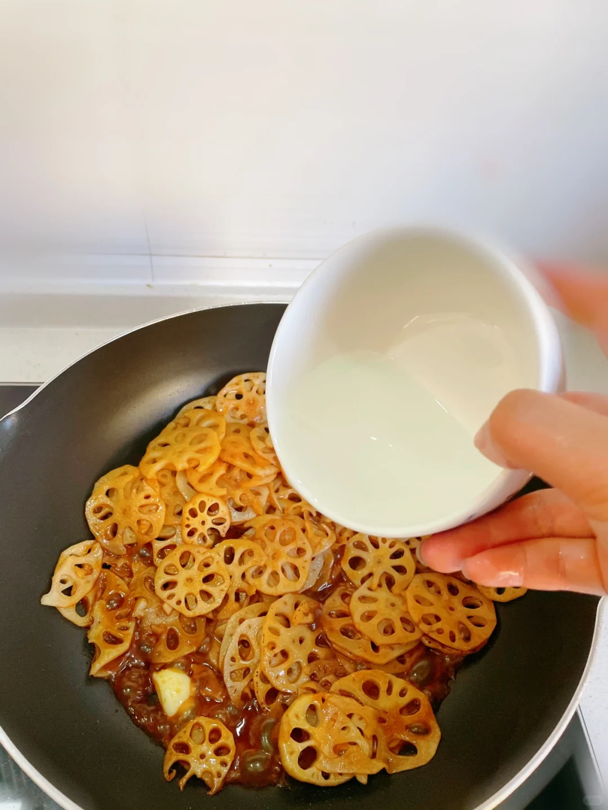
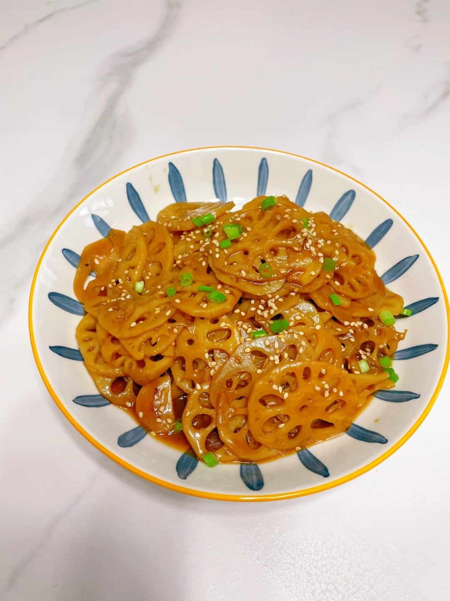

## 1. 食材

::: center

| 食材 | 重量 |
| ---- | ---- |
| 藕片 | 随意 |
| 香葱 | 随意 |
|      |      |

:::

## 2. 烹饪🍳

㊙️藕片最好吃的做法！糖醋藕片✨爽脆可口

☘️藕片的做法好多种，但我觉得糖醋藕片最好吃！酸甜爽口，超级简单 

⭐️人们常说“男不离韭，女不离藕”,莲藕营养极其丰富，具有生津、凉血、补脾的功效，是一种比较不错的食疗保健食材。

 🌸主要食材：莲藕 

🌈步骤： 

1️⃣先调个料汁：一勺生抽➕大半勺老抽➕一勺醋 ➕一勺耗油➕一勺番茄酱➕半勺白糖➕适量盐➕半碗水

2️⃣起锅烧油，放蒜爆香，加入藕片翻炒至表面微焦

加入料汁，翻炒均匀，淋入水淀粉，出锅撒上葱花芝麻点缀就好啦！ 

🎀每次吃藕，都会想起小时候姥姥家的荷塘，夏天荷叶挨挨挤挤，千姿百态的荷花，还有水中的游鱼，飞舞的蜻蜓，都是儿时的记忆。

::: tabs

@tab 1

@tab 2

@tab 3

@tab 4

@tab 5

@tab 6

:::

欢迎关注我公众号：AI悦创，有更多更好玩的等你发现！

::: details 公众号：AI悦创【二维码】

:::

::: info AI悦创·编程一对一

AI悦创·推出辅导班啦，包括「Python 语言辅导班、C++ 辅导班、java 辅导班、算法/数据结构辅导班、少儿编程、pygame 游戏开发、Linux、Java」，全部都是一对一教学：一对一辅导 + 一对一答疑 + 布置作业 + 项目实践等。当然，还有线下线上摄影课程、Photoshop、Premiere 一对一教学、QQ、微信在线，随时响应！微信：Jiabcdefh

C++ 信息奥赛题解，长期更新！长期招收一对一中小学信息奥赛集训，莆田、厦门地区有机会线下上门，其他地区线上。微信：Jiabcdefh

方法一：[QQ](http://wpa.qq.com/msgrd?v=3&uin=1432803776&site=qq&menu=yes)

方法二：微信：Jiabcdefh

:::

