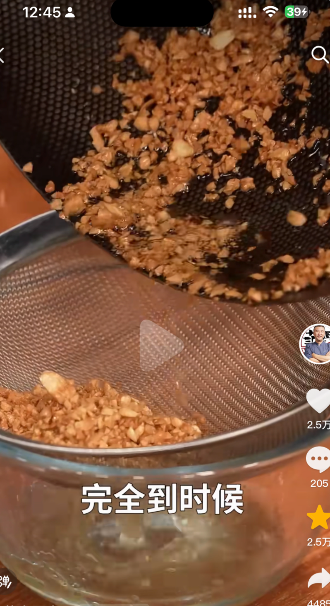
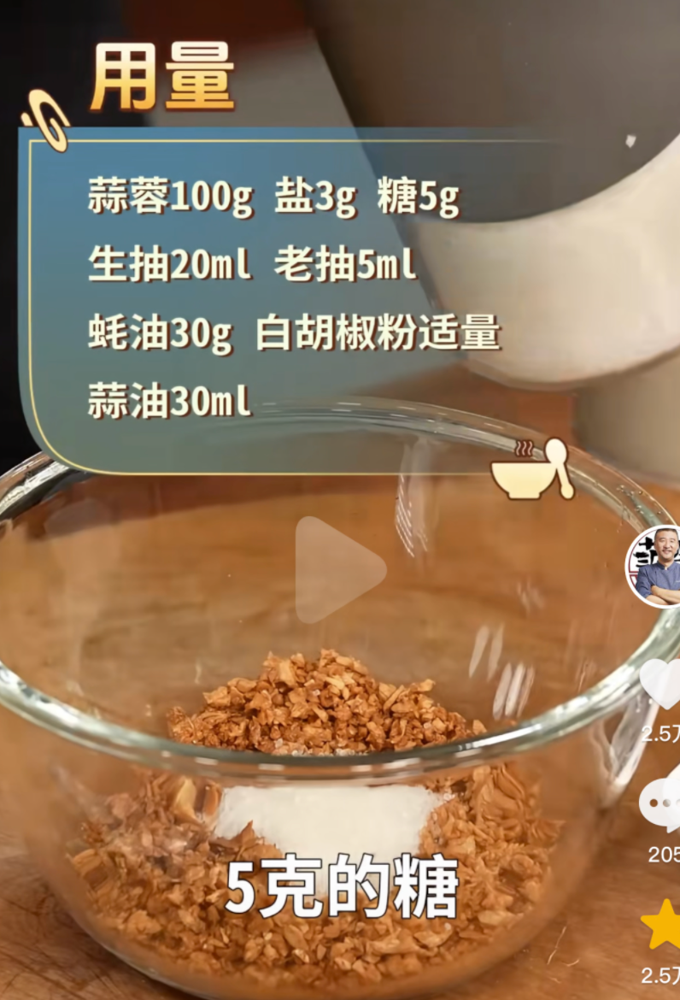
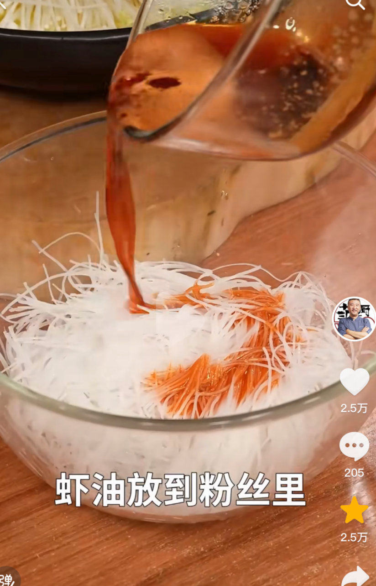
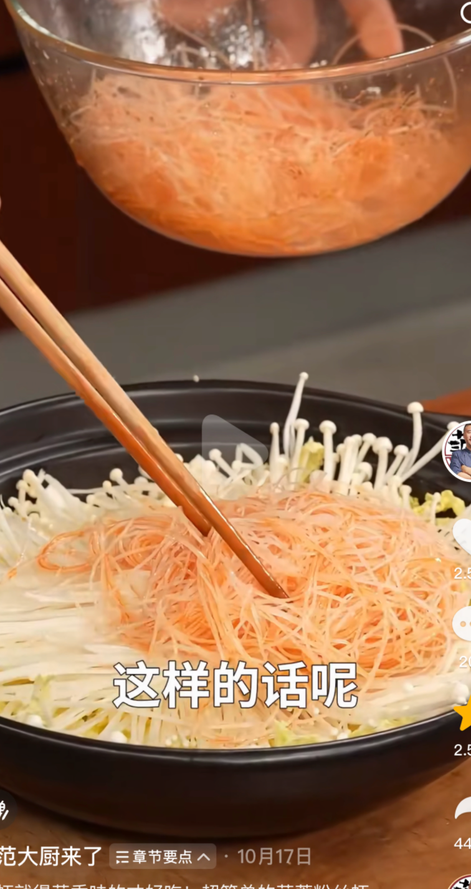
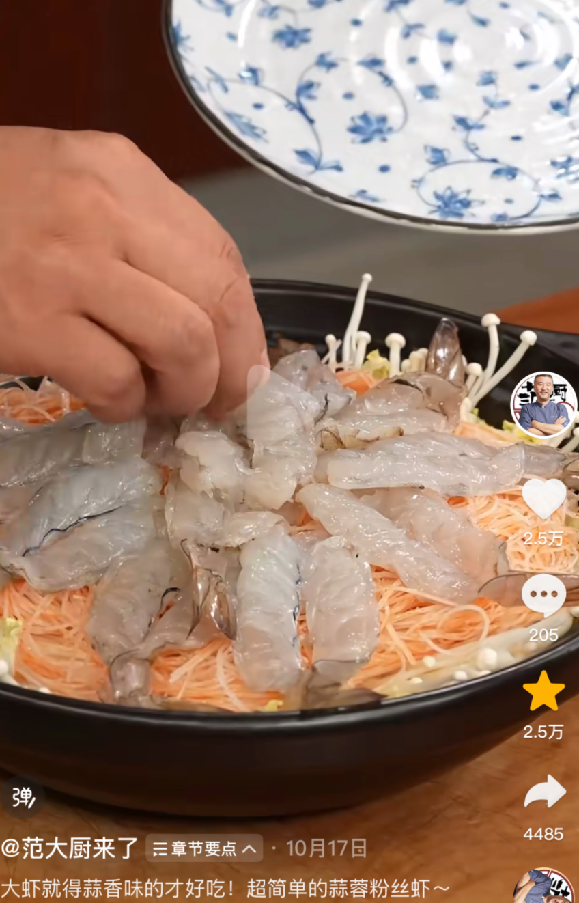
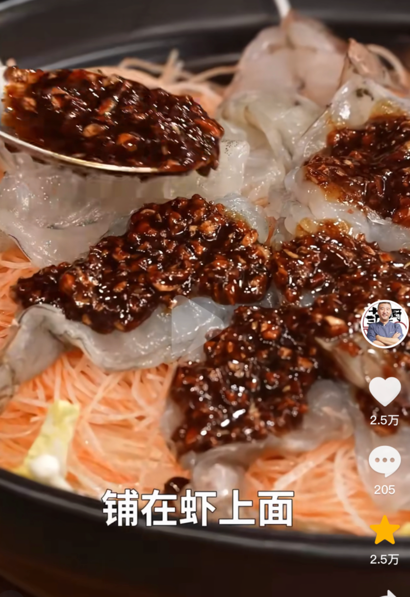
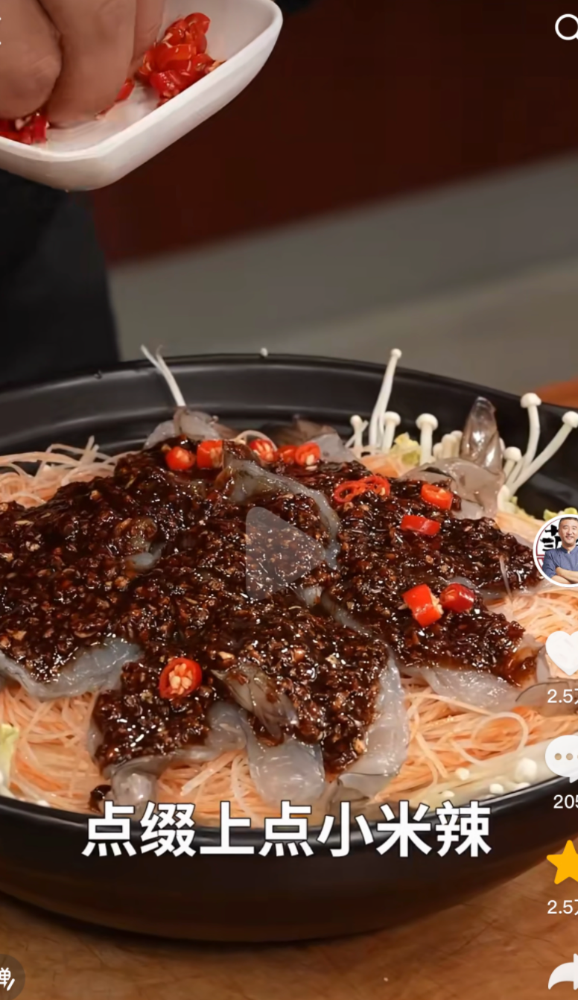
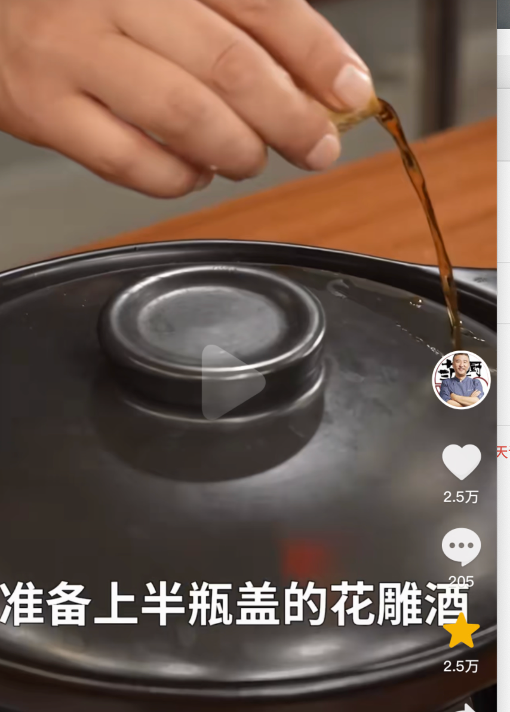
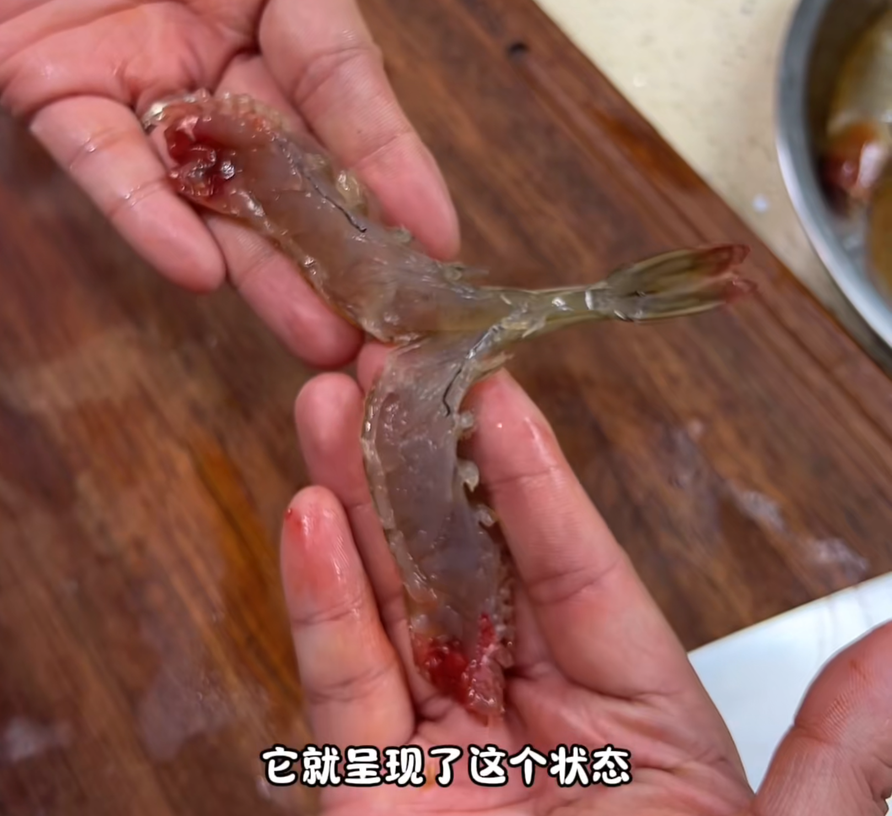
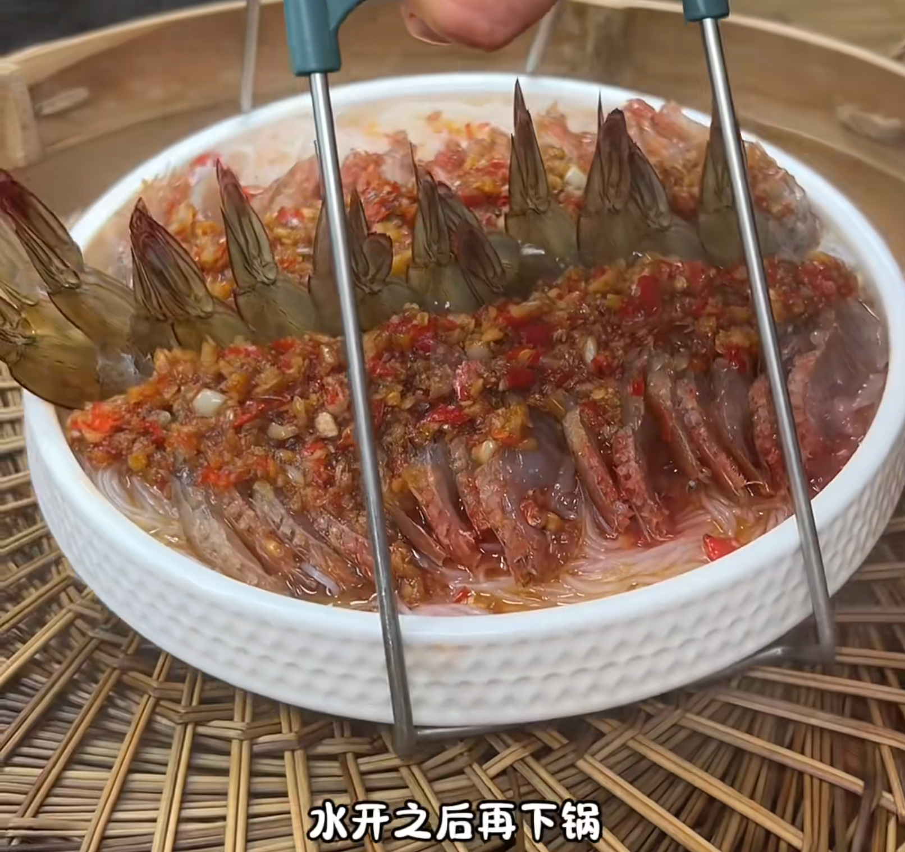

:::: tabs

@tab 范大厨「一般」

### 1. 食材

| 虾       | 龙口粉丝   | 蒜末     | 娃娃菜   | 金针菇 | 大葱 |
| -------- | ---------- | -------- | -------- | ------ | ---- |
| **生姜** | **小米椒** | **料酒** | **砂锅** |        |      |

### 2. 步骤

1. 去掉虾头、虾壳、虾尾留下——>开背去虾线——>开背后的虾，用刀稍微剁几个位置（防止虾熟的时候卷在一起）

    ::: details

    

    :::

2. 虾头、虾壳别扔掉！（后面熬制虾油）

3. 娃娃菜切丝

4. 金针菇

5. 粉丝泡软

6. 蒜蓉——>那清水洗一下蒜蓉（这样不会发苦、发黑）——>滤干——厨房用纸吸一下水；

7. **虾油：** 加油（要多一点）——>4～5成热——>下入虾头、虾壳（可选）——>中火——>加入大块葱姜——>一遍煎、一遍压——>过滤虾油（备用）「虾壳就可以不用了」

8. **黄金蒜+蒜油：** 加油——>不用等油热，直接加入蒜末——>小火慢炒（黄金蒜）——>炸到浅金黄就可以了——>过滤；

    ::: details

    

    :::

9. **蒜蓉酱：** 蒜蓉（炸过的）、盐、糖、生抽、老抽、蚝油、白胡椒粉、蒜油；（搅拌均匀）

    ::: details

    

    :::

10. 装锅：剩下的蒜油铺底——>切丝娃娃菜——>金针菇；

11. 粉丝——>加入虾油——>搅拌均匀；

    ::: details

    

    :::

12. 继续装锅：加入搅拌均匀的粉丝；

    ::: details

    

    :::

13. 摆虾：

    ::: details

    

    :::

14. 把配的酱放在虾上面：

    ::: details

    

    :::

15. 加入小米椒：

    ::: details

    

    :::

16. 听见砂锅里面有噼里啪啦的声音、砂锅眼上冒热气；

17. 关小火——>在锅盖上淋上：半瓶盖的花雕酒；

    ::: details

    

    :::

@tab:active 村驴

### 1. 食材

| 大蒜         | 虾       | 小米辣 | 蚝油 | 生抽 | 白糖 | 鸡精 | 盐   |
| ------------ | -------- | ------ | ---- | ---- | ---- | ---- | ---- |
| **龙口粉丝** | **香葱** |        |      |      |      |      |      |

### 2. 步骤

1. 做蒜末，要多——>清水清洗几遍并滤干备用；

2. 搅碎小米辣备用；

3. 小火——>锅中加入油——>微热，加入一半蒜末——>当蒜末变成淡淡的金黄色时——>关火，余温会让蒜蓉的颜色继续变深——>加入剩下的蒜蓉并不停的搅拌均匀——>等蒜蓉出现金银两种颜色，加入搅碎的小米辣——>加入生抽、蚝油、白糖、鸡精、盐——>一开锅，就可以出锅了；

4. 龙口粉丝使用开水泡开；

5. 虾去掉虾脑、虾线、从头开到尾部一节；

    ::: details

    

    :::

6. 把泡好的粉丝滤干，加入盐（1.5g）、生抽（10g）、蒜蓉酱 4 勺，搅拌均匀；

7. 接着摆上虾，铺满蒜蓉，水开之后下锅蒸；

    ::: details

    

    :::

8. 撒点葱花，热油淋浇；

::::

欢迎关注我公众号：AI悦创，有更多更好玩的等你发现！

::: details 公众号：AI悦创【二维码】

:::

::: info AI悦创·编程一对一

AI悦创·推出辅导班啦，包括「Python 语言辅导班、C++ 辅导班、java 辅导班、算法/数据结构辅导班、少儿编程、pygame 游戏开发」，全部都是一对一教学：一对一辅导 + 一对一答疑 + 布置作业 + 项目实践等。当然，还有线下线上摄影课程、Photoshop、Premiere 一对一教学、QQ、微信在线，随时响应！微信：Jiabcdefh

C++ 信息奥赛题解，长期更新！长期招收一对一中小学信息奥赛集训，莆田、厦门地区有机会线下上门，其他地区线上。微信：Jiabcdefh

方法一：[QQ](http://wpa.qq.com/msgrd?v=3&uin=1432803776&site=qq&menu=yes)

方法二：微信：Jiabcdefh

:::

