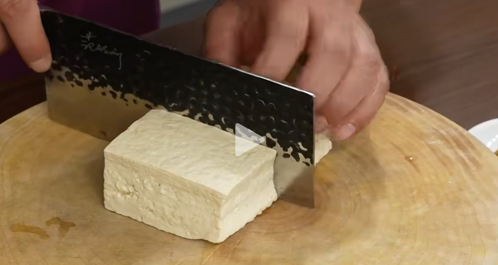
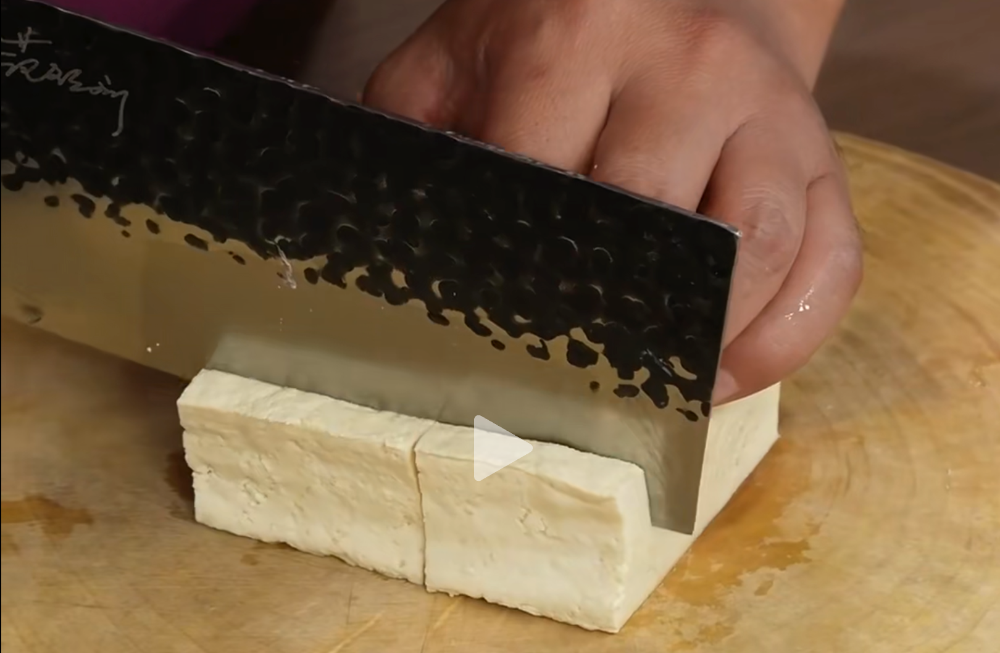

## 1. 食材

| 老豆腐       | 蒜       | 小米辣 | 辣椒面 | 花椒面       | 孜然粉 | 生抽 | 蚝油 | 豆腐乳（可选） |
| ------------ | -------- | ------ | ------ | ------------ | ------ | ---- | ---- | -------------- |
| **玉米淀粉** | **香菜** | **盐** | **糖** | **白胡椒粉** |        |      |      |                |

## 2. 步骤

1. 准备蒜末；

2. 老豆腐，切成豆腐块；

    ::: details

    

    

    :::

3. 起锅，加入油——>先加入一半的蒜末，煸香；

4. 加入：花椒面、辣椒面，炒香；

5. 加入：孜然粉；

6. 加入：生抽；

7. 加入：适量水；

8. 加入：3g 盐、10g 糖、白胡椒粉适量、20g 蚝油、腐乳 2 块（可选）、白芝麻适量、小米辣椒加入一半——>搅拌均匀；

9. 水淀粉勾芡——>出锅；

10. 接下来，炸豆腐——>出锅；

11. 用较大的盆，把炸好的豆腐、料汁加入，可以选择加入：香菜、小米辣；

12. 翻拌均匀——开炫！

::: details 公众号：AI悦创【二维码】

:::

::: info AI悦创·编程一对一

AI悦创·推出辅导班啦，包括「Python 语言辅导班、C++ 辅导班、java 辅导班、算法/数据结构辅导班、少儿编程、pygame 游戏开发、Web、Linux」，招收学员面向国内外，国外占 80%。全部都是一对一教学：一对一辅导 + 一对一答疑 + 布置作业 + 项目实践等。当然，还有线下线上摄影课程、Photoshop、Premiere 一对一教学、QQ、微信在线，随时响应！微信：Jiabcdefh

C++ 信息奥赛题解，长期更新！长期招收一对一中小学信息奥赛集训，莆田、厦门地区有机会线下上门，其他地区线上。微信：Jiabcdefh

方法一：[QQ](http://wpa.qq.com/msgrd?v=3&uin=1432803776&site=qq&menu=yes)

方法二：微信：Jiabcdefh

:::

