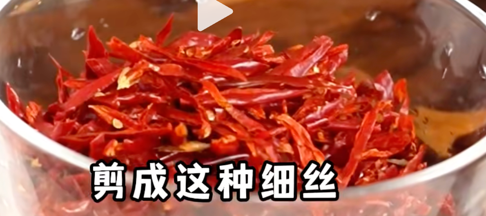
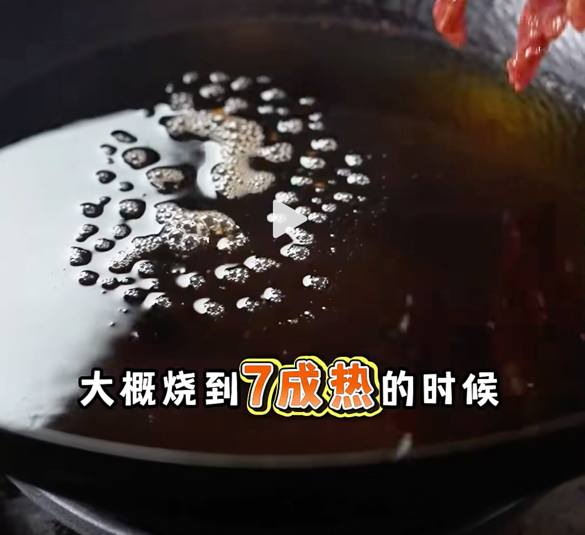
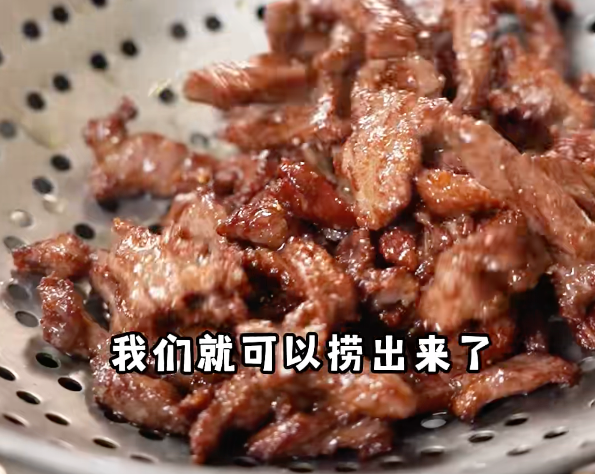
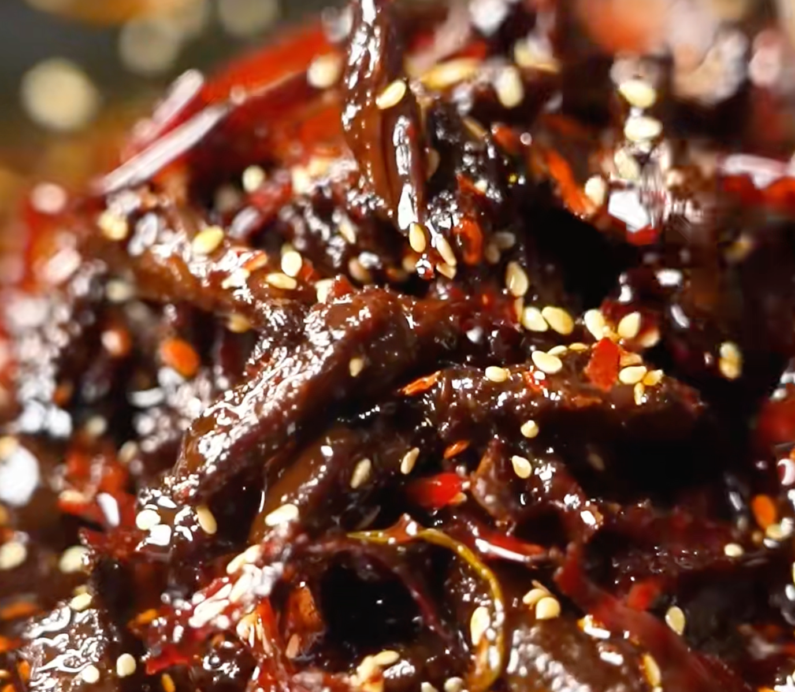

## 1. 食材

| 牛柳 2 斤      | 大葱           | 姜         | 蒜         | 辣椒干丝（干辣椒） | 香叶         |
| -------------- | -------------- | ---------- | ---------- | ------------------ | ------------ |
| **花椒粒**     | **桂皮**       | **菜籽油** | **鸡粉**   | **蚝油**           | **生抽**     |
| **料酒**       | **香油**       | **老抽**   | **花椒油** | **十三香粉**       | **白胡椒粉** |
| **玉米淀粉**   | **香叶**       | **花椒**   | **草果**   | **八角**           | **桂皮**     |
| **郫县豆瓣酱** | **郫县豆瓣酱** | **甜面酱** | **白芝麻** | **孜然粉**         | **辣椒面**   |

## 2. 步骤

1. 泡一碗：葱姜水；

2. 把牛肉顺纹理切成条状，绝不能逆纹切，不然容易烂掉；（不要太细）

3. 腌制牛肉：
    1. 2 勺鸡粉；
    2. 1.5 勺蚝油；
    3. 2 勺生抽；
    4. 3 勺料酒；
    5. 2 勺香油；
    6. 半勺老抽；
    7. 半勺花椒油；
    8. 1 勺十三香粉；
    9. 胡椒粉适量；
    10. 5 勺生粉；
    11. 葱姜水半碗；

4. 抓拌均匀，顺着一个方向抓；

5. 抓的差不多后，加入一些油进去，封油锁住水分； 

6. 干辣椒剪成细丝——>放入碗中；

    ::: details image

    

    :::

7. 再加上：干辣椒段、香叶、花椒、草果、八角、桂皮——>放入碗中，凉水浸满，泡一小会，待会炒的时候就会很香了；

8. 锅中加油（多一些），烧到 7 成热；

    ::: details image

    

    :::

9. 下入腌好的牛柳，让牛柳成型、焦化，炸到干香就可以捞出来；

    ::: details image

    

    :::

    不用炸到全熟，因为我们还要进行焖制；

10. 锅热——>下入：菜籽油——>下入：小葱、洋葱、香菜、姜、葱段——>一直翻炒；

11. 接着下入泡好的干辣椒、花椒等香料下入；（不要炒糊了）

12. 加入：1 勺郫县豆瓣酱、1 勺甜面酱；（翻炒均匀）

13. 下入：几颗冰糖；

14. 加入：一碗水；（水不要太多，水：油=1:1）

15. 调味：

     1. 2 勺蚝油；
     2. 2 勺生抽；
     3. 十三香适量；
     4. 2 勺鸡粉；
     5. 胡椒粉适量；

16. 要一直翻炒，不要糊底；

17. 炒到把所有水分都蒸发，只剩下油的状态；

18. 再撒些：白芝麻、孜然粉、辣椒面；

19. 可以存放很久；

::: details 公众号：AI悦创【二维码】

:::

::: info AI悦创·编程一对一

AI悦创·推出辅导班啦，包括「Python 语言辅导班、C++ 辅导班、java 辅导班、算法/数据结构辅导班、少儿编程、pygame 游戏开发、Web、Linux」，招收学员面向国内外，国外占 80%。全部都是一对一教学：一对一辅导 + 一对一答疑 + 布置作业 + 项目实践等。当然，还有线下线上摄影课程、Photoshop、Premiere 一对一教学、QQ、微信在线，随时响应！微信：Jiabcdefh

C++ 信息奥赛题解，长期更新！长期招收一对一中小学信息奥赛集训，莆田、厦门地区有机会线下上门，其他地区线上。微信：Jiabcdefh

方法一：[QQ](http://wpa.qq.com/msgrd?v=3&uin=1432803776&site=qq&menu=yes)

方法二：微信：Jiabcdefh

:::

