## 0. 数量

- 大框 x 2 （横竖皆可，横版为宜）

- 照片墙 x 6【九宫格x2】（横竖皆可）

- 10 寸摆台 x 4（横竖皆可）

- 8 寸摆台 x 3（横竖皆可）

- 海报 60 X 160 X 2（竖版照片两人正面尽量靠近一些）

## 1. 大框

::: tabs

@tab 大框 1「图片编号：3Z2A9861」

- 按原图比例，不要裁剪

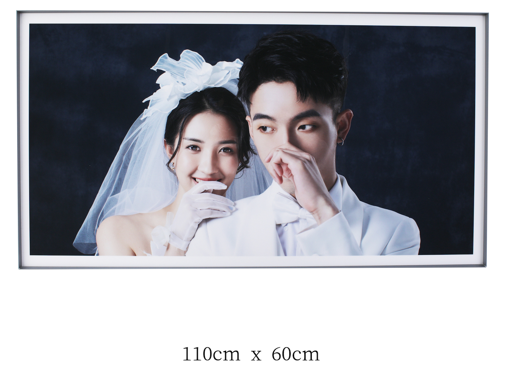

@tab 大框 2「编号：3Z2A9837 」

- 裁成横版

:::

## 2. 照片墙

::: tabs

@tab 照片墙 1「编号：3Z2A0162」

- 按原图比例「不要裁剪」

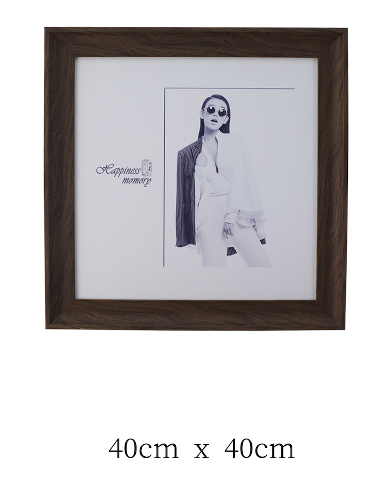

@tab 照片墙 2「编号：079A9614」✅

- 适当裁剪，竖版

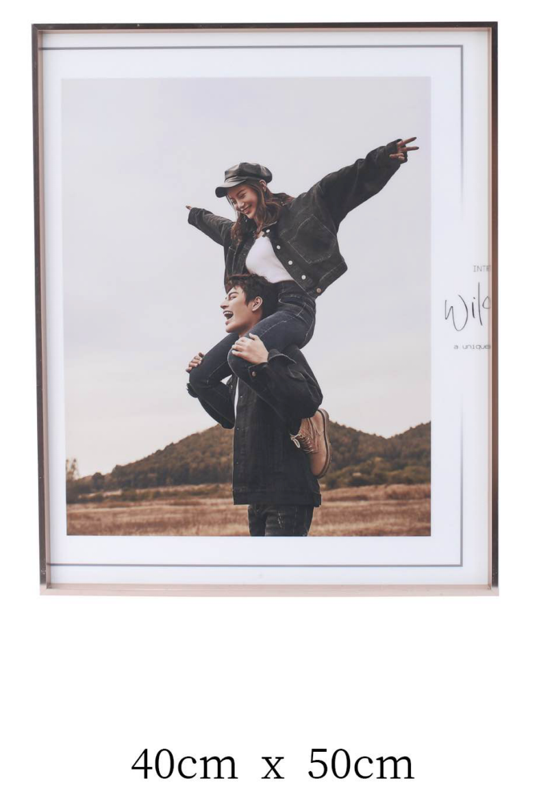

@tab 照片墙 3「编号：3Z2A5822」

- 按原图比例，不用裁剪「**要横版！！！**」

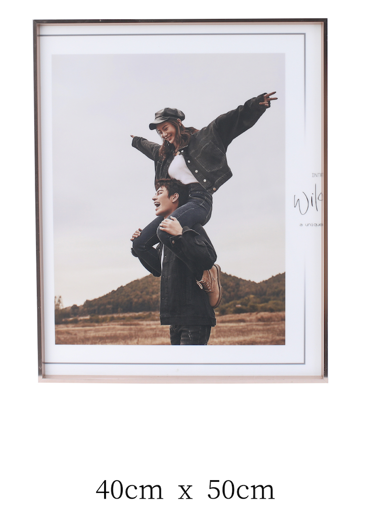

@tab 照片墙 4「编号：3Z2A0211」

- 按原图比例，竖版

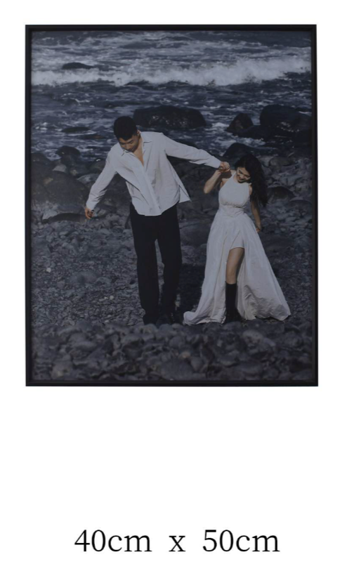

@tab 照片墙 5「编号：3Z2A9853」

- 按原图比例，竖版！竖版！竖版！

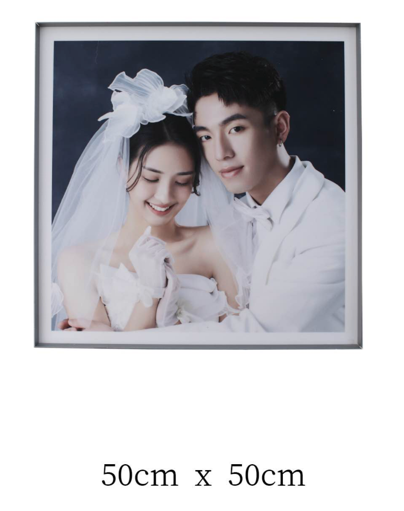

@tab 照片墙 6「编号：3Z2A9840」

- 按原图比例，竖版！竖版！竖版！

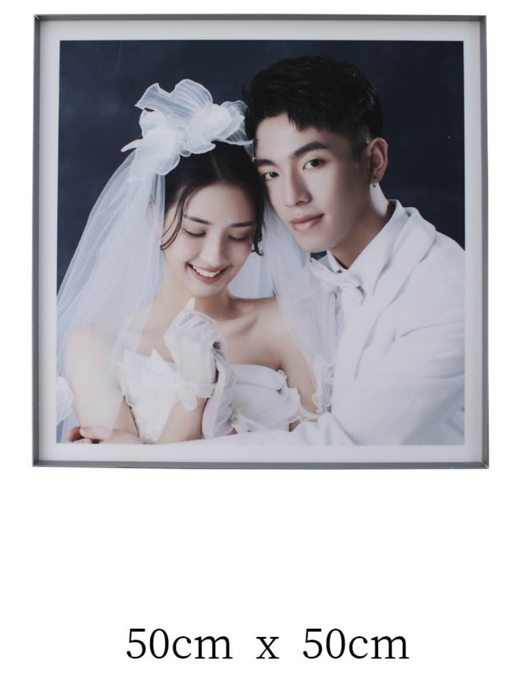

:::

## 3. 九宫格✅

- 相框按韩式九宫格的相框，拼好九宫格，发群确认；

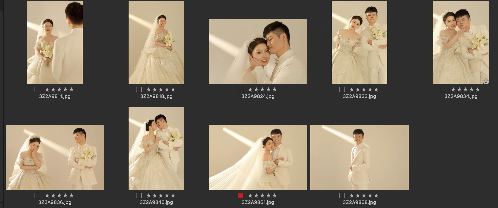

## 4. 10 寸桌摆「4」

::: tabs

@tab 图片编号: 079A2136

- 按原图比例，不要适当裁切，图片横版；

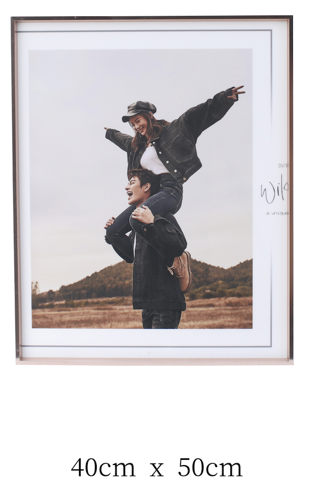

@tab 图片编号: 3Z2A0160

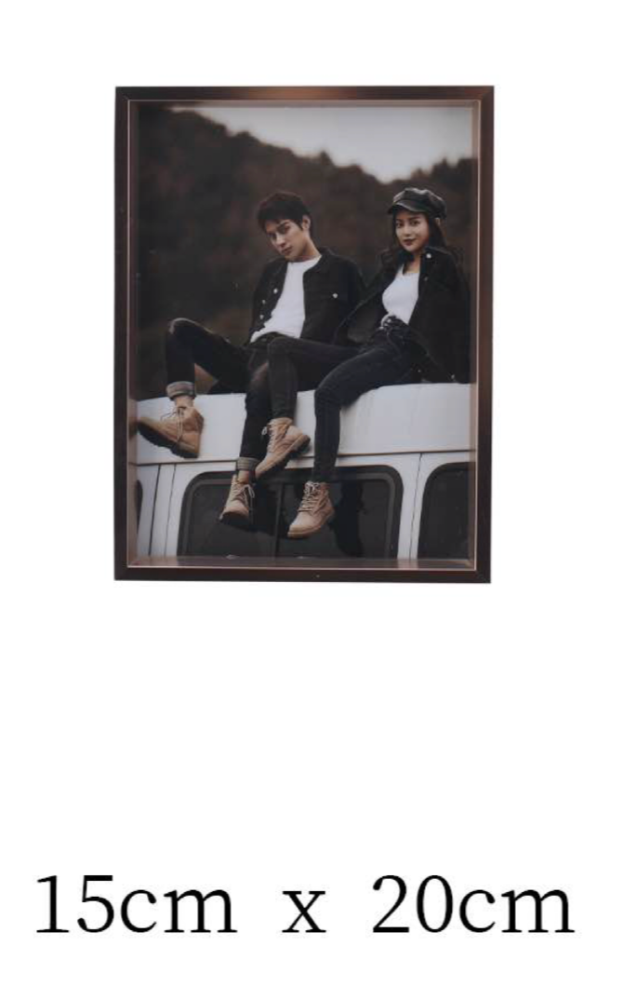

@tab 图片编号: 3Z2A5661

- 框用这个材质

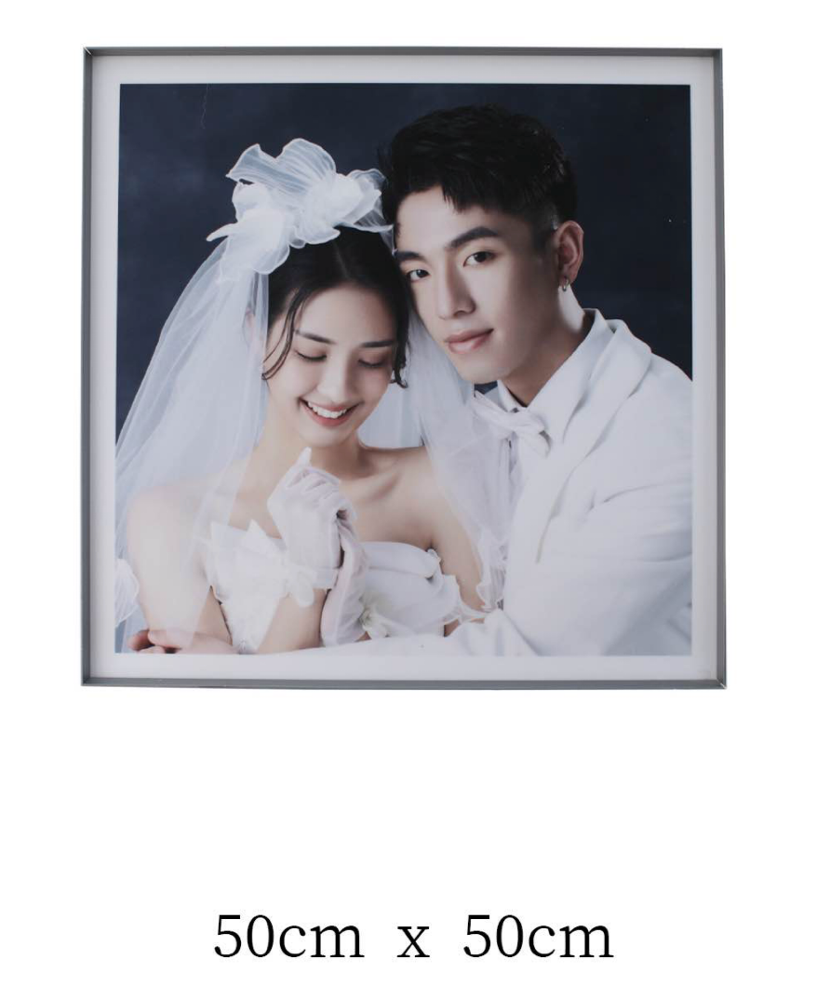

@tab 图片编号: 3Z2A5829

- 用这个材质
- 按原图比例

:::

## 5. 8 寸桌摆「3」✅

::: tabs

@tab 图片编号：079A4304✅

- 按原图比例

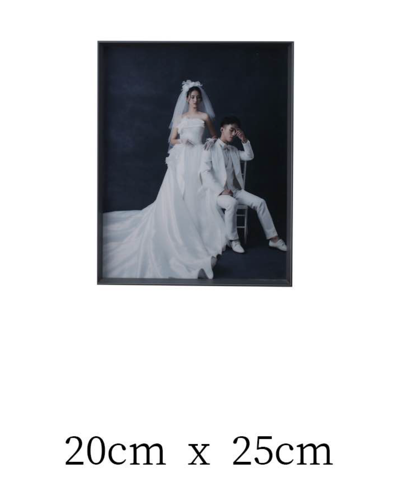

@tab 图片编号：079A2429✅

- 按原图比例

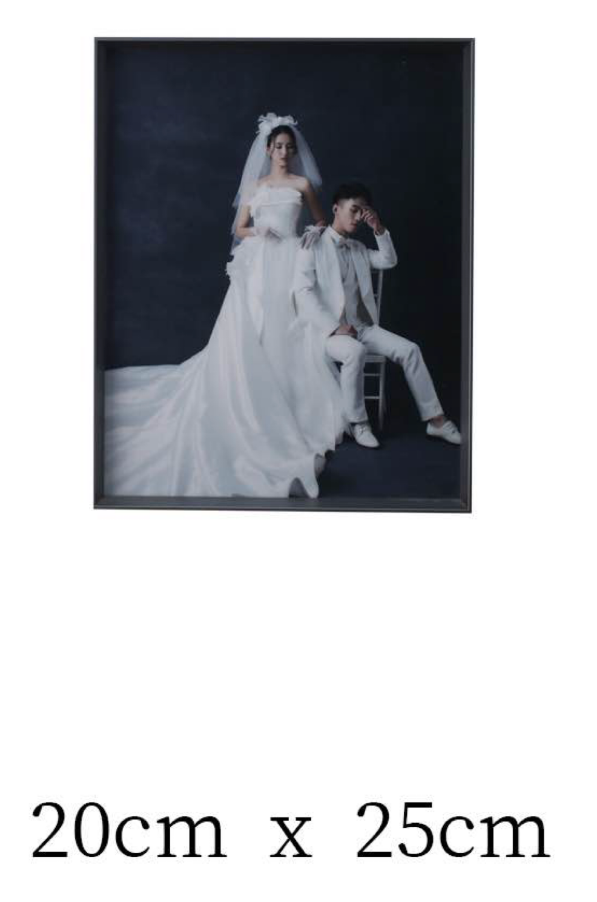

@tab 图片编号：3Z2A5674✅

- 按原图比例

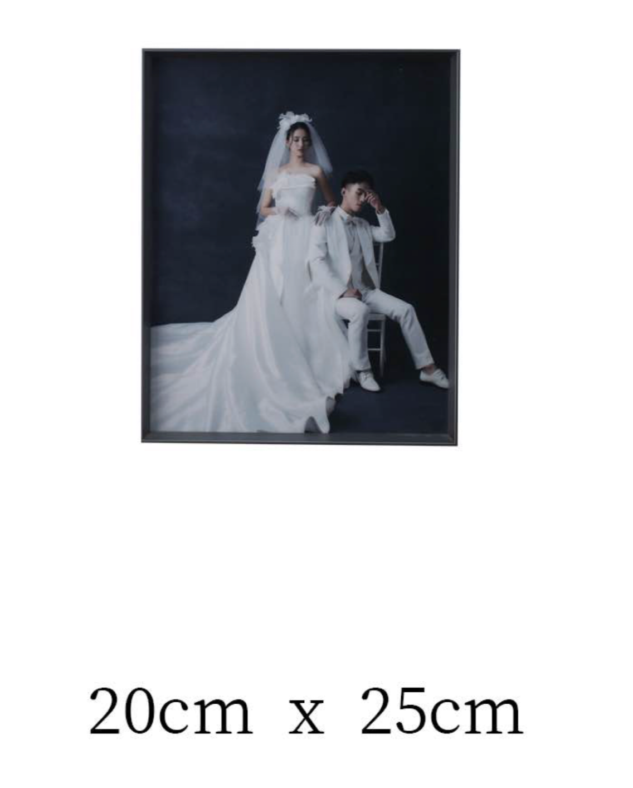

:::

## 6. 海报两张✅

- 两张都是一样的，图片编号：3Z2A9837
- 海报你们会写字吧；「设计好发群里确认」

