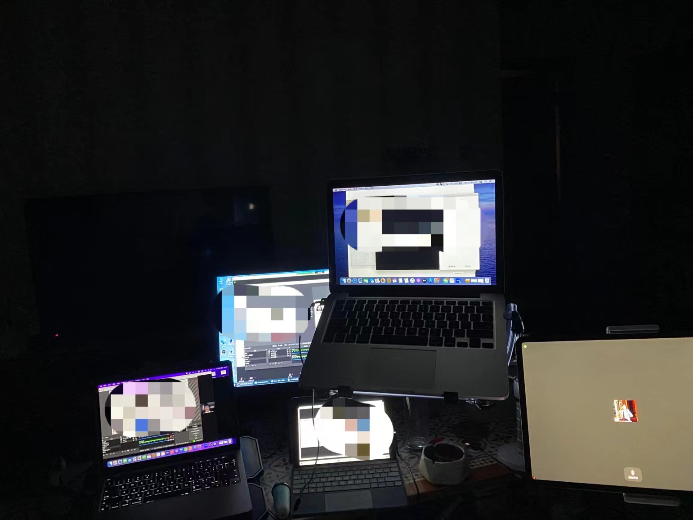
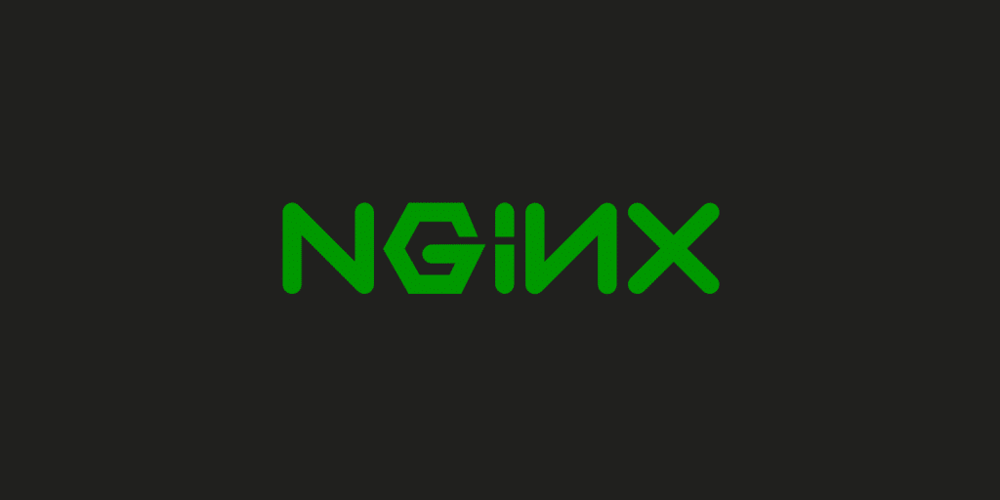
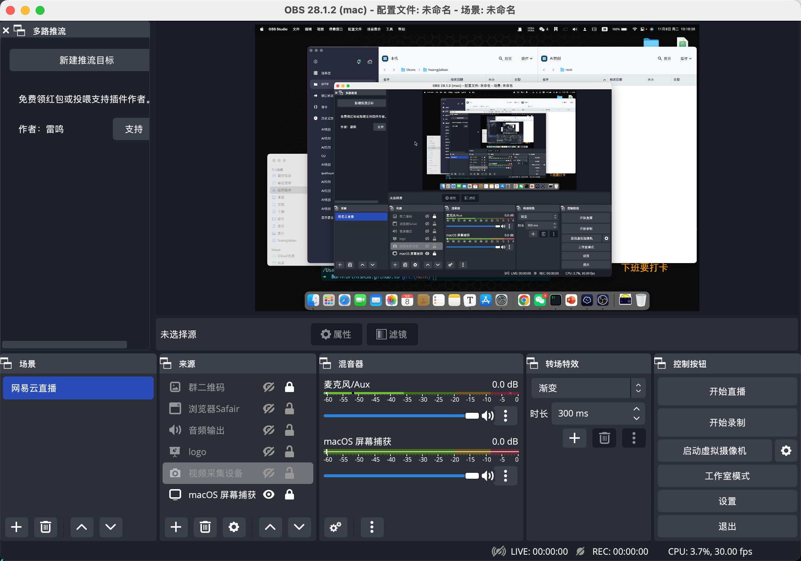
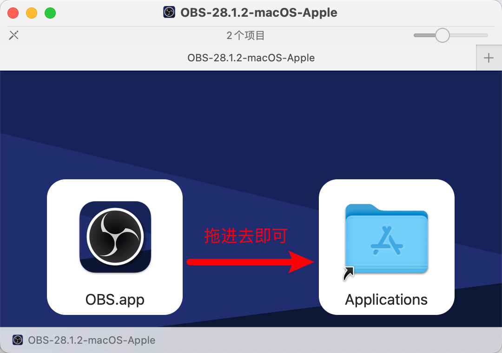
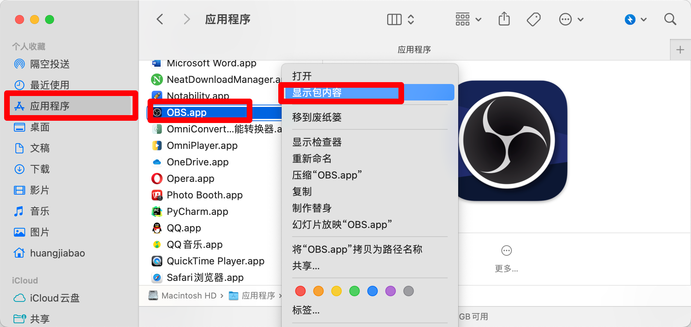
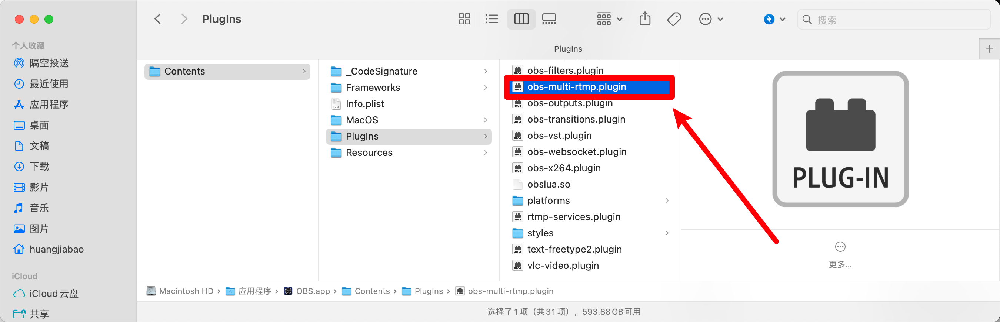
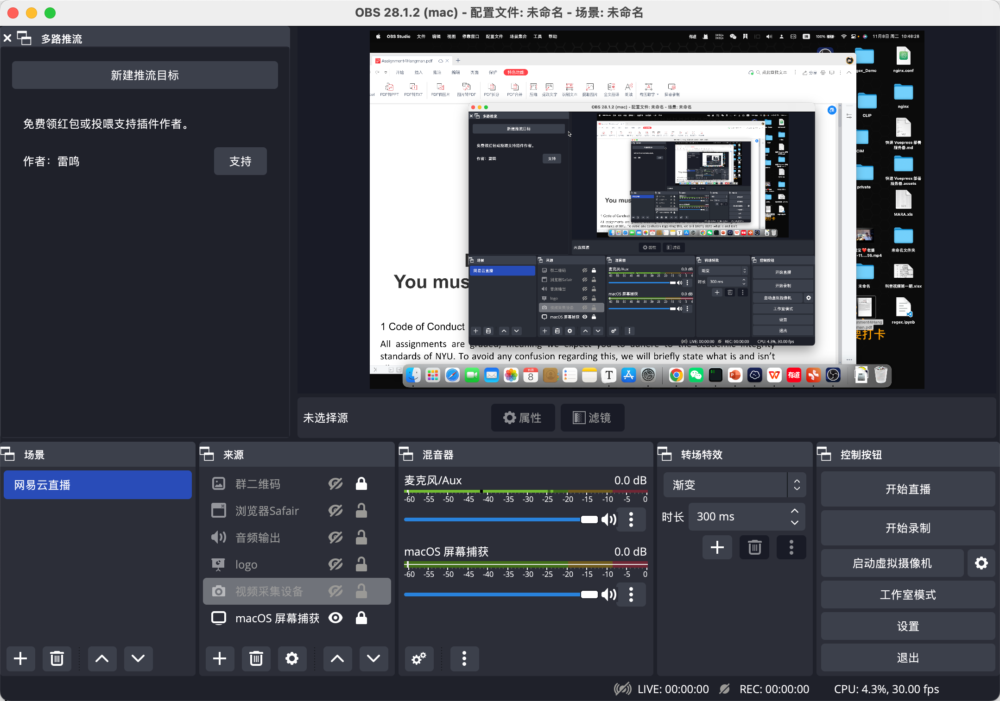
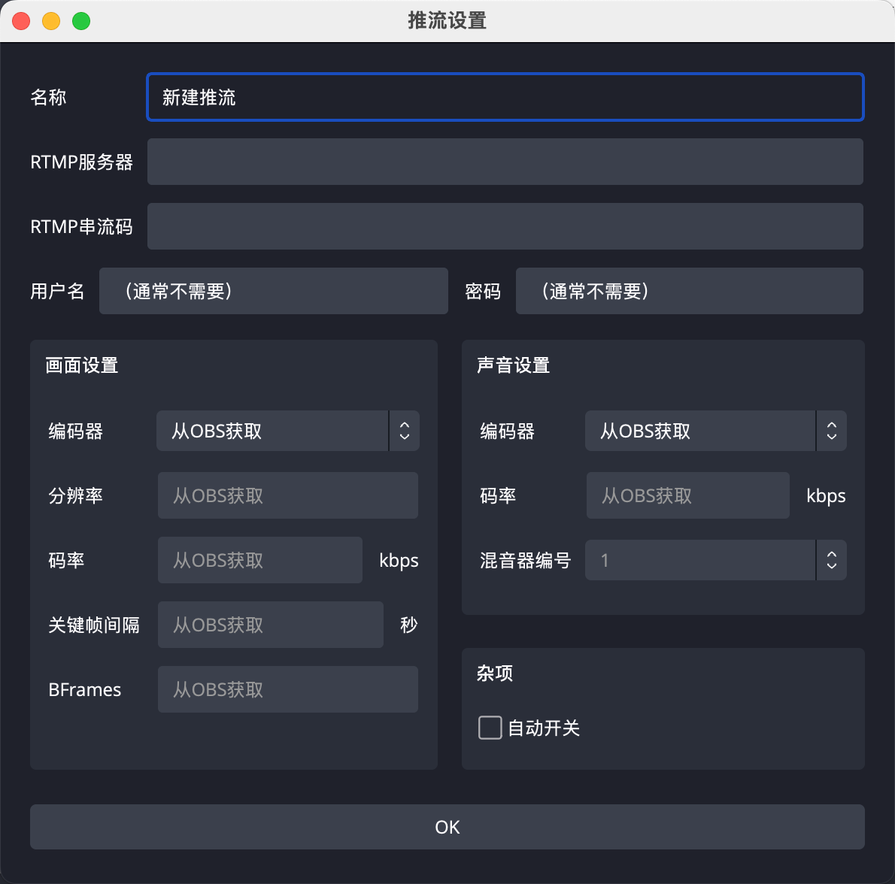

## 背景「background」

- [点击下载：OBS.zip](/cdn/OBS.zip)

你好，我是悦创。

::: tip

如果你是 Windows 你也可以参考此教程，其他问题添加我好友，入群交流。

:::

昨天，晚上再睡之前，一直在思考：我该如何实现多个平台同步直播呢？

这个时候，习惯性的刷一下朋友圈，看见：

这一瞬间，我就知道：我没那么多电脑。😭😭😭

平时需要直播的时候使用 OBS，平时也够用了。但是这个需求也仅限于：一个平台。

可是当我们想要同时直播多个平台的时候，却不能很好的满足我甚至是我的 Mac 群友们。

当然，网络上的解决方法有很多。比如：某平台提供的多平台分发直播——要钱的！这玩意也配要钱，咱们必须自己搞！

::: center

###### 上图为学员多设备直播

:::

当然，除了大公司提供的直播分发服务，或者是物理多台设备实现。当然还有使用 nginx 进行多个平台推流的。

nginx 是个不错的方法，但是还是讲究技术的，不适合非技术的小白。「如果想学，可以留言，我之后补写或者我搭建一个简单的分发平台给大家使用。」

但是，我们可以使用 OBS 插件，推荐电脑配置好一些的使用哦。

## 插件 obs-multi-rtmp「plug-in obs-multi-rtmp」

这个插件是免费的，大家不要花钱去购买哦！

使用方法也很简单，我会写能适配的最新 OBS 版本。

- OBS：[https://github.com/obsproject/obs-studio/releases/tag/28.1.2](https://github.com/obsproject/obs-studio/releases/tag/28.1.2)
- 插件：[https://github.com/kilinbox/obs-multi-rtmp/releases](https://github.com/kilinbox/obs-multi-rtmp/releases)

::: tip

国内下载还是有可能会失败或者访问不了，需要科学上网，还有专门的 Mac 交流群，欢迎加入。

:::

## 安装步骤「Installation steps」

### step1:安装 OBS

OBS 安装还是很简单的，直接安装即可。

### step2:安装插件

把你下载的插件放进去即可，重启 OBS 或者 重启 电脑。记得：关掉打开的访达。

## 效果

欢迎关注我公众号：AI悦创，有更多更好玩的等你发现！

::: details 公众号：AI悦创【二维码】

:::

::: info AI悦创·编程一对一

AI悦创·推出辅导班啦，包括「Python 语言辅导班、C++ 辅导班、java 辅导班、算法/数据结构辅导班、少儿编程、pygame 游戏开发、Web、Linux」，全部都是一对一教学：一对一辅导 + 一对一答疑 + 布置作业 + 项目实践等。当然，还有线下线上摄影课程、Photoshop、Premiere 一对一教学、QQ、微信在线，随时响应！微信：Jiabcdefh

C++ 信息奥赛题解，长期更新！长期招收一对一中小学信息奥赛集训，莆田、厦门地区有机会线下上门，其他地区线上。微信：Jiabcdefh

方法一：[QQ](http://wpa.qq.com/msgrd?v=3&uin=1432803776&site=qq&menu=yes)

方法二：微信：Jiabcdefh

:::

插件 GitHub：[https://github.com/sorayuki/obs-multi-rtmp](https://github.com/sorayuki/obs-multi-rtmp)
